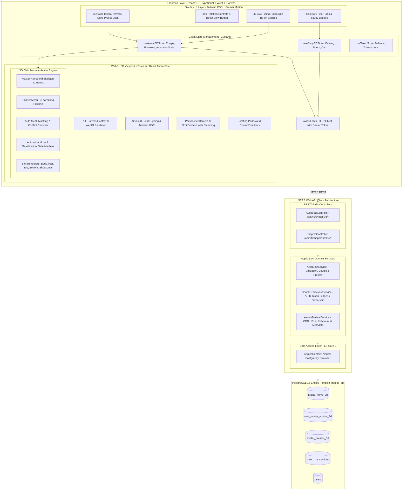
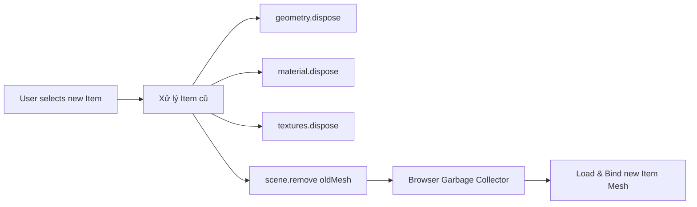
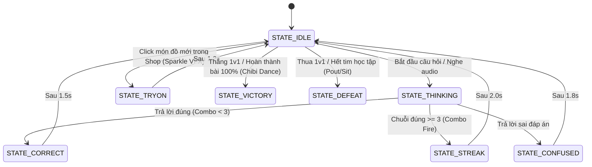

# Thiết Kế Kiến Trúc Kỹ Thuật: Hệ Thống Nhân Vật 3D Chibi & Tủ Đồ Module Thời Gian Thực (Three.js / WebGL & .NET 8 API)
## (Technical System Architecture: 3D Chibi Avatar, WebGL Canvas Engine & Modular Wardrobe Pipeline)

**Mã tài liệu:** `ARCH-3D-AVATAR-WARDROBE-V1`  
**Phiên bản:** 1.0  
**Tác giả:** Tech Lead & Software Architect (`11dba413-036f-4ce1-950e-252419384dce`)  
**Người nhận chuyển giao:** UI/UX Designer (`c74ffe18-11a2-47b9-a7f4-a3600b2f07c0`), Senior Fullstack Engineer (`e78be358-35da-419c-bf21-24a27e284561`), QA Team, Product Lead  
**Dự án:** `learn-english` (Paperclip Task `PHU-29`, Spec Tham Chiếu `PHU-28`)  
**Tài liệu đặc tả nghiệp vụ tham chiếu:** 
- [`docs/spec/3d-chibi-avatar-and-modular-wardrobe.md`](../spec/3d-chibi-avatar-and-modular-wardrobe.md) (`SPEC-3D-AVATAR-WARDROBE-V1`)
- [`docs/spec/avatar-customization-and-gamified-shop.md`](../spec/avatar-customization-and-gamified-shop.md) (`SPEC-AVATAR-SHOP-V1`)
- [`docs/architecture/avatar-and-shop-architecture.md`](./avatar-and-shop-architecture.md) (`ARCH-AVATAR-SHOP-V1`)  
**Ngày ban hành:** 30/09/2026  

---

## 1. Tổng Quan Kiến Trúc & Mô Hình Thành Phần (C4 Component Model)

Hệ thống nhân vật 3D tương tác thời gian thực được xây dựng trên kiến trúc **Dual-Engine Hybird (Client 3D Canvas + Cloud Backend Clean Architecture)**:
1. **Frontend 3D Engine:** React 19 + TypeScript + Three.js qua thư viện **React Three Fiber (@react-three/fiber)** & **Drei (@react-three/drei)**, tích hợp Tailwind CSS và Zustand state management.
2. **Backend Services:** .NET 8 Web API Clean Architecture, kết nối cơ sở dữ liệu quan hệ **PostgreSQL 16** qua **Entity Framework Core 8**.



---

## 2. Thiết Kế Chi Tiết Canvas Three.js / React Three Fiber & WebGL Lifecycle

### 2.1. Cấu Hình Thiết Lập Scene, Camera & Chiếu Sáng (Lighting & Camera Rig)
- **Camera Perspective:**
  - Field of View (FOV): $35^\circ$ (giảm méo hình phối cảnh Chibi, giữ tỷ lệ đầu/thân 1:2.8 cân đối).
  - Vị trí ban đầu: `position = [0, 0.6, 2.3]` (hướng vào ngực/mặt nhân vật).
  - Giới hạn cự ly Zoom: `minDistance = 1.2m`, `maxDistance = 3.0m`.
  - Giới hạn góc nghiêng thẳng đứng (Polar Angle): `minPolarAngle = Math.PI / 2.4` ($\approx 75^\circ$) đến `maxPolarAngle = Math.PI / 1.8` ($\approx 100^\circ$), ngăn lật camera dưới gầm sàn hoặc nhìn thẳng từ đỉnh đầu.
- **Hệ Thống Ánh Sáng 3 Điểm (Studio 3-Point Lighting):**
  - **Key Light:** DirectionalLight cường độ $1.2$, góc chiếu $[2, 3, 2]$, màu ấm `#FFF5EA`, bật bóng đổ phân giải `1024x1024`.
  - **Fill Light:** DirectionalLight cường độ $0.5$, góc chiếu $[-2, 1, 1]$, màu dịu mát `#E8F0FE` để làm mềm các vùng tối.
  - **Rim Light (Back Light):** DirectionalLight cường độ $0.8$, góc chiếu $[0, 2.5, -2.5]$, màu sáng trắng viền quanh tóc và vai Chibi tạo hiệu ứng 3D nổi bật.
  - **Ambient Light:** HemisphereLight cường độ $0.6$ giữ cho toàn bộ chi tiết không bao giờ bị đen sập.
- **Sàn Showroom & Bóng Đổ Tiếp Xúc (Contact Shadows):**
  - Sử dụng `<ContactShadows position={[0, 0, 0]} opacity={0.65} scale={1.8} blur={1.5} far={0.8} />` từ Drei.
  - Tạo bóng đổ mềm tự nhiên dưới đế giày sneaker mà không tốn chi phí tính toán Realtime Shadow Map phức tạp.

---

## 3. Thuật Toán Ghép Mesh Động & Chống Xuyên Thấu (SkinnedMesh Re-parenting & Culling Pipeline)

### 3.1. Thuật Toán Ghép Khung Xương (SkinnedMesh Re-parenting)
Mỗi item trang phục `.glb` độc lập chỉ chứa phần mesh của trang phục và các xương liên quan. Khi nạp vào nhân vật, hệ thống thực hiện re-parenting vào **Master Skeleton 42 bones**:

```typescript
export function bindItemToMasterSkeleton(
  masterSkeleton: THREE.Skeleton,
  itemScene: THREE.Group
): THREE.SkinnedMesh[] {
  const boundMeshes: THREE.SkinnedMesh[] = [];

  itemScene.traverse((child) => {
    if ((child as THREE.SkinnedMesh).isSkinnedMesh) {
      const mesh = child as THREE.SkinnedMesh;
      
      // 1. Ánh xạ xương của item vào Master Skeleton dựa trên bone.name
      const newBones: THREE.Bone[] = [];
      mesh.skeleton.bones.forEach((bone) => {
        const matchingMasterBone = masterSkeleton.bones.find((b) => b.name === bone.name);
        if (matchingMasterBone) {
          newBones.push(matchingMasterBone);
        } else {
          // Fallback: nếu xương phụ không có trên Master, bind tạm vào Hips
          newBones.push(masterSkeleton.bones[0]);
        }
      });

      // 2. Tạo Skeleton liên kết mới
      mesh.bind(
        new THREE.Skeleton(newBones, mesh.skeleton.boneInverses),
        mesh.bindMatrix
      );

      // 3. Chuẩn hóa thuộc tính render
      mesh.castShadow = true;
      mesh.receiveShadow = false;
      mesh.frustumCulled = true;

      boundMeshes.push(mesh);
    }
  });

  return boundMeshes;
}
```

### 3.2. Ma Trận Giải Quyết Xung Đột & Mặt Nạ Da Cơ Thể (Auto Mesh Culling Matrix)
Để triệt tiêu hoàn toàn hiện tượng xuyên thấu polygon (Mesh Clipping):
1. **Quy Tắc Ẩn Slot Phụ Thuộc (`hide_slots_when_equipped`):**
   - Áo hoodie trùm đầu (`top_hoodie_ninja_01`) $\rightarrow$ tự động ẩn `Slot_Hair` và mũ thuộc `Slot_Accessory`.
   - Nón bảo hiểm / Mũ len trùm kín $\rightarrow$ ẩn phần tóc sau (`hair_rear`).
   - Bốt cao cổ qua đầu gối $\rightarrow$ ẩn ống quần dưới của `Slot_Bottom`.
2. **Quy Tắc Mặt Nạ Vật Liệu Thân Người (`masked_body_parts`):**
   - Mesh `BaseBody` được cấu hình thành 4 sub-materials con: `Mat_Head`, `Mat_Torso`, `Mat_Legs`, `Mat_Feet`.
   - Khi mặc `Slot_Top` loại dài tay $\rightarrow$ kích hoạt cờ `bodyMesh.material[Mat_Torso].visible = false`.
   - Khi mang `Slot_Shoes` $\rightarrow$ kích hoạt cờ `bodyMesh.material[Mat_Feet].visible = false`.
   - Kết quả: **Triệt tiêu 100% lỗi xuyên da**, đồng thời giảm thiểu hàng nghìn phép tính đổ bóng trên GPU di động.

---

## 4. Quản Lý Bộ Nhớ WebGL & Chống Rò Rỉ VRAM (Memory Lifecycle Management)

Để đảm bảo hiệu năng mượt mà 60 FPS và **không rò rỉ RAM/VRAM** sau hàng chục lần thay đổi trang phục liên tục:



**Quy tắc bắt buộc khi unmount mesh cũ:**
1. Duyệt toàn bộ `child` trong đối tượng item bị gỡ bỏ.
2. Gọi `child.geometry.dispose()` để dọn sạch vertex buffers trong GPU.
3. Nếu `material` là mảng hoặc đối tượng đơn, duyệt mọi texture liên kết (`map`, `normalMap`, `roughnessMap`, `metalnessMap`, `aoMap`) và gọi `texture.dispose()`.
4. Gọi `material.dispose()` để hủy WebGL shader program.
5. Ngắt liên kết khỏi cha: `parent.remove(child)`.

---

## 5. Máy Trạng Thái Hoạt Họa & Phản Hồi Học Tập (Gamification Animation State Machine)

Nhân vật 3D phản ánh cảm xúc học tập tức thời theo ma trận 8 trạng thái:



**Chi Tiết Hoạt Họa:**
- `IDLE`: Thở nhịp nhàng, thỉnh thoảng chớp mắt và nhún nhảy nhẹ theo điệu nhạc nền ($60\text{ BPM}$).
- `THINKING`: Ngón tay trỏ đặt lên cằm, nghiêng đầu $15^\circ$, mắt hướng lên góc trên bên phải.
- `CORRECT`: Giơ hai tay chữ V chiến thắng, mỉm cười rạng rỡ.
- `STREAK`: Lộn nhào 360°, tiếp đất kiêu hãnh với luồng ánh sáng lửa bao quanh chân.
- `CONFUSED`: Đưa tay gãi đầu, mắt xoay xoay bối rối kèm icon giọt mồ hôi rơi `💧`.
- `TRYON`: Xoay người một vòng nhẹ khoe áo/quần mới với hiệu ứng lấp lánh (Sparkle Particles).
- `VICTORY`: Nhảy điệu Chibi sôi động, bắn pháo hoa giấy Confetti rực rỡ.
- `DEFEAT`: Ngồi bệt xuống đất, hai tay ôm gối buồn bã kèm đám mây xám nhỏ trên đầu.

---

## 6. Thiết Kế Cơ Sở Dữ Liệu PostgreSQL & Hợp Đồng RESTful API

### 6.1. PostgreSQL DDL Schema (3 Bảng Mới)

```sql
-- 1. Bảng danh mục vật phẩm 3D
CREATE TABLE avatar_items_3d (
    id VARCHAR(64) PRIMARY KEY,
    name VARCHAR(128) NOT NULL,
    description TEXT,
    slot VARCHAR(32) NOT NULL, -- BASE_BODY, HAIR, TOP, BOTTOM, SHOES, ACCESSORY
    rarity VARCHAR(32) NOT NULL DEFAULT 'COMMON', -- COMMON, RARE, EPIC, LEGENDARY
    gender VARCHAR(16) NOT NULL DEFAULT 'UNISEX', -- MALE, FEMALE, UNISEX
    model_url VARCHAR(512) NOT NULL,
    thumbnail_url VARCHAR(512) NOT NULL,
    price_tokens INT NOT NULL DEFAULT 0,
    level_required INT NOT NULL DEFAULT 1,
    bone_binding_root VARCHAR(64) NOT NULL DEFAULT 'Hips',
    hide_slots_when_equipped JSONB NOT NULL DEFAULT '[]'::jsonb,
    masked_body_parts JSONB NOT NULL DEFAULT '[]'::jsonb,
    poly_count INT NOT NULL DEFAULT 0,
    file_size_bytes INT NOT NULL DEFAULT 0,
    is_active BOOLEAN NOT NULL DEFAULT TRUE,
    created_at TIMESTAMP WITH TIME ZONE DEFAULT CURRENT_TIMESTAMP
);

CREATE INDEX idx_avatar_items_3d_slot ON avatar_items_3d(slot);
CREATE INDEX idx_avatar_items_3d_rarity ON avatar_items_3d(rarity);

-- 2. Bảng lưu trạng thái trang bị 3D hiện tại của người dùng
CREATE TABLE user_avatar_equips_3d (
    user_id UUID PRIMARY KEY REFERENCES users(id) ON DELETE CASCADE,
    base_body_id VARCHAR(64) NOT NULL REFERENCES avatar_items_3d(id),
    hair_id VARCHAR(64) NOT NULL REFERENCES avatar_items_3d(id),
    top_id VARCHAR(64) NOT NULL REFERENCES avatar_items_3d(id),
    bottom_id VARCHAR(64) NOT NULL REFERENCES avatar_items_3d(id),
    shoes_id VARCHAR(64) NOT NULL REFERENCES avatar_items_3d(id),
    accessory_id VARCHAR(64) REFERENCES avatar_items_3d(id),
    updated_at TIMESTAMP WITH TIME ZONE DEFAULT CURRENT_TIMESTAMP
);

-- 3. Bảng lưu các bộ trang phục yêu thích (Presets 3D - Tối đa 5 presets)
CREATE TABLE avatar_presets_3d (
    id UUID PRIMARY KEY DEFAULT gen_random_uuid(),
    user_id UUID NOT NULL REFERENCES users(id) ON DELETE CASCADE,
    preset_slot INT NOT NULL CHECK (preset_slot BETWEEN 1 AND 5),
    preset_name VARCHAR(64) NOT NULL,
    config JSONB NOT NULL,
    created_at TIMESTAMP WITH TIME ZONE DEFAULT CURRENT_TIMESTAMP,
    updated_at TIMESTAMP WITH TIME ZONE DEFAULT CURRENT_TIMESTAMP,
    CONSTRAINT uq_user_preset_slot_3d UNIQUE (user_id, preset_slot)
);

CREATE INDEX idx_avatar_presets_3d_user ON avatar_presets_3d(user_id);
```

### 6.2. Danh Sách RESTful API Endpoints (.NET 8 Controllers)

| Method | Route | Mô tả chức năng | Quyền truy cập |
| :--- | :--- | :--- | :--- |
| `GET` | `/api/v1/avatar-3d/manifest` | Lấy danh sách master skeleton, lighting rig & default camera config. | Public / Bearer |
| `GET` | `/api/v1/avatar-3d/equipped` | Lấy danh sách toàn bộ trang phục 3D người dùng đang mặc. | Bearer Token |
| `PUT` | `/api/v1/avatar-3d/equip` | Trang bị 1 món đồ mới vào 1 slot (có kiểm tra quyền sở hữu). | Bearer Token |
| `GET` | `/api/v1/avatar-3d/presets` | Lấy danh sách tối đa 5 bộ preset trang phục 3D đã lưu. | Bearer Token |
| `POST` | `/api/v1/avatar-3d/presets` | Lưu outfit hiện tại thành một preset mới. | Bearer Token |
| `POST` | `/api/v1/avatar-3d/presets/{id}/apply` | Áp dụng toàn bộ đồ trong preset cho nhân vật 3D. | Bearer Token |
| `GET` | `/api/v1/shop/3d-items` | Lấy danh mục vật phẩm 3D trong Cửa Hàng (phân trang, lọc theo slot, rarity). | Public / Bearer |
| `POST` | `/api/v1/shop/3d-items/{id}/purchase` | Mua vật phẩm 3D bằng Token (ACID Transaction với khóa dòng bi quan). | Bearer Token |

---

## 7. Phân Rã Nhiệm Vụ & Điều Phối Thực Thi (Task Breakdown & Delegation)

Tuân thủ nghiêm ngặt ranh giới trách nhiệm kiến trúc: Tech Lead không tự viết code ứng dụng mà phân rã thành 2 nhiệm vụ chuyên môn chi tiết cho đội ngũ trực tiếp:

### 7.1. Subtask 1: UI/UX Designer (`c74ffe18-11a2-47b9-a7f4-a3600b2f07c0`)
- **Tên nhiệm vụ:** Thiết kế UI 3D Fitting Room, Camera Orbit Controls HUD & Animation States
- **Phạm vi công việc:**
  1. Thiết kế bố cục Live 3D Fitting Room (Split-view 45% 3D Canvas / 55% Tủ đồ & Cửa Hàng).
  2. Thiết kế HUD điều khiển Camera Orbit (Nút xoay 360°, Zoom In/Out, Reset Góc Nhìn Chuẩn).
  3. Thiết kế huy hiệu trạng thái mặc thử đồ ("Previewing - Đang thử") kèm Dock tác vụ (Hủy thử / Mua ngay bằng Token).
  4. Thiết kế hệ thống nhãn độ hiếm (Common, Rare, Epic, Legendary) cho card vật phẩm 3D.
  5. Thiết kế UI chọn 5 Presets trang phục yêu thích với thumbnail preview trực quan.

### 7.2. Subtask 2: Senior Fullstack Engineer (`e78be358-35da-419c-bf21-24a27e284561`)
- **Tên nhiệm vụ:** Triển khai Three.js / R3F Canvas 3D Chibi, SkinnedMesh Engine & Backend .NET 8 APIs
- **Phạm vi công việc:**
  1. **Backend .NET 8:**
     - Tạo EF Core Migration cho 3 bảng PostgreSQL (`avatar_items_3d`, `user_avatar_equips_3d`, `avatar_presets_3d`).
     - Viết Seed Data cho ít nhất 18 vật phẩm 3D mẫu thuộc 6 slot (`BASE_BODY`, `HAIR`, `TOP`, `BOTTOM`, `SHOES`, `ACCESSORY`).
     - Triển khai `Avatar3DController`, `Shop3DController`, `Avatar3DService`, `Shop3DCheckoutService` với giao dịch ACID chống Race Condition khi mua sắm bằng Token.
  2. **Frontend React 19 + TypeScript + R3F:**
     - Thiết lập Canvas 3D Three.js qua `@react-three/fiber` & `@react-three/drei` với Lighting Rig, PerspectiveCamera, OrbitControls và ContactShadows.
     - Xây dựng thuật toán SkinnedMesh Re-parenting gắn trang phục mới vào Master Skeleton 42 bones.
     - Triển khai cơ chế Auto Mesh Culling (`hide_slots_when_equipped`) và mặt nạ da cơ thể (`masked_body_parts`).
     - Đảm bảo thu dọn tài nguyên Three.js (`dispose()` cho geometry, material, texture) ngăn chặn rò rỉ RAM trên thiết bị di động.
     - Xây dựng Zustand store `useAvatar3DStore` và tích hợp API đồng bộ trạng thái trang phục.

---

## 8. Tiêu Chuẩn Nghiệm Thu & Cổng Chất Lượng (Quality Gate Checklist)

Trước khi đóng nghiệm thu kỹ thuật:
1. **Kiểm tra biên dịch Backend:** `dotnet build` đạt **0 Warning(s), 0 Error(s)**.
2. **Kiểm tra biên dịch Frontend:** `npm.cmd run build` đạt **0 Type Error(s)**.
3. **Hiệu năng WebGL:** Đạt tối thiểu **55–60 FPS** trên Desktop và **45–60 FPS** trên Mobile WebGL.
4. **Không rò rỉ bộ nhớ:** Thực hiện thay đổi 30 món đồ liên tục, dung lượng VRAM/Heap GPU không tăng tịnh tiến.
5. **Đồng bộ giao dịch:** Mua vật phẩm 3D bằng Token phải trừ tiền chính xác, ghi nhận sổ cái bất biến `token_transactions`, không cho phép số dư âm.
