# Thiết Kế Kiến Trúc Kỹ Thuật: Hệ Thống Hồ Sơ Cá Nhân Hóa (Avatar) & Cửa Hàng Vật Phẩm (Gamified Shop & Token Economy)
## (Technical System Architecture: Avatar Customization, Gamified Shop & Token Economy)

**Mã tài liệu:** `ARCH-AVATAR-SHOP-V1`  
**Phiên bản:** 1.0  
**Tác giả:** Tech Lead & Software Architect (`11dba413-036f-4ce1-950e-252419384dce`)  
**Người nhận chuyển giao:** UI/UX Designer (`c74ffe18-11a2-47b9-a7f4-a3600b2f07c0`), Senior Fullstack Engineer (`e78be358-35da-419c-bf21-24a27e284561`), QA Team, Product Lead  
**Dự án:** `learn-english` (Paperclip Issue `PHU-22`, Epic `PHU-20`)  
**Tài liệu đặc tả nghiệp vụ tham chiếu:** [`docs/spec/avatar-customization-and-gamified-shop.md`](../spec/avatar-customization-and-gamified-shop.md), [`docs/spec/product-research-gamified-shop-and-avatar.md`](../spec/product-research-gamified-shop-and-avatar.md)  
**Ngày ban hành:** 29/09/2026  

---

## 1. Kiến Trúc Tổng Thể & Mô Hình Thành Phần (C4 Component Model)

Hệ thống được thiết kế theo mô hình **Layered Clean Architecture** trên nền tảng **.NET 8 Web API** và **React 19 + TypeScript + Tailwind CSS**, tích hợp sâu với cơ sở dữ liệu **PostgreSQL** (chạy tại port 5432).

```mermaid
flowchart TB
    subgraph Client [Frontend Layer - React 19 + TypeScript + Tailwind CSS]
        UI_AvatarCanvas[Modular SVG Avatar Canvas Engine]
        UI_DressingRoom[Avatar Customizer & Preset Switcher]
        UI_Shop[Gamified Item Shop with Rarity & Category Filters]
        UI_Inventory[User Wardrobe & Inventory Stash]
        UI_Profile[User Profile Showcase & Badges Wall]
        UI_MatchHistory[Match & Learning History Tabs]
        
        State_Zustand[Zustand Stores: useAvatarStore, useShopStore, useProfileStore]
        API_Client[Fetch Client with Bearer Token & Error Interceptors]
    end

    subgraph Backend [.NET 8 Web API Clean Architecture]
        subgraph Controllers [API Controllers Layer]
            AvatarCtrl[AvatarController: /api/v1/avatar/*]
            ShopCtrl[ShopController: /api/v1/shop/*]
            ProfileCtrl[ProfileController: /api/v1/profile/*]
            TokenCtrl[TokenController: /api/v1/tokens/*]
            BadgeCtrl[BadgesController: /api/v1/badges/*]
        end

        subgraph ApplicationServices [Application & Core Domain Services]
            TokenLedgerService[TokenLedgerService - Double-Entry Ledger & Anti-Inflation]
            ShopCheckoutService[ShopCheckoutService - Atomic Purchase & Row-Locking]
            AvatarManagerService[AvatarManagerService - Layer Validation & Preset Persist]
            BadgeEvaluationEngine[BadgeEvaluationEngine - Milestone & Criteria Checker]
            MatchHistoryService[MatchHistoryService - Game/Skill/Battle Aggregator]
        end

        subgraph BackgroundWorkers [.NET 8 Hosted Services]
            DailyTokenResetWorker[DailyTokenCapResetWorker - Chạy lúc 00:00:00 hàng ngày]
            BadgeAuditorWorker[BadgeAuditBackgroundWorker - Kiểm toán huy hiệu định kỳ]
        end

        subgraph DataAccess [Infrastructure Data Layer - EF Core 8]
            AppDbContext[AppDbContext: Npgsql PostgreSQL Provider]
        end
    end

    subgraph Database [PostgreSQL 16 Engine - english_games_db]
        T_Profile[(user_profiles)]
        T_AvatarPreset[(avatar_presets)]
        T_ShopItem[(shop_items)]
        T_Inventory[(user_inventory)]
        T_Ledger[(token_transactions)]
        T_BadgeDef[(badge_definitions)]
        T_UserBadge[(user_badges)]
        T_MatchHistory[(match_histories)]
    end

    Client -->|RESTful JSON Calls / HTTPS| Controllers
    Controllers --> ApplicationServices
    ApplicationServices --> DataAccess
    BackgroundWorkers --> DataAccess
    DataAccess --> Database
```



---

## 2. Mô Hình Dữ Liệu Chi Tiết (Database ERD & PostgreSQL DDL)

Hệ thống bổ sung 8 bảng quan hệ mới vào cơ sở dữ liệu `english_games_db`, đồng bộ qua **EF Core Code-First Migrations**:

```mermaid
erDiagram
    user_profiles ||--o{ avatar_presets : "owns 1..3 presets"
    user_profiles ||--o{ user_inventory : "owns items"
    user_profiles ||--o{ token_transactions : "audited changes"
    user_profiles ||--o{ user_badges : "earns badges"
    user_profiles ||--o{ match_histories : "logs activities"
    shop_items ||--o{ user_inventory : "instantiated as"
    badge_definitions ||--o{ user_badges : "awarded to user"

    user_profiles {
        uuid id PK
        uuid user_id UK "Khóa ngoại trỏ sang users"
        varchar bio "Giới thiệu ngắn tối đa 200 ký tự"
        varchar custom_title "Danh hiệu hiển thị (VD: Master Detective)"
        int current_level "Cấp độ học tập"
        int total_xp "Tổng điểm kinh nghiệm"
        int token_balance "Số dư Token hiện tại (check >= 0)"
        int daily_tokens_earned "Lượng token kiếm trong ngày"
        timestamp last_token_reset_at "Thời gian reset cap ngày gần nhất"
        int unlocked_preset_slots "Số lượng slot preset đã mở (1..3)"
        int active_preset_slot "Slot preset đang kích hoạt (1..3)"
        timestamp created_at
        timestamp updated_at
    }

    avatar_presets {
        uuid id PK
        uuid user_id FK
        int preset_slot "Slot số 1, 2 hoặc 3"
        varchar preset_name "Tên preset (VD: School Look, Cyber Ninja)"
        varchar gender "male | female | neutral"
        varchar skin_tone_hex "Mã màu da Hex (VD: #FDBC9B)"
        varchar base_body_type "default | athletic | slim"
        varchar face_expression_id "smile | cool | determined | wink"
        varchar rear_hair_id "rear_hair_01, rear_hair_02..."
        varchar front_hair_id "front_hair_01, front_hair_02..."
        varchar hair_color_hex "Mã màu tóc Hex (VD: #2C1B18)"
        varchar tops_id "tops_hoodie_01, tops_tshirt_01..."
        varchar bottoms_id "bottoms_jeans_01, bottoms_skirt_01..."
        varchar footwear_id "shoes_sneakers_01, shoes_boots_01..."
        varchar headwear_id "head_cap_01, head_beanie_01..."
        varchar eyewear_id "eyes_glasses_round, eyes_shades..."
        varchar neckwear_id "neck_scarf_01, neck_headphone..."
        varchar companion_id "pet_owl_01, pet_cat_01..."
        varchar aura_id "aura_fire_01, aura_stars_01..."
        boolean is_active "Đang mặc preset này hay không"
        timestamp updated_at
    }

    shop_items {
        uuid id PK
        varchar item_code UK "Mã định danh duy nhất (VD: tops_cyber_jacket)"
        varchar name "Tên vật phẩm hiển thị"
        varchar description "Mô tả vật phẩm"
        varchar category "aura | rear_hair | front_hair | face | tops | bottoms | footwear | headwear | eyewear | neckwear | handheld | companion | preset_slot"
        varchar rarity "common | rare | epic | legendary"
        int token_price "Giá niêm yết bằng Token (check >= 0)"
        varchar svg_asset_path "Đường dẫn file asset SVG"
        text svg_data "Dữ liệu SVG inline tối ưu (nếu cần)"
        varchar thumbnail_url "Ảnh preview đại diện"
        boolean is_tintable "Có hỗ trợ đổi màu qua CSS Var hay không"
        varchar default_color_hex "Màu mặc định"
        boolean is_default_free "Vật phẩm cơ bản miễn phí ban đầu"
        boolean is_active "Có mở bán trong Shop hay không"
        int sort_order "Thứ tự hiển thị"
        timestamp created_at
    }

    user_inventory {
        uuid id PK
        uuid user_id FK
        uuid item_id FK
        varchar acquired_from "shop_purchase | achievement_reward | streak_milestone | quest_chest | system_gift"
        boolean is_equipped "Đang được trang bị trên preset hiện tại"
        timestamp acquired_at
    }

    token_transactions {
        uuid id PK
        uuid user_id FK
        int amount "Số lượng token thay đổi (+ khi nhận, - khi chi tiêu)"
        int balance_after "Số dư sau giao dịch"
        varchar transaction_type "earn_lesson | earn_game | earn_battle | earn_quest | earn_streak | spend_shop_item | spend_preset_slot | admin_adjustment"
        varchar reference_id "Mã tham chiếu (lessonId, gameId, itemId...)"
        varchar description "Mô tả chi tiết giao dịch"
        timestamp created_at
    }

    badge_definitions {
        uuid id PK
        varchar badge_code UK "Mã huy hiệu duy nhất (VD: STREAK_7D)"
        varchar name "Tên huy hiệu"
        varchar category "streak | skill_mastery | battle_gladiator | fashion_collector"
        varchar tier "bronze | silver | gold | diamond"
        varchar description "Điều kiện mở khóa"
        varchar icon_svg "Dữ liệu vector SVG của huy hiệu"
        varchar requirement_type "streak_days | vocabulary_count | battle_wins | items_owned"
        int requirement_threshold "Ngưỡng cần đạt (VD: 7, 30, 100)"
        int sort_order
        timestamp created_at
    }

    user_badges {
        uuid id PK
        uuid user_id FK
        uuid badge_id FK
        int current_progress "Tiến độ hiện tại của người dùng"
        boolean is_unlocked "Đã đạt huy hiệu chưa"
        timestamp unlocked_at "Thời điểm mở khóa"
        boolean is_showcased "Được chọn ghim lên trang cá nhân (tối đa 3)"
        int showcase_slot "Vị trí ghim 1, 2 hoặc 3"
    }

    match_histories {
        uuid id PK
        uuid user_id FK
        varchar activity_type "four_skills_lesson | core_minigame | battle_1v1"
        varchar activity_key "listening_comprehension | word_match | battle_speed..."
        varchar activity_title "Tên bài học hoặc màn chơi"
        int score "Điểm số đạt được"
        decimal accuracy_percentage "Độ chính xác (0.00 - 100.00)"
        boolean is_victory "Thắng trận (đối với 1v1)"
        int xp_gained "XP kiếm được"
        int tokens_earned "Token thực tế cộng vào tài khoản"
        uuid opponent_user_id "Đối thủ trong trận 1v1 (nếu có)"
        varchar opponent_name "Tên đối thủ"
        int duration_seconds "Thời gian hoàn thành (giây)"
        timestamp created_at
    }
```



---

## 3. Quy Chuẩn Kỹ Thuật SVG Modular Avatar (Canvas 500 × 600)

Để đảm bảo hiệu năng tải trang (<50ms) và đồ họa siêu nét trên mọi thiết bị, hệ thống Avatar tuân thủ tiêu chuẩn kiến trúc SVG phân tầng:

### 3.1. Ma Trận Z-Index (11 Layers)
Mọi layer component được render lồng nhau trong cùng 1 thẻ `<svg viewBox="0 0 500 600" ...>`:
1. `Layer 0 (Z: 0):` **Hào Quang / Hiệu Ứng Nền (Background / Aura)**
2. `Layer 1 (Z: 1):` **Tóc Phía Sau (Rear Hair)**
3. `Layer 2 (Z: 2):` **Khung Thân Người (Base Body & Skin)**
4. `Layer 3 (Z: 3):` **Biểu Cảm Khuôn Mặt (Eyes, Brows, Mouth, Blush)**
5. `Layer 4 (Z: 4):` **Trang Phục Dưới (Bottoms - Quần / Váy)**
6. `Layer 5 (Z: 5):` **Giày Dép (Footwear - Sneakers, Boots)**
7. `Layer 6 (Z: 6):` **Trang Phục Trên (Tops - Áo phông, Sơ mi, Hoodie)**
8. `Layer 7 (Z: 7):` **Phụ Kiện Cổ (Neckwear - Khăn quàng, Tai nghe)**
9. `Layer 8 (Z: 8):` **Tóc Mái & Phía Trước (Front Hair & Bangs)**
10. `Layer 9 (Z: 9):` **Mũ Nón / Phụ Kiện Đầu (Headwear - Cap, Beanie, Ribbon)**
11. `Layer 10 (Z: 10):` **Kính Mắt / Mặt Nạ (Eyewear - Glasses, Shades)**
12. `Layer 11 (Z: 11):` **Thú Cưng / Bạn Đồng Hành (Floating Companion/Pet)**

### 3.2. Cơ Chế Nhuộm Màu (Dynamic Tinting via CSS Variables)
Các thành phần tóc và da sử dụng biến CSS nội suy trực tiếp trong thẻ SVG:
```xml
<g id="base-body" fill="var(--avatar-skin-color, #FDBC9B)">
    <!-- Vector path -->
</g>
<g id="front-hair" fill="var(--avatar-hair-color, #2C1B18)">
    <!-- Vector path -->
</g>
```
Frontend chỉ cần set style ở container cấp cha:
```tsx
<div style={{
    '--avatar-skin-color': preset.skinToneHex,
    '--avatar-hair-color': preset.hairColorHex,
} as React.CSSProperties}>
    <AvatarRenderer preset={preset} />
</div>
```

---

## 4. Thuật Toán Cốt Lõi & Quy Trình Xử Lý Giao Dịch An Toàn

### 4.1. Quy Trình Mua Sắm Giao Dịch Nguyên Tử (Atomic Shop Checkout Transaction)
Để chống gian lận, race conditions (mua trùng lặp khi bấm nhanh nhiều lần) và tràn số dư Token, việc mua sắm bắt buộc phải dùng **PostgreSQL Row-Level Locking (`SELECT FOR UPDATE`)** thông qua EF Core:

```csharp
public async Task<PurchaseResultDto> PurchaseItemAsync(Guid userId, string itemCode)
{
    using var transaction = await _dbContext.Database.BeginTransactionAsync(IsolationLevel.ReadCommitted);
    try
    {
        // 1. Khóa bản ghi UserProfile để kiểm tra số dư nguyên tử
        var profile = await _dbContext.UserProfiles
            .FromSqlInterpolated($"SELECT * FROM user_profiles WHERE user_id = {userId} FOR UPDATE")
            .FirstOrDefaultAsync();

        if (profile == null)
            throw new NotFoundException("User profile not found");

        // 2. Tìm vật phẩm trong Shop
        var item = await _dbContext.ShopItems
            .FirstOrDefaultAsync(x => x.ItemCode == itemCode && x.IsActive);
        if (item == null)
            throw new BadRequestException("Item does not exist or is inactive");

        // 3. Kiểm tra xem người dùng đã sở hữu vật phẩm chưa (trừ loại mua slot)
        if (item.Category != "preset_slot")
        {
            var alreadyOwned = await _dbContext.UserInventory
                .AnyAsync(x => x.UserId == userId && x.ItemId == item.Id);
            if (alreadyOwned)
                throw new ConflictException("User already owns this item");
        }
        else
        {
            if (profile.UnlockedPresetSlots >= 3)
                throw new BadRequestException("Maximum preset slots (3) already unlocked");
        }

        // 4. Kiểm tra số dư Token
        if (profile.TokenBalance < item.TokenPrice)
            throw new InsufficientBalanceException($"Not enough tokens. Required: {item.TokenPrice}, Available: {profile.TokenBalance}");

        // 5. Khấu trừ Token
        profile.TokenBalance -= item.TokenPrice;
        profile.UpdatedAt = DateTime.UtcNow;

        // 6. Ghi nhận Sổ Cái Token (Double-Entry Ledger)
        var ledgerEntry = new TokenTransaction
        {
            Id = Guid.NewGuid(),
            UserId = userId,
            Amount = -item.TokenPrice,
            BalanceAfter = profile.TokenBalance,
            TransactionType = item.Category == "preset_slot" ? "spend_preset_slot" : "spend_shop_item",
            ReferenceId = item.ItemCode,
            Description = $"Purchased {item.Name} from Shop",
            CreatedAt = DateTime.UtcNow
        };
        _dbContext.TokenTransactions.Add(ledgerEntry);

        // 7. Thêm vật phẩm vào Túi Đồ (Inventory) hoặc mở Slot
        if (item.Category == "preset_slot")
        {
            profile.UnlockedPresetSlots++;
        }
        else
        {
            var inventoryItem = new UserInventory
            {
                Id = Guid.NewGuid(),
                UserId = userId,
                ItemId = item.Id,
                AcquiredFrom = "shop_purchase",
                IsEquipped = false,
                AcquiredAt = DateTime.UtcNow
            };
            _dbContext.UserInventory.Add(inventoryItem);
        }

        await _dbContext.SaveChangesAsync();
        await transaction.CommitAsync();

        return new PurchaseResultDto(true, profile.TokenBalance, item.ItemCode, "Purchase successful");
    }
    catch
    {
        await transaction.RollbackAsync();
        throw;
    }
}
```

### 4.2. Cơ Chế Thưởng Token & Trọng Tài Chống Lạm Phát (Token Faucets & Soft-Cap)
Khi người học hoàn thành bài tập (4 kỹ năng), mini-game hoặc trận đấu 1v1:
1. Tính lượng Token danh nghĩa ($T_{base} + T_{bonus}$).
2. Kiểm tra `daily_tokens_earned` trong ngày của người dùng:
   - Nếu $T_{daily} < 600$: Nhận **100%** Token.
   - Nếu $T_{daily} \ge 600$: Áp dụng hệ số trần mềm **20%** Token ($T_{final} = \lfloor T_{nominal} \times 0.2 \rfloor$).
3. Cập nhật số dư `token_balance`, tăng `daily_tokens_earned`, tạo dòng giao dịch `token_transactions` và lưu vào `match_histories`.

---

## 5. Danh Mục RESTful API Contracts (Chi Tiết Endpoints)

| Phương Thức | Đường Dẫn Endpoint | Mục Đích |
| :--- | :--- | :--- |
| **GET** | `/api/v1/profile/me` | Lấy đầy đủ thông tin hồ sơ, avatar đang mặc, số dư token, danh hiệu, cấp độ |
| **PATCH** | `/api/v1/profile/bio` | Cập nhật bio hoặc danh hiệu tùy biến |
| **GET** | `/api/v1/profile/history` | Lấy lịch sử học tập & thi đấu (phân trang, filter theo kỹ năng/game) |
| **GET** | `/api/v1/avatar/presets` | Lấy danh sách 3 presets của người dùng và slot đang kích hoạt |
| **PUT** | `/api/v1/avatar/presets/{slot}` | Lưu cấu hình trang phục vào preset slot (1..3) và kích hoạt mặc |
| **POST** | `/api/v1/avatar/presets/{slot}/equip-item` | Mặc thử hoặc gỡ trang bị một vật phẩm cụ thể |
| **GET** | `/api/v1/avatar/inventory` | Lấy toàn bộ danh sách vật phẩm người dùng sở hữu trong kho đồ |
| **GET** | `/api/v1/shop/catalog` | Lấy danh mục vật phẩm trong Shop (filter theo category, rarity, search) |
| **POST** | `/api/v1/shop/buy` | Thực hiện mua một vật phẩm bằng Token (Atomic transaction) |
| **GET** | `/api/v1/badges` | Lấy toàn bộ danh sách huy hiệu, tiến độ mở khóa và huy hiệu đã đạt |
| **POST** | `/api/v1/badges/showcase` | Ghim tối đa 3 huy hiệu danh giá lên hồ sơ cá nhân |
| **GET** | `/api/v1/tokens/ledger` | Lấy lịch sử giao dịch biến động Token của tài khoản |

---

## 6. Kế Hoạch Phân Công Kỹ Thuật (Subtasks Orchestration Plan)

### Subtask 1: UI/UX Designer (`c74ffe18-11a2-47b9-a7f4-a3600b2f07c0`)
- **Phạm vi nhiệm vụ:**
  1. Xây dựng bộ SVG Asset thư viện đầy đủ 12 layer (Base Bodies, Hairstyles, Tops, Bottoms, Shoes, Hats, Glasses, Neckwear, Auras, Pets).
  2. Thiết kế giao diện Phòng Thay Đồ & Tùy Biến Avatar (`AvatarCustomizerModal.tsx` & `AvatarRenderer.tsx`).
  3. Thiết kế giao diện Cửa Hàng Vật Phẩm Game Hóa (`ShopModal.tsx` với card độ hiếm, hiệu ứng sao vàng, tag giá Token).
  4. Thiết kế giao diện Trang Cá Nhân (`ProfilePage.tsx` hoặc `ProfileModal.tsx` hiển thị Showcase Avatar, Tủ Huy Hiệu Badges Grid và Tab Lịch Sử Đấu).

### Subtask 2: Senior Fullstack Engineer (`e78be358-35da-419c-bf21-24a27e284561`)
- **Phạm vi nhiệm vụ:**
  1. Tạo 8 Entities C# và chạy Migration EF Core cho PostgreSQL (`20260929_AddAvatarAndGamifiedShopSubsystem`).
  2. Xây dựng `TokenLedgerService` với kiểm tra Soft-Cap 600 tokens/ngày và kiểm toán giao dịch sổ cái.
  3. Xây dựng `ShopCheckoutService` với khóa dòng nguyên tử chống duplicate checkout và race conditions.
  4. Triển khai 5 REST API Controllers (`ProfileController`, `AvatarController`, `ShopController`, `BadgesController`, `TokenController`).
  5. Tích hợp hook phân bổ Token tự động vào API hoàn thành bài học 4 kỹ năng (`FourSkillsController`), 6 Mini-games (`GameService`) và Đấu 1v1 (`BattleHub`).
  6. Xây dựng Zustand Stores (`useAvatarStore`, `useShopStore`, `useProfileStore`) và tích hợp UI Client.

---

## 7. Tiêu Chí Nghiệm Thu Chất Lượng (Quality Gate Criteria)
- [ ] `dotnet build backend/` biên dịch thành công với 0 cảnh báo, 0 lỗi.
- [ ] `npm run build` trên frontend hoàn tất với 0 lỗi TypeScript và bundle đóng gói chuẩn.
- [ ] Tất cả giao dịch mua bán Token không thể âm, không thể mua đúp cùng một vật phẩm khi spam click đồng thời.
- [ ] Avatar render SVG chuẩn nét trên mọi tỷ lệ màn hình, đổi màu tóc/da tức thời không re-render giật lag.
