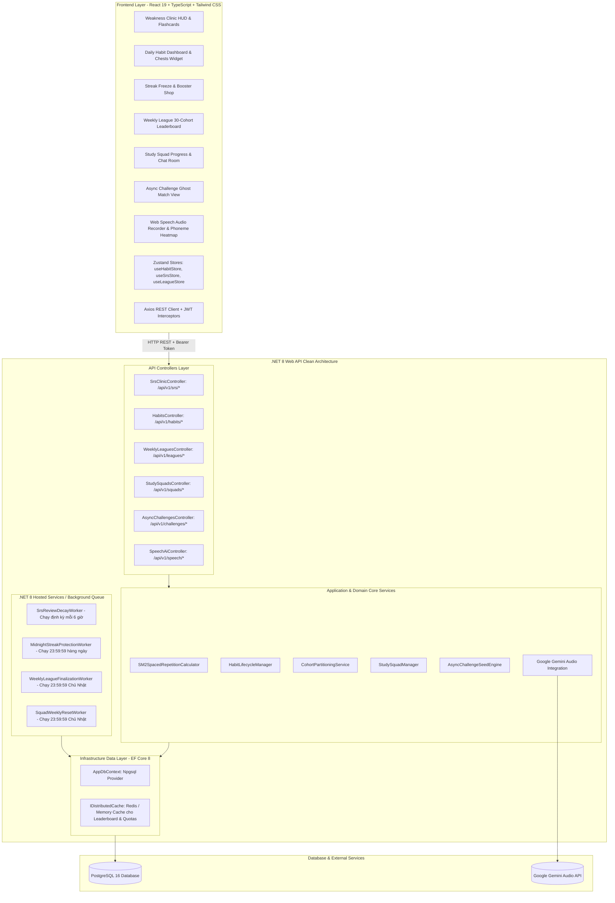
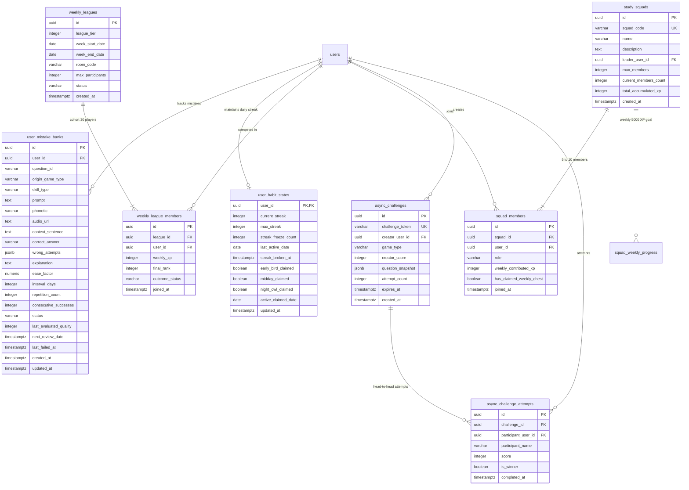
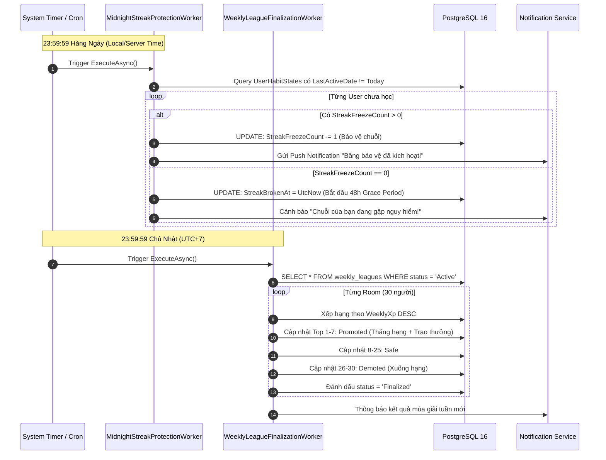
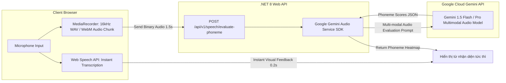

# Thiết Kế Kiến Trúc Hệ Thống: Hệ Thống Giữ Chân Người Dùng & Gamification Đột Phá
## (System Architecture: Retention & Gamification Expansion)

**Mã tài liệu:** `ARCH-RETENTION-GAMIFICATION-V1`  
**Phiên bản:** 1.0  
**Tác giả:** Tech Lead & Software Architect (`11dba413-036f-4ce1-950e-252419384dce`)  
**Người nhận chuyển giao:** UI/UX Designer (`c74ffe18-11a2-47b9-a7f4-a3600b2f07c0`), Senior Fullstack Engineer (`e78be358-35da-419c-bf21-24a27e284561`), QA Team  
**Dự án:** learn-english (Paperclip Issue `PHU-17`)  
**Tài liệu đặc tả nghiệp vụ tham chiếu:** [`docs/spec/retention-and-gamification-expansion.md`](../spec/retention-and-gamification-expansion.md), [`docs/spec/product-research-retention-expansion.md`](../spec/product-research-retention-expansion.md)  
**Ngày ban hành:** 29/09/2026  

---

## 1. Kiến Trúc Tổng Thể & Mô Hình Thành Phần (C4 Component Diagram)

Hệ thống giữ chân người dùng (Retention & Gamification Expansion) được thiết kế theo mô hình **Layered Clean Architecture** trên nền tảng **.NET 8 Web API** và **React 19 + TypeScript + Vite**.



---

## 2. Kiến Trúc Cơ Sở Dữ Liệu PostgreSQL & Entity Framework Core (Database Architecture)

### 2.1. Sơ Đồ Thực Thể Quan Hệ (ERD)



### 2.2. Kịch Bản PostgreSQL DDL Tối Ưu

```sql
-- ============================================================================
-- POSTGRESQL DDL: RETENTION & GAMIFICATION SUBSYSTEM
-- ============================================================================

-- 1. BẢNG NGÂN HÀNG LỖI SAI (MISTAKE BANK & SM-2)
CREATE TABLE IF NOT EXISTS user_mistake_banks (
    id UUID PRIMARY KEY DEFAULT gen_random_uuid(),
    user_id UUID NOT NULL REFERENCES users(id) ON DELETE CASCADE,
    question_id VARCHAR(100) NOT NULL,
    origin_game_type VARCHAR(50) NOT NULL,
    skill_type VARCHAR(20) NOT NULL,
    prompt TEXT NOT NULL,
    phonetic VARCHAR(100),
    audio_url TEXT,
    context_sentence TEXT,
    correct_answer VARCHAR(500) NOT NULL,
    wrong_attempts JSONB DEFAULT '[]'::jsonb,
    explanation TEXT,
    ease_factor NUMERIC(4, 2) NOT NULL DEFAULT 2.50,
    interval_days INT NOT NULL DEFAULT 1,
    repetition_count INT NOT NULL DEFAULT 0,
    consecutive_successes INT NOT NULL DEFAULT 0,
    status VARCHAR(20) NOT NULL DEFAULT 'Learning', -- 'Learning', 'Reviewing', 'Mastered'
    last_evaluated_quality INT,
    next_review_date TIMESTAMPTZ NOT NULL DEFAULT CURRENT_TIMESTAMP,
    last_failed_at TIMESTAMPTZ NOT NULL DEFAULT CURRENT_TIMESTAMP,
    created_at TIMESTAMPTZ NOT NULL DEFAULT CURRENT_TIMESTAMP,
    updated_at TIMESTAMPTZ NOT NULL DEFAULT CURRENT_TIMESTAMP
);

CREATE INDEX IF NOT EXISTS idx_mistake_user_review ON user_mistake_banks (user_id, status, next_review_date);
CREATE INDEX IF NOT EXISTS idx_mistake_user_skill ON user_mistake_banks (user_id, skill_type);
CREATE INDEX IF NOT EXISTS idx_mistake_question ON user_mistake_banks (user_id, question_id);

-- 2. BẢNG TRẠNG THÁI THÓI QUEN NGÀY & BẢO VỆ CHUỖI STREAK
CREATE TABLE IF NOT EXISTS user_habit_states (
    user_id UUID PRIMARY KEY REFERENCES users(id) ON DELETE CASCADE,
    current_streak INT NOT NULL DEFAULT 0,
    max_streak INT NOT NULL DEFAULT 0,
    streak_freeze_count INT NOT NULL DEFAULT 0 CHECK (streak_freeze_count BETWEEN 0 AND 2),
    last_active_date DATE,
    streak_broken_at TIMESTAMPTZ,
    early_bird_claimed BOOLEAN NOT NULL DEFAULT FALSE,
    midday_claimed BOOLEAN NOT NULL DEFAULT FALSE,
    night_owl_claimed BOOLEAN NOT NULL DEFAULT FALSE,
    active_claimed_date DATE,
    updated_at TIMESTAMPTZ NOT NULL DEFAULT CURRENT_TIMESTAMP
);

-- 3. BẢNG GIẢI ĐẤU PHÂN HẠNG TUẦN (WEEKLY LEAGUES)
CREATE TABLE IF NOT EXISTS weekly_leagues (
    id UUID PRIMARY KEY DEFAULT gen_random_uuid(),
    league_tier INT NOT NULL CHECK (league_tier BETWEEN 1 AND 5), -- 1:Bronze, 2:Silver, 3:Gold, 4:Sapphire, 5:Diamond
    week_start_date DATE NOT NULL,
    week_end_date DATE NOT NULL,
    room_code VARCHAR(50) NOT NULL,
    max_participants INT NOT NULL DEFAULT 30,
    status VARCHAR(20) NOT NULL DEFAULT 'Active', -- 'Active', 'Finalized'
    created_at TIMESTAMPTZ NOT NULL DEFAULT CURRENT_TIMESTAMP
);

CREATE UNIQUE INDEX IF NOT EXISTS uq_league_room ON weekly_leagues (week_start_date, league_tier, room_code);

CREATE TABLE IF NOT EXISTS weekly_league_members (
    id UUID PRIMARY KEY DEFAULT gen_random_uuid(),
    league_id UUID NOT NULL REFERENCES weekly_leagues(id) ON DELETE CASCADE,
    user_id UUID NOT NULL REFERENCES users(id) ON DELETE CASCADE,
    weekly_xp INT NOT NULL DEFAULT 0,
    final_rank INT,
    outcome_status VARCHAR(20) DEFAULT 'Pending', -- 'Pending', 'Promoted', 'Safe', 'Demoted'
    joined_at TIMESTAMPTZ NOT NULL DEFAULT CURRENT_TIMESTAMP,
    CONSTRAINT uq_league_user UNIQUE (league_id, user_id)
);

CREATE INDEX IF NOT EXISTS idx_league_ranking ON weekly_league_members (league_id, weekly_xp DESC);

-- 4. BẢNG NHÓM HỌC TẬP (STUDY SQUADS)
CREATE TABLE IF NOT EXISTS study_squads (
    id UUID PRIMARY KEY DEFAULT gen_random_uuid(),
    squad_code VARCHAR(20) NOT NULL UNIQUE,
    name VARCHAR(100) NOT NULL,
    description TEXT,
    leader_user_id UUID NOT NULL REFERENCES users(id),
    max_members INT NOT NULL DEFAULT 10,
    current_members_count INT NOT NULL DEFAULT 1,
    total_accumulated_xp INT NOT NULL DEFAULT 0,
    created_at TIMESTAMPTZ NOT NULL DEFAULT CURRENT_TIMESTAMP
);

CREATE TABLE IF NOT EXISTS squad_members (
    id UUID PRIMARY KEY DEFAULT gen_random_uuid(),
    squad_id UUID NOT NULL REFERENCES study_squads(id) ON DELETE CASCADE,
    user_id UUID NOT NULL REFERENCES users(id) ON DELETE CASCADE,
    role VARCHAR(20) NOT NULL DEFAULT 'Member', -- 'Leader', 'Member'
    weekly_contributed_xp INT NOT NULL DEFAULT 0,
    has_claimed_weekly_chest BOOLEAN NOT NULL DEFAULT FALSE,
    joined_at TIMESTAMPTZ NOT NULL DEFAULT CURRENT_TIMESTAMP,
    CONSTRAINT uq_squad_user UNIQUE (squad_id, user_id)
);

CREATE INDEX IF NOT EXISTS idx_squad_member_xp ON squad_members (squad_id, weekly_contributed_xp DESC);

-- 5. BẢNG THÁCH ĐẤU BẤT ĐỒNG BỘ (ASYNC CHALLENGES)
CREATE TABLE IF NOT EXISTS async_challenges (
    id UUID PRIMARY KEY DEFAULT gen_random_uuid(),
    challenge_token VARCHAR(32) NOT NULL UNIQUE,
    creator_user_id UUID NOT NULL REFERENCES users(id) ON DELETE CASCADE,
    game_type VARCHAR(50) NOT NULL,
    creator_score INT NOT NULL,
    question_snapshot JSONB NOT NULL,
    attempt_count INT NOT NULL DEFAULT 0,
    expires_at TIMESTAMPTZ NOT NULL,
    created_at TIMESTAMPTZ NOT NULL DEFAULT CURRENT_TIMESTAMP
);

CREATE TABLE IF NOT EXISTS async_challenge_attempts (
    id UUID PRIMARY KEY DEFAULT gen_random_uuid(),
    challenge_id UUID NOT NULL REFERENCES async_challenges(id) ON DELETE CASCADE,
    participant_user_id UUID REFERENCES users(id) ON DELETE SET NULL,
    participant_name VARCHAR(100) NOT NULL,
    score INT NOT NULL,
    is_winner BOOLEAN NOT NULL DEFAULT FALSE,
    completed_at TIMESTAMPTZ NOT NULL DEFAULT CURRENT_TIMESTAMP
);

CREATE INDEX IF NOT EXISTS idx_challenge_attempts ON async_challenge_attempts (challenge_id, score DESC);
```

---

## 3. Thiết Kế Thuật Toán SM-2 & Xử Lý Logic Nghiệp Vụ (SM-2 Engine Design)

### 3.1. Thuật Toán Cập Nhật SM-2 Trong C#

```csharp
namespace LearnEnglish.Api.Domain.Services;

public class Sm2EvaluationResult
{
    public decimal NewEaseFactor { get; set; }
    public int NewIntervalDays { get; set; }
    public int RepetitionCount { get; set; }
    public int ConsecutiveSuccesses { get; set; }
    public DateTime NextReviewDate { get; set; }
    public bool IsGraduated { get; set; }
    public int AwardedCoins { get; set; }
    public int AwardedXp { get; set; }
}

public static class Sm2SpacedRepetitionCalculator
{
    public const decimal MinEaseFactor = 1.30m;
    public const decimal DefaultEaseFactor = 2.50m;

    public static Sm2EvaluationResult Calculate(
        decimal currentEf,
        int currentInterval,
        int currentRepetitions,
        int currentConsecutiveSuccesses,
        int qualityScore, // 0 to 5
        DateTime baseDate)
    {
        // 1. Tính toán Ease Factor mới
        // EF' = EF + (0.1 - (5 - q) * (0.08 + (5 - q) * 0.02))
        decimal delta = 0.1m - (5 - qualityScore) * (0.08m + (5 - qualityScore) * 0.02m);
        decimal newEf = Math.Max(MinEaseFactor, Math.Round(currentEf + delta, 2));

        int newInterval;
        int newRepetitions;
        int newConsecutiveSuccesses;
        bool isGraduated = false;
        int coins = 0;
        int xp = 0;

        if (qualityScore < 3)
        {
            // Ôn tập thất bại: Đặt lại interval về 1 ngày, reset streak thành công
            newRepetitions = 0;
            newConsecutiveSuccesses = 0;
            newInterval = 1;
            coins = 0;
            xp = 5; // An ủi tinh thần
        }
        else
        {
            // Ôn tập thành công:
            newRepetitions = currentRepetitions + 1;
            newConsecutiveSuccesses = currentConsecutiveSuccesses + 1;

            if (newRepetitions == 1)
            {
                newInterval = 1;
            }
            else if (newRepetitions == 2)
            {
                newInterval = 3;
            }
            else
            {
                newInterval = (int)Math.Round(currentInterval * newEf, MidpointRounding.AwayFromZero);
            }

            // Điểm thưởng cơ bản
            coins = qualityScore == 5 ? 15 : 10;
            xp = qualityScore == 5 ? 30 : 20;

            // Kiểm tra điều kiện Tốt Nghiệp (Graduation)
            if (newRepetitions >= 4 && newEf >= 2.50m && newConsecutiveSuccesses >= 3)
            {
                isGraduated = true;
                coins += 25; // Graduation bounty
                xp += 50;
            }
        }

        return new Sm2EvaluationResult
        {
            NewEaseFactor = newEf,
            NewIntervalDays = newInterval,
            RepetitionCount = newRepetitions,
            ConsecutiveSuccesses = newConsecutiveSuccesses,
            NextReviewDate = baseDate.AddDays(newInterval),
            IsGraduated = isGraduated,
            AwardedCoins = coins,
            AwardedXp = xp
        };
    }
}
```

---

## 4. Kiến Trúc Tác Vụ Nền (.NET 8 Hosted Services / Background Jobs)

Hệ thống triển khai 4 tác vụ nền thông qua **ASP.NET Core BackgroundService / IHostedService**:



### 4.1. Chi Tiết Lớp `MidnightStreakProtectionWorker`
- **Tần suất chạy:** 23:59:59 mỗi đêm (cron: `59 23 * * *`).
- **Xử lý theo Batch:** Mỗi đợt 500 bản ghi sử dụng `EF Core IDbContextFactory` để tránh tắc nghẽn bộ nhớ.
- **Ràng buộc an toàn:** Giao dịch Transactional đảm bảo số dư `streak_freeze_count` không bao giờ rơi vào tình trạng âm hoặc race condition.

### 4.2. Chi Tiết Lớp `WeeklyLeagueFinalizationWorker`
- **Tần suất chạy:** 23:59:59 Chủ Nhật hàng tuần.
- **Phân bổ thưởng tự động:** Cộng trực tiếp `Coins` vào ví `user_profiles` và tạo bản ghi lịch sử `coin_transactions`.
- **Cơ chế Lazy Partitioning cho tuần tiếp theo:** Đầu tuần không tạo trước hàng ngàn room rỗng. Khi người dùng hoàn thành ván chơi đầu tiên, API kiểm tra nếu chưa có room sẽ gán vào room đang mở cùng tier ($< 30$ người) hoặc khởi tạo room mới.

---

## 5. Kiến Trúc Tích Hợp AI Speaking & Đánh Giá Âm Vị (Web Speech & Gemini Audio)

### 5.1. Mô Hình Tích Hợp Hai Tầng (Two-Tier Hybrid Speech Architecture)



### 5.2. Cấu Trúc Prompt Đánh Giá Ngữ Âm Cho Gemini Audio API

Khi người học thực hiện thử thách phát âm câu/từ (ví dụ từ `"comprehension"`):
```text
System Prompt:
You are an expert English Phonetics and Pronunciation Coach.
Analyze the user's uploaded audio against the reference text: "{referenceText}" and reference IPA: "{referenceIpa}".
Evaluate each phoneme and return a strict JSON payload:
{
  "overallScore": 85, // 0 - 100
  "phonemes": [
    { "phoneme": "k", "score": 95, "status": "green" },
    { "phoneme": "ɒ", "score": 88, "status": "green" },
    { "phoneme": "m", "score": 92, "status": "green" },
    { "phoneme": "p", "score": 45, "status": "red", "feedback": "Aspiration missing" },
    { "phoneme": "r", "score": 75, "status": "yellow", "feedback": "Slight tongue curl issue" },
    { "phoneme": "ɪ", "score": 90, "status": "green" },
    { "phoneme": "h", "score": 85, "status": "green" },
    { "phoneme": "e", "score": 88, "status": "green" },
    { "phoneme": "n", "score": 90, "status": "green" },
    { "phoneme": "ʃ", "score": 95, "status": "green" },
    { "phoneme": "ə", "score": 80, "status": "green" },
    { "phoneme": "n", "score": 92, "status": "green" }
  ],
  "actionableTip": "Bật hơi mạnh hơn ở âm /p/ để phát âm chuẩn xác ngữ âm bản xứ."
}
```

---

## 6. Đặc Tả Hợp Đồng RESTful API Chi Tiết (API Contracts)

### 6.1. Nhóm API Spaced Repetition (SRS) & Mistake Clinic

#### `GET /api/v1/srs/mistakes/summary`
- **Mô tả:** Lấy tổng số lượng thẻ lỗi sai đến hạn ôn tập và tổng số thẻ đã Mastered.
- **Headers:** `Authorization: Bearer <token>`
- **Response 200 OK:**
```json
{
  "totalDueToday": 14,
  "learningCount": 26,
  "reviewingCount": 18,
  "masteredCount": 42,
  "bySkill": {
    "Listening": 5,
    "Reading": 3,
    "Writing": 4,
    "Speaking": 2
  }
}
```

#### `GET /api/v1/srs/clinic/session`
- **Mô tả:** Khởi tạo một phiên khám bệnh gồm đúng 10 thẻ lỗi sai ưu tiên nhất.
- **Headers:** `Authorization: Bearer <token>`
- **Response 200 OK:**
```json
{
  "sessionId": "a1b2c3d4-e5f6-7890-abcd-ef1234567890",
  "cards": [
    {
      "id": "7f8b3c94-1a2b-4e8f-9a0d-5b6c7d8e9f01",
      "questionId": "q_audio_comprehension_01",
      "originGameType": "AudioBlitz",
      "skillType": "Listening",
      "prompt": "Nghe và điền danh từ chỉ sự thấu hiểu",
      "phonetic": "/ˌkɒm.prɪˈhen.ʃən/",
      "audioUrl": "https://assets.learnenglish.app/audio/comprehension.mp3",
      "contextSentence": "His ________ of quantum mechanics surprised the professor.",
      "correctAnswer": "Comprehension",
      "wrongAttempts": ["Comprehensive", "Comprehend"],
      "options": ["Comprehensive", "Comprehension", "Comprehend", "Comprehensibly"],
      "timeLimitSeconds": 15
    }
  ]
}
```

#### `POST /api/v1/srs/clinic/submit`
- **Mô tả:** Chấm điểm câu hỏi trong phiên Clinic và cập nhật thuật toán SM-2.
- **Headers:** `Authorization: Bearer <token>`
- **Request Body:**
```json
{
  "mistakeId": "7f8b3c94-1a2b-4e8f-9a0d-5b6c7d8e9f01",
  "selectedAnswer": "Comprehension",
  "responseTimeMs": 2450,
  "usedHint": false
}
```
- **Response 200 OK:**
```json
{
  "mistakeId": "7f8b3c94-1a2b-4e8f-9a0d-5b6c7d8e9f01",
  "isCorrect": true,
  "qualityScore": 5,
  "newEaseFactor": 2.60,
  "newIntervalDays": 3,
  "nextReviewDate": "2026-10-02T11:15:00Z",
  "isGraduated": false,
  "awardedCoins": 15,
  "awardedXp": 30
}
```

---

### 6.2. Nhóm API Thói Quen Hàng Ngày (Habits & Chests)

#### `GET /api/v1/habits/summary`
- **Mô tả:** Lấy thông tin trạng thái Streak hiện tại, số lượng Streak Freeze và trạng thái 3 hòm thưởng khung giờ.
- **Headers:** `Authorization: Bearer <token>`
- **Response 200 OK:**
```json
{
  "currentStreak": 14,
  "maxStreak": 28,
  "streakFreezeCount": 1,
  "maxAllowedFreeze": 2,
  "isStreakProtectedToday": true,
  "isStreakInGracePeriod": false,
  "gracePeriodExpiresAt": null,
  "chests": {
    "earlyBird": { "available": false, "claimed": true, "window": "06:00 - 10:00" },
    "midday": { "available": true, "claimed": false, "window": "11:30 - 13:30" },
    "nightOwl": { "available": false, "claimed": false, "window": "19:00 - 23:00" }
  }
}
```

#### `POST /api/v1/habits/shop/buy-freeze`
- **Mô tả:** Mua 1 Băng Bảo Vệ Chuỗi trong Cửa Hàng (giá 200 Coins, tối đa trữ 2 bình).
- **Headers:** `Authorization: Bearer <token>`
- **Response 200 OK:**
```json
{
  "success": true,
  "newStreakFreezeCount": 2,
  "remainingCoins": 440,
  "message": "Đã mua thành công Băng Bảo Vệ Chuỗi!"
}
```
- **Response 400 Bad Request:**
```json
{
  "error": "INVENTORY_FULL",
  "message": "Túi đồ đã đầy. Bạn chỉ có thể tích trữ tối đa 2 Băng Bảo Vệ."
}
```

#### `POST /api/v1/habits/chests/claim`
- **Mô tả:** Nhận quà từ 1 trong 3 Hòm Thưởng Khung Giờ (EarlyBird, Midday, NightOwl).
- **Headers:** `Authorization: Bearer <token>`
- **Request Body:**
```json
{
  "chestType": "Midday"
}
```
- **Response 200 OK:**
```json
{
  "chestType": "Midday",
  "awardedCoins": 40,
  "awardedBattleTickets": 2,
  "message": "Mở hòm Năng Lượng trưa thành công!"
}
```

---

### 6.3. Nhóm API Giải Đấu Tuần & Nhóm Học Tập

#### `GET /api/v1/leagues/current`
- **Mô tả:** Lấy thông tin Bảng đấu tuần 30 người của người dùng.
- **Headers:** `Authorization: Bearer <token>`
- **Response 200 OK:**
```json
{
  "leagueTier": "Sapphire",
  "roomCode": "Sapphire-Room-142",
  "timeRemainingSeconds": 102400,
  "currentUserRank": 1,
  "currentUserXp": 2450,
  "leaderboard": [
    { "rank": 1, "userId": "...", "userName": "Nguyễn Văn A (Bạn)", "weeklyXp": 2450, "zone": "Promotion" },
    { "rank": 7, "userId": "...", "userName": "Phạm Quỳnh Nga", "weeklyXp": 1620, "zone": "Promotion" },
    { "rank": 8, "userId": "...", "userName": "David Beckham", "weeklyXp": 1590, "zone": "Safe" },
    { "rank": 26, "userId": "...", "userName": "John Doe", "weeklyXp": 720, "zone": "Demotion" }
  ]
}
```

#### `GET /api/v1/squads/my-squad`
- **Mô tả:** Lấy thông tin chi tiết nhóm học tập 5-10 người và tiến độ rương tuần 5,000 XP.
- **Headers:** `Authorization: Bearer <token>`
- **Response 200 OK:**
```json
{
  "squadId": "9b1deb4d-3b7d-4bad-9bdd-2b0d7b3dcb6d",
  "squadCode": "ENG-8821",
  "name": "The IELTS Overcomers",
  "memberCount": 7,
  "maxMembers": 10,
  "weeklyGoalXp": 5000,
  "currentWeeklyXp": 3850,
  "currentUserContributionXp": 1250,
  "isEligibleForReward": true,
  "hasClaimedReward": false,
  "members": [
    { "userId": "...", "userName": "Nguyễn Văn A", "role": "Leader", "weeklyXp": 1250, "hasReachedThreshold": true }
  ]
}
```

---

### 6.4. Nhóm API Thách Đấu Bất Đồng Bộ (Async Viral Challenges)

#### `POST /api/v1/challenges/create`
- **Mô tả:** Đóng gói ván chơi vừa hoàn thành thành link thách đấu bạn bè.
- **Headers:** `Authorization: Bearer <token>`
- **Request Body:**
```json
{
  "gameType": "SpeedFalling",
  "score": 1420,
  "questionSnapshot": [
    { "id": "q1", "word": "Algorithm", "meaning": "Thuật toán" }
  ]
}
```
- **Response 200 OK:**
```json
{
  "challengeToken": "x9aB7zKd2",
  "shareUrl": "https://learnenglish.app/c/x9aB7zKd2",
  "expiresAt": "2026-10-06T11:15:00Z"
}
```

---

## 7. Phân Tách Công Việc & Điều Phối Thực Thi (Task Breakdown & Orchestration)

Theo đúng quy chuẩn phân quyền kỹ thuật, Tech Lead giao nhiệm vụ cho 2 kỹ sư trực tiếp:

### 7.1. Phân việc cho `UI/UX Designer` (`c74ffe18-11a2-47b9-a7f4-a3600b2f07c0`)
- **Nhiệm vụ:** Thiết kế UI tokens, Wireframes & Component Library cho:
  1. Giao diện "Weakness Clinic" (Phòng Khám Lỗi Sai): Header cấp cứu, Tim mạng, Flashcard lật nghĩa, Sound player, Phản hồi âm vị.
  2. Widget 3 Hòm Thưởng Khung Giờ (Bình Minh, Năng Lượng, Hoàng Hôn) kèm hiệu ứng mở rương Gacha.
  3. Màn hình Cửa Hàng Gamification (Mua Streak Freeze, Tối đa 2 bình).
  4. Giao diện Bảng Xếp Hạng Tuần (Weekly League 30 người) phân 3 vùng màu: Xanh (Thăng hạng), Trắng (An toàn), Đỏ (Xuống hạng).
  5. Giao diện Study Squads (Tiến độ rương 5,000 XP & Bảng cống hiến thành viên).
  6. Giao diện Thách Đấu Bất Đồng Bộ (Ghost Battle View & Thẻ chia sẻ mạng xã hội).

### 7.2. Phân việc cho `Senior Fullstack Engineer` (`e78be358-35da-419c-bf21-24a27e284561`)
- **Nhiệm vụ:**
  1. **Backend .NET 8 Web API:**
     - Thiết kế EF Core 8 Migrations tạo đầy đủ 8 bảng CSDL PostgreSQL theo DDL kiến trúc.
     - Triển khai `Sm2SpacedRepetitionCalculator` và các Controllers/Services RESTful API.
     - Triển khai 4 Background Jobs (`MidnightStreakProtectionWorker`, `WeeklyLeagueFinalizationWorker`, `SrsReviewDecayWorker`, `SquadWeeklyResetWorker`).
     - Tích hợp Web Speech API và Google Gemini Audio API cho Speech & Phoneme Evaluation.
  2. **Frontend React 19 + TypeScript:**
     - Tích hợp các Zustand Stores (`useHabitStore`, `useSrsStore`, `useLeagueStore`, `useSquadStore`).
     - Lắp ráp các Components theo đúng thiết kế của UI/UX Designer.
     - Đảm bảo kiểm thử `dotnet build` và `npm run build` đạt 0 lỗi.
