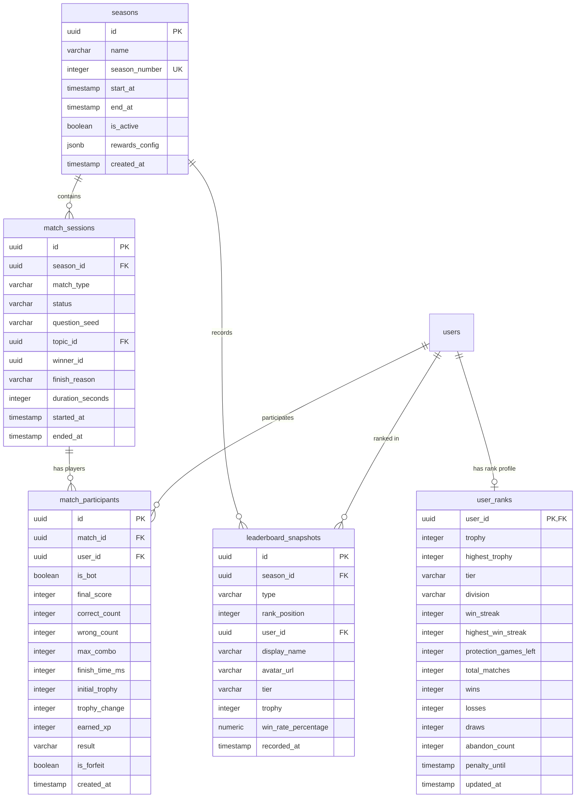

# Kiến Trúc Hệ Thống: Bảng Xếp Hạng & Đấu Đối Kháng Trực Tiếp 1v1 (System Architecture: Leaderboard & 1v1 Battle)

**Tài liệu:** Kiến trúc kỹ thuật và đặc tả triển khai hệ thống (Technical Architecture & Implementation Specification)  
**Tác giả:** Tech Lead & Software Architect (`11dba413-036f-4ce1-950e-252419384dce`)  
**Dự án:** learn-english (Paperclip Issue PHU-7)  
**Phạm vi áp dụng:** UI/UX Designer (`c74ffe18-11a2-47b9-a7f4-a3600b2f07c0`) & Senior Fullstack Engineer (`e78be358-35da-419c-bf21-24a27e284561`)  
**Tài liệu tham chiếu:** [`docs/spec/leaderboard-and-battle.md`](../spec/leaderboard-and-battle.md)

---

## 1. Kiến Trúc Tổng Thể Hệ Thống (System Overview & C4 Model)

Hệ thống bổ sung phân hệ thời gian thực (Realtime PvP) vào nền tảng học tiếng Anh hiện có. Kiến trúc kết hợp:
1. **ASP.NET Core SignalR:** Quản lý kết nối WebSocket hai chiều với độ trễ thấp, hàng đợi ghép cặp trong bộ nhớ (In-Memory Matchmaking Queue) và đồng bộ trạng thái trận đấu.
2. **PostgreSQL 16 & EF Core 8:** Quản lý dữ liệu bền vững về Rank/ELO, lịch sử trận đấu (MatchHistory), bảng xếp hạng định kỳ (Snapshots) và mùa giải (Seasons).
3. **React 19 + TypeScript + Vite + Tailwind CSS v4:** Giao diện người dùng hiện đại với hiệu ứng tương tác mượt mà (Radar animation, Dual HUD, Podium Leaderboard, Confetti).

```mermaid
flowchart TB
    subgraph Client [Frontend - React 19 + TypeScript]
        UI_Lobby[Lobby & Rank Card]
        UI_Queue[Matchmaking Radar Modal]
        UI_Battle[1v1 Speed Match Duel HUD]
        UI_Podium[Leaderboard & Podium Screen]
        SignalR_Client[@microsoft/signalr Client Service]
        REST_Client[Axios / Fetch API Client]
    end

    subgraph Backend [.NET 8 Web API]
        subgraph Realtime [Realtime Engine]
            BattleHub[SignalR BattleHub: /hubs/battle]
            MatchQueueService[Background Matchmaking Service]
            MatchSessionManager[Concurrent Battle Session Store]
            BotEngine[AI Bot Simulation Runner]
        end

        subgraph Controllers [REST API Endpoints]
            LeaderboardCtrl[LeaderboardController: /api/v1/leaderboard]
            MatchCtrl[MatchesController: /api/v1/matches]
            UserRankCtrl[UserRankController: /api/v1/users/{id}/rank]
        end

        subgraph CoreServices [Domain & Application Services]
            EloCalculator[EloRatingCalculator Service]
            SeasonManager[SeasonLifecycle Service]
            SeedGenerator[Deterministic Question Seed Generator]
        end

        subgraph DataLayer [EF Core 8 ORM]
            AppDbContext[AppDbContext: Npgsql / SQLite Fallback]
        end
    end

    subgraph Storage [Database]
        Postgres[(PostgreSQL 16 / SQLite dev)]
    end

    SignalR_Client <-->|WebSocket / SSE| BattleHub
    REST_Client -->|HTTP GET/POST| Controllers
    BattleHub --> MatchQueueService
    BattleHub --> MatchSessionManager
    MatchQueueService --> BotEngine
    MatchSessionManager --> EloCalculator
    MatchSessionManager --> AppDbContext
    Controllers --> AppDbContext
    AppDbContext --> Postgres
```

---

## 2. Kiến Trúc Cơ Sở Dữ Liệu PostgreSQL & EF Core (Database Design)

### 2.1. Sơ Đồ Thực Thể Quan Hệ (ERD)



### 2.2. DDL Scripts Chuẩn Hóa

```sql
-- 1. Bảng lưu trữ Rank và ELO của người dùng
CREATE TABLE IF NOT EXISTS user_ranks (
    user_id UUID PRIMARY KEY REFERENCES users(id) ON DELETE CASCADE,
    trophy INTEGER NOT NULL DEFAULT 0,
    highest_trophy INTEGER NOT NULL DEFAULT 0,
    tier VARCHAR(20) NOT NULL DEFAULT 'Bronze',
    division VARCHAR(10) NOT NULL DEFAULT 'III',
    win_streak INTEGER NOT NULL DEFAULT 0,
    highest_win_streak INTEGER NOT NULL DEFAULT 0,
    protection_games_left INTEGER NOT NULL DEFAULT 0,
    total_matches INTEGER NOT NULL DEFAULT 0,
    wins INTEGER NOT NULL DEFAULT 0,
    losses INTEGER NOT NULL DEFAULT 0,
    draws INTEGER NOT NULL DEFAULT 0,
    abandon_count INTEGER NOT NULL DEFAULT 0,
    penalty_until TIMESTAMP WITH TIME ZONE NULL,
    updated_at TIMESTAMP WITH TIME ZONE NOT NULL DEFAULT CURRENT_TIMESTAMP
);

CREATE INDEX IF NOT EXISTS idx_user_ranks_trophy ON user_ranks (trophy DESC);
CREATE INDEX IF NOT EXISTS idx_user_ranks_tier_division ON user_ranks (tier, division);

-- 2. Bảng quản lý Mùa Giải (Seasons)
CREATE TABLE IF NOT EXISTS seasons (
    id UUID PRIMARY KEY DEFAULT gen_random_uuid(),
    name VARCHAR(100) NOT NULL,
    season_number INTEGER NOT NULL UNIQUE,
    start_at TIMESTAMP WITH TIME ZONE NOT NULL,
    end_at TIMESTAMP WITH TIME ZONE NOT NULL,
    is_active BOOLEAN NOT NULL DEFAULT FALSE,
    rewards_config JSONB NOT NULL DEFAULT '{}'::jsonb,
    created_at TIMESTAMP WITH TIME ZONE NOT NULL DEFAULT CURRENT_TIMESTAMP
);

CREATE INDEX IF NOT EXISTS idx_seasons_active ON seasons (is_active);

-- 3. Bảng quản lý Phiên Trận Đấu 1v1 (Match Sessions)
CREATE TABLE IF NOT EXISTS match_sessions (
    id UUID PRIMARY KEY DEFAULT gen_random_uuid(),
    season_id UUID REFERENCES seasons(id) ON DELETE SET NULL,
    match_type VARCHAR(30) NOT NULL DEFAULT 'SpeedWordMatch',
    status VARCHAR(20) NOT NULL DEFAULT 'Waiting', -- Waiting, InProgress, Finished, Aborted
    question_seed VARCHAR(64) NOT NULL,
    topic_id UUID REFERENCES topics(id) ON DELETE SET NULL,
    winner_id UUID NULL,
    finish_reason VARCHAR(30) NULL, -- NormalCompletion, Timeout, Forfeit, DisconnectTimeout
    duration_seconds INTEGER NOT NULL DEFAULT 0,
    started_at TIMESTAMP WITH TIME ZONE NOT NULL DEFAULT CURRENT_TIMESTAMP,
    ended_at TIMESTAMP WITH TIME ZONE NULL
);

CREATE INDEX IF NOT EXISTS idx_matches_season_created ON match_sessions (season_id, started_at DESC);

-- 4. Bảng chi tiết Người Tham Gia Trận Đấu (Match Participants)
CREATE TABLE IF NOT EXISTS match_participants (
    id UUID PRIMARY KEY DEFAULT gen_random_uuid(),
    match_id UUID NOT NULL REFERENCES match_sessions(id) ON DELETE CASCADE,
    user_id UUID NOT NULL,
    is_bot BOOLEAN NOT NULL DEFAULT FALSE,
    final_score INTEGER NOT NULL DEFAULT 0,
    correct_count INTEGER NOT NULL DEFAULT 0,
    wrong_count INTEGER NOT NULL DEFAULT 0,
    max_combo INTEGER NOT NULL DEFAULT 0,
    finish_time_ms INTEGER NOT NULL DEFAULT 0,
    initial_trophy INTEGER NOT NULL DEFAULT 0,
    trophy_change INTEGER NOT NULL DEFAULT 0,
    earned_xp INTEGER NOT NULL DEFAULT 0,
    result VARCHAR(20) NOT NULL DEFAULT 'Pending', -- Win, Loss, Draw
    is_forfeit BOOLEAN NOT NULL DEFAULT FALSE,
    created_at TIMESTAMP WITH TIME ZONE NOT NULL DEFAULT CURRENT_TIMESTAMP
);

CREATE INDEX IF NOT EXISTS idx_participants_user_match ON match_participants (user_id, match_id);

-- 5. Bảng Lưu Trữ Bảng Xếp Hạng Định Kỳ (Leaderboard Snapshots)
CREATE TABLE IF NOT EXISTS leaderboard_snapshots (
    id UUID PRIMARY KEY DEFAULT gen_random_uuid(),
    season_id UUID REFERENCES seasons(id) ON DELETE CASCADE,
    type VARCHAR(20) NOT NULL DEFAULT 'Weekly', -- Weekly, SeasonEnd, AllTime
    rank_position INTEGER NOT NULL,
    user_id UUID NOT NULL REFERENCES users(id) ON DELETE CASCADE,
    display_name VARCHAR(100) NOT NULL,
    avatar_url VARCHAR(255) NULL,
    tier VARCHAR(20) NOT NULL,
    trophy INTEGER NOT NULL,
    win_rate_percentage NUMERIC(5,2) NOT NULL DEFAULT 0.00,
    recorded_at TIMESTAMP WITH TIME ZONE NOT NULL DEFAULT CURRENT_TIMESTAMP
);

CREATE INDEX IF NOT EXISTS idx_leaderboard_season_rank ON leaderboard_snapshots (season_id, type, rank_position ASC);
```

---

## 3. Kiến Trúc SignalR Realtime & Matchmaking Engine (Realtime Protocol)

### 3.1. Vòng Đời Kết Nối & Xác Thực (Authentication & Connection Lifecycle)
- **Endpoint:** `/hubs/battle`
- **Xác thực:** Truyền JWT qua query string: `?access_token={jwt_token}`. Server trích xuất `UserId` và đăng ký kết nối vào bảng ánh xạ `ConnectionMap (UserId <-> ConnectionId)`.
- **Hỗ trợ Reconnect:** Xử lý `OnDisconnectedAsync` bằng bộ đếm Grace Period 15 giây trước khi công bố Forfeit.

### 3.2. Thuật Toán Hàng Đợi Ghép Cặp (Adaptive Matchmaking Queue)
Hàng đợi được quản lý bằng `System.Threading.Channels` kết hợp `ConcurrentDictionary`:
1. **0 – 5s:** Tìm kiếm đối thủ có khoảng cách $\Delta\text{Trophy} \le 50$.
2. **6 – 10s:** Mở rộng vùng tìm kiếm lên $\Delta\text{Trophy} \le 100$.
3. **11 – 15s:** Mở rộng vùng tìm kiếm lên $\Delta\text{Trophy} \le 200$.
4. **> 15s (Timeout):** Ghép ngay với một **AI Bot** mô phỏng người chơi thật với độ trễ (latency $1.5s - 3.5s$) và độ chính xác ($70\% - 95\%$) phù hợp theo Tier của người chơi.

### 3.3. Bảng Phương Thức & Sự Kiện SignalR

| Hướng | Tên Phương Thức / Sự Kiện | Kiểu Dữ Liệu Payload | Mô Tả |
| :--- | :--- | :--- | :--- |
| **Client $\to$ Hub** | `JoinMatchmakingQueue` | `{ preferredTopicId?: string }` | Tham gia hàng chờ tìm đối thủ |
| **Client $\to$ Hub** | `LeaveMatchmakingQueue` | `void` | Hủy tìm trận |
| **Client $\to$ Hub** | `SendPlayerProgress` | `PlayerProgressDto` | Báo ghép đúng 1 cặp từ, cập nhật điểm |
| **Client $\to$ Hub** | `FinishMatchEarly` | `{ totalTimeMs: number }` | Báo hoàn thành 10 cặp trước 60s |
| **Client $\to$ Hub** | `ForfeitMatch` | `{ matchId: string }` | Đầu hàng hoặc thoát trận |
| **Client $\to$ Hub** | `ReconnectMatch` | `{ matchId: string }` | Kết nối lại sau sự cố mạng |
| **Hub $\to$ Client** | `QueueStatusUpdate` | `{ queueTimeSeconds, searchRangeTrophy }` | Đếm giây hàng chờ |
| **Hub $\to$ Client** | `MatchFound` | `MatchFoundPayload` | Ghép trận thành công, gửi bộ 10 cặp từ |
| **Hub $\to$ Client** | `BattleStarted` | `{ startTimeUtc: string }` | Hết 3s countdown, bắt đầu đếm 60s |
| **Hub $\to$ Client** | `OpponentProgressUpdate` | `OpponentProgressPayload` | Cập nhật thanh tiến độ đối thủ |
| **Hub $\to$ Client** | `OpponentDisconnected` | `{ gracePeriodSeconds: 15 }` | Báo đối thủ rớt mạng |
| **Hub $\to$ Client** | `OpponentReconnected` | `void` | Báo đối thủ đã vào lại |
| **Hub $\to$ Client** | `MatchFinished` | `MatchResultPayload` | Tổng kết kết quả, cập nhật Trophy/XP |

---

## 4. Đặc Tả REST API Endpoints (Bổ Trợ)

### 4.1. `GET /api/v1/leaderboard/battle`
- **Mục đích:** Lấy danh sách Top 100 xếp hạng toàn cầu theo mùa giải hiện tại và vị trí của người dùng hiện tại.
- **Parameters:**
  - `type` (optional, default `Season`): `Season` | `AllTime`
  - `page` (default 1), `pageSize` (default 50)
- **Response Format:**
```json
{
  "season": {
    "id": "e3b0c442-98fc-1c14-9afb-4c8996fb9242",
    "seasonNumber": 1,
    "name": "Mùa 1: Khởi Nguyên Chiến Binh",
    "daysRemaining": 18
  },
  "myRank": {
    "rankPosition": 42,
    "userId": "c1f1a58b-9e23-45c1-872f-5b89c3140a01",
    "displayName": "Thịnh Nguyễn",
    "avatarUrl": "https://api.dicebear.com/7.x/bottts/svg?seed=thinh",
    "tier": "Silver",
    "division": "I",
    "trophy": 1882,
    "winRate": 66.7
  },
  "items": [
    {
      "rankPosition": 1,
      "userId": "11111111-2222-3333-4444-555555555555",
      "displayName": "Hoàng Nam Pro",
      "avatarUrl": "https://api.dicebear.com/7.x/bottts/svg?seed=nam",
      "tier": "Master",
      "division": "I",
      "trophy": 5420,
      "winRate": 82.5,
      "winStreak": 9
    }
  ]
}
```

### 4.2. `GET /api/v1/users/{userId}/rank`
- **Mục đích:** Lấy thông tin thống kê chi tiết Rank của một người chơi (Trophy, Tier, Division, Win Streak, Tỷ lệ thắng, Khiên bảo vệ).

### 4.3. `GET /api/v1/matches/history`
- **Mục đích:** Lấy lịch sử 20 trận đấu 1v1 gần nhất của người dùng hiện tại (kết quả Thắng/Thua, đối thủ, điểm số, biến động Trophy).

---

## 5. Hướng Dẫn & Tiêu Chuẩn Giao Diện Cho UI/UX Designer

Dành cho: **UI/UX Designer** (`c74ffe18-11a2-47b9-a7f4-a3600b2f07c0`)

### 5.1. Bảng Màu Theo Bậc Rank (Tailwind Design Tokens)
- **Đồng (Bronze):** `bg-amber-900/30 text-amber-500 border-amber-600`
- **Bạc (Silver):** `bg-slate-800/40 text-slate-300 border-slate-400`
- **Vàng (Gold):** `bg-yellow-950/40 text-yellow-400 border-yellow-500 shadow-yellow-500/20`
- **Bạch Kim (Platinum):** `bg-cyan-950/40 text-cyan-300 border-cyan-400 shadow-cyan-400/25`
- **Kim Cương (Diamond):** `bg-blue-950/40 text-blue-400 border-blue-500 shadow-blue-500/30`
- **Cao Thủ (Master):** `bg-purple-950/40 text-purple-300 border-purple-500 shadow-purple-500/40 animate-pulse`

### 5.2. Các Thành Phần Giao Diện Cần Thiết Kế
1. **Radar Matchmaking Modal (`MatchmakingModal.tsx`):**
   - Vòng tròn radar quét xung quanh avatar của người chơi (`animate-ping`, `animate-spin`).
   - Bộ đếm thời gian tìm kiếm (`00:05`, `00:12...`).
   - Nút "Hủy tìm trận" rõ ràng, tinh tế.
   - Khi tìm thấy đối thủ: Hiệu ứng chuyển động (Flash) xuất hiện 2 avatar đối đầu với chữ `VS` rực lửa ở giữa, đếm ngược `3.. 2.. 1.. CHIẾN!`.
2. **Thanh Tiến Độ Kép Realtime (Dual Realtime HUD):**
   - Phía trên cùng màn hình 1v1: Người chơi bên trái (Xanh lá `emerald-500`), Đối thủ bên phải (Tím `purple-500` hoặc Cam `amber-500`).
   - Đồng hồ đếm ngược 60 giây ở trung tâm.
   - Thẻ hiển thị chuỗi Combo (`x2`, `x3`, `x4` hiệu ứng nảy số pháo hoa).
3. **Bảng Vinh Danh Top 3 (Podium Component):**
   - Bục vinh quang 3 bậc: Top 1 (Bậc giữa, cao nhất, vương miện vàng), Top 2 (Bậc trái, vương miện bạc), Top 3 (Bậc phải, vương miện đồng).
   - Danh sách Top 4 - 100 dạng bảng cuộn (Scrollable Table).
   - Thanh "Vị trí của bạn" (Your Rank) ghim cố định ở đáy màn hình (Sticky Bottom Footer).
4. **Màn Hình Tổng Kết Trận Đấu (Match Result Modal):**
   - Hiệu ứng Chiến Thắng (Victory - Pháo hoa Confetti vàng rực rỡ) hoặc Thất Bại (Defeat - Gam màu xanh xám điềm tĩnh).
   - Hiệu ứng tăng/giảm Trophy dạng số nhảy (Counter Ticker: `+32 Trophy`).
   - Thông báo Thăng Hạng (Promotion Alert) rực rỡ nếu vượt mốc Rank mới.

---

## 6. Hướng Dẫn Kỹ Thuật Cho Senior Fullstack Engineer

Dành cho: **Senior Fullstack Engineer** (`e78be358-35da-419c-bf21-24a27e284561`)

### 6.1. Backend (.NET 8 Web API + SignalR + PostgreSQL)
1. **EF Core Entities & DbContext:**
   - Tạo các Entity: `UserRank`, `Season`, `MatchSession`, `MatchParticipant`, `LeaderboardSnapshot` theo thiết kế Mục 2.
   - Bổ sung `DbSet` vào `AppDbContext` và cấu hình quan hệ (Foreign Keys, Indexes, Cascade Delete).
   - Đảm bảo cơ chế tự động chuyển đổi SQLite/Postgres như kiến trúc hiện tại của dự án.
2. **SignalR Hub (`BattleHub.cs`):**
   - Kế thừa `Hub`. Sử dụng `[Authorize]` hoặc xác thực JWT từ query `access_token`.
   - Triển khai `MatchmakingQueueService` (BackgroundService hoặc In-Memory Singleton với `Channel<MatchmakingRequest>`).
   - Triển khai `EloRatingCalculator` chuẩn công thức ELO với K-factor động theo Tier (xem spec).
   - Triển khai Bot Fallback Runner khi queue vượt quá 15 giây.
3. **REST Controllers:**
   - `LeaderboardController`: Endpoint lấy bảng xếp hạng Top 100 và Season info.
   - `MatchesController`: Endpoint lấy lịch sử đấu cá nhân.
   - `UserRankController`: Endpoint lấy thông tin ELO của người chơi.

### 6.2. Frontend (React 19 + TypeScript + SignalR Client)
1. **Cài Đặt Thư Viện:** Cài `@microsoft/signalr` nếu chưa có (`pnpm add @microsoft/signalr`).
2. **SignalR Service (`signalrService.ts`):** Quản lý vòng đời `HubConnection`, tự động reconnect, lắng nghe các events: `QueueStatusUpdate`, `MatchFound`, `BattleStarted`, `OpponentProgressUpdate`, `OpponentDisconnected`, `MatchFinished`.
3. **Tích hợp Components:**
   - Nhận component giao diện từ UI/UX Designer.
   - Ráp logic trạng thái trận đấu, gửi `SendPlayerProgress` khi người chơi ghép đúng thẻ, đếm ngược đồng hồ và gửi `FinishMatchEarly`.
   - Hiển thị thông báo khi đối thủ rớt mạng (`gracePeriodSeconds = 15`).

---

## 7. Kế Hoạch Điều Phối Nhiệm Vụ (Task Orchestration)

| Mã Công Việc | Người Phụ Trách | Nhiệm Vụ Chi Tiết |
| :--- | :--- | :--- |
| **Subtask 1** | **UI/UX Designer** (`c74ffe18-11a2-47b9-a7f4-a3600b2f07c0`) | Thiết kế UI Tailwind tokens, Layouts và Components cho Leaderboard & 1v1 Battle (Matchmaking modal, Dual Realtime HUD, Podium vinh danh Top 3, Result Screen). |
| **Subtask 2** | **Senior Fullstack Engineer** (`e78be358-35da-419c-bf21-24a27e284561`) | Triển khai Backend .NET 8 API (SignalR Hub `/hubs/battle`, Matchmaking Queue, EF Core Entities, REST APIs) và Frontend React (kết nối SignalR client, gameplay logic, Podium integration). |

**Chỉ Tiêu Chất Lượng (Quality Gate):**
- Backend: `dotnet build` đạt **0 Warning(s), 0 Error(s)**.
- Frontend: `pnpm run build` vượt qua **100% không có lỗi**.
