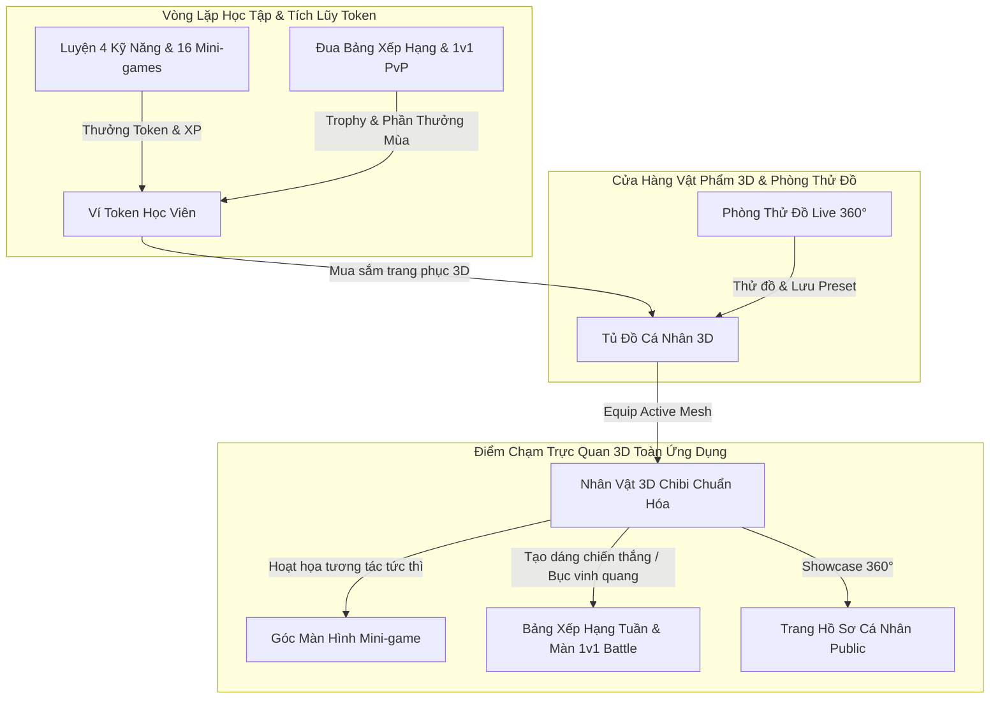
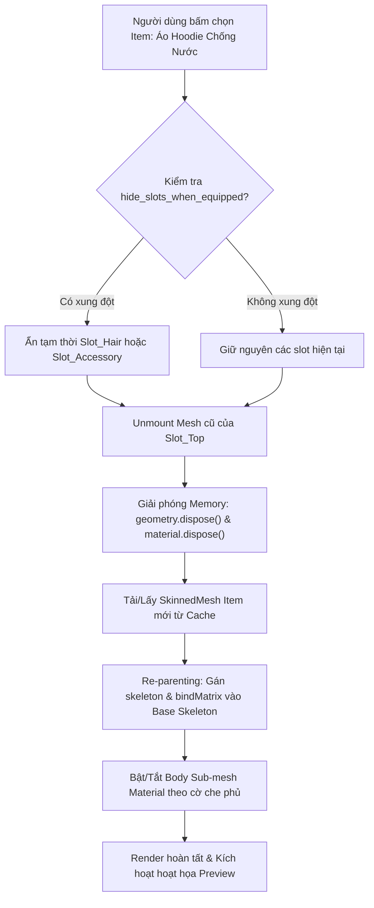
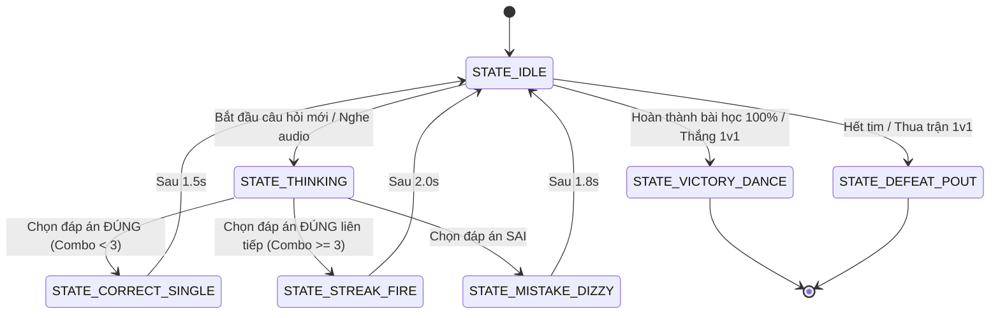

# Đặc Tả Yêu Cầu & Nghiệp Vụ Chức Năng: Hệ Thống Nhân Vật 3D Chibi & Tủ Đồ Thời Trang Module Tương Tác Thời Gian Thực
## (3D Chibi Avatar & Realtime Modular Wardrobe System Specification)

**Mã tài liệu:** `SPEC-3D-AVATAR-WARDROBE-V1`  
**Phiên bản:** 1.0  
**Tác giả:** Senior Product Business Analyst (Product BA)  
**Người nhận chuyển giao:** Tech Lead / Architect (`11dba413-036f-4ce1-950e-252419384dce`), Senior Fullstack Engineer (`e78be358-35da-419c-bf21-24a27e284561`), UI/UX Designer (`c74ffe18-11a2-47b9-a7f4-a3600b2f07c0`), QA Team  
**Dự án:** Nền tảng Học Tiếng Anh qua Mini-game (`learn-english`)  
**Mã công việc liên quan:** `PHU-28` (Kế thừa từ `PHU-20`, `PHU-21`, `PHU-22`)  
**Tài liệu tham chiếu:**
- [`docs/spec/avatar-customization-and-gamified-shop.md`](./avatar-customization-and-gamified-shop.md) (Hệ thống Avatar 2D & Kinh tế Token)
- [`docs/spec/product-research-gamified-shop-and-avatar.md`](./product-research-gamified-shop-and-avatar.md) (Nghiên cứu thị trường Avatar & Shop)
- [`docs/architecture/avatar-and-shop-architecture.md`](../architecture/avatar-and-shop-architecture.md) (Kiến trúc CSDL & Dịch vụ Backend)
- [`docs/spec/gameplay-rules.md`](./gameplay-rules.md) & [`docs/spec/new-minigames-specification.md`](./new-minigames-specification.md) (Luật chơi & Phản hồi mini-game)

---

## 1. Đánh Giá Chuyên Môn BA & Bối Cảnh Tích Hợp Dự Án (BA Expert Assessment & Strategic Fit)

### 1.1. Đánh Giá Bản Đặc Tả Gốc (External Spec Evaluation)
Bản phác thảo đặc tả kỹ thuật từ bên ngoài đề xuất việc ứng dụng mô hình 3D Chibi thời gian thực trên nền tảng Web thông qua WebGL / Three.js / React Three Fiber. Sau khi phân tích dưới lăng kính Product Business Analyst đối với nền tảng giáo dục game hóa `learn-english`, BA đưa ra đánh giá chuyên sâu như sau:

| Khía cạnh đánh giá | Điểm sáng của bản phác thảo ngoài | Điểm hạn chế / Lỗ hổng cần chuẩn hóa cho dự án | Giải pháp chuẩn hóa trong tài liệu này |
| :--- | :--- | :--- | :--- |
| **Giá trị trải nghiệm (UX Value)** | Trải nghiệm 3D Chibi 360° tạo độ chân thực và thỏa mãn cao, giống cơ chế phòng thử đồ trong game đua xe thời trang ZingSpeed / Audition / Roblox. | Chưa định hình rõ sợi dây liên kết giữa Avatar 3D và hành vi học tập (Gamification Feedback Loops). Nếu chỉ thử đồ đơn thuần, tính giáo dục sẽ mờ nhạt. | Gắn Avatar 3D vào chu kỳ phản hồi học tập: Hoạt họa biểu cảm tức thì khi giải đúng (Streak/Combo fire), sai (Confused/Dizzy), thắng đấu 1v1 (Victory Dance). |
| **Công nghệ & Phân tầng (Slot Architecture)** | Đã đề xuất 6 slot chính (`BaseBody`, `Hair`, `Top`, `Bottom`, `Shoes`, `Accessory`) và kỹ thuật SkinnedMesh Re-parenting. | Thiếu ma trận xử lý xung đột mesh tự động (Mesh Clipping & Culling matrix) khi mặc trang phục đè lớp (ví dụ: áo khoác dài đè quần, bốt cao đè giày, nón đè tóc). | Xây dựng quy tắc `hide_slots_when_equipped` và thuật toán Auto Mesh Masking trên GPU/CPU nhằm triệt tiêu hoàn toàn lỗi xuyên thấu polygon. |
| **Hiệu năng Web & Thiết bị di động (Mobile WebGL Performance)** | Đưa ra ngân sách đa giác (Geometry Budget 20k - 22k tris) và định dạng nén Draco / Meshoptimizer. | Thiếu cơ chế kiểm soát rò rỉ RAM (WebGL Memory Leaks), cơ chế giải phóng Context và giải pháp Fallback cho thiết bị cấu hình yếu. | Thiết lập kiến trúc quản lý vòng đời tài nguyên Three.js (`dispose()` triệt để), IndexedDB Cache layer, và chế độ Fallback 2D Poster khi WebGL mất ngữ cảnh (Context Lost). |
| **Tích hợp Backend & Dữ liệu** | Cung cấp JSON mẫu cơ bản cho 1 vật phẩm. | Chưa tương thích với CSDL PostgreSQL hiện hữu, chưa đồng bộ với hệ thống Token Economy (Learn-to-Earn), Sổ cái mua sắm (Double-Entry Ledger) và Presets. | Mở rộng schema CSDL PostgreSQL, hoàn thiện C# EF Core 8 Entities, TypeScript DTOs và 8 RESTful API contracts chuẩn mực. |

### 1.2. Vị Trí Của Nhân Vật 3D Trong Hệ Sinh Thái Sản Phẩm



---

## 2. Mục Tiêu Sản Phẩm & Chỉ Số Hiệu Năng Kỹ Thuật (Product & Technical KPIs)

### 2.1. Mục Tiêu Sản Phẩm (Product KPIs)
1. **D7 & D30 Retention Impact:** Tăng trưởng tỷ lệ quay lại ngày thứ 7 (D7) thêm **+25%** và ngày thứ 30 (D30) thêm **+18%** nhờ hiệu ứng thỏa mãn thị giác từ việc sở hữu nhân vật 3D độc quyền.
2. **Shop Engagement Rate:** Tối thiểu **70%** người dùng hoạt động hàng tuần (WAU) mở tính năng Phòng Thử Đồ 3D (3D Live Fitting Room) và thao tác xoay nhân vật.
3. **Token Sink Velocity:** Duy trì tỷ lệ tiêu thụ Token vào tủ đồ 3D đạt **80%** tổng lượng Token học sinh cày được, giữ cho nền kinh tế ảo không bị lạm phát.

### 2.2. Ngân Sách Hiệu Năng Kỹ Thuật (Technical Performance Budget)
- **Tốc độ khung hình (Frame Rate):** Ổn định tối thiểu **55 – 60 FPS** trên thiết bị Desktop và **45 – 60 FPS** trên thiết bị di động tầm trung (ví dụ: iPhone 11+, Samsung Galaxy A52+).
- **Kích thước tệp tải về (Asset Payload):**
  - Model Base Body + Skeleton chuẩn: $\le 650 \text{ KB}$ (đã nén Draco/Meshoptimizer).
  - Từng Item trang phục (Áo/Quần/Tóc/Giày/Phụ kiện): $\le 150 \text{ KB} - 350 \text{ KB}$ mỗi item.
  - Tổng tài nguyên tải cho 1 nhân vật đầy đủ: $\le 1.8 \text{ MB}$.
- **Thời gian chuyển đồ (Hot-Swap Latency):**
  - Với item đã nạp trong bộ nhớ đệm (RAM/IndexedDB): $< 100 \text{ ms}$.
  - Với item tải lần đầu qua mạng 4G/Wifi: $< 1.2 \text{ s}$ (hiển thị skeleton placeholder mượt mà, không giật lag màn hình).
- **Bộ nhớ WebGL (VRAM & Heap Memory):**
  - Mức chiếm dụng GPU VRAM $\le 120 \text{ MB}$.
  - WebGL Context Memory không tăng tịnh tiến (Zero Memory Leak) sau 50 lần thay đổi trang phục liên tục.

---

## 3. Đặc Tả Nghiệp Vụ Chức Năng (Detailed Functional Requirements)

### 3.1. Phân Tầng Module & Khung Khớp Xương (Slot-Based Hierarchy)
Toàn bộ nhân vật Chibi được cấu thành từ 1 khung xương gốc duy nhất (Master Skeleton) và 6 phân nhóm slot độc lập:

| Mã Slot | Tên Slot | Chức năng & Phạm vi bao phủ | Khung xương liên kết chính (Parent Bone) | Quy tắc Mesh Re-parenting |
| :--- | :--- | :--- | :--- | :--- |
| `Slot_BaseBody` | Thân cơ bản | Đầu, mắt, da mặt, cổ, thân mình, cánh tay, cẳng chân. | `Hips` (Root bone) | Chứa SkinnedMesh gốc định hình toàn bộ cấu trúc cơ thể. |
| `Slot_Hair` | Kiểu tóc | Mái tóc phía trước, búi tóc/đuôi ngựa phía sau, lọn tóc mai. | `Head` | SkinnedMesh (cho tóc dài có chuyển động xương) hoặc Static Mesh gắn `Head`. |
| `Slot_Top` | Trang phục trên | Áo thun, áo hoodie, áo khoác len, cà vạt, vest học sinh. | `Spine`, `Chest`, `LeftArm`, `RightArm` | SkinnedMesh bám theo chuyển động thở và vung tay. |
| `Slot_Bottom` | Trang phục dưới | Quần short, quần dài thể thao, váy xếp ly, thắt lưng. | `Hips`, `LeftUpLeg`, `RightUpLeg` | SkinnedMesh bám theo chuyển động chân và hông. |
| `Slot_Shoes` | Giày dép | Giày sneaker, giày bốt, dép sandal, tất/vớ. | `LeftFoot`, `RightFoot`, `LeftToeBase`, `RightToeBase` | SkinnedMesh liên kết bước chân. |
| `Slot_Accessory` | Phụ kiện | Kính mắt, mũ lưỡi trai, balo, cánh thiên thần, hiệu ứng sấm sét. | `Head`, `Chest`, hoặc `Hand` | Có thể là Static Mesh đính kèm (Socket attachment) hoặc Skinned Mesh hiệu ứng. |

### 3.2. Cơ Chế Xung Đột Trang Phục & Ẩn Lưới Tự Động (Slot Conflict & Auto Mesh Culling)
Để ngăn ngừa triệt để hiện tượng xuyên thấu polygon (Mesh Clipping) – một lỗi phổ biến khi ghép đồ 3D module:
1. **Trường `hide_slots_when_equipped`:** Mỗi trang phục có danh sách các slot hoặc nhóm xương bị ẩn.
   - *Ví dụ 1:* Mặc Áo Hoodie trùm đầu (`top_hoodie_ninja_01`) $\rightarrow$ Tự động ẩn `Slot_Hair` và `Slot_Accessory` (mũ).
   - *Ví dụ 2:* Mang Bốt đùi cao cổ (`shoes_high_boots_01`) $\rightarrow$ Tự động ẩn phần dưới của `Slot_Bottom` hoặc ẩn mắt cá chân trên `BaseBody`.
2. **Cơ chế Body Sub-mesh Masking (Mặt nạ thân):**
   - Lưới `BaseBody` được phân thành các vùng vật liệu con: `Mat_Head`, `Mat_Torso`, `Mat_UpperLegs`, `Mat_LowerLegs`, `Mat_Feet`.
   - Khi mặc áo phủ kín ngực và tay, hệ thống tự động tắt cờ `visible = false` cho `Mat_Torso` của `BaseBody`. Việc này vừa loại bỏ 100% khả năng xuyên da, vừa tiết kiệm năng lượng render của GPU di động.



### 3.3. Phòng Thử Đồ Trực Tiếp 3D (3D Live Fitting Room UX Flow)
- **Tương tác 360° (Orbit Controls):**
  - Chạm 1 ngón hoặc kéo chuột trái: Xoay nhân vật quanh trục thẳng đứng Y (giới hạn góc nhìn nghiêng từ $-15^\circ$ đến $+45^\circ$, không cho lật ngược nhân vật).
  - Chụm 2 ngón hoặc cuộn chuột: Phóng to / Thu nhỏ (Zoom giới hạn khoảng cách camera từ $1.2\text{m}$ đến $3.0\text{m}$ tính từ tâm nhân vật).
  - Tự động xoay chậm (Auto-Rotate): Khi người dùng không tương tác trong vòng $5\text{s}$, camera tự động xoay chậm $0.5\text{ rad/s}$ tạo cảm giác sống động như showroom thời trang thực tế.
- **Thử Đồ Tức Thì (Instant Try-On):**
  - Người dùng chạm vào bất kỳ món đồ nào trong Cửa Hàng, nhân vật trên bục 3D lập tức khoác món đồ đó lên người.
  - Hiển thị nhãn huy hiệu **"Đang thử" (Previewing)** màu vàng cam lấp lánh kèm thanh tác vụ đáy:
    - *Nút "Hủy thử đồ" (Revert):* Trả nhân vật về nguyên trạng trang phục ban đầu.
    - *Nút "Mua ngay" (Buy Now):* Mua món đồ đang chọn bằng Token.
    - *Nút "Mua toàn bộ giỏ thử đồ" (Buy All Outfits):* Tổng hợp chi phí các món đang thử và thực hiện thanh toán 1-click.
- **Hệ Thống Lưu Bộ Phối Đồ (Wardrobe Presets):**
  - Người dùng có thể lưu tối đa **5 bộ trang phục yêu thích** (Preset 1, 2, 3, 4, 5).
  - 1-click để đổi nguyên set đồ nhanh chóng trước khi bước vào phòng thi đấu 1v1 hoặc đua rank.

---

## 4. Vòng Đời Hoạt Họa & Phản Hồi Gamification (Animation State Machine & Educational Feedback Loops)

Nhân vật 3D không chỉ đứng yên mà đóng vai trò là "Người bạn đồng hành ảo" (Virtual Learning Companion), biểu lộ cảm xúc dựa trên kết quả làm bài của học viên.



### 4.1. Ma Trận Hoạt Họa Học Tập & Hiệu Ứng (Animation Triggers)

| Tên Hoạt Họa (Animation State) | Hành vi kích hoạt trong sản phẩm | Diễn hoạt nhân vật (Chibi Gesture) | Hiệu ứng phụ trợ (VFX / Sound) |
| :--- | :--- | :--- | :--- |
| `anim_idle` | Mặc định khi duyệt menu, phòng thử đồ, xem bảng xếp hạng. | Nhún nhảy nhẹ theo nhịp điệu, thỉnh thoảng chớp mắt, đưa tay vẫy chào thân thiện. | Không có âm thanh lặp lại; chuyển động thở nhịp nhàng. |
| `anim_thinking` | Học viên đang suy nghĩ câu hỏi khó hoặc nghe đoạn phát âm. | Đưa một ngón tay lên cằm, đầu nghiêng $15^\circ$, ánh mắt nhìn lên góc trên. | Icon bong bóng suy nghĩ nhỏ `...` phía trên đầu. |
| `anim_correct` | Trả lời đúng câu đơn lẻ. | Nở nụ cười tươi, giơ hai tay làm biểu tượng chữ V chiến thắng. | Hiệu ứng ánh sáng tỏa nhẹ, âm thanh *Ding!* trong trẻo. |
| `anim_streak_fire` | Đạt chuỗi Combo liên tiếp $\ge 3$ câu đúng trong mini-game. | Nhảy bật lên cao, xoay người 360°, tiếp đất kiêu hãnh với ánh mắt rực lửa. | Hào quang lửa bùng lên quanh chân, âm thanh *Whoosh Fire* hào hùng. |
| `anim_confused` | Trả lời sai đáp án hoặc chọn nhầm thẻ trong mini-game. | Đưa tay gãi đầu, cơ thể hơi chùng xuống, mắt xoay vòng tròn bối rối. | Đốm mồ hôi rơi `💧`, âm thanh gảy đàn dây trầm buồn. |
| `anim_victory` | Hoàn thành bài học với điểm tuyệt đối hoặc chiến thắng trận 1v1. | Vũ đạo Chibi sôi động (Chibi Dance), lộn nhào và vẫy cờ vinh quang. | Pháo hoa giấy (Confetti) bắn tung tóe, âm nhạc chiến thắng vang dội. |
| `anim_defeat` | Thất bại trong trận 1v1 hoặc bị trừ hết số tim học tập. | Ngồi bệt xuống sàn, hai tay ôm gối, vai rung nhẹ như đang tiếc nuối. | Hiệu ứng mưa rơi nhỏ xám xịt trên đỉnh đầu. |
| `anim_fitting_turn` | Khi người dùng click thử một món đồ mới trong Shop. | Xoay một vòng nhẹ để khoe đồ mới, tay chỉ vào trang phục và mỉm cười nháy mắt. | Hiệu ứng ngôi sao lấp lánh (Sparkle VFX) tỏa ra quanh món đồ. |

---

## 5. Đặc Tả Kỹ Thuật Nghệ Thuật 3D (3D Art & Tech Pipeline Specification)

Dành cho 3D Modeler, Rigging Artist và Tech Artist nhằm đảm bảo tài nguyên xuất khẩu tương thích hoàn toàn với WebGL engine.

### 5.1. Tỷ Lệ & Kích Thước Nhân Vật (Scale & Proportions)
- **Tỷ lệ chuẩn Super Deformed (SD Chibi):** Chiều cao nhân vật bằng **2.8 lần chiều cao đầu (Head-to-body ratio: 1:2.8)**.
- **Kích thước thực tế trong WebGL Scene (World Units):**
  - Hệ quy chiếu mét: $1.0\text{ unit} = 1.0\text{ meter}$.
  - Chiều cao toàn thân chuẩn hóa: **$0.95\text{ m}$** (tính từ mặt đất đến đỉnh tóc).
  - Tọa độ gốc trọng tâm nhân vật (Pivot Origin): Tọa độ $[0, 0, 0]$ nằm chính giữa hai lòng bàn chân trên mặt đất.

### 5.2. Ngân Sách Đa Giác & Khung Xương (Geometry & Bone Budget)

| Bộ phận thành phần | Ngân sách Poly tối đa (Triangles) | Giới hạn Bone Weights | Số lượng Texture Maps |
| :--- | :--- | :--- | :--- |
| `Slot_BaseBody` (Da, Mặt, Mắt, Thân) | 5,000 tris | Max 4 bones/vertex | 1 BaseColor, 1 ORM (1024x1024) |
| `Slot_Hair` (Tóc mái & Tóc đuôi) | 3,500 tris | Max 4 bones/vertex | 1 BaseColor, 1 ORM (512x512) |
| `Slot_Top` (Áo/Áo khoác) | 3,500 tris | Max 4 bones/vertex | 1 BaseColor, 1 ORM (1024x1024) |
| `Slot_Bottom` (Quần/Váy) | 2,500 tris | Max 4 bones/vertex | 1 BaseColor, 1 ORM (512x512) |
| `Slot_Shoes` (Cặp giày) | 2,000 tris | Max 4 bones/vertex | 1 BaseColor, 1 ORM (512x512) |
| `Slot_Accessory` (Mũ/Kính/Cánh) | 1,500 tris | Max 4 bones/vertex | 1 BaseColor, 1 ORM (512x512) |
| **Tổng thể trọn bộ (Full Avatar)** | **Tối đa 18,000 – 22,000 tris** | **Chuẩn WebGL Mobile** | **Tổng kích thước file $\le 1.8\text{ MB}$** |

### 5.3. Tiêu Chuẩn Bộ Khung Xương Chuẩn (Master Rigging Skeleton)
- **Cấu trúc xương:** Tuân thủ 100% quy chuẩn **Mixamo / Unity Humanoid**:
  - `Root` $\rightarrow$ `Hips` $\rightarrow$ `Spine` $\rightarrow$ `Spine1` $\rightarrow$ `Chest` $\rightarrow$ `Neck` $\rightarrow$ `Head`.
  - Khớp vai & tay: `LeftShoulder` $\rightarrow$ `LeftArm` $\rightarrow$ `LeftForeArm` $\rightarrow$ `LeftHand` (tương tự với bên phải).
  - Khớp chân: `LeftUpLeg` $\rightarrow$ `LeftLeg` $\rightarrow$ `LeftFoot` $\rightarrow$ `LeftToeBase` (tương tự với bên phải).
- **Giới hạn số lượng xương (Bone Budget):** Toàn bộ nhân vật không vượt quá **42 bones** để đảm bảo khả năng tính toán ma trận SkinnedMesh mượt mà trên chip đồ họa di động (Adreno, Apple GPU, Mali).

### 5.4. Quy Chuẩn Vật Liệu & Shading (Stylized Anime Cel-Shaded Material)
- **Phong cách thị giác:** Stylized Anime / Vinyl Toy bóng mờ mịn (Vinyl Figure look).
- **Kỹ thuật đóng gói kênh Texture (ORM Map Packing):**
  - Kênh **R (Red):** Ambient Occlusion (Bóng đổ tiếp xúc bề mặt).
  - Kênh **G (Green):** Roughness (Độ nhám bề mặt, tạo độ bóng mềm đặc trưng của nhựa vinyl cao cấp).
  - Kênh **B (Blue):** Metallic (Độ kim loại - đa số bằng 0, ngoại trừ khóa kéo, phụ kiện kim loại).
- **Định dạng file xuất chuẩn:** Tệp `.glb` (glTF 2.0 Binary) được tối ưu qua `gltfpack -cc -kn` hoặc Draco Mesh Compression, đảm bảo tải nhanh không nghẽn băng thông.

---

## 6. Đặc Tả Kiến Trúc Kỹ Thuật Client Web (Frontend Three.js / React Three Fiber Stack)

### 6.1. Component Tree Architecture trong React 19

```
<AvatarViewer3DContainer>
  ├── <AvatarCanvas> (Canvas WebGL context với R3F)
  │     ├── <LightingRig> (AmbientLight + DirectionalLight + RimLight tạo khối Chibi)
  │     ├── <OrbitCameraControls> (Giới hạn góc xoay và cự ly Zoom)
  │     ├── <StagePlatform> (Bục xoay tròn 3D với bóng đổ mềm ContactShadows)
  │     └── <ChibiMasterModel>
  │           ├── <SkeletonManager> (Nạp Master Skeleton và khởi tạo Animation Mixer)
  │           ├── <SlotRenderer slot="BaseBody" />
  │           ├── <SlotRenderer slot="Hair" />
  │           ├── <SlotRenderer slot="Top" />
  │           ├── <SlotRenderer slot="Bottom" />
  │           ├── <SlotRenderer slot="Shoes" />
  │           └── <SlotRenderer slot="Accessory" />
  └── <FittingRoomHUD> (Giao diện React DOM nổi phía trên Canvas)
        ├── <SlotTabsSelector> (Chọn danh mục: Áo, Quần, Tóc, Giày...)
        ├── <ItemGridCardList> (Lưới vật phẩm kèm giá Token và độ hiếm)
        └── <ActionFooterBar> (Nút Hoàn tác, Mua bằng Token, Đổi Preset)
```

### 6.2. Thuật Toán Ghép Mesh Quần Áo Động (SkinnedMesh Re-parenting Algorithm)
Khi học viên thay đổi trang phục, hệ thống thực thi thuật toán ghép xương theo 5 bước tuần tự:

```typescript
/**
 * Thuật toán liên kết trang phục mới vào bộ khung xương gốc của nhân vật
 * @param masterSkeleton Khung xương chuẩn của BaseBody
 * @param itemGlbScene Đối tượng scene glTF của trang phục vừa tải về
 * @returns Mảng các SkinnedMesh đã được chuẩn hóa liên kết
 */
export function reparentWardrobeItem(
  masterSkeleton: THREE.Skeleton,
  itemGlbScene: THREE.Group
): THREE.SkinnedMesh[] {
  const boundMeshes: THREE.SkinnedMesh[] = [];

  itemGlbScene.traverse((child) => {
    if ((child as THREE.SkinnedMesh).isSkinnedMesh) {
      const skinnedMesh = child as THREE.SkinnedMesh;
      
      // 1. Tìm ánh xạ xương tương ứng giữa item và master skeleton
      const newBones: THREE.Bone[] = [];
      skinnedMesh.skeleton.bones.forEach((bone) => {
        const targetBone = masterSkeleton.bones.find((b) => b.name === bone.name);
        if (targetBone) {
          newBones.push(targetBone);
        } else {
          console.warn(`[3D Avatar] Không tìm thấy bone ${bone.name} trên master skeleton.`);
        }
      });

      // 2. Tái tạo Skeleton mới gắn với xương của cơ thể gốc
      skinnedMesh.bind(
        new THREE.Skeleton(newBones, skinnedMesh.skeleton.boneInverses),
        skinnedMesh.bindMatrix
      );

      // 3. Tối ưu culling & shadow
      skinnedMesh.castShadow = true;
      skinnedMesh.receiveShadow = false;
      skinnedMesh.frustumCulled = true;

      boundMeshes.push(skinnedMesh);
    }
  });

  return boundMeshes;
}
```

### 6.3. Chiến Lược Thu Gom Bộ Nhớ & Ngăn Chặn Rò Rỉ RAM (Memory Management)
Trình duyệt trên smartphone (đặc biệt là WebKit trên iOS) giới hạn dung lượng VRAM cho mỗi tab duyệt web. Nếu không giải phóng tài nguyên Three.js cũ khi thay đồ, trình duyệt sẽ gặp lỗi trắng màn hình (`WebGL Context Lost`).

Hệ thống bắt buộc tuân thủ quy trình hủy tài nguyên 4 bước:
1. `geometry.dispose()`: Giải phóng mảng vertex, normal, UV khỏi bộ nhớ GPU.
2. `material.dispose()`: Hủy shader program đã biên dịch.
3. `texture.dispose()`: Xóa sạch Albedo và ORM texture maps khỏi VRAM.
4. `scene.remove(oldMesh)`: Ngắt hoàn toàn node mesh khỏi Scene Graph của Three.js.

---

## 7. Thiết Kế Mô Hình Dữ Liệu & JSON Schemas (Data Models & Schemas)

### 7.1. JSON Schema Cho Vật Phẩm 3D (`AvatarItem3D`)

```json
{
  "$schema": "http://json-schema.org/draft-07/schema#",
  "title": "AvatarItem3D",
  "type": "object",
  "required": [
    "id",
    "name",
    "slot",
    "rarity",
    "gender",
    "modelUrl",
    "thumbnailUrl",
    "priceTokens",
    "boneBindingRoot"
  ],
  "properties": {
    "id": { "type": "string", "example": "top_hoodie_lightning_01" },
    "name": { "type": "string", "example": "Zing Chibi Lightning Hoodie" },
    "description": { "type": "string", "example": "Áo hoodie thể thao phong cách sấm sét năng động" },
    "slot": {
      "type": "string",
      "enum": ["BASE_BODY", "HAIR", "TOP", "BOTTOM", "SHOES", "ACCESSORY"]
    },
    "rarity": {
      "type": "string",
      "enum": ["COMMON", "RARE", "EPIC", "LEGENDARY"]
    },
    "gender": {
      "type": "string",
      "enum": ["MALE", "FEMALE", "UNISEX"]
    },
    "modelUrl": {
      "type": "string",
      "format": "uri",
      "example": "https://cdn.englishgames.edu.vn/models/3d/top_hoodie_lightning_01.glb"
    },
    "thumbnailUrl": {
      "type": "string",
      "format": "uri",
      "example": "https://cdn.englishgames.edu.vn/thumbnails/top_hoodie_lightning_01.webp"
    },
    "priceTokens": { "type": "integer", "minimum": 0, "example": 850 },
    "levelRequired": { "type": "integer", "minimum": 1, "example": 5 },
    "boneBindingRoot": { "type": "string", "example": "Chest" },
    "hideSlotsWhenEquipped": {
      "type": "array",
      "items": { "type": "string" },
      "example": ["Slot_Necklace"]
    },
    "maskedBodyParts": {
      "type": "array",
      "items": { "type": "string" },
      "example": ["Mat_Torso", "Mat_Arms"]
    },
    "polyCount": { "type": "integer", "example": 2840 },
    "fileSizeBytes": { "type": "integer", "example": 245760 }
  }
}
```

### 7.2. JSON Schema Cho Trạng Thái Trang Bị Toàn Thân (`UserAvatar3DConfig`)

```json
{
  "$schema": "http://json-schema.org/draft-07/schema#",
  "title": "UserAvatar3DConfig",
  "type": "object",
  "required": [
    "userId",
    "baseBodyId",
    "hairId",
    "topId",
    "bottomId",
    "shoesId",
    "updatedAt"
  ],
  "properties": {
    "userId": { "type": "string", "format": "uuid" },
    "baseBodyId": { "type": "string", "example": "body_chibi_standard_01" },
    "hairId": { "type": "string", "example": "hair_anime_spiky_blue_01" },
    "topId": { "type": "string", "example": "top_hoodie_lightning_01" },
    "bottomId": { "type": "string", "example": "bottom_cargo_shorts_01" },
    "shoesId": { "type": "string", "example": "shoes_sneaker_chunky_01" },
    "accessoryId": { "type": ["string", "null"], "example": "acc_cyber_goggles_01" },
    "activeAnimation": {
      "type": "string",
      "enum": ["IDLE", "THINKING", "CORRECT", "STREAK", "CONFUSED", "VICTORY", "DEFEAT"],
      "default": "IDLE"
    },
    "updatedAt": { "type": "string", "format": "date-time" }
  }
}
```

### 7.3. Thiết Kế CSDL PostgreSQL (DDL Migration)

```sql
-- 1. Bảng danh mục vật phẩm 3D
CREATE TABLE avatar_items_3d (
    id VARCHAR(64) PRIMARY KEY,
    name VARCHAR(128) NOT NULL,
    description TEXT,
    slot VARCHAR(32) NOT NULL, -- BASE_BODY, HAIR, TOP, BOTTOM, SHOES, ACCESSORY
    rarity VARCHAR(32) NOT NULL DEFAULT 'COMMON', -- COMMON, RARE, EPIC, LEGENDARY
    gender VARCHAR(16) NOT NULL DEFAULT 'UNISEX', -- MALE, FEMALE, UNISEX
    model_url VARCHAR(512) NOT NULL,
    thumbnail_url VARCHAR(512) NOT NULL,
    price_tokens INT NOT NULL DEFAULT 0,
    level_required INT NOT NULL DEFAULT 1,
    bone_binding_root VARCHAR(64) NOT NULL DEFAULT 'Hips',
    hide_slots_when_equipped JSONB NOT NULL DEFAULT '[]'::jsonb,
    masked_body_parts JSONB NOT NULL DEFAULT '[]'::jsonb,
    poly_count INT NOT NULL DEFAULT 0,
    file_size_bytes INT NOT NULL DEFAULT 0,
    is_active BOOLEAN NOT NULL DEFAULT TRUE,
    created_at TIMESTAMP WITH TIME ZONE DEFAULT CURRENT_TIMESTAMP
);

CREATE INDEX idx_avatar_items_3d_slot ON avatar_items_3d(slot);
CREATE INDEX idx_avatar_items_3d_rarity ON avatar_items_3d(rarity);

-- 2. Bảng lưu trạng thái trang bị 3D hiện tại của người dùng
CREATE TABLE user_avatar_equips_3d (
    user_id UUID PRIMARY KEY REFERENCES users(id) ON DELETE CASCADE,
    base_body_id VARCHAR(64) NOT NULL REFERENCES avatar_items_3d(id),
    hair_id VARCHAR(64) NOT NULL REFERENCES avatar_items_3d(id),
    top_id VARCHAR(64) NOT NULL REFERENCES avatar_items_3d(id),
    bottom_id VARCHAR(64) NOT NULL REFERENCES avatar_items_3d(id),
    shoes_id VARCHAR(64) NOT NULL REFERENCES avatar_items_3d(id),
    accessory_id VARCHAR(64) REFERENCES avatar_items_3d(id),
    updated_at TIMESTAMP WITH TIME ZONE DEFAULT CURRENT_TIMESTAMP
);

-- 3. Bảng lưu bộ trang phục yêu thích (Presets - tối đa 5 presets/người dùng)
CREATE TABLE avatar_presets_3d (
    id UUID PRIMARY KEY DEFAULT gen_random_uuid(),
    user_id UUID NOT NULL REFERENCES users(id) ON DELETE CASCADE,
    preset_slot INT NOT NULL CHECK (preset_slot BETWEEN 1 AND 5),
    preset_name VARCHAR(64) NOT NULL,
    config JSONB NOT NULL,
    created_at TIMESTAMP WITH TIME ZONE DEFAULT CURRENT_TIMESTAMP,
    updated_at TIMESTAMP WITH TIME ZONE DEFAULT CURRENT_TIMESTAMP,
    CONSTRAINT uq_user_preset_slot UNIQUE (user_id, preset_slot)
);

CREATE INDEX idx_avatar_presets_3d_user ON avatar_presets_3d(user_id);
```

---

## 8. Đặc Tả Hợp Đồng Giao Tiếp API (RESTful API Contracts)

### 8.1. Danh Sách Endpoints Chuẩn Hóa

| Phương thức | Endpoint | Chức năng nghiệp vụ | Xác thực |
| :--- | :--- | :--- | :--- |
| `GET` | `/api/v1/avatar-3d/manifest` | Lấy danh sách base models, skeletons và cấu hình camera chuẩn. | Public / Bearer |
| `GET` | `/api/v1/avatar-3d/equipped` | Lấy thông tin trang phục 3D người dùng đang mặc trên người. | Bearer Token |
| `PUT` | `/api/v1/avatar-3d/equip` | Thay đổi món đồ đang mặc ở một hoặc nhiều slot. | Bearer Token |
| `GET` | `/api/v1/avatar-3d/presets` | Lấy danh sách 5 bộ phối đồ yêu thích đã lưu. | Bearer Token |
| `POST` | `/api/v1/avatar-3d/presets` | Lưu lại bộ trang phục đang mặc vào một ô Preset. | Bearer Token |
| `POST` | `/api/v1/avatar-3d/presets/{id}/apply` | Kích hoạt nhanh nguyên bộ trang phục từ Preset. | Bearer Token |
| `GET` | `/api/v1/shop/3d-items` | Lấy danh mục vật phẩm 3D trong Cửa Hàng (có phân trang & lọc). | Public / Bearer |
| `POST` | `/api/v1/shop/3d-items/{id}/purchase` | Mua vật phẩm 3D trừ Token theo Sổ cái giao dịch an toàn. | Bearer Token |

### 8.2. Mẫu Yêu Cầu & Phản Hồi Chi Tiết (Request / Response Sample)

#### Endpoint: `PUT /api/v1/avatar-3d/equip`
**Request Payload:**
```json
{
  "slot": "TOP",
  "itemId": "top_hoodie_lightning_01"
}
```

**Response Payload (200 OK):**
```json
{
  "success": true,
  "message": "Trang bị vật phẩm 3D thành công",
  "data": {
    "userId": "a8f3b210-912b-4e12-b13c-d32890123456",
    "equipped": {
      "baseBodyId": "body_chibi_standard_01",
      "hairId": "hair_anime_spiky_blue_01",
      "topId": "top_hoodie_lightning_01",
      "bottomId": "bottom_cargo_shorts_01",
      "shoesId": "shoes_sneaker_chunky_01",
      "accessoryId": null
    },
    "hiddenSlots": ["Slot_Necklace"],
    "maskedBodyParts": ["Mat_Torso"],
    "updatedAt": "2026-09-30T10:15:30.120Z"
  }
}
```

---

## 9. Tiêu Chí Nghiệm Thu Độc Lập Cho QA & Tech Lead (Given-When-Then Acceptance Criteria)

### Kịch bản 1: Xoay nhân vật 360° và giới hạn Camera Orbit
- **Given:** Người dùng đang ở màn hình Cửa Hàng Thời Trang hoặc Tủ Đồ Cá Nhân.
- **When:** Người dùng vuốt màn hình sang trái/phải hoặc cuộn chuột lên/xuống.
- **Then:**
  - Nhân vật xoay mượt mà quanh trục đứng với tốc độ khung hình $\ge 55\text{ FPS}$.
  - Góc nhìn nghiêng camera bị khóa cứng trong khoảng $[-15^\circ, +45^\circ]$, không cho phép góc nhìn nhìn xuyên từ dưới đáy bục lên.
  - Cự ly Zoom không vượt quá giới hạn $[1.2\text{m}, 3.0\text{m}]$.

### Kịch bản 2: Hot-Swap Trang Phục Độc Lập Không Tải Lại Toàn Thân
- **Given:** Nhân vật đang mặc đầy đủ Áo thun (`top_tshirt_white`) và Quần dài.
- **When:** Người dùng click chọn áo mới `top_hoodie_lightning_01` trong giỏ hàng.
- **Then:**
  - Hệ thống chỉ unmount SkinnedMesh ở `Slot_Top` và nạp mesh mới vào vị trí đó.
  - Khung xương cơ thể (`BaseBody`), quần và giày không bị nhấp nháy (No Full Reload).
  - Độ trễ chuyển đổi $\le 150\text{ ms}$ đối với asset đã có sẵn trong IndexedDB cache.

### Kịch bản 3: Tự Động Ẩn Lưới Tránh Xuyên Thấu Polygon (Mesh Clipping)
- **Given:** Học viên đang trang bị áo Hoodie trùm đầu có trường `maskedBodyParts = ["Mat_Torso"]`.
- **When:** Model 3D hoàn tất việc nạp và kích hoạt animation `anim_idle`.
- **Then:**
  - Phần da thân mình `Mat_Torso` của `BaseBody` được ẩn đi (`visible = false`).
  - Khi nhân vật thực hiện động tác thở và vung tay, không xuất hiện bất kỳ điểm nhô da xuyên qua bề mặt vải áo.

### Kịch bản 4: Kiểm Soát Rò Rỉ Bộ Nhớ (Zero Memory Leak Test)
- **Given:** Ứng dụng đang chạy trên trình duyệt di động Safari/Chrome với công cụ Performance Profiler được bật.
- **When:** Người dùng thực hiện thao tác click thử 50 trang phục khác nhau liên tục trong vòng 2 phút.
- **Then:**
  - WebGL Memory Heap không tăng lũy tiến vượt quá $+15\text{ MB}$ so với mức ban đầu.
  - Các hàm `dispose()` cho geometry, material và textures được gọi đầy đủ cho từng mesh bị gỡ.
  - Không xảy ra sự cố văng ngữ cảnh WebGL (`WebGL: CONTEXT_LOST_WEBGL`).

### Kịch bản 5: Kích Hoạt Hoạt Họa Gamification Khi Đạt Chuỗi Combo
- **Given:** Học viên đang chơi mini-game `Word Match` và nhân vật Chibi 3D hiển thị ở góc màn hình.
- **When:** Học viên trả lời đúng câu thứ 3 liên tiếp (Combo Streak đạt mốc x3).
- **Then:**
  - Nhân vật lập tức chuyển từ trạng thái `anim_idle` sang `anim_streak_fire` trong vòng $\le 50\text{ ms}$.
  - Kích hoạt hiệu ứng hào quang lửa quanh chân và nhân vật thực hiện động tác nhảy xoay ăn mừng.
  - Sau $2.0\text{ s}$, nhân vật tự động chuyển mượt mà (Cross-fade blending) trở lại trạng thái `anim_idle`.

### Kịch bản 6: Chế Độ Fallback Đồ Họa Cho Thiết Bị Cấu Hình Yếu (Graceful Degradation)
- **Given:** Người dùng truy cập bằng thiết bị cấu hình rất thấp hoặc trình duyệt tắt tính năng tăng tốc phần cứng WebGL.
- **When:** Three.js khởi tạo thất bại (`THREE.WebGLRenderer` trả về lỗi không hỗ trợ).
- **Then:**
  - Hệ thống không bị treo màn hình trắng.
  - Tự động kích hoạt cơ chế Fallback: Hiển thị ảnh Poster tĩnh 2D sắc nét render sẵn của nhân vật theo đúng cấu hình trang phục hiện tại.
  - Hiển thị thông báo gợi ý thân thiện: *"Thiết bị đang ở chế độ tiết kiệm hiệu năng 2D"*.

### Kịch bản 7: Mua Trang Phục Bằng Token An Toàn Tuyệt Đối
- **Given:** Người dùng có số dư 1,200 Token và đang thử Áo Hoodie giá 850 Token.
- **When:** Người dùng nhấn nút "Mua ngay" trên thanh tác vụ.
- **Then:**
  - Hệ thống gửi yêu cầu `POST /api/v1/shop/3d-items/{id}/purchase`.
  - Backend thực thi Transaction ghi sổ cái kép: trừ 850 Token, thêm vật phẩm vào kho đồ `user_avatar_equips_3d`.
  - Số dư mới 350 Token cập nhật ngay lập tức trên Navbar; nút "Mua ngay" chuyển thành trạng thái "Đã sở hữu / Đang trang bị".

### Kịch bản 8: Quản Lý & Lưu Bộ Phối Đồ (Wardrobe Presets)
- **Given:** Người dùng đã phối xong một set đồ ưng ý gồm Tóc xanh, Áo hoodie sấm sét và Giày chunky.
- **When:** Người dùng chọn ô Preset 1 và nhấn "Lưu trang phục hiện tại".
- **Then:**
  - Cấu hình trang bị được ghi nhận vào bảng `avatar_presets_3d`.
  - Khi người dùng bấm sang Preset 2 (set đồ mặc định) rồi bấm lại Preset 1, toàn bộ nhân vật chuyển đổi mượt mà về đúng set đồ đã lưu trong $\le 200\text{ ms}$.

---

## 10. Kế Hoạch Chuyển Giao & Phân Công Trách Nhiệm (Hand-off Matrix)

| Vai trò tiếp nhận | Thành viên / Agent ID | Hạng mục công việc tiếp theo |
| :--- | :--- | :--- |
| **Tech Lead / Architect** | `11dba413-036f-4ce1-950e-252419384dce` | - Thẩm định kiến trúc WebGL Three.js / React Three Fiber.<br>- Thiết kế chi tiết luồng WebGL Context Management & IndexedDB Cache Service.<br>- Lập kế hoạch phân rã Task kỹ thuật (Technical Breakdown) cho Fullstack Engineer. |
| **UI/UX Designer** | `c74ffe18-11a2-47b9-a7f4-a3600b2f07c0` | - Thiết kế giao diện phòng thử đồ 3D (3D Fitting Room HUD, Camera Reset, Orbit Controls Indicator).<br>- Thiết kế bảng màu cấp độ hiếm (Common, Rare, Epic, Legendary) cho Card vật phẩm 3D.<br>- Thiết kế icon trạng thái Fallback 2D và VFX chúc mừng chuỗi Combo. |
| **Senior Fullstack Engineer** | `e78be358-35da-419c-bf21-24a27e284561` | - Backend: Tạo Migration EF Core cho các bảng `avatar_items_3d`, `user_avatar_equips_3d`, `avatar_presets_3d` và viết Controllers/Services.<br>- Frontend: Tích hợp thư viện `@react-three/fiber`, `@react-three/drei`, viết component `<AvatarViewer3D>` và SkinnedMesh Re-parenting logic. |
| **QA Team** | Testing Specialists | - Xây dựng Test Cases tự động và thủ công dựa trên 8 kịch bản Given-When-Then.<br>- Thực hiện kiểm thử tải hiệu năng FPS và rò rỉ RAM (Memory Leak test) trên thiết bị di động thực tế. |

---

*Tài liệu được soạn thảo và kiểm duyệt bởi **Senior Product Business Analyst (Product BA)** nhằm phục vụ mục tiêu chuẩn hóa tuyệt đối trước khi bước vào giai đoạn thiết kế kiến trúc và viết code.*
