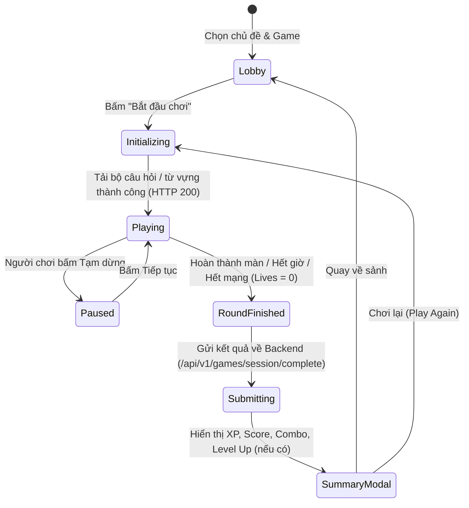

# Đặc Tả Kiến Trúc & Chức Năng Nền Tảng Học Tiếng Anh Qua Mini-game (MVP)

Tài liệu này tổng hợp toàn bộ các đặc tả yêu cầu, luật chơi, hệ thống tính điểm & phần thưởng, mô hình dữ liệu (PostgreSQL / C# / TypeScript) và hợp đồng API RESTful cho dự án **Nền tảng Học Tiếng Anh qua Mini-game**.

---

## 1. Giới Thiệu & Mục Tiêu Dự Án

### 1.1. Bối cảnh & Mục tiêu
- **Mục tiêu sản phẩm:** Xây dựng một ứng dụng web học tiếng Anh hoàn toàn miễn phí, tối ưu hóa mức độ giữ chân người dùng (Retention Rate) thông qua cơ chế Gamification với 3 mini-game cốt lõi:
  1. **Word Match** (Ghép thẻ từ vựng - nghĩa): Rèn luyện khả năng nhận diện và ghi nhớ từ vựng nhanh.
  2. **Speed Falling Word** (Từ rơi tốc độ cao): Phản xạ nhanh với nghĩa của từ trong áp lực thời gian.
  3. **Sentence Scramble** (Sắp xếp trật tự câu): Củng cố ngữ pháp và cấu trúc câu tự nhiên.
- **Đối tượng người dùng:** Người học tiếng Anh từ trình độ mới bắt đầu (Beginner / A1-A2) đến trung cấp (Intermediate / B1-B2).

### 1.2. Tech Stack Bắt Buộc
- **Backend:** .NET 8 Web API, Entity Framework Core 8, ASP.NET Core Identity / JWT Auth.
- **Frontend:** React 18 / 19, TypeScript, Vite, Tailwind CSS, Lucide Icons, Framer Motion (cho animation mượt mà), Zustand / Redux Toolkit (quản lý state).
- **Database:** PostgreSQL 16+.
- **Kiến trúc:** Clean Architecture / Layered Architecture (Domain, Application, Infrastructure, API).

---

## 2. Danh Mục Tài Liệu Đặc Tả Chi Tiết

Hệ thống tài liệu spec được chia thành các file chuyên sâu phục vụ trực tiếp cho Tech Lead, Backend Engineer, Frontend Engineer và QA:

1. [gameplay-rules.md](./gameplay-rules.md):
   - Quy tắc chi tiết của 3 mini-game: Word Match, Speed Falling Word, Sentence Scramble.
   - Vòng đời phiên chơi (State Machine: Loading -> Playing -> Paused -> Result).
   - Quy tắc tương tác UI/UX, thao tác bàn phím, mobile touch, âm thanh và hiệu ứng visual feedback.
2. [reward-system.md](./reward-system.md):
   - Công thức tính điểm số (Score), điểm kinh nghiệm (XP), hệ số Combo Streak.
   - Cơ chế chuỗi ngày học liên tục (Daily Streak), danh hiệu (Ranks & Levels), huy hiệu thành tích (Badges/Achievements).
   - Thiết kế màn hình tổng kết (Post-game Summary Modal) và hệ thống nhiệm vụ hàng ngày (Daily Quests).
3. [data-models.md](./data-models.md):
   - Thiết kế CSDL PostgreSQL (DDL, Indexes, Foreign Keys).
   - Sơ đồ thực thể liên kết (Entity Relationship Diagram - Mermaid ERD).
   - Entity Classes trong C# (.NET 8 EF Core) và Interfaces trong TypeScript.
4. [api-contracts.md](./api-contracts.md):
   - Đặc tả chi tiết các RESTful Endpoints (`/api/v1/games/*`, `/api/v1/users/*`, `/api/v1/leaderboard/*`).
   - Request / Response JSON Schema chuẩn mực, HTTP status codes và cơ chế xử lý lỗi nhất quán.
5. [leaderboard-and-battle.md](./leaderboard-and-battle.md):
   - Đặc tả hệ thống Bảng Xếp Hạng Toàn Cầu & Đấu Đối Kháng 1v1 Realtime.
   - Cơ chế tính điểm ELO/Trophy, phân tầng rank, bảo vệ hạng (Demotion Shield), thưởng chuỗi thắng.
   - Thuật toán ghép cặp thích ứng (Adaptive Matchmaking) và cơ chế Bot thông minh dự phòng.
   - Luật thi đấu 1v1, xử lý ngắt kết nối (Grace Period) / bỏ cuộc (Forfeit).
   - Thiết kế CSDL PostgreSQL, SignalR BattleHub WebSocket protocol và tiêu chí nghiệm thu (Given-When-Then).

---

## 3. Bản Đồ Trạng Thái Phiên Chơi (Game Session State Flow)

---

## 4. Nguyên Tắc Thiết Kế Cho Đội Ngũ Kỹ Thuật
1. **Frontend-Driven Animation, Server-Validated Result:**
   - Client chịu trách nhiệm render animation 60fps mượt mà (chữ rơi, lật thẻ, kéo thả).
   - Backend xác thực tính hợp lệ của thời gian chơi, số câu đúng/sai để chống cheat điểm trước khi lưu DB.
2. **Zero-Friction Onboarding:**
   - Cho phép chơi ngay dưới dạng Guest (Guest Session ID lưu ở LocalStorage).
   - Khi người dùng đăng ký tài khoản thật, toàn bộ XP, Streak và lịch sử chơi của Guest ID sẽ được tự động gộp (merge) vào tài khoản mới.
3. **Responsive & Mobile-First:**
   - Giao diện Tailwind CSS hỗ trợ hoàn hảo cả màn hình Desktop và Mobile (Touch tap, swipe).
