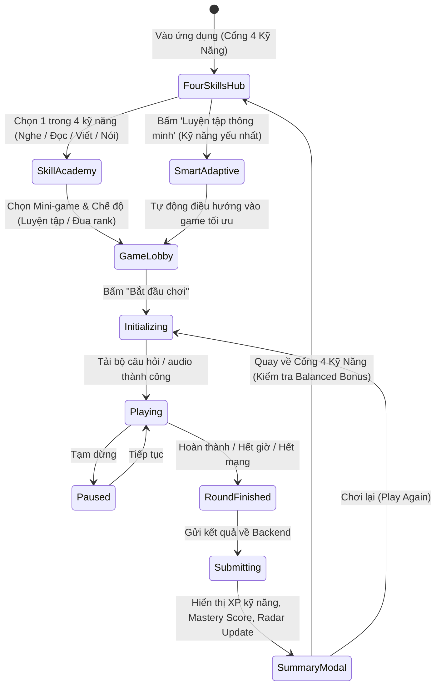

# Đặc Tả Kiến Trúc & Chức Năng Nền Tảng Học Tiếng Anh Qua Mini-game (MVP)

Tài liệu này tổng hợp toàn bộ các đặc tả yêu cầu, luật chơi, hệ thống tính điểm & phần thưởng, mô hình dữ liệu (PostgreSQL / C# / TypeScript) và hợp đồng API RESTful cho dự án **Nền tảng Học Tiếng Anh qua Mini-game**.

---

## 1. Giới Thiệu & Mục Tiêu Dự Án

### 1.1. Bối cảnh & Mục tiêu
- **Mục tiêu sản phẩm:** Xây dựng một ứng dụng web học tiếng Anh hoàn toàn miễn phí, tối ưu hóa mức độ giữ chân người dùng (Retention Rate) thông qua cơ chế Gamification với 3 mini-game cốt lõi:
  1. **Word Match** (Ghép thẻ từ vựng - nghĩa): Rèn luyện khả năng nhận diện và ghi nhớ từ vựng nhanh.
  2. **Speed Falling Word** (Từ rơi tốc độ cao): Phản xạ nhanh với nghĩa của từ trong áp lực thời gian.
  3. **Sentence Scramble** (Sắp xếp trật tự câu): Củng cố ngữ pháp và cấu trúc câu tự nhiên.
- **Đối tượng người dùng:** Người học tiếng Anh từ trình độ mới bắt đầu (Beginner / A1-A2) đến trung cấp (Intermediate / B1-B2).

### 1.2. Tech Stack Bắt Buộc
- **Backend:** .NET 8 Web API, Entity Framework Core 8, ASP.NET Core Identity / JWT Auth.
- **Frontend:** React 18 / 19, TypeScript, Vite, Tailwind CSS, Lucide Icons, Framer Motion (cho animation mượt mà), Zustand / Redux Toolkit (quản lý state).
- **Database:** PostgreSQL 16+.
- **Kiến trúc:** Clean Architecture / Layered Architecture (Domain, Application, Infrastructure, API).

---

## 2. Danh Mục Tài Liệu Đặc Tả Chi Tiết

Hệ thống tài liệu spec được chia thành các file chuyên sâu phục vụ trực tiếp cho Tech Lead, Backend Engineer, Frontend Engineer và QA:

1. [gameplay-rules.md](./gameplay-rules.md):
   - Quy tắc chi tiết của 3 mini-game: Word Match, Speed Falling Word, Sentence Scramble.
   - Vòng đời phiên chơi (State Machine: Loading -> Playing -> Paused -> Result).
   - Quy tắc tương tác UI/UX, thao tác bàn phím, mobile touch, âm thanh và hiệu ứng visual feedback.
2. [reward-system.md](./reward-system.md):
   - Công thức tính điểm số (Score), điểm kinh nghiệm (XP), hệ số Combo Streak.
   - Cơ chế chuỗi ngày học liên tục (Daily Streak), danh hiệu (Ranks & Levels), huy hiệu thành tích (Badges/Achievements).
   - Thiết kế màn hình tổng kết (Post-game Summary Modal) và hệ thống nhiệm vụ hàng ngày (Daily Quests).
3. [data-models.md](./data-models.md):
   - Thiết kế CSDL PostgreSQL (DDL, Indexes, Foreign Keys).
   - Sơ đồ thực thể liên kết (Entity Relationship Diagram - Mermaid ERD).
   - Entity Classes trong C# (.NET 8 EF Core) và Interfaces trong TypeScript.
4. [api-contracts.md](./api-contracts.md):
   - Đặc tả chi tiết các RESTful Endpoints (`/api/v1/games/*`, `/api/v1/users/*`, `/api/v1/leaderboard/*`).
   - Request / Response JSON Schema chuẩn mực, HTTP status codes và cơ chế xử lý lỗi nhất quán.
5. [leaderboard-and-battle.md](./leaderboard-and-battle.md):
   - Đặc tả hệ thống Bảng Xếp Hạng Toàn Cầu & Đấu Đối Kháng 1v1 Realtime.
   - Cơ chế tính điểm ELO/Trophy, phân tầng rank, bảo vệ hạng (Demotion Shield), thưởng chuỗi thắng.
   - Thuật toán ghép cặp thích ứng (Adaptive Matchmaking) và cơ chế Bot thông minh dự phòng.
   - Luật thi đấu 1v1, xử lý ngắt kết nối (Grace Period) / bỏ cuộc (Forfeit).
   - Thiết kế CSDL PostgreSQL, SignalR BattleHub WebSocket protocol và tiêu chí nghiệm thu (Given-When-Then).
6. [new-minigames-specification.md](./new-minigames-specification.md):
   - Đặc tả mở rộng 3 mini-game mới: **Audio Blitz** (Nghe & Điền chính tả), **Cloze Master** (Điền từ ngữ cảnh), **Grammar Detective** (Thám tử bắt lỗi ngữ pháp).
   - Luật chơi, win/lose logic, timers, scoring mechanisms và gamification feedback loops (Streak, Coins, Level progress).
   - Thiết kế lược đồ CSDL PostgreSQL, C# EF Core entities, TypeScript interfaces và sample mock JSON.
   - Tiêu chí nghiệm thu (Given-When-Then) chi tiết cho QA và Tech Lead.
7. [four-skills-learning-hub.md](./four-skills-learning-hub.md):
   - **Tái cấu trúc Cổng vào (Learning Hub Gateway):** Người dùng truy cập KHÔNG thấy game dàn trải liền, mà được chào đón bởi **Cổng Trung Tâm 4 Kỹ Năng: 🎧 Nghe (Listening) - 📖 Đọc (Reading) - ✍️ Viết (Writing) - 🗣️ Nói (Speaking)**.
   - Bản đồ ma trận phân bổ 16 mini-game theo 4 kỹ năng sư phạm (kế thừa nghiên cứu từ *The IELTS Dictionary*).
   - Đặc tả chi tiết các mini-game mới theo từng kỹ năng: `Dictation Dash` (Nghe), `Skim & Scan Sprint` (Đọc), `Collocation Chain` (Viết), `Minimal Pairs Duel` (Nói).
   - Cơ chế Gamification toàn diện: Radar Chart 4 kỹ năng (Skill Mastery Matrix), Nhiệm vụ Cân bằng Hàng ngày (Balanced Learner Daily Bonus +50 Coins & +100 XP), Hệ thống huy hiệu theo từng kỹ năng.
   - Thiết kế CSDL PostgreSQL, C# EF Core entities, TypeScript interfaces, RESTful APIs và kịch bản nghiệm thu Given-When-Then.
8. [product-research-retention-expansion.md](./product-research-retention-expansion.md):
   - **Nghiên cứu & Đối sánh thị trường (Competitive Benchmarking):** Khảo sát chuyên sâu Duolingo, ELSA Speak, Quizlet, Memrise, Busuu, Kahoot.
   - **4 Trụ cột chiến lược đột phá (Core Strategic Pillars):**
     1. *Smart Spaced Repetition (SRS) Flashcards & Mistake Bank:* Thuật toán SM-2, Phòng khám lỗi sai (Weakness Clinic).
     2. *Duolingo-style Daily Habit Loop:* Bảo hiểm chuỗi (Streak Freeze), Hòm báu nhiệm vụ 3 khung giờ, Giải đấu tuần (Weekly Leagues).
     3. *Social Study Squads & Async Challenges:* Nhóm học tập 5-10 người, Thanh tiến độ chung mở rương, Link thách đấu bất đồng bộ.
     4. *AI Speaking Partner & Phoneme Heatmap:* Bản đồ nhiệt âm vị phát âm và hội thoại nhập vai AI.
   - Lộ trình triển khai phân kỳ (Gantt Roadmap), chỉ số KPIs (D1/D7/D30 Retention) và phân công nhiệm vụ cho Product BA & Tech Lead.
9. [retention-and-gamification-expansion.md](./retention-and-gamification-expansion.md):
   - **Đặc tả nghiệp vụ chi tiết Hệ thống Giữ chân Người dùng (Retention & Gamification Expansion):**
     1. *Ngân hàng lỗi sai (Mistake Bank) & Thuật toán SM-2:* Công thức tính khoảng cách ôn tập, hệ số $EF$, quy chế tốt nghiệp lỗi sai (Mastered) và chế độ chơi "Phòng Khám Điểm Yếu" (Weakness Clinic).
     2. *Duolingo-style Daily Habit Loop:* Cơ chế mua và tự động kích hoạt Băng Bảo Vệ Chuỗi (Streak Freeze), cơ chế Cứu Chuỗi Khẩn Cấp 48h, Hòm Báu 3 Khung Giờ (Early Bird, Midday Energy, Night Owl) kèm bảng tỷ lệ Gacha Loot.
     3. *Giải Đấu Phân Hạng Tuần (Weekly Leagues):* 5 bậc rank, thuật toán phân bảng 30 người (Lazy Partitioning) và chốt thăng/xuống hạng 23:59:59 Chủ Nhật.
     4. *Social Study Squads & Async Challenges:* Nhóm học tập 5-10 người, thanh tiến độ chung 5,000 XP/tuần, mở Squad Mega Chest và Link thách đấu bất đồng bộ (Seed snapshot + Open Graph preview).
   - Mô hình dữ liệu PostgreSQL DDL, C# EF Core entities, TypeScript interfaces, RESTful API contracts và bộ tiêu chí nghiệm thu Given-When-Then cho QA & Tech Lead.
10. [product-research-gamified-shop-and-avatar.md](./product-research-gamified-shop-and-avatar.md):
    - **Nghiên cứu Thị trường & Chiến lược Hệ Thống Avatar & Cửa Hàng Game Hóa (PHU-20):**
      1. *Mục tiêu & Đối sánh thị trường:* Khảo sát Duolingo Avatars, Habitica RPG Gear & Pets, Roblox Live Fitting Room, Pokemon GO Trainer Showcase.
      2. *4 Trụ cột chiến lược đột phá:* Token Economy (Learn-to-Earn & Sinks), Hệ thống 2D Modular Layered Avatar, Cửa hàng vật phẩm & Phòng thử đồ (Live Fitting Room), Hồ sơ cá nhân & Hiển thị diện rộng (Navbar, Leaderboard, 1v1 Battle, Squads).
      3. *Lộ trình phân kỳ & Kế hoạch điều phối:* Phân công chi tiết cho Product BA, Tech Lead, UI/UX Designer và Senior Fullstack Engineer.
11. [avatar-customization-and-gamified-shop.md](./avatar-customization-and-gamified-shop.md):
    - **Đặc tả nghiệp vụ & thiết kế chức năng Hệ thống Avatar, Cửa Hàng Vật Phẩm & Token Economy (PHU-20 / PHU-21):**
      - *Kinh tế Token (Learn-to-Earn):* Bảng phân bổ Token theo 4 kỹ năng (Nghe, Đọc, Viết, Nói), 6 mini-game cốt lõi, thưởng 1v1 Battle, mốc Streak và mở Hòm 3 khung giờ; cơ chế Soft-cap chống lạm phát & Sổ cái giao dịch bất biến (Token Ledger).
      - *Nhân vật 2D phân tầng (Modular Layered Avatar):* Ma trận Z-Index 11 lớp (Aura/Bục -> Body -> Face/Expressions -> Hair -> Outfits -> Footwear -> Headwear -> Eyewear -> Handheld); Bộ tùy biến miễn phí tân thủ (8 màu da, 10 kiểu tóc, 3 biểu cảm, đồ khởi đầu) & JSON Schema chuẩn.
      - *Cửa hàng vật phẩm & Phòng thử đồ (Live Fitting Room):* Hệ thống 4 cấp độ hiếm (Common, Rare, Epic, Legendary); Danh mục chi tiết 28+ vật phẩm mẫu kèm metadata SVG; Luồng thử đồ trực quan 2 cột & Mua sắm 1-click / Mua cả giỏ; Tủ đồ cá nhân (Inventory) & Lưu tối đa 3 bộ phối đồ yêu thích (Presets).
      - *Hồ sơ cá nhân (Profile) & Điểm chạm toàn diện:* Thiết kế layout Profile vinh danh, Radar năng lực 4 kỹ năng, Tủ huy hiệu; Hiển thị đồng bộ Avatar trên Header Navbar, Bục vinh quang Bảng xếp hạng tuần Top 1-2-3, Màn hình ghép trận 1v1 (Versus & Victory) và Nhóm học tập (Study Squads).
      - *Thiết kế Kỹ thuật & Nghiệm thu:* Schema CSDL PostgreSQL DDL, C# EF Core 8 Entities, TypeScript Interfaces, 10 RESTful API endpoints và 7 kịch bản nghiệm thu kiểm thử Given-When-Then.
12. [3d-chibi-avatar-and-modular-wardrobe.md](./3d-chibi-avatar-and-modular-wardrobe.md):
    - **Đặc tả nghiệp vụ & kỹ thuật Hệ thống Nhân vật 3D Chibi & Tủ đồ Modular tương tác thời gian thực (PHU-28):**
      - *Đánh giá chuyên môn BA & Tích hợp Sản phẩm:* Đối chiếu spec ngoài với nền tảng `learn-english`, tích hợp vòng lặp Gamification (hoạt họa Streak, bối rối, chiến thắng 1v1, bục vinh quang).
      - *Cấu trúc Slot & Phân tầng:* 6 slot module (`BaseBody`, `Hair`, `Top`, `Bottom`, `Shoes`, `Accessory`), ma trận ẩn lưới tự động (Auto Mesh Masking / Culling) triệt tiêu lỗi xuyên thấu polygon (Mesh Clipping).
      - *Phòng thử đồ 3D Live & Tủ đồ:* Tương tác xoay 360° Orbit Controls, zoom giới hạn, thử đồ tức thì, mua lẻ / mua cả giỏ bằng Token, quản lý 5 Presets phối đồ.
      - *Đặc tả 3D & WebGL Engine:* Ngân sách đa giác (20,000 - 22,000 tris), chuẩn khung xương Mixamo/Unity Humanoid (<= 42 bones), Texture ORM packing, định dạng nén GLB (Draco / Meshoptimizer).
      - *Kiến trúc Three.js / React Three Fiber:* Thuật toán SkinnedMesh Re-parenting, quản lý thu gom bộ nhớ chống rò rỉ RAM trên Safari/Chrome Mobile (`dispose()`), giải pháp Fallback 2D Poster khi mất ngữ cảnh WebGL.
      - *Mô hình Dữ liệu, API & Nghiệm thu:* JSON Schema, PostgreSQL DDL migrations, 8 RESTful endpoints chuẩn mực và 8 kịch bản nghiệm thu Given-When-Then chi tiết cho QA & Tech Lead.

---

## 3. Bản Đồ Hành Trình Học Tập & Vòng Đời Phiên Chơi (User Journey & Session State Flow)

---

## 4. Nguyên Tắc Thiết Kế Cho Đội Ngũ Kỹ Thuật
1. **Frontend-Driven Animation, Server-Validated Result:**
   - Client chịu trách nhiệm render animation 60fps mượt mà (chữ rơi, lật thẻ, kéo thả).
   - Backend xác thực tính hợp lệ của thời gian chơi, số câu đúng/sai để chống cheat điểm trước khi lưu DB.
2. **Zero-Friction Onboarding:**
   - Cho phép chơi ngay dưới dạng Guest (Guest Session ID lưu ở LocalStorage).
   - Khi người dùng đăng ký tài khoản thật, toàn bộ XP, Streak và lịch sử chơi của Guest ID sẽ được tự động gộp (merge) vào tài khoản mới.
3. **Responsive & Mobile-First:**
   - Giao diện Tailwind CSS hỗ trợ hoàn hảo cả màn hình Desktop và Mobile (Touch tap, swipe).
