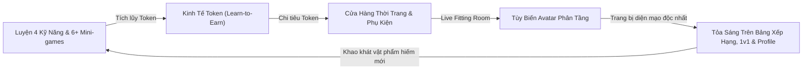
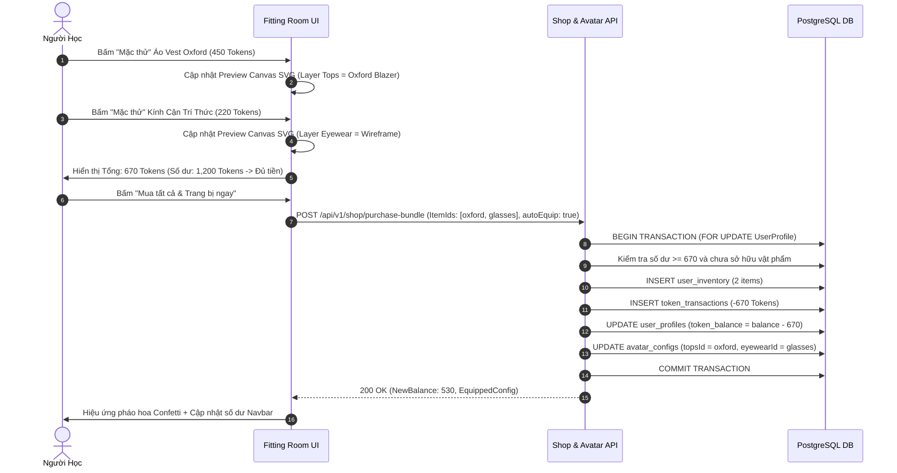
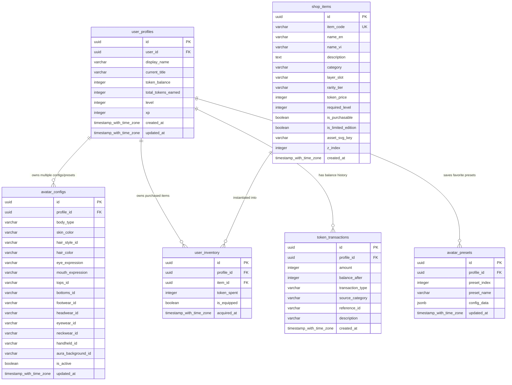

# Đặc Tả Nghiệp Vụ & Thiết Kế Chức Năng: Hệ Thống Hồ Sơ Cá Nhân Hóa (Avatar Customization) & Cửa Hàng Vật Phẩm Game Hóa (Gamified Item Shop & Token Economy)

**Mã tài liệu:** `SPEC-AVATAR-SHOP-V1`  
**Phiên bản:** 1.0  
**Tác giả:** Senior Product Business Analyst (Product BA)  
**Người nhận bàn giao:** Tech Lead / Architect (`11dba413-036f-4ce1-950e-252419384dce`), UI/UX Designer, Senior Fullstack Engineer, QA Team  
**Ngày ban hành:** 29/09/2026  
**Dự án:** Nền tảng Học Tiếng Anh qua Mini-game (Learn English Platform)  
**Mã công việc liên quan:** PHU-20, PHU-21  
**Trạng thái:** Đã hoàn thiện - Sẵn sàng chuyển giao kiến trúc CSDL & triển khai kỹ thuật  

---

## 1. Tổng Quan & Bối Cảnh Chiến Lược (Executive Summary)

### 1.1. Bối Cảnh & Mục Tiêu Sản Phẩm
Dựa trên tài liệu nghiên cứu thị trường và chiến lược sản phẩm tại [`docs/spec/product-research-gamified-shop-and-avatar.md`](./product-research-gamified-shop-and-avatar.md) do Product Lead xây dựng, nền tảng học tiếng Anh cần một bước nhảy vọt về mức độ gắn kết cảm xúc (**Emotional Attachment**) và động lực nội tại (**Intrinsic Motivation**).

Học ngôn ngữ là một hành trình dài hạn đòi hỏi tính kỷ luật cao. Nếu chỉ tích lũy điểm số vô hình (XP) hay vị trí bảng xếp hạng trừu tượng, người học rất nhanh chán nản. Việc ra mắt **Hệ Thống Tạo Hình Nhân Vật (Modular 2D Avatar)** kết hợp với **Cửa Hàng Vật Phẩm (Gamified Shop)** và **Nền Kinh Tế Token (Learn-to-Earn Economy)** tạo ra một chu trình phản hồi khen thưởng đóng kín hoàn hảo:



### 1.2. Các Chỉ Số Hiệu Quả Mục Tiêu (Target Product KPIs)
1. **D7 & D30 Retention:** Tăng trưởng tương đối tối thiểu **+30%** nhờ động lực tích lũy Token mua sắm thời trang.
2. **Average Daily Time Spent:** Tăng từ 14 phút lên **22 phút/ngày** nhờ trải nghiệm phòng thử đồ và động lực hoàn thành bài học kiếm Token.
3. **Weekly Active Shop Users:** Tối thiểu **65%** người học ghé thăm Cửa Hàng và thử đồ ít nhất 1 lần mỗi tuần.
4. **Token Circulation Velocity:** Duy trì tỷ lệ tiêu thụ Token (Token Sink Ratio) đạt **75% - 85%** tổng lượng Token phát hành, ngăn ngừa lạm phát ảo.

---

## 2. Hệ Thống Tiền Tệ & Luồng Token (Learn-to-Earn Token Economy)

### 2.1. Đơn Vị Tiền Tệ (Currency Definition)
- **Tên hiển thị:** **Token** (hoặc **Coin Tri Thức**).
- **Ký hiệu UI:** Biểu tượng đồng xu vàng viền sao lấp lánh (🪙 / Gold Coin SVG Icon).
- **Tính chất:** Tiền tệ trong ứng dụng kiếm được hoàn toàn thông qua nỗ lực học tập (Proof of Learning), không hỗ trợ nạp tiền thực (pay-to-win) để giữ gìn tính công bằng và định hướng giáo dục trong sạch của nền tảng.

### 2.2. Luồng Thu Thập Token (Token Faucets / Earn Mechanism)

#### Bảng 1: Phân bổ Token theo 4 Kỹ Năng Sư Phạm
Mỗi bài học 4 kỹ năng hoàn thành sẽ trao thưởng Token dựa trên thời lượng và độ khó:

| Kỹ Năng | Loại Bài Học | Mức Độ | Token Cơ Bản | Thưởng Điểm Tuyệt Đối (100% Score) | Thưởng Lần Đầu (First-Try Bonus) |
| :--- | :--- | :--- | :---: | :---: | :---: |
| 🎧 **Nghe (Listening)** | Dictation Dash / Audio Blitz | Dễ (A1-A2) | 10 | +5 | +5 |
| 🎧 **Nghe (Listening)** | Listening Comprehension | Trung bình (B1-B2) | 15 | +8 | +8 |
| 📖 **Đọc (Reading)** | Speed Skim & Scan Sprint | Dễ (A1-A2) | 10 | +5 | +5 |
| 📖 **Đọc (Reading)** | Long Passage In-depth | Trung bình (B1-B2) | 15 | +8 | +8 |
| ✍️ **Viết (Writing)** | Collocation Chain / Sentence Craft | Dễ (A1-A2) | 15 | +6 | +5 |
| ✍️ **Viết (Writing)** | Paragraph Writing & Error Fix | Trung bình (B1-B2) | 20 | +10 | +10 |
| 🗣️ **Nói (Speaking)** | Minimal Pairs Duel / Word Pronounce | Dễ (A1-A2) | 15 | +5 | +5 |
| 🗣️ **Nói (Speaking)** | AI Roleplay Scenario / Pitch | Trung bình (B1-B2) | 25 | +10 | +10 |

*Quy tắc Thưởng Cân Bằng (Balanced Learner Daily Bonus):* Khi người học hoàn thành ít nhất 1 bài tập của cả 4 kỹ năng (Nghe, Đọc, Viết, Nói) trong cùng một ngày dương lịch, hệ thống thưởng ngay **+50 Tokens** và **+100 XP**.

#### Bảng 2: Phân bổ Token theo 6 Mini-games Cốt Lõi

| Mini-game | Thời Lượng Ván | Token Hoàn Thành | Thưởng Combo Cao (Combo $\ge$ 10) | Thưởng Phá Kỷ Lục Cá Nhân (New Highscore) |
| :--- | :---: | :---: | :---: | :---: |
| **Word Match** | 60 giây | 8 | +5 | +10 |
| **Speed Falling Word** | 60 - 90 giây | 10 | +6 | +12 |
| **Sentence Scramble** | 90 giây | 10 | +5 | +10 |
| **Audio Blitz** | 60 giây | 12 | +6 | +15 |
| **Cloze Master** | 90 giây | 12 | +6 | +12 |
| **Grammar Detective** | 90 giây | 15 | +8 | +15 |

#### Bảng 3: Thưởng Token Đấu Đối Kháng 1v1 & Thói Quen Hàng Ngày

| Hoạt Động | Điều Kiện Kích Hoạt | Phần Thưởng Token |
| :--- | :--- | :---: |
| **1v1 Battle Rank Match** | Chiến thắng trận đấu | **+25 Tokens** |
| **1v1 Battle Win Streak** | Chuỗi thắng 3 trận liên tiếp | **+15 Tokens** (Bonus) |
| **1v1 Battle Participation** | Thua trận nhưng hoàn thành đủ ván | **+5 Tokens** (Khuyến khích) |
| **Daily Streak Milestones** | Giữ chuỗi 7 ngày liên tục | **+100 Tokens** |
| **Daily Streak Milestones** | Giữ chuỗi 30 ngày liên tục | **+500 Tokens** |
| **Daily Streak Milestones** | Giữ chuỗi 100 ngày liên tục | **+2,000 Tokens** |
| **Hòm Sáng (Early Bird Chest)** | Hoàn thành 1 bài trong khung 05:00 - 09:00 | **15 - 25 Tokens** (Ngẫu nhiên) |
| **Hòm Trưa (Midday Energy Chest)** | Hoàn thành 1 bài trong khung 11:30 - 13:30 | **20 - 30 Tokens** (Ngẫu nhiên) |
| **Hòm Tối (Night Owl Chest)** | Hoàn thành 1 bài trong khung 20:00 - 23:00 | **25 - 40 Tokens** (Ngẫu nhiên) |

### 2.3. Quy Tắc Chống Lạm Phát & Sổ Cái Giao Dịch (Anti-Inflation & Token Ledger)

1. **Giới Hạn Trần Mềm Hàng Ngày (Daily Soft-Cap):**
   - Mỗi người dùng chỉ có thể kiếm tối đa **600 Tokens/ngày** từ việc cày cuốc mini-games và bài tập thông thường (không tính phần thưởng mốc Streak và phần thưởng mở Rương nhiệm vụ).
   - Khi chạm mốc 600 Tokens, người học vẫn nhận 100% XP và tăng điểm kỹ năng bình thường, nhưng tỷ lệ thưởng Token giảm còn **20%** cho các ván tiếp theo trong ngày để ngăn chặn hành vi botting hoặc spam tự động.
2. **Nguyên Tắc Bất Biến Sổ Cái (Immutable Double-Entry Ledger Concept):**
   - Không bao giờ cập nhật trường `token_balance` của bảng người dùng một cách đơn độc.
   - Mọi biến động số dư phải được bao bọc trong một Database Transaction cùng với việc chèn 1 bản ghi vào bảng `token_transactions`.
   - Bảng ghi nhận rõ: `Amount` (dương khi cộng, âm khi trừ), `BalanceAfter`, `TransactionType` (Enum: `earn_lesson`, `earn_game`, `earn_battle`, `earn_quest`, `earn_streak`, `spend_shop_item`, `spend_preset_slot`, `admin_adjustment`), `ReferenceId` (ID bài học, ID trận đấu hoặc ID vật phẩm) và `Description`.

---

## 3. Hệ Thống Nhân Vật 2D Phân Tầng Đa Lớp (Modular Layered 2D Avatar System)

### 3.1. Cấu Trúc Các Tầng Hiển Thị (Z-Index Hierarchy Matrix)
Avatar được xây dựng theo phong cách 2D Flat Vector hiện đại, tối ưu hóa hiển thị bằng SVG thuần nhằm đảm bảo tải tức thì (<50ms), sắc nét trên mọi mật độ điểm ảnh (Retina, 4K) và dễ dàng đổi màu (Tintable via CSS Variables / Fill attributes).

Tất cả các bộ phận được căn chỉnh trên cùng một hệ tọa độ chuẩn Canvas **500 × 600 px** với thứ tự xếp lớp Z-Index nghiêm ngặt:

```
[Z: 10] Layer 10: Phụ kiện cầm tay / Thú cưng bay (Handhelds / Companions)
   ▲
[Z: 9]  Layer 9:  Kính mắt / Mặt nạ (Eyewear / Glasses)
   ▲
[Z: 8]  Layer 8:  Mũ nón / Băng đô (Headwear / Hats)
   ▲
[Z: 7]  Layer 7:  Tóc phía trước / Mái tóc (Front Hair & Bangs)
   ▲
[Z: 6]  Layer 6:  Trang sức cổ / Khăn choàng (Neckwear / Scarf)
   ▲
[Z: 5]  Layer 5:  Trang phục trên: Áo ngoài / Áo khoác (Tops / Outerwear)
   ▲
[Z: 4]  Layer 4:  Trang phục dưới: Quần / Váy (Bottoms / Pants / Skirts)
   ▲
[Z: 3]  Layer 3:  Giày dép / Tất vớ (Footwear / Shoes)
   ▲
[Z: 2]  Layer 2:  Khuôn mặt: Màu da, Mắt, Lông mày, Miệng (Base Face & Facial Features)
   ▲
[Z: 1]  Layer 1:  Thân thể cơ bản & Tóc phía sau (Base Body & Back Hair)
   ▲
[Z: 0]  Layer 0:  Hào quang / Hiệu ứng nền / Bục vinh danh (Aura, Background & Pedestal)
```

#### Bảng Chi Tiết Thuộc Tính Từng Lớp (Layer Properties):
| Layer ID | Tên Lớp | Slot Key | Z-Index | Khả Năng Đổi Màu (Color Tintable) | Tùy Chọn Tháo Rời (Removable) |
| :---: | :--- | :--- | :---: | :---: | :---: |
| **0** | Hào quang / Bục nền | `pedestal_aura` | 0 | Không (Theo asset) | Có (Mặc định: Bục gỗ tròn) |
| **1A**| Tóc phía sau | `hair_back` | 1 | Có (Theo `hair_color`) | Tự động sinh theo kiểu tóc |
| **1B**| Khung cơ thể cơ bản | `base_body` | 10 | Có (Theo `skin_tone`) | Không (Bắt buộc) |
| **2A**| Khuôn mặt & Cổ | `face_shape` | 20 | Có (Theo `skin_tone`) | Không (Bắt buộc) |
| **2B**| Biểu cảm mắt & mày | `eyes` | 25 | Có (Màu tròng mắt) | Không (Bắt buộc) |
| **2C**| Biểu cảm khuôn miệng | `mouth` | 26 | Không (Đường nét chuẩn) | Không (Bắt buộc) |
| **3** | Giày dép | `footwear` | 30 | Có / Không theo asset | Có (Mặc định: Giày thể thao trắng) |
| **4** | Quần / Chân váy | `bottoms` | 40 | Có / Không theo asset | Có (Mặc định: Quần jeans xanh) |
| **5** | Áo sơ mi / Áo thun / Áo khoác | `tops` | 50 | Có / Không theo asset | Có (Mặc định: Áo thun trắng) |
| **6** | Trang sức cổ / Cà vạt / Khăn | `neckwear` | 60 | Theo asset | Có |
| **7** | Mái tóc phía trước | `hair_front` | 70 | Có (Theo `hair_color`) | Không (Bắt buộc) |
| **8** | Mũ nón / Nơ cài | `headwear` | 80 | Theo asset | Có |
| **9** | Kính mắt / Kính râm | `eyewear` | 90 | Theo asset | Có |
| **10**| Phụ kiện cầm tay / Thú cưng | `handheld` | 100 | Theo asset | Có |

### 3.2. Danh Sách Tùy Biến Cơ Bản Miễn Phí (Default Starter Presets)
Người dùng mới đăng ký tài khoản được cấp quyền truy cập ngay lập tức vào bộ sưu tập tạo hình cơ bản hoàn toàn miễn phí:

1. **Giới tính / Kiểu khung thân (Body Framework):**
   - `male` (Dáng vai rộng, đường nét cơ thể nam).
   - `female` (Dáng vai thon, đường nét cơ thể nữ).
   - `neutral` (Dáng trung tính hiện đại, phong cách phi giới tính).
2. **Bảng màu da chuẩn (8 Universal Skin Tones):**
   - `#FDDFDF` - Porcelain / Rất sáng
   - `#F8D5C2` - Fair / Trắng hồng
   - `#E8B898` - Warm Ivory / Sáng tự nhiên
   - `#D09B74` - Tan / Bánh mật nhẹ
   - `#BA7B54` - Olive / Răm nắng Châu Á
   - `#9B5B32` - Honey Bronze / Đồng đậm
   - `#6C3E1F` - Deep Chestnut / Nâu hạt dẻ
   - `#3D2314` - Dark Espresso / Nâu trầm Châu Phi
3. **10 Kiểu tóc ban đầu (Starter Hair Styles):**
   - Nam/Neutral: `short_crop`, `side_part`, `messy_fringe`, `undercut_fade`, `buzz_cut`.
   - Nữ/Neutral: `bob_cut`, `pixie_chic`, `long_waves`, `high_ponytail`, `curly_afro`.
4. **8 Màu tóc tự nhiên (Natural Hair Colors):**
   - `#1C1917` (Jet Black), `#3B2219` (Dark Espresso), `#5C3317` (Chestnut Brown), `#854D0E` (Caramel Honey), `#CA8A04` (Golden Blonde), `#78350F` (Auburn Copper), `#DC2626` (Crimson Flame), `#64748B` (Platinum Silver).
5. **3 Biểu cảm khuôn mặt (Facial Expressions):**
   - `friendly_smile` (Mắt cười thân thiện, miệng cười lộ răng nhẹ - Mặc định).
   - `intellectual_focus` (Ánh mắt kiên định, lông mày hơi nhíu tập trung cao độ).
   - `playful_wink` (Một bên mắt nháy tinh nghịch, miệng cười tươi vui nhộn).
6. **Bộ trang phục mặc định ban đầu:**
   - Áo thun ngắn tay `starter_tee_white` (Trắng) hoặc `starter_tee_navy` (Xanh navy).
   - Quần dài `starter_jeans_blue` (Jeans cổ điển).
   - Giày thể thao `starter_sneakers_white` (Sneaker trắng năng động).
   - Bục đứng `pedestal_wood_circle` (Bục gỗ tối giản).

### 3.3. Định Dạng Cấu Hình Lưu Trữ Avatar (Avatar Config JSON Schema)
Cấu hình diện mạo người dùng được chuẩn hóa theo JSON Schema sau:

```json
{
  "$schema": "https://json-schema.org/draft/2020-12/schema",
  "title": "AvatarConfig",
  "type": "object",
  "required": [
    "bodyType",
    "skinColor",
    "hairStyleId",
    "hairColor",
    "eyeExpression",
    "mouthExpression",
    "topsId",
    "bottomsId",
    "footwearId"
  ],
  "properties": {
    "bodyType": {
      "type": "string",
      "enum": ["male", "female", "neutral"]
    },
    "skinColor": {
      "type": "string",
      "pattern": "^#([A-Fa-f0-9]{6})$"
    },
    "hairStyleId": {
      "type": "string"
    },
    "hairColor": {
      "type": "string",
      "pattern": "^#([A-Fa-f0-9]{6})$"
    },
    "eyeExpression": {
      "type": "string",
      "enum": ["friendly_smile", "intellectual_focus", "playful_wink", "confident_sparkle"]
    },
    "mouthExpression": {
      "type": "string",
      "enum": ["smile_open", "smile_calm", "confident_grin", "thinking_pout"]
    },
    "topsId": {
      "type": "string",
      "description": "ID hoặc ItemCode của trang phục thân trên"
    },
    "bottomsId": {
      "type": "string",
      "description": "ID hoặc ItemCode của trang phục thân dưới"
    },
    "footwearId": {
      "type": "string",
      "description": "ID hoặc ItemCode của giày dép"
    },
    "headwearId": {
      "type": ["string", "null"],
      "default": null
    },
    "eyewearId": {
      "type": ["string", "null"],
      "default": null
    },
    "neckwearId": {
      "type": ["string", "null"],
      "default": null
    },
    "handheldId": {
      "type": ["string", "null"],
      "default": null
    },
    "auraBackgroundId": {
      "type": ["string", "null"],
      "default": "pedestal_wood_circle"
    }
  },
  "additionalProperties": false
}
```

---

## 4. Cửa Hàng Vật Phẩm & Phòng Thay Đồ Trực Quan (Gamified Item Shop & Wardrobe)

### 4.1. Hệ Thống 4 Cấp Bậc Độ Hiếm (Rarity Tiers & Visual Identity)

| Độ Hiếm (Rarity) | Badge / Viền CSS | Khung Giá Token | Hiệu Ứng Hình Ảnh & Animation | Cảm Xúc Thiết Kế |
| :--- | :--- | :---: | :--- | :--- |
| ⚪ **Common** (Phổ thông) | `border-slate-300 bg-slate-50 text-slate-700` | **100 - 250** | Thiết kế vector tĩnh, đường nét gọn gàng, thanh lịch. | Quần áo dạo phố, trang phục thường ngày, phụ kiện cơ bản. |
| 🟢 **Rare** (Hiếm) | `border-emerald-400 bg-emerald-50 text-emerald-800 shadow-sm` | **300 - 650** | Chi tiết sắc nét hơn, có hoa văn thêu dệt, gradient chuyển màu nhẹ. | Đồng phục học giả Oxford, mũ beret nghệ sĩ, kính gọng vàng. |
| 🟣 **Epic** (Sử thi) | `border-purple-500 bg-purple-50 text-purple-900 shadow-md ring-1 ring-purple-400` | **800 - 1,600** | Hiệu ứng ánh kim nhẹ (Metallic Sheen), viền phát sáng nhẹ dạng nhịp thở (Pulse Glow). | Áo khoác thám tử Sherlock, bộ đồ phi hành gia, tai nghe Cyberpunk phát sáng. |
| 🟡 **Legendary** (Huyền thoại) | `border-amber-400 bg-gradient-to-br from-amber-50 to-yellow-100 text-amber-900 shadow-lg ring-2 ring-amber-400` | **2,000 - 5,000** | Hiệu ứng hạt phát sáng bay lượn (Floating Particles, Sparkles), hào quang lửa vàng động 60fps. | Áo choàng Pháp sư Ngôn từ Tối thượng, Vòng nguyệt quế Thần thoại Olympus, Hào quang Sách cổ bay quanh người. |

### 4.2. Danh Mục Chi Tiết 28+ Vật Phẩm Mẫu Cửa Hàng (Shop Item Catalog)

Dưới đây là bảng thông số 28 vật phẩm mẫu đa dạng trải đều trên tất cả các danh mục và cấp độ hiếm:

| Mã Item (`item_code`) | Tên Tiếng Việt & Tiếng Anh | Phân Loại (`category`) | Vị Trí Slot (`layer_slot`) | Độ Hiếm (`rarity`) | Giá Token | Yêu Cầu Level | Hiệu Ứng Đặc Biệt | Mã Asset SVG (`asset_svg_key`) |
| :--- | :--- | :--- | :--- | :--- | :---: | :---: | :--- | :--- |
| `top_oxford_blazer` | Áo Vest Học Giả Oxford (Oxford Scholar Blazer) | `tops` | `tops` | **Rare** | 450 | 5 | Huy hiệu ngực vàng thêu tinh xảo | `assets/avatar/tops/oxford_blazer.svg` |
| `top_cyber_hoodie` | Áo Hoodie Neon Tương Lai (Cyber Neon Hoodie) | `tops` | `tops` | **Epic** | 950 | 10 | Dải đèn LED dạ quang chạy dọc tay áo | `assets/avatar/tops/cyber_hoodie.svg` |
| `top_wizard_robe` | Áo Choàng Đại Pháp Sư Từ Vựng (Archmage Lexicon Robe) | `tops` | `tops` | **Legendary** | 3,200 | 25 | Cổ áo thêu chòm sao phát sáng huyền ảo | `assets/avatar/tops/wizard_robe.svg` |
| `top_detective_trench` | Áo Măng Tô Thám Tử Baker (Baker Street Trench Coat) | `tops` | `tops` | **Epic** | 1,100 | 12 | Khăn choàng kẻ caro phong cách London | `assets/avatar/tops/detective_trench.svg` |
| `top_vintage_denim` | Áo Khoác Bò Cổ Điển (Vintage Denim Jacket) | `tops` | `tops` | **Common** | 200 | 2 | None | `assets/avatar/tops/vintage_denim.svg` |
| `top_astronaut_suit` | Bộ Đồ Phi Hành Gia Apollo (Apollo Flight Suit) | `tops` | `tops` | **Legendary** | 3,800 | 30 | Cờ phù hiệu vũ trụ phản quang | `assets/avatar/tops/astronaut_suit.svg` |
| `bot_pleated_skirt` | Váy Xếp Ly Đồng Phục (Academic Pleated Skirt) | `bottoms` | `bottoms` | **Common** | 180 | 1 | None | `assets/avatar/bottoms/pleated_skirt.svg` |
| `bot_cargo_joggers` | Quần Túi Hộp Chiến Thuật (Urban Cargo Joggers) | `bottoms` | `bottoms` | **Rare** | 350 | 4 | Túi hộp đai khóa phong cách Streetwear | `assets/avatar/bottoms/cargo_joggers.svg` |
| `bot_wizard_skirt` | Quần Pháp Sư Thêu Chỉ Vàng (Runic Mage Trousers) | `bottoms` | `bottoms` | **Epic** | 850 | 15 | Họa tiết chữ Runes phát sáng viền gấu | `assets/avatar/bottoms/wizard_skirt.svg` |
| `bot_suit_pants` | Quần Tây Doanh Nhân Lịch Lãm (Tailored Suit Trousers) | `bottoms` | `bottoms` | **Rare** | 380 | 5 | Nếp gấp thẳng tắp cao cấp | `assets/avatar/bottoms/suit_pants.svg` |
| `foot_leather_oxford` | Giày Da Oxford Bóng Bẩy (Polished Oxford Shoes) | `footwear` | `footwear` | **Rare** | 320 | 3 | Ánh sáng bóng loáng phản chiếu | `assets/avatar/footwear/leather_oxford.svg` |
| `foot_cyber_kicks` | Giày Thể Thao Đệm Khí Neon (Neon Air Striders) | `footwear` | `footwear` | **Epic** | 900 | 12 | Đế giày nhấp nháy ánh sáng tím Neon | `assets/avatar/footwear/cyber_kicks.svg` |
| `foot_hermes_boots` | Bốt Thần Gió Có Cánh (Hermes Winged Boots) | `footwear` | `footwear` | **Legendary** | 2,500 | 20 | Đôi cánh vàng nhỏ vẫy nhẹ ở gót chân | `assets/avatar/footwear/hermes_boots.svg` |
| `foot_canvas_high` | Giày Cổ Cao Vải Canvas (Classic High-Top Canvas) | `footwear` | `footwear` | **Common** | 150 | 1 | None | `assets/avatar/footwear/canvas_high.svg` |
| `head_graduation_cap` | Mũ Cử Nhân Tri Thức (Valedictorian Mortarboard) | `headwear` | `headwear` | **Rare** | 500 | 8 | Dải tua rua vàng lay nhẹ trong gió | `assets/avatar/headwear/graduation_cap.svg` |
| `head_detective_hat` | Mũ Thám Tử Săn Hươu (Deerstalker Investigator Hat) | `headwear` | `headwear` | **Rare** | 420 | 6 | Nơ thắt đỉnh mũ phong cách cổ điển | `assets/avatar/headwear/detective_hat.svg` |
| `head_cyber_headphones`| Tai Nghe Chụp Tai Gaming LED (Cyber Cat Headphones) | `headwear` | `headwear` | **Epic** | 1,200 | 14 | Vành tai mèo phát sáng đổi 7 màu | `assets/avatar/headwear/cyber_headphones.svg` |
| `head_olympus_crown` | Vòng Nguyệt Quế Vàng Olympus (Golden Laurels of Olympus) | `headwear` | `headwear` | **Legendary** | 4,000 | 30 | Lá vàng óng ánh tỏa bụi sáng lấp lánh | `assets/avatar/headwear/olympus_crown.svg` |
| `head_wizard_hat` | Mũ Phù Thủy Ngàn Năm (Centennial Sorcerer Hat) | `headwear` | `headwear` | **Epic** | 1,400 | 18 | Mặt trăng lưỡi liềm vàng đu đưa ở chóp | `assets/avatar/headwear/wizard_hat.svg` |
| `eye_smart_glasses` | Kính Cận Trí Thức Mạ Vàng (Scholastic Wireframe Glasses) | `eyewear` | `eyewear` | **Common** | 220 | 2 | Tròng kính phản chiếu ánh sáng thông tuệ | `assets/avatar/eyewear/smart_glasses.svg` |
| `eye_vr_visor` | Kính Thực Tế Ảo Cyber (Cyber Tactical Visor) | `eyewear` | `eyewear` | **Epic** | 1,050 | 16 | Màn hình hiển thị dữ liệu số HUD quét liên tục | `assets/avatar/eyewear/vr_visor.svg` |
| `eye_steampunk_goggles`| Kính Phi Công Cổ Điển Bằng Đồng (Steampunk Aviator Goggles)| `eyewear` | `eyewear` | **Rare** | 550 | 7 | Bánh răng đồng hồ xoay nhẹ trên gọng | `assets/avatar/eyewear/steampunk_goggles.svg` |
| `hand_magic_tome` | Sách Cổ Ngữ Pháp Cấm Thuật (Grimoire of Ancient Grammar) | `handheld` | `handheld` | **Legendary** | 3,500 | 25 | Sách bay lơ lửng bên tay tự động lật trang | `assets/avatar/handheld/magic_tome.svg` |
| `hand_golden_mic` | Micro Mạ Vàng Thần Thoại (Golden Voice Champion Mic) | `handheld` | `handheld` | **Epic** | 1,500 | 15 | Sóng âm nhạc nốt vàng tỏa ra xung quanh | `assets/avatar/handheld/golden_mic.svg` |
| `aura_floating_books` | Vòng Xoáy Sách Tri Thức (Orbiting Lexicon Runes) | `aura_background`| `pedestal_aura` | **Epic** | 1,600 | 18 | 4 quyển từ điển thu nhỏ bay xoay quanh người | `assets/avatar/aura/floating_books.svg` |
| `aura_golden_triumph`| Hào Quang Lửa Vàng Vinh Quang (Aura of Victorious Flames) | `aura_background`| `pedestal_aura` | **Legendary** | 4,500 | 35 | Lửa thần vàng rực bốc lên từ bục chân 60fps | `assets/avatar/aura/golden_triumph.svg` |
| `aura_royal_library` | Nền Thư Viện Hoàng Gia Cổ Kính (Grand Royal Archives) | `aura_background`| `pedestal_aura` | **Rare** | 600 | 10 | Giá sách gỗ sồi cổ kính và ánh nến ấm áp | `assets/avatar/aura/royal_library.svg` |
| `boost_streak_freeze` | Băng Bảo Vệ Chuỗi Ngày Học (Streak Freeze Shield) | `consumable` | `consumable` | **Rare** | 200 | 1 | Tự động bảo lưu Streak nếu quên học 1 ngày | `assets/icons/streak_freeze.svg` |
| `boost_xp_potion_2x` | Lọ Nước Thần Tăng Gấp Đôi XP 30 Phút (Double XP Potion) | `consumable` | `consumable` | **Rare** | 150 | 1 | Nhân đôi XP nhận được trong 30 phút | `assets/icons/xp_potion.svg` |

### 4.3. Phòng Thử Đồ Trực Quan (Live Fitting Room / Wardrobe Preview)

#### Trải Nghiệm Người Dùng (User Experience & Interaction Flow):
1. **Giao Diện Split-View Hiện Đại:**
   - **Bên Trái (40% màn hình):** **Live Avatar Stage** hiển thị nhân vật toàn thân kích thước lớn với hiệu ứng thở nhẹ (Idle Breathing Animation). Phía dưới chân avatar có nút bật tắt đối sánh *"Xem đồ đang mặc"* vs *"Xem sau khi phối"*.
   - **Bên Phải (60% màn hình):** **Item Shop Catalog** với thanh lọc đa tầng (Tabs: *Tất cả, Trang phục, Mũ nón, Giày dép, Kính & Phụ kiện, Hào quang, Tiện ích*), bộ lọc Độ hiếm (*All, Common, Rare, Epic, Legendary*) và thanh tìm kiếm từ khóa.
2. **Cơ Chế Thử Đồ Ngay Tức Thì (Instant Try-On):**
   - Người dùng bấm vào bất kỳ món đồ nào trong Shop:
     - Avatar bên trái lập tức khoác món đồ đó lên mà **chưa hề trừ Token**.
     - Nếu món đồ thuộc slot đã có vật phẩm đang thử trước đó (ví dụ đang thử Mũ thám tử rồi bấm Mũ cử nhân), hệ thống tự động tráo đổi item ở slot đó.
     - Nút trên thẻ vật phẩm chuyển sang trạng thái: `Đang thử (Trying On)` kèm viền phát sáng màu Cyan.
   - Thẻ hiển thị thanh tóm tắt giỏ thử đồ phía dưới Avatar: `Đang thử: 3 món | Tổng giá: 1,850 Tokens | Số dư của bạn: 2,400 Tokens`.
3. **Hai Phương Thức Thanh Toán Linh Hoạt:**
   - **Mua Nhanh 1-Click (Instant Buy):** Bấm nút "Mua ngay" trên từng card vật phẩm -> Hiện modal xác nhận ngắn gọn -> Trừ Token -> Tự động trang bị vào Avatar nếu người dùng tích chọn "Mặc ngay sau khi mua".
   - **Mua Trọn Gói Giỏ Thử Đồ (Checkout All in Cart):** Cho phép gom tất cả các món đồ đang thử trong phòng thay đồ và bấm `"Mua tất cả (3 món) & Lưu diện mạo"`.



### 4.4. Tủ Đồ Cá Nhân (User Inventory) & Bộ Phối Yêu Thích (Outfit Presets)

1. **Quản Lý Tủ Đồ (Wardrobe Management):**
   - Màn hình tủ đồ liệt kê toàn bộ các trang phục và phụ kiện mà người dùng đã mua hoặc được tặng.
   - Phân loại rõ ràng: `Đang trang bị (Equipped)` (có tick xanh nổi bật), `Chưa trang bị (Owned)`, `Vật phẩm tiêu hao (Consumables)`.
   - Hành động 1-chạm: Bấm vào một món đồ trong tủ để **Trang bị (Equip)** hoặc **Tháo bỏ (Unequip)**.
2. **Lưu Tối Đa 3 Bộ Phối Đồ Yêu Thích (Favorite Outfit Presets):**
   - Cho phép người dùng lưu toàn bộ diện mạo hiện tại thành một bộ Preset với tên tùy chỉnh:
     - **Slot 1 (Mặc định):** *"Phong cách Học Đường (Campus Casual)"*
     - **Slot 2:** *"Thám Tử Tri Thức (Sherlock Detective)"*
     - **Slot 3:** *"Chiến Thần Đấu Rank (Cyber Gladiator)"*
   - Thay đổi trang phục thần tốc: Người dùng chỉ cần bấm `"Áp dụng Preset 2"` trước khi vào trận đấu 1v1 hoặc lên Bảng xếp hạng, toàn bộ trang phục, tóc, nón, kính sẽ lập tức đổi theo cấu hình đã lưu.

---

## 5. Trang Profile Người Dùng & Điểm Chạm Hiển Thị Diện Rộng

### 5.1. Bố Cục Trang Hồ Sơ Cá Nhân (User Profile Page Layout)

Trang cá nhân được tái thiết kế theo cấu trúc trang trọng, tôn vinh thành tích người học:

```
┌─────────────────────────────────────────────────────────────────────────────┐
│                             HEADER PROFILE BANNER                           │
├───────────────────────────────────┬─────────────────────────────────────────┤
│                                   │  TRẦN VĂN AN (Level 28)                 │
│         [ FULL-BODY AVATAR ]      │  Danh hiệu: 🎖️ Bậc Thầy Ngữ Pháp         │
│                                   │  ═════════════════════════════════════  │
│         - Nhân vật toàn thân -    │  🪙 Số Dư Token: 3,450 Tokens           │
│         - Hiệu ứng Idle Breath -  │  🔥 Chuỗi Streak: 45 Ngày (Kỷ lục: 60)  │
│         - Bục vinh danh vàng -    │  ⭐ Tổng EXP: 18,250 XP                 │
│         - Hào quang bao quanh -   │  🏆 Rank 1v1: Kim Cương II (1,850 Elo)  │
│                                   ├─────────────────────────────────────────┤
│     [ ✏️ Đổi Trang Phục & Tủ Đồ ]  │     RADAR NĂNG LỰC 4 KỸ NĂNG            │
│     [ 📸 Chia Sẻ Avatar Lên MXH ] │          (Listening: 85%)               │
│                                   │    (Speaking: 70%)    (Reading: 92%)    │
│                                   │          (Writing: 78%)                 │
├───────────────────────────────────┴─────────────────────────────────────────┤
│  TỦ TRƯNG BÀY HUY HIỆU DANH GIÁ (BADGES SHOWCASE - 8/24 ĐÃ MỞ KHÓA)         │
│  [🥇 Bug Slayer]  [⚡ Combo Master]  [🦉 Night Owl]  [🛡️ Streak Keeper]     │
├─────────────────────────────────────────────────────────────────────────────┤
│  LỊCH SỬ THI ĐẤU & GIAO DỊCH GẦN ĐÂY (RECENT ACTIVITY & TOKEN HISTORY)      │
│  • Hôm nay 20:15: Thắng 1v1 Battle (+25 Tokens)                             │
│  • Hôm nay 19:40: Mua Áo Khoác Cyber Neon Hoodie (-950 Tokens)             │
│  • Hôm nay 12:10: Mở Hòm Nhiệm Vụ Trưa (+25 Tokens)                         │
└─────────────────────────────────────────────────────────────────────────────┘
```

### 5.2. Các Điểm Chạm Hiển Thị Avatar Toàn Ứng Dụng (Universal Touchpoints)

1. **Header Navbar Chung Toàn Hệ Thống:**
   - Góc phải trên màn hình hiển thị: Avatar tròn mini (kích thước 40 × 40 px, chỉ lấy phần đầu, tóc, nón, kính và biểu cảm khuôn mặt) + Ô hiển thị số dư Token màu vàng có hiệu ứng đếm số khi nhận thưởng (`+25 🪙`). Bấm vào Avatar mở nhanh Quick Menu dẫn tới Profile và Cửa Hàng.
2. **Bảng Xếp Hạng Tuần (Weekly Leaderboard):**
   - Trên cùng là Bục Vinh Quang (Podium) Top 1, Top 2, Top 3 hiển thị **Avatar toàn thân** của 3 người dẫn đầu với các bục Vàng, Bạc, Đồng và hiệu ứng hào quang lấp lánh tương ứng với trang bị của họ.
   - Các thứ hạng từ 4 đến 30 hiển thị Avatar thumbnail tròn cạnh tên người chơi.
3. **Màn Hình Ghép Trận Đấu Đối Kháng 1v1 (Versus & Victory Screen):**
   - **Màn hình chờ ghép cặp (Matchmaking / Versus Screen):** Hai Avatar đối thủ đứng hai bên màn hình (Avatar của bạn nhìn sang phải, Avatar đối thủ nhìn sang trái), hiển thị đầy đủ trang phục, vũ khí/sách cầm tay và danh hiệu chiến đấu.
   - **Màn hình tổng kết ván (Victory Scene):** Avatar người thắng trận bước lên bục vinh quang, giơ cúp chiến thắng hoặc vẫy tay ăn mừng kèm hiệu ứng pháo hoa, trong khi Avatar người thua hiển thị biểu cảm gãi đầu tiếc nuối thân thiện.
4. **Nhóm Học Tập Hợp Tác (Study Squads Member List):**
   - Danh sách thành viên đội học tập 5-10 người hiển thị Avatar của từng người bạn đứng cạnh nhau như một biệt đội học tập đoàn kết.

---

## 6. Thiết Kế Mô Hình Dữ Liệu Chi Tiết (PostgreSQL DDL & C# EF Core Entities)

### 6.1. Sơ Đồ Thực Thể Liên Kết (Mermaid ERD)



### 6.2. PostgreSQL DDL Migration Script

```sql
-- ============================================================================
-- MIGRATION: 20260929_AddAvatarAndGamifiedShopTables.sql
-- Mô tả: Khởi tạo bảng CSDL cho Hồ sơ Avatar, Cửa Hàng Vật Phẩm & Giao Dịch Token
-- ============================================================================

-- 1. Bảng User Profiles (Mở rộng hoặc tạo mới liên kết AspNetUsers)
CREATE TABLE IF NOT EXISTS user_profiles (
    id UUID PRIMARY KEY DEFAULT gen_random_uuid(),
    user_id UUID NOT NULL UNIQUE,
    display_name VARCHAR(100) NOT NULL,
    current_title VARCHAR(100) DEFAULT 'Người Học Mới (Novice Learner)',
    token_balance INTEGER NOT NULL DEFAULT 100 CHECK (token_balance >= 0),
    total_tokens_earned INTEGER NOT NULL DEFAULT 100 CHECK (total_tokens_earned >= 0),
    level INTEGER NOT NULL DEFAULT 1 CHECK (level >= 1),
    xp INTEGER NOT NULL DEFAULT 0 CHECK (xp >= 0),
    created_at TIMESTAMPTZ NOT NULL DEFAULT CURRENT_TIMESTAMP,
    updated_at TIMESTAMPTZ NOT NULL DEFAULT CURRENT_TIMESTAMP
);

CREATE INDEX idx_user_profiles_user_id ON user_profiles(user_id);
CREATE INDEX idx_user_profiles_token_balance ON user_profiles(token_balance);

-- 2. Bảng Cấu Hình Avatar Hiện Tại (Avatar Configs)
CREATE TABLE IF NOT EXISTS avatar_configs (
    id UUID PRIMARY KEY DEFAULT gen_random_uuid(),
    profile_id UUID NOT NULL REFERENCES user_profiles(id) ON DELETE CASCADE,
    body_type VARCHAR(20) NOT NULL DEFAULT 'neutral' CHECK (body_type IN ('male', 'female', 'neutral')),
    skin_color VARCHAR(10) NOT NULL DEFAULT '#E8B898',
    hair_style_id VARCHAR(50) NOT NULL DEFAULT 'short_crop',
    hair_color VARCHAR(10) NOT NULL DEFAULT '#1C1917',
    eye_expression VARCHAR(50) NOT NULL DEFAULT 'friendly_smile',
    mouth_expression VARCHAR(50) NOT NULL DEFAULT 'smile_open',
    tops_id VARCHAR(50) NOT NULL DEFAULT 'starter_tee_white',
    bottoms_id VARCHAR(50) NOT NULL DEFAULT 'starter_jeans_blue',
    footwear_id VARCHAR(50) NOT NULL DEFAULT 'starter_sneakers_white',
    headwear_id VARCHAR(50) NULL,
    eyewear_id VARCHAR(50) NULL,
    neckwear_id VARCHAR(50) NULL,
    handheld_id VARCHAR(50) NULL,
    aura_background_id VARCHAR(50) DEFAULT 'pedestal_wood_circle',
    is_active BOOLEAN NOT NULL DEFAULT true,
    updated_at TIMESTAMPTZ NOT NULL DEFAULT CURRENT_TIMESTAMP
);

CREATE INDEX idx_avatar_configs_profile_id ON avatar_configs(profile_id);

-- 3. Bảng Danh Mục Vật Phẩm Cửa Hàng (Shop Items)
CREATE TABLE IF NOT EXISTS shop_items (
    id UUID PRIMARY KEY DEFAULT gen_random_uuid(),
    item_code VARCHAR(80) NOT NULL UNIQUE,
    name_en VARCHAR(150) NOT NULL,
    name_vi VARCHAR(150) NOT NULL,
    description TEXT NULL,
    category VARCHAR(40) NOT NULL CHECK (category IN ('tops', 'bottoms', 'footwear', 'headwear', 'eyewear', 'neckwear', 'handheld', 'aura_background', 'consumable')),
    layer_slot VARCHAR(40) NOT NULL,
    rarity_tier VARCHAR(20) NOT NULL CHECK (rarity_tier IN ('common', 'rare', 'epic', 'legendary')),
    token_price INTEGER NOT NULL CHECK (token_price >= 0),
    required_level INTEGER NOT NULL DEFAULT 1 CHECK (required_level >= 1),
    is_purchasable BOOLEAN NOT NULL DEFAULT true,
    is_limited_edition BOOLEAN NOT NULL DEFAULT false,
    asset_svg_key VARCHAR(255) NOT NULL,
    z_index INTEGER NOT NULL DEFAULT 50,
    created_at TIMESTAMPTZ NOT NULL DEFAULT CURRENT_TIMESTAMP
);

CREATE INDEX idx_shop_items_category ON shop_items(category);
CREATE INDEX idx_shop_items_rarity ON shop_items(rarity_tier);
CREATE INDEX idx_shop_items_price ON shop_items(token_price);

-- 4. Bảng Tủ Đồ Người Dùng (User Inventory)
CREATE TABLE IF NOT EXISTS user_inventory (
    id UUID PRIMARY KEY DEFAULT gen_random_uuid(),
    profile_id UUID NOT NULL REFERENCES user_profiles(id) ON DELETE CASCADE,
    item_id UUID NOT NULL REFERENCES shop_items(id) ON DELETE RESTRICT,
    token_spent INTEGER NOT NULL DEFAULT 0 CHECK (token_spent >= 0),
    is_equipped BOOLEAN NOT NULL DEFAULT false,
    acquired_at TIMESTAMPTZ NOT NULL DEFAULT CURRENT_TIMESTAMP,
    CONSTRAINT uq_profile_item UNIQUE(profile_id, item_id)
);

CREATE INDEX idx_user_inventory_profile_id ON user_inventory(profile_id);
CREATE INDEX idx_user_inventory_item_id ON user_inventory(item_id);

-- 5. Bảng Sổ Cái Giao Dịch Token (Token Transactions)
CREATE TABLE IF NOT EXISTS token_transactions (
    id UUID PRIMARY KEY DEFAULT gen_random_uuid(),
    profile_id UUID NOT NULL REFERENCES user_profiles(id) ON DELETE CASCADE,
    amount INTEGER NOT NULL CHECK (amount <> 0),
    balance_after INTEGER NOT NULL CHECK (balance_after >= 0),
    transaction_type VARCHAR(40) NOT NULL CHECK (transaction_type IN (
        'earn_lesson', 'earn_game', 'earn_battle', 'earn_quest', 
        'earn_streak', 'spend_shop_item', 'spend_preset_slot', 'admin_adjustment'
    )),
    source_category VARCHAR(50) NULL,
    reference_id VARCHAR(100) NULL,
    description VARCHAR(255) NOT NULL,
    created_at TIMESTAMPTZ NOT NULL DEFAULT CURRENT_TIMESTAMP
);

CREATE INDEX idx_token_transactions_profile_id ON token_transactions(profile_id);
CREATE INDEX idx_token_transactions_created_at ON token_transactions(created_at DESC);

-- 6. Bảng Lưu Bộ Phối Đồ Yêu Thích (Avatar Presets)
CREATE TABLE IF NOT EXISTS avatar_presets (
    id UUID PRIMARY KEY DEFAULT gen_random_uuid(),
    profile_id UUID NOT NULL REFERENCES user_profiles(id) ON DELETE CASCADE,
    preset_index INTEGER NOT NULL CHECK (preset_index BETWEEN 1 AND 3),
    preset_name VARCHAR(100) NOT NULL,
    config_data JSONB NOT NULL,
    updated_at TIMESTAMPTZ NOT NULL DEFAULT CURRENT_TIMESTAMP,
    CONSTRAINT uq_profile_preset_index UNIQUE(profile_id, preset_index)
);

CREATE INDEX idx_avatar_presets_profile_id ON avatar_presets(profile_id);
```

### 6.3. C# Entity Framework Core 8 Entities

```csharp
namespace LearnEnglish.Domain.Entities.AvatarAndShop;

using System;
using System.Collections.Generic;
using System.ComponentModel.DataAnnotations;
using System.ComponentModel.DataAnnotations.Schema;

[Table("user_profiles")]
public class UserProfile
{
    [Key]
    public Guid Id { get; set; } = Guid.NewGuid();

    [Required]
    public Guid UserId { get; set; }

    [Required]
    [MaxLength(100)]
    public string DisplayName { get; set; } = string.Empty;

    [MaxLength(100)]
    public string CurrentTitle { get; set; } = "Người Học Mới (Novice Learner)";

    public int TokenBalance { get; set; } = 100;

    public int TotalTokensEarned { get; set; } = 100;

    public int Level { get; set; } = 1;

    public int Xp { get; set; } = 0;

    public DateTime CreatedAt { get; set; } = DateTime.UtcNow;

    public DateTime UpdatedAt { get; set; } = DateTime.UtcNow;

    // Navigation Properties
    public virtual AvatarConfig? ActiveAvatarConfig { get; set; }
    public virtual ICollection<UserInventory> InventoryItems { get; set; } = new List<UserInventory>();
    public virtual ICollection<TokenTransaction> TokenTransactions { get; set; } = new List<TokenTransaction>();
    public virtual ICollection<AvatarPreset> Presets { get; set; } = new List<AvatarPreset>();
}

[Table("avatar_configs")]
public class AvatarConfig
{
    [Key]
    public Guid Id { get; set; } = Guid.NewGuid();

    [Required]
    public Guid ProfileId { get; set; }

    [ForeignKey(nameof(ProfileId))]
    public virtual UserProfile Profile { get; set; } = null!;

    [Required]
    [MaxLength(20)]
    public string BodyType { get; set; } = "neutral"; // male, female, neutral

    [Required]
    [MaxLength(10)]
    public string SkinColor { get; set; } = "#E8B898";

    [Required]
    [MaxLength(50)]
    public string HairStyleId { get; set; } = "short_crop";

    [Required]
    [MaxLength(10)]
    public string HairColor { get; set; } = "#1C1917";

    [Required]
    [MaxLength(50)]
    public string EyeExpression { get; set; } = "friendly_smile";

    [Required]
    [MaxLength(50)]
    public string MouthExpression { get; set; } = "smile_open";

    [Required]
    [MaxLength(50)]
    public string TopsId { get; set; } = "starter_tee_white";

    [Required]
    [MaxLength(50)]
    public string BottomsId { get; set; } = "starter_jeans_blue";

    [Required]
    [MaxLength(50)]
    public string FootwearId { get; set; } = "starter_sneakers_white";

    [MaxLength(50)]
    public string? HeadwearId { get; set; }

    [MaxLength(50)]
    public string? EyewearId { get; set; }

    [MaxLength(50)]
    public string? NeckwearId { get; set; }

    [MaxLength(50)]
    public string? HandheldId { get; set; }

    [MaxLength(50)]
    public string? AuraBackgroundId { get; set; } = "pedestal_wood_circle";

    public bool IsActive { get; set; } = true;

    public DateTime UpdatedAt { get; set; } = DateTime.UtcNow;
}

[Table("shop_items")]
public class ShopItem
{
    [Key]
    public Guid Id { get; set; } = Guid.NewGuid();

    [Required]
    [MaxLength(80)]
    public string ItemCode { get; set; } = string.Empty;

    [Required]
    [MaxLength(150)]
    public string NameEn { get; set; } = string.Empty;

    [Required]
    [MaxLength(150)]
    public string NameVi { get; set; } = string.Empty;

    public string? Description { get; set; }

    [Required]
    [MaxLength(40)]
    public string Category { get; set; } = string.Empty; // tops, bottoms, footwear, etc.

    [Required]
    [MaxLength(40)]
    public string LayerSlot { get; set; } = string.Empty;

    [Required]
    [MaxLength(20)]
    public string RarityTier { get; set; } = "common"; // common, rare, epic, legendary

    public int TokenPrice { get; set; }

    public int RequiredLevel { get; set; } = 1;

    public bool IsPurchasable { get; set; } = true;

    public bool IsLimitedEdition { get; set; } = false;

    [Required]
    [MaxLength(255)]
    public string AssetSvgKey { get; set; } = string.Empty;

    public int ZIndex { get; set; } = 50;

    public DateTime CreatedAt { get; set; } = DateTime.UtcNow;
}

[Table("user_inventory")]
public class UserInventory
{
    [Key]
    public Guid Id { get; set; } = Guid.NewGuid();

    [Required]
    public Guid ProfileId { get; set; }

    [ForeignKey(nameof(ProfileId))]
    public virtual UserProfile Profile { get; set; } = null!;

    [Required]
    public Guid ItemId { get; set; }

    [ForeignKey(nameof(ItemId))]
    public virtual ShopItem Item { get; set; } = null!;

    public int TokenSpent { get; set; }

    public bool IsEquipped { get; set; } = false;

    public DateTime AcquiredAt { get; set; } = DateTime.UtcNow;
}

[Table("token_transactions")]
public class TokenTransaction
{
    [Key]
    public Guid Id { get; set; } = Guid.NewGuid();

    [Required]
    public Guid ProfileId { get; set; }

    [ForeignKey(nameof(ProfileId))]
    public virtual UserProfile Profile { get; set; } = null!;

    public int Amount { get; set; }

    public int BalanceAfter { get; set; }

    [Required]
    [MaxLength(40)]
    public string TransactionType { get; set; } = string.Empty;

    [MaxLength(50)]
    public string? SourceCategory { get; set; }

    [MaxLength(100)]
    public string? ReferenceId { get; set; }

    [Required]
    [MaxLength(255)]
    public string Description { get; set; } = string.Empty;

    public DateTime CreatedAt { get; set; } = DateTime.UtcNow;
}

[Table("avatar_presets")]
public class AvatarPreset
{
    [Key]
    public Guid Id { get; set; } = Guid.NewGuid();

    [Required]
    public Guid ProfileId { get; set; }

    [ForeignKey(nameof(ProfileId))]
    public virtual UserProfile Profile { get; set; } = null!;

    public int PresetIndex { get; set; } // 1, 2, 3

    [Required]
    [MaxLength(100)]
    public string PresetName { get; set; } = string.Empty;

    [Required]
    [Column(TypeName = "jsonb")]
    public string ConfigData { get; set; } = "{}";

    public DateTime UpdatedAt { get; set; } = DateTime.UtcNow;
}
```

---

## 7. TypeScript Interfaces & Hợp Đồng API RESTful

### 7.1. TypeScript Interfaces

```typescript
export type BodyType = 'male' | 'female' | 'neutral';

export type ItemCategory = 
  | 'tops' 
  | 'bottoms' 
  | 'footwear' 
  | 'headwear' 
  | 'eyewear' 
  | 'neckwear' 
  | 'handheld' 
  | 'aura_background' 
  | 'consumable';

export type RarityTier = 'common' | 'rare' | 'epic' | 'legendary';

export interface AvatarConfigDto {
  bodyType: BodyType;
  skinColor: string;
  hairStyleId: string;
  hairColor: string;
  eyeExpression: string;
  mouthExpression: string;
  topsId: string;
  bottomsId: string;
  footwearId: string;
  headwearId: string | null;
  eyewearId: string | null;
  neckwearId: string | null;
  handheldId: string | null;
  auraBackgroundId: string | null;
}

export interface UserProfileDto {
  id: string;
  userId: string;
  displayName: string;
  currentTitle: string;
  tokenBalance: number;
  totalTokensEarned: number;
  level: number;
  xp: number;
  avatarConfig: AvatarConfigDto;
  skillsMastery: {
    listeningScore: number;
    readingScore: number;
    writingScore: number;
    speakingScore: number;
  };
  streakDays: number;
}

export interface ShopItemDto {
  id: string;
  itemCode: string;
  nameEn: string;
  nameVi: string;
  description: string | null;
  category: ItemCategory;
  layerSlot: string;
  rarityTier: RarityTier;
  tokenPrice: number;
  requiredLevel: number;
  isPurchasable: boolean;
  isLimitedEdition: boolean;
  assetSvgKey: string;
  zIndex: number;
  isOwned?: boolean;
}

export interface InventoryItemDto {
  id: string;
  itemId: string;
  itemCode: string;
  nameEn: string;
  nameVi: string;
  category: ItemCategory;
  rarityTier: RarityTier;
  assetSvgKey: string;
  isEquipped: boolean;
  acquiredAt: string;
}

export interface TokenTransactionDto {
  id: string;
  amount: number;
  balanceAfter: number;
  transactionType: string;
  description: string;
  createdAt: string;
}

export interface OutfitPresetDto {
  presetIndex: number;
  presetName: string;
  configData: AvatarConfigDto;
  updatedAt: string;
}
```

### 7.2. Đặc Tả Các Endpoints RESTful

#### Nhóm 1: Hồ Sơ Cá Nhân (`/api/v1/profile/*`)
* `GET /api/v1/profile`
  - **Mô tả:** Lấy thông tin hồ sơ người dùng hiện tại, số dư token, radar kỹ năng và cấu hình avatar đang kích hoạt.
  - **Headers:** `Authorization: Bearer <JWT>`
  - **Response 200 OK:** `UserProfileDto`
* `PATCH /api/v1/profile/title`
  - **Mô tả:** Cập nhật danh hiệu hiển thị (Title) cho người dùng.
  - **Request Body:** `{ "newTitle": "🎖️ Bậc Thầy Từ Vựng" }`
  - **Response 200 OK:** `{ "success": true, "currentTitle": "🎖️ Bậc Thầy Từ Vựng" }`

#### Nhóm 2: Tùy Biến Avatar (`/api/v1/avatar/*`)
* `GET /api/v1/avatar/config`
  - **Mô tả:** Lấy cấu hình Avatar hiện tại của người dùng.
  - **Response 200 OK:** `AvatarConfigDto`
* `PUT /api/v1/avatar/config`
  - **Mô tả:** Lưu cấu hình tùy biến Avatar (chỉ được sử dụng các item mặc định hoặc item người dùng đã sở hữu trong inventory).
  - **Request Body:** `AvatarConfigDto`
  - **Response 200 OK:** `{ "success": true, "updatedConfig": AvatarConfigDto }`
  - **Response 400 Bad Request:** `{ "error": "Item 'top_cyber_hoodie' chưa được sở hữu trong tủ đồ." }`
* `GET /api/v1/avatar/presets`
  - **Mô tả:** Lấy danh sách tối đa 3 bộ phối đồ đã lưu.
  - **Response 200 OK:** `OutfitPresetDto[]`
* `PUT /api/v1/avatar/presets/{index}`
  - **Mô tả:** Lưu cấu hình hiện tại vào slot preset `{index}` (giá trị 1..3).
  - **Request Body:** `{ "presetName": "Phong Cách Đi Học", "config": AvatarConfigDto }`
  - **Response 200 OK:** `OutfitPresetDto`
* `POST /api/v1/avatar/presets/{index}/apply`
  - **Mô tả:** Áp dụng toàn bộ diện mạo của slot preset `{index}` lên avatar chính đang kích hoạt.
  - **Response 200 OK:** `{ "success": true, "activeConfig": AvatarConfigDto }`

#### Nhóm 3: Cửa Hàng Vật Phẩm (`/api/v1/shop/*`)
* `GET /api/v1/shop/items`
  - **Mô tả:** Lấy danh mục vật phẩm trong Cửa Hàng kèm trạng thái đã sở hữu (`isOwned`).
  - **Query Params:** `category`, `rarity`, `search`, `page`, `pageSize`
  - **Response 200 OK:** `{ "items": ShopItemDto[], "total": 28, "page": 1 }`
* `POST /api/v1/shop/purchase`
  - **Mô tả:** Mua 1 vật phẩm đơn lẻ.
  - **Request Body:** `{ "itemCode": "top_oxford_blazer", "autoEquip": true }`
  - **Response 200 OK:**
    ```json
    {
      "success": true,
      "item": { "itemCode": "top_oxford_blazer", "nameVi": "Áo Vest Học Giả Oxford" },
      "tokenSpent": 450,
      "newBalance": 750,
      "isEquipped": true
    }
    ```
  - **Response 400 Bad Request:** `{ "errorCode": "INSUFFICIENT_FUNDS", "message": "Số dư Token không đủ để thực hiện giao dịch." }`
  - **Response 409 Conflict:** `{ "errorCode": "ITEM_ALREADY_OWNED", "message": "Bạn đã sở hữu vật phẩm này." }`
* `POST /api/v1/shop/purchase-bundle`
  - **Mô tả:** Mua nhiều món đồ cùng lúc từ giỏ hàng thử đồ trong Fitting Room.
  - **Request Body:** `{ "itemCodes": ["top_cyber_hoodie", "eye_vr_visor"], "autoEquip": true }`
  - **Response 200 OK:** `{ "success": true, "itemsPurchased": 2, "totalSpent": 2000, "newBalance": 400 }`

#### Nhóm 4: Tủ Đồ & Lịch Sử Giao Dịch (`/api/v1/inventory/*` & `/api/v1/tokens/*`)
* `GET /api/v1/inventory`
  - **Mô tả:** Lấy toàn bộ danh sách vật phẩm người dùng đang sở hữu trong tủ đồ.
  - **Response 200 OK:** `InventoryItemDto[]`
* `POST /api/v1/inventory/{itemId}/equip`
  - **Mô tả:** Trang bị món đồ trong tủ lên Avatar.
  - **Response 200 OK:** `{ "success": true, "equippedSlot": "tops", "activeConfig": AvatarConfigDto }`
* `POST /api/v1/inventory/{itemId}/unequip`
  - **Mô tả:** Tháo bỏ trang bị (đối với các slot không bắt buộc như nón, kính, phụ kiện).
  - **Response 200 OK:** `{ "success": true, "unequippedSlot": "headwear" }`
* `GET /api/v1/tokens/transactions`
  - **Mô tả:** Lấy lịch sử biến động số dư Token phân trang.
  - **Response 200 OK:** `{ "transactions": TokenTransactionDto[], "total": 45 }`

---

## 8. Tiêu Chí Nghiệm Thu Chuẩn Mực (Given - When - Then Acceptance Criteria)

### Kịch Bản 1: Khởi tạo Avatar mặc định cho người dùng mới
* **Given (Bối cảnh):** Người dùng mới đăng ký tài khoản thành công qua `/api/v1/auth/register` và lần đầu đăng nhập.
* **When (Hành động):** Hệ thống kích hoạt hook khởi tạo hồ sơ người dùng.
* **Then (Kết quả kỳ vọng):**
  1. Bản ghi `user_profiles` được tạo với `token_balance = 100` (quà tân thủ tặng 100 Tokens khởi nghiệp) và `level = 1`.
  2. Bản ghi `avatar_configs` được tạo với bộ mặc định: `body_type = 'neutral'`, `skin_color = '#E8B898'`, `hair_style_id = 'short_crop'`, `tops_id = 'starter_tee_white'`, `bottoms_id = 'starter_jeans_blue'`, `footwear_id = 'starter_sneakers_white'`.
  3. `token_transactions` ghi nhận 1 giao dịch `amount = +100`, `transaction_type = 'admin_adjustment'`, `description = 'Quà tặng chào mừng tân thủ'`.
  4. Client hiển thị avatar hoàn chỉnh với bục gỗ tròn và số dư 100 🪙 trên Navbar.

---

### Kịch Bản 2: Luyện tập kỹ năng/mini-game nhận Token và ghi nhận Sổ cái
* **Given (Bối cảnh):** Người dùng có số dư `token_balance = 350`, hoàn thành bài tập nghe `Dictation Dash` với điểm số tuyệt đối 100/100.
* **When (Hành động):** Client submit kết quả bài học qua API kiểm tra bài tập.
* **Then (Kết quả kỳ vọng):**
  1. Backend tính toán thưởng: Token cơ bản (+10) + Thưởng điểm tuyệt đối (+5) = +15 Tokens.
  2. Bảng `token_transactions` chèn bản ghi mới: `amount = 15`, `balance_after = 365`, `transaction_type = 'earn_lesson'`, `reference_id = '<lesson_id>'`.
  3. Bảng `user_profiles` cập nhật `token_balance = 365` và `total_tokens_earned = total_tokens_earned + 15`.
  4. Response trả về kèm thông số `tokensEarned: 15`, `newBalance: 365`.
  5. UI hiển thị Animation đồng xu vàng bay từ vị trí bài nộp lên góc Navbar và cập nhật con số 365 lấp lánh.

---

### Kịch Bản 3: Thử đồ trong Fitting Room và Mua sắm thành công
* **Given (Bối cảnh):** Người dùng có số dư `token_balance = 1,200`. Đang trong Live Fitting Room và thử món `top_oxford_blazer` (giá 450 Tokens, yêu cầu Level 5, người dùng đang Level 8). Món đồ này chưa có trong `user_inventory`.
* **When (Hành động):** Người dùng bấm nút "Mua ngay & Trang bị" (`POST /api/v1/shop/purchase`).
* **Then (Kết quả kỳ vọng):**
  1. Backend mở transaction với khóa hàng người dùng (Row Lock):
     - Xác nhận số dư $1,200 \ge 450$.
     - Xác nhận người dùng Level $8 \ge 5$.
     - Xác nhận chưa tồn tại bản ghi trong `user_inventory`.
  2. Trừ `token_balance` từ $1,200 \to 750$.
  3. Thêm 1 dòng vào `user_inventory` với `item_id` tương ứng và `is_equipped = true`.
  4. Thêm 1 dòng vào `token_transactions` với `amount = -450`, `balance_after = 750`, `transaction_type = 'spend_shop_item'`.
  5. Cập nhật `avatar_configs.tops_id = 'top_oxford_blazer'`.
  6. Transaction commit thành công; Client nhận mã 200 OK, bắn pháo hoa Confetti chúc mừng và chuyển trạng thái thẻ trong Shop thành "Đã sở hữu".

---

### Kịch Bản 4: Mua sắm thất bại khi không đủ Token (Insufficient Balance)
* **Given (Bối cảnh):** Người dùng có số dư `token_balance = 200`, đang ngắm nhìn Áo Hoodie Cyber Neon `top_cyber_hoodie` (giá 950 Tokens).
* **When (Hành động):** Người dùng bấm nút "Mua ngay" hoặc gửi request mua vật phẩm.
* **Then (Kết quả kỳ vọng):**
  1. Client nhận biết trước số dư $200 < 950$, hiển thị nút mua màu xám kèm nhãn "Thiếu 750 🪙 - Hãy học thêm bài để kiếm Token!".
  2. Nếu người dùng cố tình bypass client gọi trực tiếp API `POST /api/v1/shop/purchase`:
     - Backend từ chối với HTTP Status `400 Bad Request`.
     - JSON trả về: `{"errorCode": "INSUFFICIENT_FUNDS", "message": "Số dư Token không đủ để mua vật phẩm này."}`.
     - Số dư và trạng thái tủ đồ của người dùng giữ nguyên vẹn 100%.

---

### Kịch Bản 5: Ngăn chặn mua trùng lặp vật phẩm thời trang vĩnh viễn (Idempotency / Unique Item)
* **Given (Bối cảnh):** Người dùng đã sở hữu Mũ thám tử `head_detective_hat` trong tủ đồ cá nhân.
* **When (Hành động):** Người dùng vào Cửa hàng và bấm vào Mũ thám tử.
* **Then (Kết quả kỳ vọng):**
  1. Nút mua hiển thị trạng thái disabled: `Đã sở hữu (Owned)`.
  2. Nếu request trùng lặp được gửi lên server (do click đúp hoặc lag mạng), ràng buộc cơ sở dữ liệu `CONSTRAINT uq_profile_item UNIQUE(profile_id, item_id)` bảo vệ hệ thống.
  3. Backend trả về HTTP Status `409 Conflict` kèm thông báo: `"Bạn đã sở hữu vật phẩm này trong tủ đồ."`.
  4. Không phát sinh trừ Token lần thứ hai.

---

### Kịch Bản 6: Lưu và áp dụng Bộ Phối Đồ Yêu Thích (Outfit Presets)
* **Given (Bối cảnh):** Người dùng vừa phối xong một bộ trang phục phong cách Thám tử gồm Mũ săn hươu, Áo măng tô Baker, Giày da Oxford và Kính gọng đồng.
* **When (Hành động):** Người dùng bấm "Lưu vào Preset 2", đặt tên *"Thám Tử Baker Street"* và bấm Xác nhận (`PUT /api/v1/avatar/presets/2`).
* **Then (Kết quả kỳ vọng):**
  1. Toàn bộ `AvatarConfigDto` hiện tại được lưu dưới dạng JSONB vào bảng `avatar_presets` ở bản ghi `preset_index = 2`.
  2. Sau đó người dùng thay đổi avatar sang đồ ngủ cơ bản.
  3. Khi bấm `"Áp dụng Preset 2"` (`POST /api/v1/avatar/presets/2/apply`):
     - Backend đọc dữ liệu từ Preset 2, kiểm tra lại xem tất cả các món đồ trong preset người dùng vẫn còn quyền sở hữu hay không.
     - Ghi đè cấu hình vào `avatar_configs`.
     - Toàn bộ giao diện Avatar trên Profile, Header và Live Stage lập tức biến hóa trở lại thành bộ Thám tử Baker Street hoàn chỉnh.

---

### Kịch Bản 7: Hiển thị Avatar đồng bộ trên Bục Bảng Xếp Hạng Tuần
* **Given (Bối cảnh):** Người dùng đạt Hạng 1 tuần trong giải đấu Silver League với 1,850 XP. Người dùng đang mặc Áo Choàng Pháp Sư `top_wizard_robe` (Legendary) và Hào Quang Sách Bay `aura_floating_books`.
* **When (Hành động):** Bất kỳ người học nào khác mở tab "Bảng Xếp Hạng Tuần (Leaderboard)".
* **Then (Kết quả kỳ vọng):**
  1. Vị trí Top 1 trên Bục Vinh Quang hiển thị đầy đủ hình thể toàn thân của người dùng.
  2. Lớp áo choàng đại pháp sư hiển thị sắc nét cùng hiệu ứng sách bay xoay tròn quanh người ở tốc độ 60fps.
  3. Dưới chân hiển thị bục vàng khắc chữ "Top 1 - 1,850 XP" và danh hiệu đã chọn của người chơi.
  4. Khi click vào avatar trên bục, hiển thị Modal xem hồ sơ tóm tắt của người chơi này.

---

## 9. Kế Hoạch Chuyển Giao & Điều Phối Kỹ Thuật (Handoff & Implementation Tasks)

Để nhanh chóng hiện thực hóa đặc tả trên thành tính năng hoàn chỉnh, quy trình phối hợp kỹ thuật được phân công như sau:

1. **Bàn giao cho Tech Lead / Architect (`11dba413-036f-4ce1-950e-252419384dce`):**
   - **Rà soát kiến trúc:** Xác nhận mô hình CSDL PostgreSQL DDL, tối ưu hóa các chỉ mục (Indexes) trên `token_transactions` và `user_inventory`.
   - **Thiết kế Backend Service:**
     - Thiết lập `TokenLedgerService` đảm bảo tính toán số dư thread-safe với Database Pessimistic Locking (`SELECT FOR UPDATE`).
     - Viết EF Core Migrations cho 6 bảng mới (`user_profiles`, `avatar_configs`, `shop_items`, `user_inventory`, `token_transactions`, `avatar_presets`).
     - Viết Seed Data cho 28 vật phẩm mẫu theo bảng tại mục 4.2.
     - Triển khai bộ Controller và Endpoints theo hợp đồng tại mục 7.2.
2. **Bàn giao cho UI/UX Designer:**
   - Dựng trọn bộ Vector SVG Components cho Avatar 11 tầng phân lớp theo đúng tỷ lệ Canvas 500 × 600 px và hệ tọa độ anchor points.
   - Thiết kế Layout 2 cột cho Phòng Thử Đồ (Live Fitting Room) với hiệu ứng chuyển trang phục mượt mà.
   - Thiết kế Modal mua hàng và hoạt ảnh pháo hoa chúc mừng mở khóa đồ hiếm Epic/Legendary.
3. **Bàn giao cho Senior Fullstack Engineer:**
   - Dựng Component React `ModularAvatar` nhận props `config: AvatarConfigDto` và render các thẻ SVG xếp chồng theo Z-Index.
   - Tích hợp State Management (Zustand) cho Fitting Room giỏ đồ thử trang phục.
   - Tích hợp animation Framer Motion cho hiệu ứng đếm số Token trên Header Navbar.
4. **Bàn giao cho QA Team:**
   - Viết Unit Tests kiểm tra logic tính toán Token không bị số âm và không vượt trần lạm phát.
   - Viết Integration Tests cho 7 kịch bản Given-When-Then, chú trọng kiểm thử tấn công Race Condition khi click mua liên tục nhiều lần cùng một lúc.
