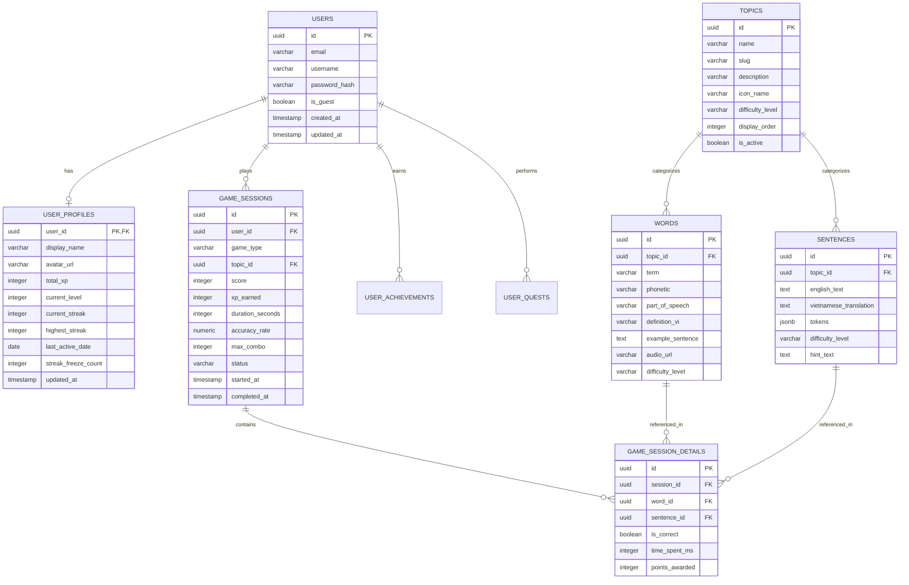

# Đặc Tả Cấu Trúc Dữ Liệu & Mô Hình Thực Thể (Data Models & Schemas)

Tài liệu này xác định toàn bộ lược đồ cơ sở dữ liệu PostgreSQL, các mô hình thực thể Entity Framework Core (.NET 8) và các kiểu dữ liệu tương ứng trong TypeScript (React Frontend) nhằm đảm bảo sự thống nhất tuyệt đối giữa Backend và Frontend.

---

## 1. Sơ Đồ Thực Thể Quan Hệ (Entity-Relationship Diagram - ERD)



---

## 2. Thiết Kế Cơ Sở Dữ Liệu PostgreSQL (DDL & Indexes)

```sql
-- Kích hoạt extension sinh UUID v4
CREATE EXTENSION IF NOT EXISTS "uuid-ossp";

-- 1. Bảng Người dùng (Hỗ trợ cả Tài khoản Thật và Tài khoản Khách)
CREATE TABLE users (
    id UUID PRIMARY KEY DEFAULT uuid_generate_v4(),
    email VARCHAR(255) UNIQUE NULL,
    username VARCHAR(100) UNIQUE NOT NULL,
    password_hash VARCHAR(255) NULL,
    is_guest BOOLEAN NOT NULL DEFAULT FALSE,
    created_at TIMESTAMPTZ NOT NULL DEFAULT NOW(),
    updated_at TIMESTAMPTZ NOT NULL DEFAULT NOW()
);

-- 2. Hồ sơ tiến trình & Gamification của Người dùng
CREATE TABLE user_profiles (
    user_id UUID PRIMARY KEY REFERENCES users(id) ON DELETE CASCADE,
    display_name VARCHAR(100) NOT NULL,
    avatar_url VARCHAR(500) NULL,
    total_xp INT NOT NULL DEFAULT 0 CHECK (total_xp >= 0),
    current_level INT NOT NULL DEFAULT 1 CHECK (current_level >= 1),
    current_streak INT NOT NULL DEFAULT 0 CHECK (current_streak >= 0),
    highest_streak INT NOT NULL DEFAULT 0 CHECK (highest_streak >= 0),
    last_active_date DATE NULL,
    streak_freeze_count INT NOT NULL DEFAULT 0 CHECK (streak_freeze_count >= 0),
    updated_at TIMESTAMPTZ NOT NULL DEFAULT NOW()
);

CREATE INDEX idx_user_profiles_total_xp ON user_profiles(total_xp DESC);
CREATE INDEX idx_user_profiles_current_streak ON user_profiles(current_streak DESC);

-- 3. Bảng Chủ đề Từ vựng & Câu (Topics)
CREATE TABLE topics (
    id UUID PRIMARY KEY DEFAULT uuid_generate_v4(),
    name VARCHAR(150) NOT NULL,
    slug VARCHAR(150) UNIQUE NOT NULL,
    description TEXT NULL,
    icon_name VARCHAR(50) NOT NULL DEFAULT 'BookOpen',
    difficulty_level VARCHAR(20) NOT NULL DEFAULT 'Easy' CHECK (difficulty_level IN ('Easy', 'Medium', 'Hard')),
    display_order INT NOT NULL DEFAULT 0,
    is_active BOOLEAN NOT NULL DEFAULT TRUE,
    created_at TIMESTAMPTZ NOT NULL DEFAULT NOW()
);

-- 4. Bảng Từ vựng (Words) - Dùng cho Word Match & Speed Falling Word
CREATE TABLE words (
    id UUID PRIMARY KEY DEFAULT uuid_generate_v4(),
    topic_id UUID NOT NULL REFERENCES topics(id) ON DELETE CASCADE,
    term VARCHAR(100) NOT NULL,
    phonetic VARCHAR(100) NULL,
    part_of_speech VARCHAR(50) NULL, -- noun, verb, adjective, adverb...
    definition_vi VARCHAR(255) NOT NULL,
    example_sentence TEXT NULL,
    audio_url VARCHAR(500) NULL,
    difficulty_level VARCHAR(20) NOT NULL DEFAULT 'Easy',
    created_at TIMESTAMPTZ NOT NULL DEFAULT NOW()
);

CREATE INDEX idx_words_topic_id ON words(topic_id);

-- 5. Bảng Câu (Sentences) - Dùng cho Sentence Scramble
CREATE TABLE sentences (
    id UUID PRIMARY KEY DEFAULT uuid_generate_v4(),
    topic_id UUID NOT NULL REFERENCES topics(id) ON DELETE CASCADE,
    english_text TEXT NOT NULL,
    vietnamese_translation TEXT NOT NULL,
    tokens JSONB NOT NULL, -- Mảng các từ ["I", "usually", "drink", "coffee"]
    difficulty_level VARCHAR(20) NOT NULL DEFAULT 'Easy',
    hint_text TEXT NULL,
    created_at TIMESTAMPTZ NOT NULL DEFAULT NOW()
);

CREATE INDEX idx_sentences_topic_id ON sentences(topic_id);

-- 6. Bảng Phiên Chơi (Game Sessions)
CREATE TABLE game_sessions (
    id UUID PRIMARY KEY DEFAULT uuid_generate_v4(),
    user_id UUID NOT NULL REFERENCES users(id) ON DELETE CASCADE,
    game_type VARCHAR(50) NOT NULL CHECK (game_type IN ('WordMatch', 'SpeedFalling', 'SentenceScramble')),
    topic_id UUID NOT NULL REFERENCES topics(id) ON DELETE RESTRICT,
    score INT NOT NULL DEFAULT 0,
    xp_earned INT NOT NULL DEFAULT 0,
    duration_seconds INT NOT NULL DEFAULT 0,
    accuracy_rate NUMERIC(5,2) NOT NULL DEFAULT 0.00,
    max_combo INT NOT NULL DEFAULT 0,
    status VARCHAR(30) NOT NULL DEFAULT 'InProgress' CHECK (status IN ('InProgress', 'Completed', 'Abandoned', 'Failed')),
    started_at TIMESTAMPTZ NOT NULL DEFAULT NOW(),
    completed_at TIMESTAMPTZ NULL
);

CREATE INDEX idx_game_sessions_user_id ON game_sessions(user_id);
CREATE INDEX idx_game_sessions_completed_at ON game_sessions(completed_at DESC);
```

---

## 3. Cấu Trúc Thực Thể C# (.NET 8 EF Core Models)

```csharp
namespace LearnEnglish.Domain.Entities;

public enum GameType
{
    WordMatch,
    SpeedFalling,
    SentenceScramble
}

public enum GameSessionStatus
{
    InProgress,
    Completed,
    Abandoned,
    Failed
}

public class User
{
    public Guid Id { get; set; } = Guid.NewGuid();
    public string? Email { get; set; }
    public string Username { get; set; } = string.Empty;
    public string? PasswordHash { get; set; }
    public bool IsGuest { get; set; }
    public DateTime CreatedAt { get; set; } = DateTime.UtcNow;
    public DateTime UpdatedAt { get; set; } = DateTime.UtcNow;

    public UserProfile? Profile { get; set; }
    public ICollection<GameSession> GameSessions { get; set; } = new List<GameSession>();
}

public class UserProfile
{
    public Guid UserId { get; set; }
    public string DisplayName { get; set; } = string.Empty;
    public string? AvatarUrl { get; set; }
    public int TotalXp { get; set; }
    public int CurrentLevel { get; set; } = 1;
    public int CurrentStreak { get; set; }
    public int HighestStreak { get; set; }
    public DateOnly? LastActiveDate { get; set; }
    public int StreakFreezeCount { get; set; }
    public DateTime UpdatedAt { get; set; } = DateTime.UtcNow;

    public User User { get; set; } = null!;
}

public class Word
{
    public Guid Id { get; set; } = Guid.NewGuid();
    public Guid TopicId { get; set; }
    public string Term { get; set; } = string.Empty;
    public string? Phonetic { get; set; }
    public string? PartOfSpeech { get; set; }
    public string DefinitionVi { get; set; } = string.Empty;
    public string? ExampleSentence { get; set; }
    public string? AudioUrl { get; set; }
    public string DifficultyLevel { get; set; } = "Easy";

    public Topic Topic { get; set; } = null!;
}

public class Sentence
{
    public Guid Id { get; set; } = Guid.NewGuid();
    public Guid TopicId { get; set; }
    public string EnglishText { get; set; } = string.Empty;
    public string VietnameseTranslation { get; set; } = string.Empty;
    public List<string> Tokens { get; set; } = new();
    public string DifficultyLevel { get; set; } = "Easy";
    public string? HintText { get; set; }

    public Topic Topic { get; set; } = null!;
}

public class GameSession
{
    public Guid Id { get; set; } = Guid.NewGuid();
    public Guid UserId { get; set; }
    public GameType GameType { get; set; }
    public Guid TopicId { get; set; }
    public int Score { get; set; }
    public int XpEarned { get; set; }
    public int DurationSeconds { get; set; }
    public decimal AccuracyRate { get; set; }
    public int MaxCombo { get; set; }
    public GameSessionStatus Status { get; set; } = GameSessionStatus.InProgress;
    public DateTime StartedAt { get; set; } = DateTime.UtcNow;
    public DateTime? CompletedAt { get; set; }

    public User User { get; set; } = null!;
    public Topic Topic { get; set; } = null!;
}
```

---

## 4. Định Nghĩa Kiểu Dữ Liệu TypeScript (Frontend Interfaces)

```typescript
// types/game.ts

export type GameType = 'WordMatch' | 'SpeedFalling' | 'SentenceScramble';
export type GameStatus = 'InProgress' | 'Completed' | 'Abandoned' | 'Failed';

export interface UserProfileDto {
  userId: string;
  username: string;
  displayName: string;
  avatarUrl?: string;
  totalXp: number;
  currentLevel: number;
  currentStreak: number;
  highestStreak: number;
  streakFreezeCount: number;
}

export interface TopicDto {
  id: string;
  name: string;
  slug: string;
  description?: string;
  iconName: string;
  difficultyLevel: 'Easy' | 'Medium' | 'Hard';
}

export interface WordDto {
  id: string;
  term: string;
  phonetic?: string;
  partOfSpeech?: string;
  definitionVi: string;
  exampleSentence?: string;
  audioUrl?: string;
}

export interface SentenceDto {
  id: string;
  englishText: string;
  vietnameseTranslation: string;
  tokens: string[];
  hintText?: string;
}

// Model bắt đầu ván chơi Word Match
export interface WordMatchInitResponse {
  sessionId: string;
  timeLimitSeconds: number;
  cards: {
    id: string;
    pairId: string;
    type: 'EN' | 'VI';
    content: string;
    subContent?: string; // Phiên âm nếu là thẻ EN
  }[];
}

// Model bắt đầu ván chơi Speed Falling Word
export interface SpeedFallingInitResponse {
  sessionId: string;
  items: {
    wordId: string;
    term: string;
    phonetic?: string;
    correctDefinitionVi: string;
    options: string[]; // 4 lựa chọn ngẫu nhiên gồm 1 đáp án đúng
    fallSpeedDurationMs: number;
  }[];
}

// Model bắt đầu ván chơi Sentence Scramble
export interface SentenceScrambleInitResponse {
  sessionId: string;
  totalTimeLimitSeconds: number;
  sentences: {
    sentenceId: string;
    vietnameseTranslation: string;
    shuffledTokens: {
      id: string;
      word: string;
    }[];
    correctOrderTokens: string[];
    hintText?: string;
  }[];
}

// Model submit kết quả ván chơi
export interface CompleteSessionRequest {
  sessionId: string;
  score: number;
  durationSeconds: number;
  totalAttempts: number;
  correctAnswers: number;
  maxCombo: number;
}

export interface CompleteSessionResponse {
  sessionId: string;
  score: number;
  xpEarned: number;
  accuracyRate: number;
  isNewLevel: boolean;
  newLevel?: number;
  currentStreak: number;
  streakIncremented: boolean;
  totalXp: number;
}
```
