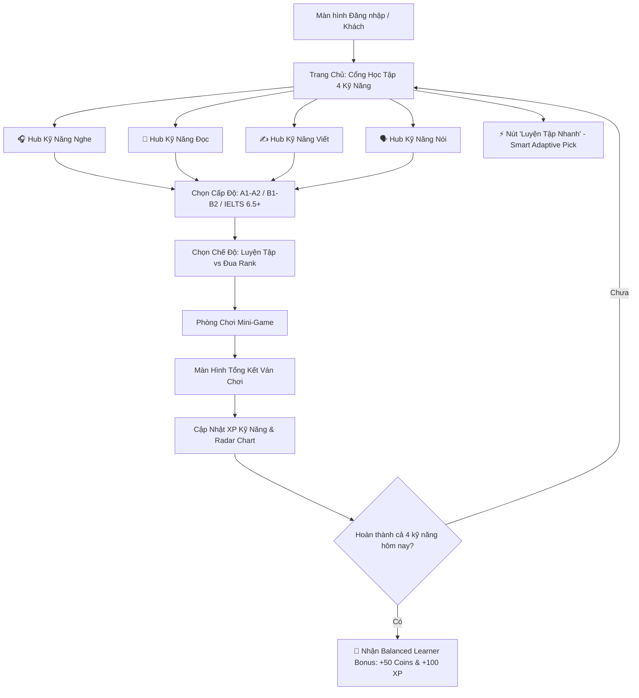
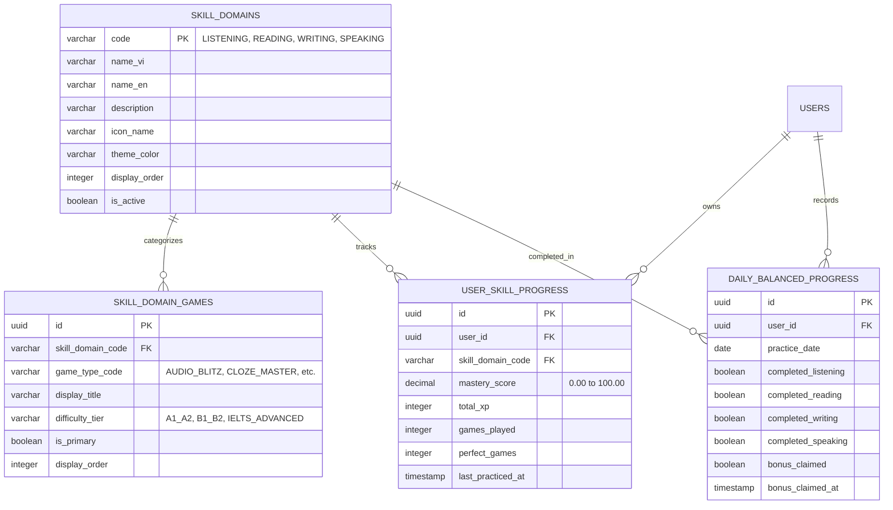

# Đặc Tả Nghiệp Vụ & Thiết Kế Chức Năng: Cổng Học Tập 4 Kỹ Năng & Hệ Thống Mini-Game Theo Chủ Đề (4-Skills Gamified Learning Hub)

**Mã tài liệu:** `SPEC-FOUR-SKILLS-HUB-V1`  
**Phiên bản:** 1.0  
**Tác giả:** Senior Product Business Analyst (Product BA)  
**Người nhận bàn giao:** Tech Lead / Architect (`11dba413-036f-4ce1-950e-252419384dce`), UI/UX Designer, Senior Fullstack Engineer, QA Team  
**Ngày ban hành:** 29/09/2026  
**Trạng thái:** Đã hoàn thiện - Sẵn sàng chuyển giao thiết kế UI/UX & kiến trúc kỹ thuật  

---

## 1. Bối Cảnh, Mục Tiêu Sản Phẩm & Định Hướng Cải Tiến (Product Vision & Benchmarking)

### 1.1. Thực Trạng & Điểm Nghẽn Của Kiến Trúc Cũ (Problem Statement)
Trong phiên bản MVP ban đầu, ứng dụng hiển thị trực tiếp danh sách các mini-game (Word Match, Speed Falling Word, Sentence Scramble) ngay tại trang chủ. Mô hình này bộc lộ những nhược điểm lớn trong trải nghiệm người dùng (UX) và phương pháp sư phạm:
1. **Thiếu tính định hướng sư phạm (Lack of Learning Orientation):** Người học bị "ngợp" trước các trò chơi mà không hiểu rõ mình chơi game này để cải thiện kỹ năng gì trong 4 kỹ năng chuẩn quốc tế (**Nghe - Nói - Đọc - Viết**).
2. **Học tập lệch pha (Unbalanced Skill Development):** Người dùng có xu hướng chỉ chơi mãi 1 game dễ (ví dụ: Word Match) và bỏ quên các kỹ năng quan trọng nhưng thử thách hơn như Nghe (Listening) hay Nói (Speaking).
3. **Giảm chỉ số gắn kết đường dài (Long-term Retention Drop):** Cảm giác vào một "Arcade giải trí" hơn là một "Nền tảng học tiếng Anh bài bản", dẫn đến người học nhanh chán sau 3–5 ngày khi tính mới mẻ của game giảm dần.

### 1.2. Định Hướng Đột Phá: Mô Hình Cổng 4 Kỹ Năng (4-Skills Learning Hub)
Học hỏi từ nghiên cứu thực tế tại **The IELTS Dictionary (theieltsdictionary.com - TID)** — nền tảng luyện thi hàng đầu với phân định 4 kỹ năng rõ rệt kết hợp phương pháp khoa học (*Spaced Repetition, Shadowing, Contextual Cloze, Dictation*), ứng dụng quyết định tái cấu trúc toàn diện hành trình người dùng:

> **Quy tắc cốt lõi (Core UX Rule):**  
> Khi người dùng truy cập vào ứng dụng (Landing / Home Dashboard), **tuyệt đối KHÔNG hiển thị danh sách game trực tiếp**. Thay vào đó, người dùng được chào đón bởi **Cổng Trung Tâm 4 Kỹ Năng (4-Skills Learning Hub)**:
> 1. 🎧 **Nghe (Listening)**
> 2. 📖 **Đọc (Reading)**
> 3. ✍️ **Viết (Writing)**
> 4. 🗣️ **Nói (Speaking)**

Mỗi kỹ năng đóng vai trò là một "Học viện chuyên sâu" (Skill Domain), cung cấp:
- Lộ trình tiến độ cá nhân hóa (Skill Mastery % & Level riêng biệt).
- Biểu đồ mạng nhện đánh giá độ cân bằng 4 kỹ năng (Skill Radar Chart).
- Danh mục các mini-game được phân loại và tối ưu hóa riêng cho kỹ năng đó.
- Hai chế độ linh hoạt: **Chế độ Luyện tập (Practice Mode - Học sâu, không áp lực)** và **Chế độ Thử thách Đua rank (Arcade / Ranked Mode - Tính giờ, combo, mất mạng)**.

---

## 2. Kiến Trúc Thông Tin (IA) & Trải Nghiệm Người Dùng (UX Flow)

### 2.1. Sơ Đồ Điều Hướng Tổng Thể (User Navigation Flow)



### 2.2. Wireframe Giao Diện Trang Chủ (4-Skills Dashboard Wireframe)

```
+---------------------------------------------------------------------------------------------------+
|  [Logo] LEARN ENGLISH       [🔥 Streak: 7 Ngày]   [💰 350 Coins]   [⭐ Cấp 12 - Intermediate]   [User] |
+---------------------------------------------------------------------------------------------------+
|                                                                                                   |
|   👋 Chào Minh! Hôm nay bạn muốn nâng cấp kỹ năng nào?                                            |
|   "Thành công là tổng hòa của những nỗ lực nhỏ được lặp lại mỗi ngày."                             |
|                                                                                                   |
|   +---------------------------------------+   +-----------------------------------------------+   |
|   | 📊 MA TRẬN 4 KỸ NĂNG CỦA BẠN          |   | 🎯 NHIỆM VỤ CÂN BẰNG HÔM NAY (BALANCED QUEST) |   |
|   |                                       |   |                                               |   |
|   |               [Nói] 45%               |   |   [x] 🎧 Nghe: Đã hoàn thành 1 bài (+20 XP)   |   |
|   |                  / \                  |   |   [x] 📖 Đọc: Đã hoàn thành 1 bài (+20 XP)    |   |
|   |         70%     /   \     80%         |   |   [ ] ✍️ Viết: Chưa hoàn thành (0/1)           |   |
|   |       [Viết] --+-----+-- [Đọc]        |   |   [ ] 🗣️ Nói: Chưa hoàn thành (0/1)           |   |
|   |                 \   /                 |   |                                               |   |
|   |                  \ /                  |   |   🎁 Phần thưởng hoàn thành cả 4 kỹ năng:     |   |
|   |               [Nghe] 85%              |   |   [ +50 Coins  |  +100 XP  |  Huy Hiệu 4K ]   |   |
|   |                                       |   |                                               |   |
|   |   💡 Gợi ý: Kỹ năng [Nói] của bạn     |   |   [⚡ LUYỆN TẬP BÙ KỸ NĂNG YẾU (SMART PICK)]  |   |
|   |   đang cần được rèn luyện thêm!       |   |                                               |   |
|   +---------------------------------------+   +-----------------------------------------------+   |
|                                                                                                   |
|   ============================ CHỌN CHỦ ĐỀ KỸ NĂNG ĐỂ BẮT ĐẦU ============================        |
|                                                                                                   |
|   +--------------------------+  +--------------------------+  +-------------------------------+   |
|   | 🎧 KỸ NĂNG NGHE          |  | 📖 KỸ NĂNG ĐỌC           |  | ✍️ KỸ NĂNG VIẾT               |   |
|   | (Listening Academy)      |  | (Reading Academy)        |  | (Writing Academy)             |   |
|   |                          |  |                          |  |                               |   |
|   | • 4 Mini-games           |  | • 4 Mini-games           |  | • 4 Mini-games                |   |
|   | • Tiến độ: 85% Mastery   |  | • Tiến độ: 80% Mastery   |  | • Tiến độ: 70% Mastery        |   |
|   | • Cấp độ: Master Ear     |  | • Cấp độ: Sharp Reader   |  | • Cấp độ: Word Crafter        |   |
|   |                          |  |                          |  |                               |   |
|   | [ 🚀 KHÁM PHÁ HUB NGHE ] |  | [ 🚀 KHÁM PHÁ HUB ĐỌC ]  |  | [ 🚀 KHÁM PHÁ HUB VIẾT ]      |   |
|   +--------------------------+  +--------------------------+  +-------------------------------+   |
|                                                                                                   |
|   +--------------------------+  +-------------------------------------------------------------+   |
|   | 🗣️ KỸ NĂNG NÓI           |  | 🏆 BẢNG XẾP HẠNG TOÀN DIỆN (OVERALL 4-SKILLS LEADERBOARD)    |   |
|   | (Speaking Academy)       |  |                                                             |   |
|   |                          |  |  1. 🥇 Alex Nguyen   - 4,200 XP (Đồng đều 4 kỹ năng 95%+)   |   |
|   | • 4 Mini-games           |  |  2. 🥈 Tran Linh     - 3,850 XP                             |   |
|   | • Tiến độ: 45% Mastery   |  |  3. 🥉 Pham Hoang    - 3,420 XP                             |   |
|   | • Cấp độ: Apprentice     |  |  ...                                                        |   |
|   |                          |  |  42. Bạn (Minh)      - 1,650 XP [Top 15%]                   |   |
|   | [ 🚀 KHÁM PHÁ HUB NÓI ]  |  |                                                             |   |
|   +--------------------------+  +-------------------------------------------------------------+   |
+---------------------------------------------------------------------------------------------------+
```

### 2.3. Wireframe Giao Diện Chi Tiết Từng Kỹ Năng (Skill Domain Hub Wireframe)

```
+---------------------------------------------------------------------------------------------------+
|  [<- Quay lại Trang Chủ]      🎧 TRUNG TÂM LUYỆN NGHE (LISTENING ACADEMY)        [Hỗ trợ / Quy tắc] |
+---------------------------------------------------------------------------------------------------+
|                                                                                                   |
|   Bộ lọc cấp độ:  (•) Tất cả   ( ) Cơ bản (A1-A2)   ( ) Trung cấp (B1-B2)   ( ) Học thuật (IELTS) |
|                                                                                                   |
|   +-------------------------------------------------------------------------------------------+   |
|   | 1. AUDIO BLITZ (Nghe & Điền Chính Tả)                           [Độ khó: ⭐⭐]  [HOT 🔥]   |   |
|   | Nghe phát âm native chuẩn US/UK, quan sát phiên âm IPA và gõ/chạm đúng chính tả từ vựng.   |   |
|   | Kỹ năng rèn luyện: Nhận diện âm vị, chính tả từ khó (Spelling accuracy).                 |   |
|   | [ Chơi Luyện Tập (Không tính giờ) ]         [ ⚡ Chơi Thử Thách Đua Rank (3 Tim, Tính giờ) ] |   |
|   +-------------------------------------------------------------------------------------------+   |
|                                                                                                   |
|   +-------------------------------------------------------------------------------------------+   |
|   | 2. DICTATION DASH (Chép Chính Tả Biểu Mẫu & Số Liệu - Inspired by TID)   [Độ khó: ⭐⭐⭐] |   |
|   | Nghe đoạn audio ngắn, bắt thông tin then chốt: Số điện thoại, ngày tháng, tên riêng, giá tiền|   |
|   | Kỹ năng rèn luyện: Bắt keyword trong ngữ cảnh thực tế (IELTS Listening Part 1-2).         |   |
|   | [ Chơi Luyện Tập (Không tính giờ) ]         [ ⚡ Chơi Thử Thách Đua Rank (3 Tim, Tính giờ) ] |   |
|   +-------------------------------------------------------------------------------------------+   |
|                                                                                                   |
|   +-------------------------------------------------------------------------------------------+   |
|   | 3. SPEED AUDIO MATCH (Phản Xạ Âm Thanh Siêu Tốc)                 [Độ khó: ⭐]             |   |
|   | Nghe 1 từ/cụm từ trong 3 giây và chọn nhanh hình ảnh hoặc nghĩa tiếng Việt tương ứng.       |   |
|   | Kỹ năng rèn luyện: Phản xạ âm thanh trực tiếp không qua dịch nhẩm.                        |   |
|   | [ Chơi Luyện Tập (Không tính giờ) ]         [ ⚡ Chơi Thử Thách Đua Rank (3 Tim, Tính giờ) ] |   |
|   +-------------------------------------------------------------------------------------------+   |
|                                                                                                   |
|   +-------------------------------------------------------------------------------------------+   |
|   | 4. SHADOWING BEAT (Luyện Nhại Giọng Ngắt Nhịp - Inspired by TID)         [Độ khó: ⭐⭐⭐] |   |
|   | Lắng nghe câu ngắn có ngữ điệu bản xứ và nhại lại ngay lập tức theo sóng âm.             |   |
|   | Kỹ năng rèn luyện: Nối âm, nuốt âm, nhịp điệu phát âm tự nhiên.                           |   |
|   | [ Chơi Luyện Tập (Không tính giờ) ]         [ ⚡ Chơi Thử Thách Đua Rank (3 Tim, Tính giờ) ] |   |
|   +-------------------------------------------------------------------------------------------+   |
+---------------------------------------------------------------------------------------------------+
```

---

## 3. Ma Trận Phân Bổ Mini-Game Theo 4 Chủ Đề Kỹ Năng

Hệ thống sở hữu danh mục 16 mini-game được phân loại chuẩn hóa theo 4 trụ cột kỹ năng:

| Kỹ Năng (Domain) | Tên Mini-Game | Mã Game | Trọng Tâm Sư Phạm | Thời Lượng | Chế Độ Khả Dụng |
| :--- | :--- | :--- | :--- | :--- | :--- |
| **🎧 NGHE (Listening)** | **Audio Blitz** | `AUDIO_BLITZ` | Nhận diện âm vị, chính tả từ khó | 15s/từ | Practice / Ranked |
| | **Dictation Dash** *(Mới)* | `DICTATION_DASH` | Bắt số liệu, tên riêng, keyword biểu mẫu | 30s/câu | Practice / Ranked |
| | **Speed Audio Match** *(Mới)* | `SPEED_AUDIO_MATCH` | Phản xạ âm thanh trực tiếp (Audio Reflex) | 5s/từ | Practice / Ranked |
| | **Shadowing Beat** *(Mới)* | `SHADOWING_BEAT` | Nhại giọng, nối âm, nhịp điệu câu | 20s/câu | Practice / Ranked |
| **📖 ĐỌC (Reading)** | **Word Match** | `WORD_MATCH` | Nhận diện mặt chữ & nghĩa ngữ cảnh | 60s/ván | Practice / Ranked |
| | **Speed Falling Word** | `FALLING_WORDS` | Phản xạ nghĩa từ dưới áp lực thời gian | 90s/ván | Practice / Ranked |
| | **Cloze Master** | `CLOZE_MASTER` | Điền từ vào ngữ cảnh câu & Collocation | 20s/câu | Practice / Ranked |
| | **Skim & Scan Sprint** *(Mới)*| `SKIM_SCAN_SPRINT` | Đọc lướt nhanh tìm chi tiết True/False | 35s/đoạn | Practice / Ranked |
| **✍️ VIẾT (Writing)** | **Sentence Scramble** | `SENTENCE_SCRAMBLE`| Cú pháp câu, vị trí trạng từ & mệnh đề | 120s/ván| Practice / Ranked |
| | **Grammar Detective** | `GRAMMAR_DETECTIVE`| Bắt lỗi ngữ pháp: thì, mạo từ, chủ vị | 60s/vụ án| Practice / Ranked |
| | **Collocation Chain** *(Mới)* | `COLLOCATION_CHAIN`| Ghép cụm từ học thuật C1/C2 (Academic Collocations) | 15s/cụm | Practice / Ranked |
| | **Paraphrase Rush** *(Mới)* | `PARAPHRASE_RUSH` | Kỹ năng viết lại câu học thuật đa dạng | 30s/câu | Practice / Ranked |
| **🗣️ NÓI (Speaking)** | **Minimal Pairs Duel** *(Mới)*| `MINIMAL_PAIRS` | Phân biệt cặp âm dễ nhầm (/iː/-/ɪ/, /s/-/ʃ/) | 10s/cặp | Practice / Ranked |
| | **Word Stress Hunter** *(Mới)*| `STRESS_HUNTER` | Xác định trọng âm từ vựng 2-4 âm tiết | 12s/từ | Practice / Ranked |
| | **Intonation Curve** *(Mới)* | `INTONATION_CURVE` | Nhận diện ngữ điệu Lên (Rising) / Xuống (Falling)| 15s/câu | Practice / Ranked |
| | **45-Sec Fluency Sprint** *(Mới)*| `FLUENCY_SPRINT` | Phản xạ nói có gợi ý từ vựng theo chủ đề | 45s/chủ đề| Practice / Ranked |

---

## 4. Chi Tiết Gameplay, Win/Lose Logic, Timers & Scoring Cho Các Game Mới (Cảm Hứng Từ TID)

### 4.1. Kỹ Năng Nghe: `DICTATION_DASH` (Chép Chính Tả Biểu Mẫu)
- **Cơ chế gameplay:**
  - Lấy cảm hứng từ Section 1 của bài thi Cambridge IELTS Listening trên *theieltsdictionary.com*.
  - Người chơi lắng nghe đoạn hội thoại ngắn (10-15 giây) giữa 2 nhân vật (ví dụ: đăng ký thẻ thư viện, đặt phòng khách sạn, giao hàng).
  - Màn hình hiển thị một form biểu mẫu chứa các trường thông tin cần điền:
    - *Full Name:* `[ ______ ]`
    - *Contact Number:* `[ ______ ]`
    - *Date of Arrival:* `[ ______ ]`
  - Người chơi có thể bấm nghe lại tối đa 2 lần. Sau đó nhập dữ liệu vào ô trống.
- **Quy tắc tính điểm & Timer:**
  - Thời gian đếm ngược: 45 giây cho cả biểu mẫu (3 trường thông tin).
  - Điểm số: 100 điểm cho mỗi trường thông tin đúng chính xác (tối đa 300 điểm/câu).
  - Bỏ qua chữ hoa/chữ thường nhưng bắt buộc đúng chính tả 100% (ví dụ: "0905123456" hoặc "14th October").
  - Nếu hết thời gian hoặc sai quá 2 trường: Mất 1 mạng (ở chế độ Ranked).

### 4.2. Kỹ Năng Đọc: `SKIM_SCAN_SPRINT` (Đọc Lướt Bắt Chi Tiết True/False/Not Given)
- **Cơ chế gameplay:**
  - Lấy cảm hứng từ bài thi IELTS Reading trên TID. Thay vì bắt người học đọc cả bài dài 1000 từ gây nản lòng, game trích đoạn một **Micro-Passage** (đoạn văn cực ngắn 50–70 từ) về các đề tài thú vị (Khoa học, Lịch sử, Đời sống).
  - Bên dưới hiển thị 1 câu nhận định (Statement).
  - Người chơi phải chọn 1 trong 3 nút: `[ TRUE (Đúng) ]`, `[ FALSE (Sai) ]`, `[ NOT GIVEN (Không đề cập) ]`.
- **Quy tắc tính điểm & Timer:**
  - Timer: 30 giây đếm ngược.
  - Trả lời đúng trong 10 giây đầu: Điểm cơ bản 150 + Bonus phản xạ nhanh 50 = 200 điểm.
  - Trả lời đúng trong khoảng 11-30 giây: 150 điểm.
  - Trả lời sai: 0 điểm, mất 1 mạng, hiển thị ngay đoạn văn chứng cứ (Evidence Highlighting) để người chơi học từ lỗi sai.

### 4.3. Kỹ Năng Viết: `COLLOCATION_CHAIN` (Nối Chuỗi Cụm Từ Cố Định)
- **Cơ chế gameplay:**
  - Lấy cảm hứng từ chuyên mục "Vocab & Collocations" của TID. Người học tiếng Anh thường ghép từ theo tư duy tiếng Việt (ví dụ: "make a research" thay vì "conduct/do research", "take a decision" thay vì "make a decision").
  - Màn hình xuất hiện từ gốc ở trung tâm (ví dụ: `DECISION`) và 4 vệ tinh quay xung quanh chứa các động từ/tính từ: `[ Do ]`, `[ Make ]`, `[ Take ]`, `[ Create ]`.
  - Người chơi phải kéo từ đúng vào tâm hoặc bấm chọn đáp án chuẩn xác nhất.
- **Quy tắc tính điểm & Combo:**
  - Timer: 12 giây/cụm từ (1 ván gồm 8 cụm).
  - Đúng liên tiếp kích hoạt Combo x1.5, x2.0, x3.0.
  - Sau khi chọn đúng, hiển thị câu ví dụ thực tế trong 1.5 giây kèm giải thích tại sao cụm từ đó tự nhiên.

### 4.4. Kỹ Năng Nói: `MINIMAL_PAIRS` (Đấu Sĩ Phân Biệt Cặp Âm)
- **Cơ chế gameplay:**
  - Rất nhiều người học Việt Nam phát âm sai do không phân biệt được các cặp âm phụ âm/nguyên âm tương đồng (/iː/ vs /ɪ/ trong *sheep - ship*, /l/ vs /r/ trong *light - right*, /θ/ vs /s/ trong *think - sink*).
  - Hệ thống phát âm thanh 1 từ ngẫu nhiên (chỉ nghe tiếng, không hiện chữ).
  - Màn hình hiển thị 2 thẻ từ tương tự nhau: Thẻ A (`Sheep`) và Thẻ B (`Ship`).
  - Người chơi phải bấm chọn thẻ từ có phát âm vừa nghe.
- **Quy tắc tính điểm:**
  - Timer: 8 giây/từ (1 ván gồm 10 cặp từ).
  - Tính điểm độ nhạy âm thanh: Càng bấm nhanh càng nhiều điểm.
  - Điểm thưởng "Golden Ear": Nếu đúng 10/10 câu không sai câu nào, nhận danh hiệu "Tai Vàng Phản Xạ".

---

## 5. Cơ Chế Gamification & Vòng Lặp Giữ Chân Người Dùng (Retention Feedback Loops)

### 5.1. Hệ Thống Điểm Kỹ Năng Riêng Biệt & Điểm Thông Thạo (Skill Mastery Score)
Mỗi người dùng có 4 chỉ số thông thạo kỹ năng độc lập, được tính theo thang điểm từ **0% đến 100%**:
- `ListeningMastery` (0 - 100%)
- `ReadingMastery` (0 - 100%)
- `WritingMastery` (0 - 100%)
- `SpeakingMastery` (0 - 100%)

**Công thức tính điểm Mastery:**
$$\text{Mastery}_{\text{new}} = \text{Mastery}_{\text{current}} + \Delta \text{Progress}$$
Trong đó:
- Hoàn thành 1 ván chơi đạt tỷ lệ đúng $\ge 80\%$: Tăng $+1.5\%$ đến $+3.0\%$ tùy độ khó.
- Tỷ lệ đúng $< 50\%$: Không tăng điểm (không bị trừ % để tránh tạo tâm lý tiêu cực).
- Sau 7 ngày không luyện tập kỹ năng đó: Giảm nhẹ $-1\%$ (Skill Decay) để khuyến khích duy trì học đều đặn.

### 5.2. Nhiệm Vụ Cân Bằng Hàng Ngày (Balanced Learner Daily Bonus)
Để giải quyết triệt để tình trạng học lệch:
- Mỗi ngày hệ thống đặt ra mục tiêu: **"Luyện ít nhất 1 bài ở mỗi kỹ năng (Nghe, Đọc, Viết, Nói)"**.
- Khi người chơi hoàn thành đủ 4/4 ô check:
  - 🎁 Thưởng ngay **+50 Coins**.
  - ⭐ Thưởng thêm **+100 XP Toàn năng**.
  - 🔥 Giữ vững chuỗi **Daily Streak** và tăng hệ số nhân thưởng kinh nghiệm ngày hôm sau lên `1.2x`.

### 5.3. Hệ Thống Huy Hiệu Theo Từng Kỹ Năng (Skill Badges)
Mỗi kỹ năng có 4 cấp độ danh hiệu để mở khóa:

| Kỹ Năng | Cấp 1 (Đồng - 25%) | Cấp 2 (Bạc - 50%) | Cấp 3 (Vàng - 75%) | Cấp 4 (Kim Cương - 100%) |
| :--- | :--- | :--- | :--- | :--- |
| **🎧 Nghe** | Bronze Ear | Silver Listener | Master Decoder | Ultimate Sonic Native |
| **📖 Đọc** | Word Seeker | Agile Scanner | Critical Reader | Lexical Scholar |
| **✍️ Viết** | Sentence Builder | Clause Architect | Stylistic Writer | Master Wordsmith |
| **🗣️ Nói** | Echo Apprentice | Clear Speaker | Rhythmic Voice | Native Fluency Titan |

---

## 6. Thiết Kế Cơ Sở Dữ Liệu PostgreSQL & Entity Models

### 6.1. Sơ Đồ Thực Thể Quan Hệ Bổ Sung (Mermaid ERD)



### 6.2. PostgreSQL DDL Migration Scripts

```sql
-- 1. Bảng danh mục 4 kỹ năng cốt lõi
CREATE TABLE IF NOT EXISTS skill_domains (
    code VARCHAR(20) PRIMARY KEY, -- 'LISTENING', 'READING', 'WRITING', 'SPEAKING'
    name_vi VARCHAR(100) NOT NULL,
    name_en VARCHAR(100) NOT NULL,
    description TEXT NULL,
    icon_name VARCHAR(50) NOT NULL,
    theme_color VARCHAR(30) NOT NULL, -- mã tailwind hoặc hex: 'sky-500', 'emerald-500', 'amber-500', 'rose-500'
    display_order INT NOT NULL DEFAULT 0,
    is_active BOOLEAN NOT NULL DEFAULT TRUE,
    created_at TIMESTAMP WITH TIME ZONE NOT NULL DEFAULT CURRENT_TIMESTAMP
);

-- Seed dữ liệu khởi tạo 4 kỹ năng chuẩn
INSERT INTO skill_domains (code, name_vi, name_en, description, icon_name, theme_color, display_order)
VALUES 
('LISTENING', 'Kỹ Năng Nghe', 'Listening Academy', 'Rèn luyện khả năng nhận diện âm thanh bản xứ, chép chính tả và phản xạ nghe hiểu tức thì.', 'Headphones', 'sky-500', 1),
('READING', 'Kỹ Năng Đọc', 'Reading Academy', 'Mở rộng vốn từ vựng theo ngữ cảnh, đọc lướt nắm keyword và phản xạ nhận diện nghĩa.', 'BookOpen', 'emerald-500', 2),
('WRITING', 'Kỹ Năng Viết', 'Writing Academy', 'Làm chủ cú pháp câu, cụm từ học thuật Collocations và thám tử sửa lỗi ngữ pháp.', 'PenTool', 'amber-500', 3),
('SPEAKING', 'Kỹ Năng Nói', 'Speaking Academy', 'Chuẩn hóa phát âm âm vị, đánh bắt trọng âm và luyện nhại giọng ngữ điệu tự nhiên.', 'Mic', 'rose-500', 4)
ON CONFLICT (code) DO NOTHING;

-- 2. Bảng ánh xạ Game vào từng Kỹ năng
CREATE TABLE IF NOT EXISTS skill_domain_games (
    id UUID PRIMARY KEY DEFAULT gen_random_uuid(),
    skill_domain_code VARCHAR(20) NOT NULL REFERENCES skill_domains(code) ON DELETE CASCADE,
    game_type_code VARCHAR(50) NOT NULL, -- 'AUDIO_BLITZ', 'DICTATION_DASH', 'WORD_MATCH', etc.
    display_title VARCHAR(150) NOT NULL,
    difficulty_tier VARCHAR(30) NOT NULL DEFAULT 'B1_B2', -- 'A1_A2', 'B1_B2', 'IELTS_ADVANCED'
    is_primary BOOLEAN NOT NULL DEFAULT TRUE,
    display_order INT NOT NULL DEFAULT 0,
    is_active BOOLEAN NOT NULL DEFAULT TRUE,
    CONSTRAINT uk_domain_game UNIQUE (skill_domain_code, game_type_code)
);

-- 3. Bảng lưu trữ tiến độ thông thạo của người dùng theo từng kỹ năng
CREATE TABLE IF NOT EXISTS user_skill_progress (
    id UUID PRIMARY KEY DEFAULT gen_random_uuid(),
    user_id UUID NOT NULL REFERENCES users(id) ON DELETE CASCADE,
    skill_domain_code VARCHAR(20) NOT NULL REFERENCES skill_domains(code) ON DELETE CASCADE,
    mastery_score DECIMAL(5,2) NOT NULL DEFAULT 0.00, -- Điểm thông thạo từ 0.00% đến 100.00%
    total_xp INT NOT NULL DEFAULT 0,
    games_played INT NOT NULL DEFAULT 0,
    perfect_games INT NOT NULL DEFAULT 0,
    last_practiced_at TIMESTAMP WITH TIME ZONE NULL,
    updated_at TIMESTAMP WITH TIME ZONE NOT NULL DEFAULT CURRENT_TIMESTAMP,
    CONSTRAINT uk_user_skill UNIQUE (user_id, skill_domain_code)
);
CREATE INDEX idx_user_skill_progress ON user_skill_progress(user_id, skill_domain_code);

-- 4. Bảng theo dõi mục tiêu học toàn diện 4 kỹ năng trong ngày (Balanced Learner Daily Progress)
CREATE TABLE IF NOT EXISTS daily_balanced_progress (
    id UUID PRIMARY KEY DEFAULT gen_random_uuid(),
    user_id UUID NOT NULL REFERENCES users(id) ON DELETE CASCADE,
    practice_date DATE NOT NULL DEFAULT CURRENT_DATE,
    completed_listening BOOLEAN NOT NULL DEFAULT FALSE,
    completed_reading BOOLEAN NOT NULL DEFAULT FALSE,
    completed_writing BOOLEAN NOT NULL DEFAULT FALSE,
    completed_speaking BOOLEAN NOT NULL DEFAULT FALSE,
    bonus_claimed BOOLEAN NOT NULL DEFAULT FALSE,
    bonus_claimed_at TIMESTAMP WITH TIME ZONE NULL,
    updated_at TIMESTAMP WITH TIME ZONE NOT NULL DEFAULT CURRENT_TIMESTAMP,
    CONSTRAINT uk_user_daily_balanced UNIQUE (user_id, practice_date)
);
CREATE INDEX idx_daily_balanced_user_date ON daily_balanced_progress(user_id, practice_date);
```

### 6.3. C# Entity Framework Core Classes (.NET 8)

```csharp
namespace LearnEnglish.Api.Domain.Entities
{
    public class SkillDomain
    {
        public string Code { get; set; } = null!; // LISTENING, READING, WRITING, SPEAKING
        public string NameVi { get; set; } = null!;
        public string NameEn { get; set; } = null!;
        public string? Description { get; set; }
        public string IconName { get; set; } = null!;
        public string ThemeColor { get; set; } = null!;
        public int DisplayOrder { get; set; }
        public bool IsActive { get; set; } = true;
        public DateTime CreatedAt { get; set; } = DateTime.UtcNow;

        public virtual ICollection<SkillDomainGame> Games { get; set; } = new List<SkillDomainGame>();
        public virtual ICollection<UserSkillProgress> UserProgresses { get; set; } = new List<UserSkillProgress>();
    }

    public class SkillDomainGame
    {
        public Guid Id { get; set; } = Guid.NewGuid();
        public string SkillDomainCode { get; set; } = null!;
        public string GameTypeCode { get; set; } = null!;
        public string DisplayTitle { get; set; } = null!;
        public string DifficultyTier { get; set; } = "B1_B2";
        public bool IsPrimary { get; set; } = true;
        public int DisplayOrder { get; set; }
        public bool IsActive { get; set; } = true;

        public virtual SkillDomain SkillDomain { get; set; } = null!;
    }

    public class UserSkillProgress
    {
        public Guid Id { get; set; } = Guid.NewGuid();
        public Guid UserId { get; set; }
        public string SkillDomainCode { get; set; } = null!;
        public decimal MasteryScore { get; set; } = 0.00m;
        public int TotalXp { get; set; }
        public int GamesPlayed { get; set; }
        public int PerfectGames { get; set; }
        public DateTime? LastPracticedAt { get; set; }
        public DateTime UpdatedAt { get; set; } = DateTime.UtcNow;

        public virtual SkillDomain SkillDomain { get; set; } = null!;
    }

    public class DailyBalancedProgress
    {
        public Guid Id { get; set; } = Guid.NewGuid();
        public Guid UserId { get; set; }
        public DateOnly PracticeDate { get; set; }
        public bool CompletedListening { get; set; }
        public bool CompletedReading { get; set; }
        public bool CompletedWriting { get; set; }
        public bool CompletedSpeaking { get; set; }
        public bool BonusClaimed { get; set; }
        public DateTime? BonusClaimedAt { get; set; }
        public DateTime UpdatedAt { get; set; } = DateTime.UtcNow;
    }
}
```

### 6.4. TypeScript Interfaces (Frontend)

```typescript
export type SkillDomainCode = 'LISTENING' | 'READING' | 'WRITING' | 'SPEAKING';

export interface SkillDomainDto {
  code: SkillDomainCode;
  nameVi: string;
  nameEn: string;
  description: string;
  iconName: string;
  themeColor: string;
  displayOrder: number;
  masteryScore: number; // 0 - 100
  totalXp: number;
  gamesPlayed: number;
  badgeLevel: 'Bronze' | 'Silver' | 'Gold' | 'Diamond';
}

export interface SkillDomainGameDto {
  id: string;
  skillDomainCode: SkillDomainCode;
  gameTypeCode: string;
  displayTitle: string;
  difficultyTier: 'A1_A2' | 'B1_B2' | 'IELTS_ADVANCED';
  isPrimary: boolean;
  displayOrder: number;
}

export interface DailyBalancedStatusDto {
  practiceDate: string;
  completedListening: boolean;
  completedReading: boolean;
  completedWriting: boolean;
  completedSpeaking: boolean;
  completedCount: number; // 0 đến 4
  allCompleted: boolean;
  bonusClaimed: boolean;
  rewardCoins: number;
  rewardXp: number;
}

export interface SkillRadarDto {
  listening: number;
  reading: number;
  writing: number;
  speaking: number;
  weakestSkill: SkillDomainCode;
  strongestSkill: SkillDomainCode;
  recommendedGameCode: string;
  recommendedGameTitle: string;
}
```

---

## 7. Thiết Kế Hợp Đồng API RESTful (API Endpoints & Contracts)

### 7.1. Danh Sách Endpoints Mới

| Method | Endpoint | Quyền Hạn | Mô Tả Chức Năng |
| :--- | :--- | :--- | :--- |
| `GET` | `/api/v1/skills` | Public / Auth | Lấy danh sách 4 kỹ năng kèm tiến độ, điểm Mastery & Radar của người dùng |
| `GET` | `/api/v1/skills/{domainCode}` | Public / Auth | Lấy thông tin chi tiết của 1 kỹ năng kèm danh sách các game thuộc kỹ năng đó |
| `GET` | `/api/v1/skills/daily-status` | Auth / Guest | Lấy trạng thái hoàn thành 4 kỹ năng trong ngày và tiến trình nhận Balanced Bonus |
| `POST` | `/api/v1/skills/claim-balanced-bonus` | Auth / Guest | Nhận thưởng Balanced Learner Bonus (+50 Coins, +100 XP) khi đủ 4 kỹ năng |
| `GET` | `/api/v1/skills/recommended` | Auth / Guest | Trả về gợi ý mini-game phù hợp nhất dựa trên kỹ năng yếu nhất của người dùng |

### 7.2. Chi Tiết Request / Response Payloads

#### `GET /api/v1/skills`
**Response (200 OK):**
```json
{
  "skills": [
    {
      "code": "LISTENING",
      "nameVi": "Kỹ Năng Nghe",
      "nameEn": "Listening Academy",
      "description": "Rèn luyện khả năng nhận diện âm thanh bản xứ và chép chính tả.",
      "iconName": "Headphones",
      "themeColor": "sky-500",
      "masteryScore": 85.0,
      "totalXp": 1250,
      "gamesPlayed": 42,
      "badgeLevel": "Master Decoder"
    },
    {
      "code": "READING",
      "nameVi": "Kỹ Năng Đọc",
      "nameEn": "Reading Academy",
      "description": "Mở rộng vốn từ vựng ngữ cảnh và đọc lướt nắm keyword.",
      "iconName": "BookOpen",
      "themeColor": "emerald-500",
      "masteryScore": 80.0,
      "totalXp": 1100,
      "gamesPlayed": 38,
      "badgeLevel": "Critical Reader"
    },
    {
      "code": "WRITING",
      "nameVi": "Kỹ Năng Viết",
      "nameEn": "Writing Academy",
      "description": "Làm chủ cú pháp câu, collocations và thám tử sửa lỗi.",
      "iconName": "PenTool",
      "themeColor": "amber-500",
      "masteryScore": 70.0,
      "totalXp": 850,
      "gamesPlayed": 25,
      "badgeLevel": "Clause Architect"
    },
    {
      "code": "SPEAKING",
      "nameVi": "Kỹ Năng Nói",
      "nameEn": "Speaking Academy",
      "description": "Chuẩn hóa phát âm âm vị, đánh bắt trọng âm và ngữ điệu.",
      "iconName": "Mic",
      "themeColor": "rose-500",
      "masteryScore": 45.0,
      "totalXp": 320,
      "gamesPlayed": 12,
      "badgeLevel": "Echo Apprentice"
    }
  ],
  "radar": {
    "listening": 85.0,
    "reading": 80.0,
    "writing": 70.0,
    "speaking": 45.0,
    "weakestSkill": "SPEAKING",
    "strongestSkill": "LISTENING",
    "recommendedGameCode": "MINIMAL_PAIRS",
    "recommendedGameTitle": "Minimal Pairs Duel (Đấu Sĩ Cặp Âm)"
  }
}
```

---

## 8. JSON Schema & Sample Mock Data Cho Mini-Games Tiêu Biểu Theo Kỹ Năng

### 8.1. Kỹ Năng Nghe: `DICTATION_DASH` (Chép Chính Tả Biểu Mẫu)
**JSON Schema:**
```json
{
  "$schema": "https://json-schema.org/draft/2020-12/schema",
  "title": "DictationDashQuestion",
  "type": "object",
  "required": ["id", "audioUrl", "contextTitle", "scenarioDescription", "fields"],
  "properties": {
    "id": { "type": "string", "format": "uuid" },
    "audioUrl": { "type": "string", "format": "uri" },
    "contextTitle": { "type": "string" },
    "scenarioDescription": { "type": "string" },
    "timeLimitSeconds": { "type": "integer", "default": 45 },
    "fields": {
      "type": "array",
      "items": {
        "type": "object",
        "required": ["fieldKey", "label", "expectedAnswers", "hint"],
        "properties": {
          "fieldKey": { "type": "string" },
          "label": { "type": "string" },
          "expectedAnswers": { 
            "type": "array", 
            "items": { "type": "string" } 
          },
          "hint": { "type": "string" }
        }
      }
    }
  }
}
```

**Sample Mock Data:**
```json
{
  "id": "a1b2c3d4-e5f6-4a7b-8c9d-0e1f2a3b4c5d",
  "audioUrl": "https://cdn.learnenglish.app/audio/dictation/hotel_booking_01.mp3",
  "contextTitle": "Khách sạn Sunrise: Phiếu Đặt Phòng",
  "scenarioDescription": "Bạn hãy lắng nghe cuộc điện thoại đặt phòng khách sạn và hoàn thành các thông tin còn thiếu dưới đây:",
  "timeLimitSeconds": 45,
  "fields": [
    {
      "fieldKey": "guest_name",
      "label": "Tên khách hàng (Customer Name):",
      "expectedAnswers": ["Arthur Pendelton", "Arthur Pendleton"],
      "hint": "Nghe kỹ cách đánh vần họ của khách (P-E-N-D-E-L-T-O-N)"
    },
    {
      "fieldKey": "phone_number",
      "label": "Số điện thoại liên hệ (Phone):",
      "expectedAnswers": ["07945821903", "0794 5821 903"],
      "hint": "Số điện thoại di động Anh gồm 11 chữ số"
    },
    {
      "fieldKey": "room_type",
      "label": "Loại phòng (Room Type):",
      "expectedAnswers": ["Deluxe Suite", "Deluxe"],
      "hint": "Phòng có hướng nhìn ra biển"
    }
  ]
}
```

### 8.2. Kỹ Năng Đọc: `SKIM_SCAN_SPRINT` (Đọc Lướt Bắt Chi Tiết)
**Sample Mock Data:**
```json
{
  "id": "b2c3d4e5-f6a7-4b8c-9d0e-1f2a3b4c5d6e",
  "topic": "Environmental Science",
  "passage": "Honeybees communicate the location of floral resources through a specialized sequence of movements known as the waggle dance. By running in a figure-eight pattern and vibrating their abdomen, the duration of the central waggle run correlates directly to the distance of the food source, with one second indicating approximately one kilometer.",
  "statement": "The longer the waggle run lasts, the further away the food source is located.",
  "correctAnswer": "TRUE",
  "explanation": "Đoạn văn nêu rõ: 'the duration of the central waggle run correlates directly to the distance of the food source' (thời lượng tỷ lệ thuận trực tiếp với khoảng cách). Do đó nhận định này hoàn toàn đúng (TRUE).",
  "timeLimitSeconds": 30
}
```

### 8.3. Kỹ Năng Viết: `COLLOCATION_CHAIN` (Chuỗi Cụm Từ Học Thuật)
**Sample Mock Data:**
```json
{
  "id": "c3d4e5f6-a7b8-4c9d-0e1f-2a3b4c5d6e7f",
  "targetWord": "RESEARCH",
  "wordType": "Noun",
  "vietnameseMeaning": "Nghiên cứu khoa học",
  "prompt": "Chọn động từ học thuật tự nhiên nhất đi kèm với 'RESEARCH' trong văn phong học thuật:",
  "options": [
    { "text": "Conduct", "isCorrect": true, "nuance": "Chuẩn mực học thuật C1/C2 (to conduct research)" },
    { "text": "Make", "isCorrect": false, "nuance": "Lỗi sai phổ biến do dịch từ tiếng Việt 'làm nghiên cứu'" },
    { "text": "Create", "isCorrect": false, "nuance": "Không dùng để nói về việc tiến hành nghiên cứu" },
    { "text": "Perform", "isCorrect": false, "nuance": "Chấp nhận được nhưng thường dùng cho 'experiment/surgery' hơn" }
  ],
  "exampleSentence": "The university is planning to conduct extensive research into renewable energy sources.",
  "timeLimitSeconds": 15
}
```

### 8.4. Kỹ Năng Nói: `MINIMAL_PAIRS` (Phân Biệt Cặp Âm)
**Sample Mock Data:**
```json
{
  "id": "d4e5f6a7-b8c9-4d0e-1f2a-3b4c5d6e7f8a",
  "phonemeFocus": "/iː/ vs /ɪ/",
  "audioUrl": "https://cdn.learnenglish.app/audio/phonemes/sheep_01.mp3",
  "playedWord": "sheep",
  "options": [
    {
      "word": "sheep",
      "ipa": "/ʃiːp/",
      "meaningVi": "Con cừu (Nguyên âm dài /iː/)",
      "isCorrect": true
    },
    {
      "word": "ship",
      "ipa": "/ʃɪp/",
      "meaningVi": "Con tàu (Nguyên âm ngắn /ɪ/)",
      "isCorrect": false
    }
  ],
  "distinctionTip": "Âm /iː/ trong 'sheep' khóe miệng kéo bè sang hai bên như đang cười; âm /ɪ/ trong 'ship' khẩu hình miệng thả lỏng và phát âm dứt khoát ngắn hơn.",
  "timeLimitSeconds": 8
}
```

---

## 9. Tiêu Chí Nghiệm Thu (Acceptance Criteria - Given-When-Then)

### Kịch Bản 1: Điều Hướng Cổng 4 Kỹ Năng Tại Trang Chủ
- **Given** người dùng truy cập vào trang chủ của ứng dụng (dù là Khách hay đã Đăng nhập),
- **When** màn hình tải hoàn tất,
- **Then** hệ thống **KHÔNG hiển thị danh sách game trực tiếp**, mà hiển thị **4 Thẻ Kỹ Năng lớn**: 🎧 Nghe, 📖 Đọc, ✍️ Viết, 🗣️ Nói kèm Biểu đồ Radar Năng Lực 4 Kỹ Năng và Mục Tiêu Cân Bằng Hàng Ngày (Balanced Quest).

### Kịch Bản 2: Xem Chi Tiết Kỹ Năng & Lọc Danh Sách Game
- **Given** người dùng đang ở Trang chủ Cổng 4 Kỹ Năng,
- **When** người dùng bấm vào thẻ "🎧 Kỹ Năng Nghe (Listening Academy)",
- **Then** ứng dụng chuyển hướng đến URL `/skills/listening`, hiển thị đúng các mini-game trực thuộc kỹ năng Nghe (`Audio Blitz`, `Dictation Dash`, `Speed Audio Match`, `Shadowing Beat`) cùng bộ lọc cấp độ (`A1-A2`, `B1-B2`, `IELTS 6.5+`).

### Kịch Bản 3: Gợi Ý Thông Minh Dựa Trên Kỹ Năng Yếu Nhất (Smart Pick)
- **Given** người dùng có điểm Mastery của 4 kỹ năng lần lượt là: Nghe (85%), Đọc (80%), Viết (70%), Nói (45%),
- **When** người dùng nhìn vào Widget Radar Chart hoặc bấm nút "⚡ Luyện tập thông minh",
- **Then** hệ thống tự động đánh dấu kỹ năng **Nói (45%)** là kỹ năng yếu nhất và đề xuất người dùng vào ngay mini-game `MINIMAL_PAIRS` hoặc `STRESS_HUNTER`.

### Kịch Bản 4: Nhận Thưởng Cân Bằng Toàn Diện (Balanced Learner Bonus)
- **Given** trong ngày hôm nay người dùng đã hoàn thành ít nhất 1 bài chơi ở kỹ năng Nghe, Đọc, Viết,
- **When** người dùng hoàn thành thêm 1 bài chơi ở kỹ năng Nói (đạt 4/4 kỹ năng trong ngày),
- **Then** hệ thống tự động kích hoạt hiệu ứng pháo hoa chúc mừng, cập nhật `completed_speaking = true`, mở khóa nút "Nhận thưởng Balanced Bonus (+50 Coins & +100 XP)", và ghi nhận vào bảng `daily_balanced_progress`.

### Kịch Bản 5: Phân Định Chế Độ Luyện Tập (Practice) vs Đua Rank (Ranked)
- **Given** người dùng chọn mini-game bất kỳ trong một Kỹ năng,
- **When** người dùng bấm "Chơi Luyện Tập" (Practice Mode),
- **Then** trò chơi không áp dụng đồng hồ đếm ngược gấp gáp, không trừ mạng tim khi sai, cho phép xem gợi ý từ điển và giải thích ngữ pháp chi tiết.
- **When** người dùng bấm "Chơi Thử Thách Đua Rank" (Ranked Mode),
- **Then** trò chơi kích hoạt 3 mạng tim ($\heartsuit\heartsuit\heartsuit$), thanh đếm ngược thời gian và hệ thống nhân điểm Combo Streak.

---

## 10. Kế Hoạch Chuyển Giao & Phân Công Nhiệm Vụ Tiếp Theo

| Vai Trò | Trách Nhiệm Cụ Thể | Sản Phẩm Bàn Giao Mong Đợi |
| :--- | :--- | :--- |
| **Tech Lead / Architect** | 1. Thiết kế kiến trúc Entity Framework Core DbContext và Migrations theo DDL trên.<br>2. Thiết kế Controller `/api/v1/skills/*` và cơ chế tính toán Radar Chart.<br>3. Điều phối phân công lập trình Frontend & Backend. | `docs/architecture/four-skills-architecture.md` & Task Breakdown |
| **UI/UX Designer** | 1. Lên giao diện Dashboard 4 Kỹ Năng với bảng màu Tailwind quy định (`sky-500`, `emerald-500`, `amber-500`, `rose-500`).<br>2. Thiết kế Component Radar Chart SVG / Canvas tương tác mượt mà.<br>3. Thiết kế Modal chúc mừng Balanced Learner Bonus. | `docs/design/four-skills-ui-tokens.md` & React Component Specs |
| **Fullstack Engineer** | 1. Triển khai backend migrations, models, services và controllers.<br>2. Xây dựng trang `/skills` và các trang con `/skills/{code}` trên React Vite. | Pull Request Fullstack tính năng 4 Kỹ năng |
| **QA Team** | 1. Dựa trên 5 kịch bản Given-When-Then tại Mục 9 để viết Test Cases kiểm thử chức năng và luồng điều hướng.<br>2. Kiểm thử bảo toàn dữ liệu khi chơi ở chế độ Khách rồi đăng ký tài khoản. | Báo cáo kiểm thử chất lượng (QA Sign-off Report) |
