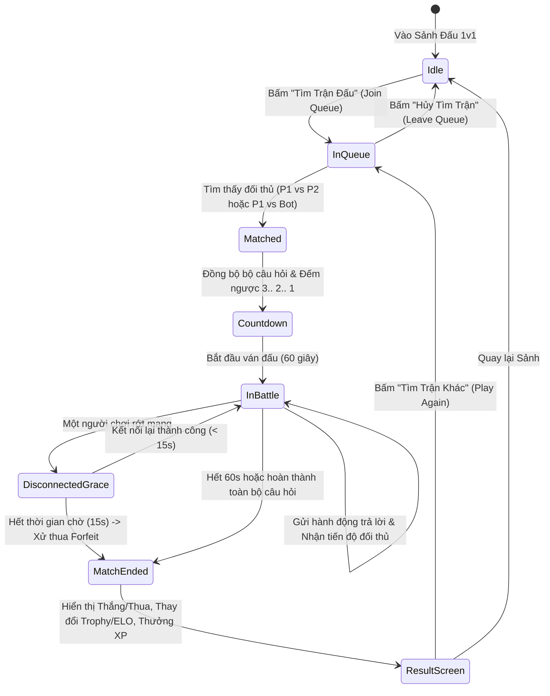
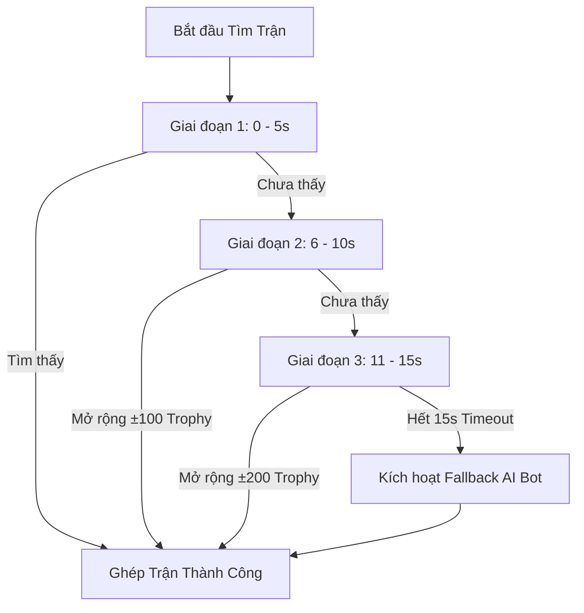
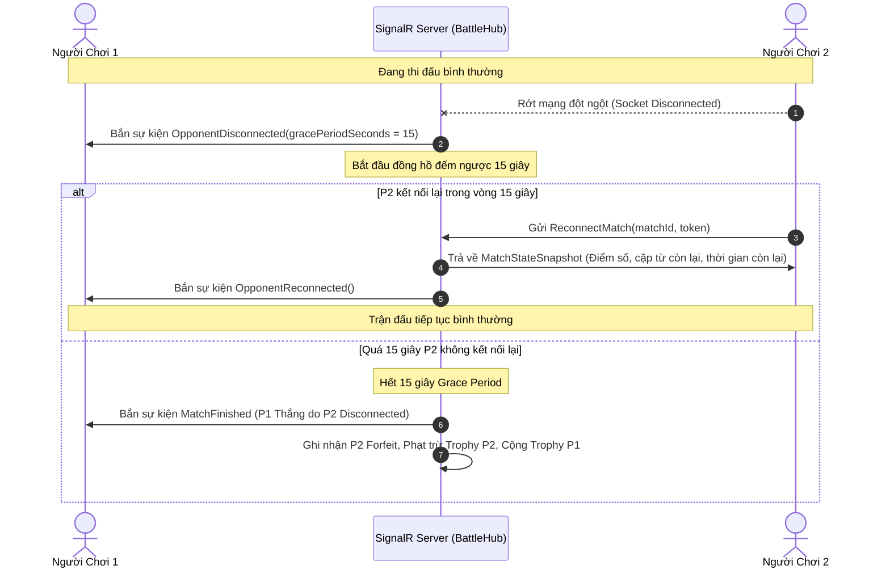
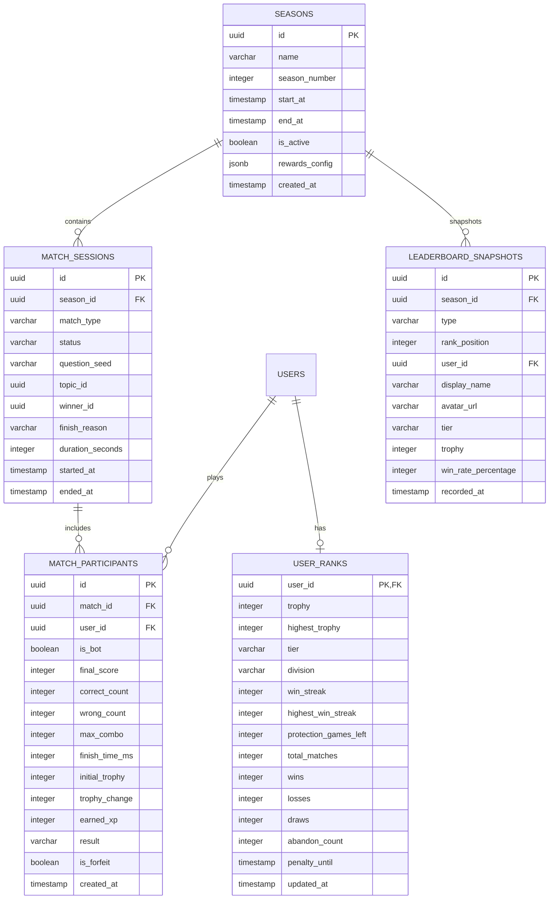

# Đặc Tả Nghiệp Vụ Bảng Xếp Hạng Toàn Cầu & Đấu Đối Kháng Trực Tiếp 1v1 (Leaderboard & Realtime 1v1 Battle)

Tài liệu này định nghĩa chi tiết toàn bộ yêu cầu nghiệp vụ, cơ chế tính điểm ELO/Trophy, thuật toán ghép cặp (Matchmaking), luật thi đấu đối kháng trực tiếp (1v1 Realtime), cơ chế xử lý mất kết nối/bỏ cuộc, mô hình dữ liệu PostgreSQL, giao thức SignalR Hub và tiêu chí nghiệm thu (Acceptance Criteria) cho phân hệ **Bảng Xếp Hạng Toàn Cầu & Đấu Trực Tiếp 1v1** trên nền tảng học tiếng Anh qua mini-game.

---

## 1. Tổng Quan Nghiệp Vụ & Mục Tiêu (Business Overview)

### 1.1. Bối cảnh & Giá trị mang lại
- **Kích thích cạnh tranh lành mạnh:** Việc học từ vựng đơn độc thường dễ gây nhàm chán sau 1–2 tuần. Tính năng Đấu Trực Tiếp 1v1 (PvP) mang lại cảm xúc kịch tính, biến việc ôn luyện từ vựng tiếng Anh thành trải nghiệm thi đấu thể thao điện tử (Esports).
- **Tăng tính gắn kết (Social Stickiness & DAU):** Bảng xếp hạng danh giá theo mùa giải thôi thúc người học quay lại mỗi ngày để bảo vệ thứ hạng và nhận phần thưởng độc quyền.
- **Fair Play & Công bằng tuyệt đối:** Cả 2 người chơi cùng đối mặt với bộ câu hỏi/từ vựng được đồng bộ hoàn toàn (Identical Question Seed), bảo đảm chiến thắng phụ thuộc 100% vào phản xạ và vốn từ vựng thực tế.

### 1.2. Bản Đồ Trạng Thái Đấu 1v1 (1v1 Battle State Flow)



---

## 2. Cơ Chế Điểm Xếp Hạng, ELO & Hệ Thống Cúp (Trophy & ELO System)

### 2.1. Thang Bậc Rank & Phân Hạng (Ranks & Tiers)
Hệ thống sử dụng điểm Cúp (Trophy) tương tự cơ chế xếp hạng hiện đại. Mỗi bậc hạng (Tier) được chia thành 3 phân hạng nhỏ (Divisions: III $\to$ II $\to$ I), ngoại trừ bậc Master:

| Bậc Rank (Tier) | Khoảng Trophy | Phân hạng (Division) | Điểm mỗi Division | Màu sắc nhận diện (Tailwind) | Hệ số $K$ (K-Factor) |
| :--- | :--- | :--- | :--- | :--- | :--- |
| **Đồng (Bronze)** | $0 - 999$ | Bronze III $\to$ I | ~333 Trophy/div | `amber-700` | $K = 40$ |
| **Bạc (Silver)** | $1,000 - 1,999$ | Silver III $\to$ I | ~333 Trophy/div | `slate-400` | $K = 35$ |
| **Vàng (Gold)** | $2,000 - 2,999$ | Gold III $\to$ I | ~333 Trophy/div | `yellow-500` | $K = 30$ |
| **Bạch Kim (Platinum)** | $3,000 - 3,999$ | Platinum III $\to$ I | ~333 Trophy/div | `cyan-400` | $K = 25$ |
| **Kim Cương (Diamond)** | $4,000 - 4,999$ | Diamond III $\to$ I | ~333 Trophy/div | `blue-500` | $K = 20$ |
| **Cao Thủ (Master)** | $5,000+$ | Không chia division | Đua top điểm tuyệt đối | `purple-500` | $K = 16$ |

*Ghi chú:* Người chơi mới bắt đầu với $0$ Trophy (Bronze III). Điểm Trophy không bao giờ bị giảm xuống dưới $0$.

### 2.2. Công Thức Tính Điểm Thắng / Thua / Hòa (ELO Rating Formula)
Điểm Trophy nhận hoặc trừ sau mỗi trận đấu dựa trên kỳ vọng chiến thắng (Expected Score) theo chuẩn ELO:

1. **Kỳ vọng thắng của Người chơi A ($E_A$):**
   $$E_A = \frac{1}{1 + 10^{(R_B - R_A) / 400}}$$
   Trong đó: $R_A$ là Trophy của người chơi A, $R_B$ là Trophy của người chơi B.

2. **Kỳ vọng thắng của Người chơi B ($E_B$):**
   $$E_B = 1 - E_A$$

3. **Điểm Trophy thực tế thay đổi ($\Delta R$):**
   $$\Delta R_A = \text{Round}\big(K \times (S_A - E_A)\big)$$
   Trong đó:
   - $S_A = 1$ nếu A Thắng (Victory).
   - $S_A = 0.5$ nếu Hòa (Draw).
   - $S_A = 0$ nếu A Thua (Defeat).
   - $K$ là hệ số K-Factor của bậc Rank tương ứng của người chơi A.

4. **Giới hạn biến thiên tối thiểu/tối đa trong 1 trận:**
   - Khi Thắng: Tối thiểu $+10$ Trophy, tối đa $+45$ Trophy.
   - Khi Thua: Tối thiểu $-5$ Trophy, tối đa $-35$ Trophy (Ở bậc Đồng không bao giờ bị trừ quá $-10$ Trophy).
   - Khi Hòa: Biến thiên từ $-5$ đến $+5$ Trophy tùy thuộc chênh lệch Rank.

### 2.3. Thưởng Chuỗi Thắng (Win Streak Bonus)
- Kích hoạt khi người chơi đạt từ **3 trận thắng liên tiếp** trở lên.
- **Mức thưởng bổ sung:**
  - Chuỗi 3 trận thắng: $+5$ Trophy thưởng.
  - Chuỗi 4 trận thắng: $+8$ Trophy thưởng.
  - Chuỗi 5 trận thắng trở lên: $+12$ Trophy thưởng.
- **Phạm vi áp dụng:** Chỉ áp dụng cho các bậc từ **Đồng (Bronze)** đến **Vàng (Gold)**. 
- Từ **Bạch Kim (Platinum)** trở lên: Tắt cơ chế Win Streak Bonus để đảm bảo tính cạnh tranh khắt khe và công bằng cho các rank đỉnh cao.

### 2.4. Cơ Chế Bảo Vệ Hạng (Rank Protection & Demotion Shield)
Để tránh ức chế tâm lý khi vừa vất vả thăng hạng đã lập tức bị rớt hạng ngay sau 1 trận thua xui xẻo:
1. **Khiên Tân Binh (Promotion Shield):**
   - Khi người chơi vừa thăng lên một Bậc Rank mới (ví dụ từ Silver I lên Gold III), họ được cấp **3 Trận Bảo Hiểm (Protection Buffer = 3)**.
   - Trong 3 trận này, nếu thua trận, người chơi chỉ bị trừ điểm tối đa về đúng mốc sàn của Rank mới (ví dụ mốc 2,000 Trophy cho Gold III) mà **không bị giáng xuống Silver I**.
2. **Ngưỡng Giáng Hạng (Demotion Threshold):**
   - Sau khi hết 3 trận bảo hiểm, nếu điểm Trophy của người chơi bị giảm, họ sẽ chỉ bị giáng hạng khi Trophy tụt xuống dưới ngưỡng an toàn là **$-50$ Trophy so với mốc sàn** (Ví dụ: Đang ở Gold III mốc 2,000, nếu thua xuống 1,970 vẫn giữ Gold III; chỉ khi tụt xuống dưới 1,950 mới chính thức bị giáng về Silver I với 1,949 Trophy).

### 2.5. Chu Kỳ Mùa Giải & Reset Thứ Hạng (Season Lifecycle & Soft Reset)
- **Thời lượng mùa giải:** Mỗi mùa giải kéo dài đúng **4 tuần (28 ngày)**, bắt đầu lúc 00:00:00 Thứ Hai đầu tiên của tháng và kết thúc lúc 23:59:59 Chủ Nhật của tuần thứ 4.
- **Quy tắc Reset Mềm (Soft Reset Formula):**
  - Bronze & Silver: Giữ nguyên điểm Trophy (không reset).
  - Gold: Reset về mốc đầu Gold III ($2,000$ Trophy).
  - Platinum: Reset về $2,500$ Trophy (Gold I).
  - Diamond: Reset về $3,000$ Trophy (Platinum III).
  - Master: $\text{NewTrophy} = 3,500 + \lfloor(\text{OldTrophy} - 5,000) \times 0.2\rfloor$.
- **Phần thưởng kết thúc mùa (Season End Rewards):**
  - Khung Avatar đặc biệt vinh danh Rank cao nhất đạt được trong mùa.
  - Huy hiệu (Badge) lưu vĩnh viễn trong Profile người dùng.
  - Thưởng lượng lớn XP và Coins (nếu có hệ thống shop).

---

## 3. Cơ Chế Ghép Cặp Thông Minh (Smart Matchmaking Engine)

### 3.1. Thuật Toán Tìm Đối Thủ (Adaptive Range Expansion)
Hệ thống sử dụng cơ chế mở rộng vùng tìm kiếm linh hoạt theo thời gian chờ (Queue Time) để vừa đảm bảo tìm được đối thủ cân tài cân sức, vừa giữ cho thời gian chờ không quá 15 giây:



- **Giai đoạn 1 (0s – 5s):** Tìm đối thủ trong khoảng $\pm 50$ Trophy.
- **Giai đoạn 2 (6s – 10s):** Mở rộng biên độ tìm kiếm lên $\pm 100$ Trophy.
- **Giai đoạn 3 (11s – 15s):** Mở rộng biên độ tìm kiếm lên $\pm 200$ Trophy.
- **Giai đoạn 4 (Sau 15s - Timeout):** Tự động khởi tạo một **AI Bot thông minh** mô phỏng người chơi thật để người dùng luôn được trải nghiệm ngay lập tức mà không bao giờ bị kẹt hàng chờ.

### 3.2. Cấu Hình & Hành Vi AI Bot Dự Phòng (AI Bot Profiles)
Bot được thiết kế tinh vi với độ trễ phản xạ và tỷ lệ trả lời đúng phù hợp với rank hiện tại của người chơi:

| Tier của Người Chơi | Tên hiển thị Bot (Random Pool) | Thời gian phản xạ mỗi câu (Latency) | Tỷ lệ trả lời đúng (Accuracy) | Hành vi mô phỏng |
| :--- | :--- | :--- | :--- | :--- |
| **Bronze** | LanAnh_9x, AlexWalker, MinhVu... | $3.5\text{s} - 5.0\text{s}$ | $60\% - 70\%$ | Thi thoảng sai câu dễ, không có combo dài. |
| **Silver** | EmilyNguyen, David_K, ThuTrang... | $2.8\text{s} - 4.0\text{s}$ | $70\% - 80\%$ | Phản xạ khá, thi thoảng đạt combo 3-4. |
| **Gold** | BrainMaster, Sarah_T, HoangLong... | $2.2\text{s} - 3.2\text{s}$ | $80\% - 88\%$ | Ít sai sót, đạt combo ổn định. |
| **Platinum** | FastLearner, DragonK, MaiAnh99... | $1.8\text{s} - 2.5\text{s}$ | $88\% - 93\%$ | Rất nhanh, hiếm khi sai quá 1 câu. |
| **Diamond / Master** | EliteSpeed, FlashWord, ProVn... | $1.2\text{s} - 1.8\text{s}$ | $94\% - 98\%$ | Trình độ cực cao, tạo áp lực thời gian lớn. |

*Nguyên tắc UI/UX:* Giao diện không để lộ nhãn "Bot" cho người chơi biết, avatar bot được lấy ngẫu nhiên từ kho avatar tiêu chuẩn để giữ trọn vẹn sự hào hứng và phấn khích.

### 3.3. Bộ Đề Thi Đấu Đồng Bộ Tuyệt Đối (Fair Question Seed Generator)
- Khi ghép trận thành công, Server sinh ra một chuỗi ngẫu nhiên `MatchSeed` (ví dụ: `seed_8f7b2a...`).
- Dựa trên `MatchSeed` và Chủ đề thi đấu (Topic), Server chọn ra đúng **10 từ vựng hoặc 10 câu hỏi**.
- Thứ tự các câu hỏi, vị trí đảo ngẫu nhiên của các đáp án (Shuffle Order) được tính toán trên Server và gửi đồng thời tới cả 2 Client trong sự kiện `MatchFound`.
- Đảm bảo tính công bằng 100%: Cả hai bên đối mặt với độ khó, từ ngữ và thử thách giống hệt nhau.

---

## 4. Luật Thi Đấu 1v1 Realtime (Realtime 1v1 Gameplay Rules)

### 4.1. Thể Thức Thi Đấu Cốt Lõi: Speed Word Match Duel
- **Thể thức:** 1v1 Ghép Cặp Từ Vựng Tốc Độ Cao (Speed Word Match).
- **Quy mô trận đấu:** Gồm **10 cặp từ vựng** (Anh - Việt).
- **Thời gian tối đa:** **60 giây** (Đồng hồ đếm ngược đồng bộ từ Server).
- **Giao diện thi đấu phía mỗi người chơi:**
  - Bảng $4 \times 5$ gồm 20 thẻ (10 thẻ Tiếng Anh + 10 thẻ Tiếng Việt đảo ngẫu nhiên).
  - Người chơi chạm chọn 1 thẻ tiếng Anh và 1 thẻ tiếng Việt tương ứng để ghép cặp.

### 4.2. Cơ Chế Tính Điểm Trận Đấu (Match Scoring Formula)
Điểm số trong trận đấu được tính dựa trên 3 yếu tố: Tính chính xác, Tốc độ phản xạ và Chuỗi combo:

$$\text{CardScore} = 100 + \text{SpeedBonus} + \text{ComboBonus}$$

1. **Điểm Cơ Bản:** $+100$ điểm cho mỗi cặp ghép đúng.
2. **Thưởng Tốc Độ (Speed Bonus):**
   - Ghép đúng trong vòng $1.5\text{s}$ kể từ lần ghép trước: $+50$ điểm.
   - Ghép đúng từ $1.5\text{s} - 3.0\text{s}$: $+30$ điểm.
   - Ghép đúng từ $3.0\text{s} - 5.0\text{s}$: $+10$ điểm.
   - Quá $5.0\text{s}$: $+0$ điểm thưởng tốc độ.
3. **Thưởng Combo (Combo Multiplier):**
   - Combo x2: $+20$ điểm.
   - Combo x3: $+40$ điểm.
   - Combo x4+: $+60$ điểm.
4. **Phạt Ghép Sai (Penalty):**
   - Trừ $-30$ điểm trận đấu (Điểm ván đấu không âm, tối thiểu 0).
   - Reset thanh Combo về 0.
   - Khóa tạm thời bảng 0.5s để người chơi định thần (hiệu ứng thẻ đỏ rung lắc).

### 4.3. Thanh Tiến Độ Kép Thời Gian Thực (Dual Realtime Progress HUD)
Giao diện trên cùng của màn hình trận đấu hiển thị cuộc đua trực quan:

```
[Avatar P1] [Tên bạn]               VS               [Tên đối thủ] [Avatar P2]
Điểm: 650 | Combo: x3                                Điểm: 520 | Combo: x1
Tiến độ: [==========--------] 5/10                   Tiến độ: [========----------] 4/10
===========================[ Thời gian: 00:38 ]===========================
```

- **Thanh tiến độ của Bạn (Player Progress Bar):** Màu xanh lá (Emerald), cập nhật ngay lập tức theo thao tác client.
- **Thanh tiến độ của Đối thủ (Opponent Ghost Bar):** Màu tím/cam, cập nhật theo thời gian thực mỗi khi nhận được sự kiện `OpponentProgressUpdate` từ SignalR Hub.
- **Hiệu ứng kịch tính:**
  - Khi đối thủ vừa ghi điểm: Mini-avatar đối thủ nảy lên kèm số điểm nhảy `+150`.
  - Khi đối thủ ghép sai: Thanh đối thủ nháy đỏ kèm icon rung lắc.

### 4.4. Điều Kiện Phân Thắng Bại (Win/Loss/Draw Conditions)
Ván đấu kết thúc ngay lập tức khi xảy ra một trong các điều kiện sau:
1. **Một người chơi hoàn thành toàn bộ 10 cặp từ trước:**
   - Người hoàn thành trước nhận thêm **Thưởng Về Đích (Finish Bonus)**:
     $$\text{FinishBonus} = \text{RemainingSeconds} \times 10\text{ điểm}$$
   - Sau đó so sánh tổng điểm cuối cùng của cả hai. Người có tổng điểm cao hơn là người **Chiến Thắng (Winner)**.
2. **Hết thời gian 60 giây:**
   - Cả 2 người chơi bị cưỡng chế dừng thao tác.
   - So sánh tổng điểm: Ai có điểm cao hơn sẽ **Chiến Thắng**.
3. **Trường hợp Hòa Điểm (Tie-Breaker):**
   - Nếu tổng điểm 2 bên bằng nhau: Người có **Thời gian hoàn thành lượt cuối cùng nhanh hơn** sẽ thắng.
   - Nếu cả điểm và thời gian hoàn thành đều bằng nhau hoàn toàn: Kết quả **Hòa (Draw)**.

---

## 5. Xử Lý Mất Kết Nối & Bỏ Cuộc (Disconnect, Reconnect & Forfeit)

Để bảo đảm trải nghiệm không bị phá bĩnh bởi các hành vi tiêu cực (thoát game khi đang thua - rage quit) hoặc sự cố mạng đột xuất trên thiết bị di động:



### 5.1. Thời Gian Chờ Kết Nối Lại (Grace Period = 15 giây)
- Khi một người chơi bị ngắt kết nối WebSocket:
  - Server **không xử thua ngay lập tức**, mà đưa trạng thái người chơi sang `Disconnected` và kích hoạt bộ đếm ngược 15 giây.
  - Phía người chơi còn lại: Màn hình hiển thị thông báo nhẹ: *"Đối thủ đang gặp sự cố mạng... Đang chờ kết nối lại (15s)"*. Trận đấu vẫn tiếp tục đếm giờ để người chơi còn lại hoàn thành bài thi của mình.
- **Khôi phục trạng thái (State Catch-up):**
  - Khi người chơi gặp sự cố kết nối lại thành công trong 15s: Server gửi gói snapshot gồm: các thẻ đã giải, điểm số của cả hai và số giây còn lại. Client lập tức khôi phục màn chơi.

### 5.2. Xử Lý Bỏ Cuộc Cố Tình (Forfeit / Rage Quit)
- Nếu người chơi chủ động bấm nút **"Đầu hàng / Thoát trận" (Surrender/Leave)** hoặc đóng hẳn trình duyệt mà không quay lại sau 15s:
  - **Người bỏ cuộc:** 
    - Bị xử **Thua Ngay Lập Tức (Defeat by Forfeit)**.
    - Bị trừ trọn vẹn điểm Trophy theo hệ số thua nặng nhất (tối đa $-35$ Trophy).
    - Mất toàn bộ chuỗi thắng (Win Streak reset về 0).
    - Bị ghi nhận vào chỉ số vi phạm `abandon_count`.
  - **Cơ chế Phạt Hàng Chờ (Leaver Penalty Queue):**
    - Thoát 1 lần trong ngày: Cảnh cáo nhẹ.
    - Thoát 2 lần trong ngày: Khóa tìm trận 1v1 trong **5 phút**.
    - Thoát 3 lần trở lên trong ngày: Khóa tìm trận 1v1 trong **30 phút**.
  - **Người ở lại:**
    - Được công nhận **Chiến Thắng (Victory)**.
    - Nhận đầy đủ điểm Trophy chiến thắng ($+25$ đến $+35$ Trophy tùy ELO).
    - Được cộng dồn chuỗi thắng và nhận trọn vẹn XP thắng trận ($+30$ XP).

---

## 6. Thiết Kế Mô Hình Dữ Liệu PostgreSQL & C# / TypeScript Schemas

### 6.1. Sơ Đồ Thực Thể Quan Hệ Bổ Sung (Mermaid ERD)



### 6.2. PostgreSQL DDL Schema

```sql
-- 1. Bảng lưu trữ Rank và ELO của người dùng
CREATE TABLE IF NOT EXISTS user_ranks (
    user_id UUID PRIMARY KEY REFERENCES users(id) ON DELETE CASCADE,
    trophy INTEGER NOT NULL DEFAULT 0,
    highest_trophy INTEGER NOT NULL DEFAULT 0,
    tier VARCHAR(20) NOT NULL DEFAULT 'Bronze',
    division VARCHAR(10) NOT NULL DEFAULT 'III',
    win_streak INTEGER NOT NULL DEFAULT 0,
    highest_win_streak INTEGER NOT NULL DEFAULT 0,
    protection_games_left INTEGER NOT NULL DEFAULT 0,
    total_matches INTEGER NOT NULL DEFAULT 0,
    wins INTEGER NOT NULL DEFAULT 0,
    losses INTEGER NOT NULL DEFAULT 0,
    draws INTEGER NOT NULL DEFAULT 0,
    abandon_count INTEGER NOT NULL DEFAULT 0,
    penalty_until TIMESTAMP WITH TIME ZONE NULL,
    updated_at TIMESTAMP WITH TIME ZONE NOT NULL DEFAULT CURRENT_TIMESTAMP
);

CREATE INDEX idx_user_ranks_trophy ON user_ranks (trophy DESC);
CREATE INDEX idx_user_ranks_tier_division ON user_ranks (tier, division);

-- 2. Bảng quản lý Mùa Giải (Seasons)
CREATE TABLE IF NOT EXISTS seasons (
    id UUID PRIMARY KEY DEFAULT gen_random_uuid(),
    name VARCHAR(100) NOT NULL,
    season_number INTEGER NOT NULL UNIQUE,
    start_at TIMESTAMP WITH TIME ZONE NOT NULL,
    end_at TIMESTAMP WITH TIME ZONE NOT NULL,
    is_active BOOLEAN NOT NULL DEFAULT FALSE,
    rewards_config JSONB NOT NULL DEFAULT '{}'::jsonb,
    created_at TIMESTAMP WITH TIME ZONE NOT NULL DEFAULT CURRENT_TIMESTAMP
);

CREATE INDEX idx_seasons_active ON seasons (is_active);

-- 3. Bảng quản lý Phiên Trận Đấu 1v1 (Match Sessions)
CREATE TABLE IF NOT EXISTS match_sessions (
    id UUID PRIMARY KEY DEFAULT gen_random_uuid(),
    season_id UUID REFERENCES seasons(id) ON DELETE SET NULL,
    match_type VARCHAR(30) NOT NULL DEFAULT 'SpeedWordMatch',
    status VARCHAR(20) NOT NULL DEFAULT 'Waiting', -- Waiting, InProgress, Finished, Aborted
    question_seed VARCHAR(64) NOT NULL,
    topic_id UUID REFERENCES topics(id) ON DELETE SET NULL,
    winner_id UUID NULL,
    finish_reason VARCHAR(30) NULL, -- NormalCompletion, Timeout, Forfeit, DisconnectTimeout
    duration_seconds INTEGER NOT NULL DEFAULT 0,
    started_at TIMESTAMP WITH TIME ZONE NOT NULL DEFAULT CURRENT_TIMESTAMP,
    ended_at TIMESTAMP WITH TIME ZONE NULL
);

CREATE INDEX idx_matches_season_created ON match_sessions (season_id, started_at DESC);

-- 4. Bảng chi tiết Người Tham Gia Trận Đấu (Match Participants)
CREATE TABLE IF NOT EXISTS match_participants (
    id UUID PRIMARY KEY DEFAULT gen_random_uuid(),
    match_id UUID NOT NULL REFERENCES match_sessions(id) ON DELETE CASCADE,
    user_id UUID NOT NULL, -- Có thể là bot UUID hoặc user thật
    is_bot BOOLEAN NOT NULL DEFAULT FALSE,
    final_score INTEGER NOT NULL DEFAULT 0,
    correct_count INTEGER NOT NULL DEFAULT 0,
    wrong_count INTEGER NOT NULL DEFAULT 0,
    max_combo INTEGER NOT NULL DEFAULT 0,
    finish_time_ms INTEGER NOT NULL DEFAULT 0,
    initial_trophy INTEGER NOT NULL DEFAULT 0,
    trophy_change INTEGER NOT NULL DEFAULT 0,
    earned_xp INTEGER NOT NULL DEFAULT 0,
    result VARCHAR(20) NOT NULL DEFAULT 'Pending', -- Win, Loss, Draw
    is_forfeit BOOLEAN NOT NULL DEFAULT FALSE,
    created_at TIMESTAMP WITH TIME ZONE NOT NULL DEFAULT CURRENT_TIMESTAMP
);

CREATE INDEX idx_participants_user_match ON match_participants (user_id, match_id);

-- 5. Bảng Lưu Trữ Bảng Xếp Hạng Định Kỳ (Leaderboard Snapshots)
CREATE TABLE IF NOT EXISTS leaderboard_snapshots (
    id UUID PRIMARY KEY DEFAULT gen_random_uuid(),
    season_id UUID REFERENCES seasons(id) ON DELETE CASCADE,
    type VARCHAR(20) NOT NULL DEFAULT 'Weekly', -- Weekly, SeasonEnd, AllTime
    rank_position INTEGER NOT NULL,
    user_id UUID NOT NULL REFERENCES users(id) ON DELETE CASCADE,
    display_name VARCHAR(100) NOT NULL,
    avatar_url VARCHAR(255) NULL,
    tier VARCHAR(20) NOT NULL,
    trophy INTEGER NOT NULL,
    win_rate_percentage NUMERIC(5,2) NOT NULL DEFAULT 0.00,
    recorded_at TIMESTAMP WITH TIME ZONE NOT NULL DEFAULT CURRENT_TIMESTAMP
);

CREATE INDEX idx_leaderboard_season_rank ON leaderboard_snapshots (season_id, type, rank_position ASC);
```

### 6.3. Entity Classes trong .NET 8 (C# EF Core)

```csharp
namespace LearnEnglish.Domain.Entities;

public enum RankTier
{
    Bronze,
    Silver,
    Gold,
    Platinum,
    Diamond,
    Master
}

public enum MatchResult
{
    Pending,
    Win,
    Loss,
    Draw
}

public class UserRank
{
    public Guid UserId { get; set; }
    public int Trophy { get; set; } = 0;
    public int HighestTrophy { get; set; } = 0;
    public RankTier Tier { get; set; } = RankTier.Bronze;
    public string Division { get; set; } = "III";
    public int WinStreak { get; set; } = 0;
    public int HighestWinStreak { get; set; } = 0;
    public int ProtectionGamesLeft { get; set; } = 0;
    public int TotalMatches { get; set; } = 0;
    public int Wins { get; set; } = 0;
    public int Losses { get; set; } = 0;
    public int Draws { get; set; } = 0;
    public int AbandonCount { get; set; } = 0;
    public DateTime? PenaltyUntil { get; set; }
    public DateTime UpdatedAt { get; set; } = DateTime.UtcNow;

    // Navigation property
    public virtual User User { get; set; } = null!;
}

public class MatchSession
{
    public Guid Id { get; set; } = Guid.NewGuid();
    public Guid? SeasonId { get; set; }
    public string MatchType { get; set; } = "SpeedWordMatch";
    public string Status { get; set; } = "Waiting";
    public string QuestionSeed { get; set; } = string.Empty;
    public Guid? TopicId { get; set; }
    public Guid? WinnerId { get; set; }
    public string? FinishReason { get; set; }
    public int DurationSeconds { get; set; }
    public DateTime StartedAt { get; set; } = DateTime.UtcNow;
    public DateTime? EndedAt { get; set; }

    public virtual ICollection<MatchParticipant> Participants { get; set; } = new List<MatchParticipant>();
}

public class MatchParticipant
{
    public Guid Id { get; set; } = Guid.NewGuid();
    public Guid MatchId { get; set; }
    public Guid UserId { get; set; }
    public bool IsBot { get; set; } = false;
    public int FinalScore { get; set; } = 0;
    public int CorrectCount { get; set; } = 0;
    public int WrongCount { get; set; } = 0;
    public int MaxCombo { get; set; } = 0;
    public int FinishTimeMs { get; set; } = 0;
    public int InitialTrophy { get; set; } = 0;
    public int TrophyChange { get; set; } = 0;
    public int EarnedXp { get; set; } = 0;
    public MatchResult Result { get; set; } = MatchResult.Pending;
    public bool IsForfeit { get; set; } = false;
    public DateTime CreatedAt { get; set; } = DateTime.UtcNow;

    public virtual MatchSession Match { get; set; } = null!;
}
```

### 6.4. Interfaces trong TypeScript (React Client)

```typescript
export type RankTier = 'Bronze' | 'Silver' | 'Gold' | 'Platinum' | 'Diamond' | 'Master';
export type RankDivision = 'I' | 'II' | 'III';

export interface UserRankProfile {
  userId: string;
  trophy: number;
  highestTrophy: number;
  tier: RankTier;
  division: RankDivision;
  winStreak: number;
  highestWinStreak: number;
  protectionGamesLeft: number;
  totalMatches: number;
  wins: number;
  losses: number;
  draws: number;
  winRate: number; // Tỷ lệ thắng (ví dụ: 68.5%)
  penaltyUntil?: string | null;
}

export interface MatchPlayerDto {
  userId: string;
  displayName: string;
  avatarUrl: string;
  tier: RankTier;
  division: RankDivision;
  currentTrophy: number;
  isBot: boolean;
}

export interface MatchFoundPayload {
  matchId: string;
  durationSeconds: number;
  topicId: string;
  topicName: string;
  opponent: MatchPlayerDto;
  pairs: Array<{
    id: string;
    english: string;
    vietnamese: string;
  }>;
}

export interface OpponentProgressPayload {
  matchId: string;
  opponentUserId: string;
  currentScore: number;
  completedPairsCount: number;
  currentCombo: number;
  isCompleted: boolean;
}

export interface MatchResultPayload {
  matchId: string;
  isWinner: boolean;
  isDraw: boolean;
  finishReason: 'NormalCompletion' | 'Timeout' | 'Forfeit' | 'DisconnectTimeout';
  myFinalScore: number;
  opponentFinalScore: number;
  trophyChange: number;
  newTrophy: number;
  newTier: RankTier;
  newDivision: RankDivision;
  earnedXp: number;
  winStreak: number;
  isPromotion: boolean;
  isDemoted: boolean;
}
```

---

## 7. Đặc Tả Giao Thức Thời Gian Thực SignalR (BattleHub Specification)

- **Hub Endpoint:** `/hubs/battle`
- **Giao thức xác thực:** JWT Bearer Token truyền qua `access_token` query parameter khi bắt đầu bắt tay kết nối WebSocket (`new HubConnectionBuilder().withUrl('/hubs/battle?access_token=...').build()`).

### 7.1. Các Phương Thức Client Gọi Lên Server (Client Invocations)

| Tên Phương Thức | Tham Số Đầu Vào (Parameters) | Ý Nghĩa / Mục Đích |
| :--- | :--- | :--- |
| `JoinMatchmakingQueue` | `{ preferredTopicId?: string }` | Người chơi yêu cầu tham gia hàng chờ tìm đối thủ 1v1. |
| `LeaveMatchmakingQueue` | `void` | Người chơi hủy tìm trận khi còn đang trong hàng chờ. |
| `SendPlayerProgress` | `PlayerActionDto` | Gửi sự kiện khi người chơi ghép đúng 1 cặp từ, cập nhật điểm và tiến độ. |
| `FinishMatchEarly` | `{ totalTimeMs: number }` | Gửi thông báo người chơi đã ghép xong toàn bộ 10 cặp từ. |
| `ForfeitMatch` | `{ matchId: string }` | Người chơi bấm nút đầu hàng hoặc thoát trận. |
| `ReconnectMatch` | `{ matchId: string }` | Người chơi kết nối lại sau khi rớt mạng đột ngột. |

### 7.2. Các Sự Kiện Server Bắn Xuống Client (Server Pushes)

| Tên Sự Kiện | Kiểu Dữ Liệu Payload | Thời Điểm Kích Hoạt |
| :--- | :--- | :--- |
| `QueueStatusUpdate` | `{ queueTimeSeconds: number, searchRangeTrophy: number }` | Cứ mỗi giây một lần khi đang trong hàng chờ để cập nhật thời gian. |
| `MatchFound` | `MatchFoundPayload` | Khi tìm thấy đối thủ hoặc kích hoạt Bot. Chuyển UI sang màn hình Countdown. |
| `BattleStarted` | `{ startTimeUtc: string }` | Kết thúc 3s đếm ngược, cả 2 bên bắt đầu tính giờ thi đấu. |
| `OpponentProgressUpdate` | `OpponentProgressPayload` | Bắn sang Client đối diện mỗi khi người chơi bên kia ghi điểm hoặc ghép đúng. |
| `OpponentDisconnected` | `{ gracePeriodSeconds: 15 }` | Báo đối thủ bị ngắt kết nối mạng, bắt đầu 15s đếm ngược chờ đợi. |
| `OpponentReconnected` | `void` | Báo đối thủ đã kết nối lại thành công, tắt thông báo chờ. |
| `MatchFinished` | `MatchResultPayload` | Khi trận đấu hoàn tất (hết giờ, xong 10 câu, hoặc 1 bên bỏ cuộc). |

### 7.3. Chi Tiết Mock JSON Payloads Của Sự Kiện SignalR

#### `MatchFound` Event Payload:
```json
{
  "matchId": "b8a92f01-5e8c-4a3b-9a1d-724bcde59182",
  "durationSeconds": 60,
  "topicId": "3fa85f64-5717-4562-b3fc-2c963f66afa6",
  "topicName": "Công Nghệ & Lập Trình",
  "opponent": {
    "userId": "9f213456-11e2-4789-a3bb-887766554433",
    "displayName": "Alex Walker",
    "avatarUrl": "https://api.dicebear.com/7.x/bottts/svg?seed=alex",
    "tier": "Silver",
    "division": "I",
    "currentTrophy": 1850,
    "isBot": false
  },
  "pairs": [
    { "id": "p1", "english": "Algorithm", "vietnamese": "Thuật toán" },
    { "id": "p2", "english": "Database", "vietnamese": "Cơ sở dữ liệu" },
    { "id": "p3", "english": "Framework", "vietnamese": "Bộ khung phát triển" },
    { "id": "p4", "english": "Compiler", "vietnamese": "Trình biên dịch" },
    { "id": "p5", "english": "Inheritance", "vietnamese": "Kế thừa" },
    { "id": "p6", "english": "Interface", "vietnamese": "Giao diện lập trình" },
    { "id": "p7", "english": "Deployment", "vietnamese": "Triển khai phần mềm" },
    { "id": "p8", "english": "Refactoring", "vietnamese": "Tái cấu trúc mã nguồn" },
    { "id": "p9", "english": "Concurrency", "vietnamese": "Xử lý đồng thời" },
    { "id": "p10", "english": "Repository", "vietnamese": "Kho lưu trữ mã" }
  ]
}
```

#### `OpponentProgressUpdate` Event Payload:
```json
{
  "matchId": "b8a92f01-5e8c-4a3b-9a1d-724bcde59182",
  "opponentUserId": "9f213456-11e2-4789-a3bb-887766554433",
  "currentScore": 480,
  "completedPairsCount": 4,
  "currentCombo": 3,
  "isCompleted": false
}
```

#### `MatchFinished` Event Payload:
```json
{
  "matchId": "b8a92f01-5e8c-4a3b-9a1d-724bcde59182",
  "isWinner": true,
  "isDraw": false,
  "finishReason": "NormalCompletion",
  "myFinalScore": 1450,
  "opponentFinalScore": 1120,
  "trophyChange": 32,
  "newTrophy": 1882,
  "newTier": "Silver",
  "newDivision": "I",
  "earnedXp": 45,
  "winStreak": 4,
  "isPromotion": false,
  "isDemoted": false
}
```

---

## 8. Hợp Đồng REST API Bổ Trợ (Leaderboard & Match History APIs)

### 8.1. Lấy Bảng Xếp Hạng Toàn Cầu & Theo Mùa (Global & Season Leaderboard)
- **Endpoint:** `GET /api/v1/leaderboard/battle`
- **Query Params:**
  - `type`: `Season` (mặc định) hoặc `AllTime`
  - `page`: `1`
  - `pageSize`: `50` (Tối đa 100)
- **Response (200 OK):**
```json
{
  "season": {
    "id": "e3b0c442-98fc-1c14-9afb-4c8996fb9242",
    "seasonNumber": 3,
    "name": "Mùa 3: Vực Dậy Chiến Binh",
    "daysRemaining": 12
  },
  "myRank": {
    "rankPosition": 42,
    "userId": "c1f1a58b-9e23-45c1-872f-5b89c3140a01",
    "displayName": "Thịnh Nguyễn",
    "avatarUrl": "https://api.dicebear.com/7.x/bottts/svg?seed=thinh",
    "tier": "Silver",
    "division": "I",
    "trophy": 1882,
    "winRate": 66.7
  },
  "items": [
    {
      "rankPosition": 1,
      "userId": "11111111-2222-3333-4444-555555555555",
      "displayName": "Hoàng Nam Pro",
      "avatarUrl": "https://api.dicebear.com/7.x/bottts/svg?seed=nam",
      "tier": "Master",
      "division": "I",
      "trophy": 5420,
      "winRate": 82.5,
      "winStreak": 9
    },
    {
      "rankPosition": 2,
      "userId": "66666666-7777-8888-9999-000000000000",
      "displayName": "Minh Anh Language",
      "avatarUrl": "https://api.dicebear.com/7.x/bottts/svg?seed=minhanh",
      "tier": "Master",
      "division": "I",
      "trophy": 5210,
      "winRate": 79.1,
      "winStreak": 4
    }
  ],
  "totalCount": 1420
}
```

### 8.2. Lấy Hồ Sơ Đấu & Lịch Sử Trận Đấu Của Bản Thân
- **Endpoint:** `GET /api/v1/matches/history`
- **Query Params:** `page=1&pageSize=10`
- **Headers:** `Authorization: Bearer <token>`
- **Response (200 OK):**
```json
{
  "summary": {
    "totalMatches": 85,
    "wins": 55,
    "losses": 28,
    "draws": 2,
    "winRate": 64.7,
    "currentWinStreak": 4,
    "highestWinStreak": 8,
    "currentTrophy": 1882,
    "highestTrophy": 1950,
    "currentTier": "Silver",
    "currentDivision": "I"
  },
  "history": [
    {
      "matchId": "b8a92f01-5e8c-4a3b-9a1d-724bcde59182",
      "topicName": "Công Nghệ & Lập Trình",
      "opponent": {
        "displayName": "Alex Walker",
        "avatarUrl": "https://api.dicebear.com/7.x/bottts/svg?seed=alex",
        "tier": "Silver",
        "division": "I"
      },
      "result": "Win",
      "myScore": 1450,
      "opponentScore": 1120,
      "trophyChange": 32,
      "durationSeconds": 48,
      "playedAt": "2026-09-28T15:20:00Z"
    }
  ]
}
```

---

## 9. Tiêu Chí Nghiệm Thu (Acceptance Criteria - Given / When / Then)

Dành cho **QA** và **Tech Lead / Architect** kiểm thử và xác nhận:

### Kịch Bản 1: Ghép Cặp Thành Công Giữa 2 Người Chơi Cùng Bậc Rank
- **Given:** Người chơi A (Rank Silver II, 1,450 Trophy) và Người chơi B (Rank Silver I, 1,520 Trophy) cùng bấm "Tìm Trận" cách nhau dưới 4 giây.
- **When:** Hệ thống Matchmaking quét hàng chờ trong khoảng thời gian $\le 5$ giây với biên độ chênh lệch ELO ban đầu $\pm 50 - 100$.
- **Then:**
  1. Cả hai người chơi nhận được sự kiện `MatchFound` qua SignalR kèm thông tin đối thủ.
  2. Cả hai nhận cùng 1 bộ 10 cặp từ vựng với mã seed giống nhau.
  3. Giao diện chuyển sang màn đếm ngược $3 \to 2 \to 1$ và bắt đầu đếm giờ đồng thời.

### Kịch Bản 2: Ghép Bot Khi Quá Thời Gian Chờ (Timeout 15 giây)
- **Given:** Người chơi đang ở khung giờ ít người, bấm tìm trận và không có người chơi nào khác trong khoảng $\pm 200$ Trophy.
- **When:** Thời gian chờ hàng chờ chạm mốc 15 giây.
- **Then:**
  1. Server tự động ghép một AI Bot phù hợp với bậc Rank của người chơi (về tốc độ và tỷ lệ chính xác).
  2. Bắn sự kiện `MatchFound` cho người chơi; người chơi vào trận mượt mà không nhận thấy độ trễ hay báo lỗi.
  3. Bot tự động gửi các hành động trả lời với khoảng thời gian ngẫu nhiên theo profile quy định.

### Kịch Bản 3: Đồng Bộ Tiến Trình Thời Gian Thực Trong Trận Đấu
- **Given:** Người chơi A và Người chơi B đang trong trận đấu 1v1.
- **When:** Người chơi A ghép đúng thành công 1 cặp từ vựng và đạt chuỗi Combo x3.
- **Then:**
  1. Điểm của A tăng lên ngay trên màn hình của A.
  2. Phía Người chơi B lập tức nhận được sự kiện `OpponentProgressUpdate`.
  3. Thanh tiến trình của đối thủ (Ghost bar) trên màn hình B tiến lên 1 bước, hiển thị điểm số và combo x3 của A kèm hiệu ứng visual.

### Kịch Bản 4: Xử Lý Rớt Mạng Đột Ngột & Kết Nối Lại Trong 15 Giây (Grace Period)
- **Given:** Người chơi B bị ngắt kết nối mạng bất ngờ (rớt Wifi/4G).
- **When:**
  1. SignalR Server phát hiện kết nối của B bị drop.
  2. Bắn sự kiện `OpponentDisconnected` tới Người chơi A với `gracePeriodSeconds = 15`.
  3. Người chơi B có mạng trở lại sau 8 giây và gửi `ReconnectMatch`.
- **Then:**
  1. Server gửi lại toàn bộ Snapshot trận đấu cho B.
  2. Server gửi `OpponentReconnected` cho A để ẩn thông báo chờ.
  3. Trận đấu tiếp tục bình thường mà không bị hủy ván.

### Kịch Bản 5: Xử Thua Do Thoát Trận Cố Tình (Forfeit / Rage Quit)
- **Given:** Người chơi B đang bị dẫn điểm sâu và chủ động bấm nút "Đầu hàng" hoặc ngắt kết nối quá 15 giây.
- **When:** Server xác nhận trạng thái Forfeit.
- **Then:**
  1. Người chơi A nhận thông báo Chiến Thắng (Victory by Opponent Forfeit) và được cộng trọn vẹn điểm Trophy ($+30$), nhận đầy đủ XP.
  2. Người chơi B nhận thông báo Thua Cuộc, bị trừ điểm Trophy tối đa ($-30$), mất chuỗi thắng và tăng biến `abandon_count`.

### Kịch Bản 6: Tính Điểm Trophy, Thưởng Chuỗi Thắng & Bảo Vệ Rank
- **Given:** Người chơi A đang ở bậc Silver I với 1,980 Trophy và đang có chuỗi 3 trận thắng liên tiếp.
- **When:** Người chơi A thắng trận tiếp theo với điểm ELO gốc là $+24$ Trophy.
- **Then:**
  1. Hệ thống cộng thêm $+8$ Trophy thưởng chuỗi thắng (Tổng nhận: $+32$ Trophy).
  2. Tổng Trophy mới là $2,012$, kích hoạt trạng thái **Thăng Hạng lên Gold III** (`isPromotion = true`).
  3. Cấp cho người chơi $3$ trận bảo hiểm rank mới (`protection_games_left = 3`).
  4. Màn hình chiến thắng hiển thị pháo hoa Confetti và hiệu ứng thăng hạng Gold III ấn tượng.

---

## 10. Chỉ Dẫn Dành Cho Đội Ngũ Triển Khai Kỹ Thuật

1. **Tech Lead / Architect:**
   - Tạo Migration DB theo schema ở Mục 6 (`user_ranks`, `match_sessions`, `match_participants`, `seasons`, `leaderboard_snapshots`).
   - Thiết lập cấu trúc `BattleHub : Hub` trong .NET 8 Web API và quản lý connection IDs bằng `ConcurrentDictionary` hoặc Redis cache (nếu scale đa server).
   - Thiết lập Background Service `MatchmakingQueueService` chạy chu kỳ 1 giây để quét và ghép cặp các cặp người chơi trong hàng đợi.
2. **Backend Engineer:**
   - Hiện thực thuật toán ELO, công thức K-factor, phân bậc Tier/Division và cơ chế Fallback AI Bot trong `BattleService`.
   - Viết Unit Tests đầy đủ cho các kịch bản tính điểm thắng/thua, demotion shield và timeout forfeit.
3. **Frontend Engineer:**
   - Dựng giao diện Sảnh Đấu (Battle Lobby), Modal Hàng Chờ Tìm Trận (Matchmaking Modal với đồng hồ và animation radar sóng âm).
   - Xây dựng màn hình thi đấu 1v1 với thanh đua tiến trình đối thủ (Dual Progress Bar), hiệu ứng combo nảy số và modal kết quả hoành tráng.
   - Kết nối SignalR Client `@microsoft/signalr` với cơ chế `withAutomaticReconnect()`.
