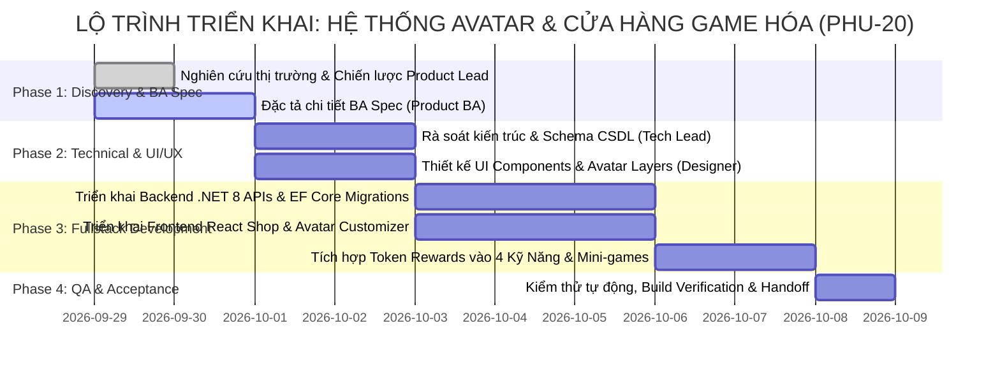

# Báo Cáo Nghiên Cứu & Chiến Lược Sản Phẩm: Hệ Thống Hồ Sơ Nhân Vật (Avatar) & Cửa Hàng Vật Phẩm Game Hóa (Gamified Shop & Token Economy)

> **Tài liệu chiến lược sản phẩm (Product Strategy & Benchmark Analysis)**  
> **Người thực hiện:** Product Lead (AI Executive)  
> **Dự án:** Nền tảng Học Tiếng Anh qua Mini-game (Learn English Platform)  
> **Mã công việc:** PHU-20  
> **Ngày lập:** 29/09/2026  

---

## 1. Bối Cảnh & Mục Tiêu Từ Ban Lãnh Đạo (Board of Directors)

Theo chỉ đạo chiến lược từ Ban Lãnh Đạo tại công việc **PHU-20**, nền tảng cần mở rộng một bước ngoặt lớn về trải nghiệm người dùng: **Biến việc học tiếng Anh thành một thế giới game hóa nhập vai sâu sắc (Deep Gamification & Role-playing)** thông qua hai trụ cột gắn kết:
1. **Hệ thống Hồ Sơ Cá Nhân & Tạo Hình Nhân Vật (Avatar Customization & Profile System):** Cho phép người học tự thiết kế nhân vật đại diện cho chính mình (giới tính nam/nữ, màu da, kiểu tóc, màu tóc, khuôn mặt, trang phục mặc định ban đầu).
2. **Cửa Hàng Vật Phẩm Game Hóa & Kinh Tế Token (Gamified Shop & Token Economy):** Khi người dùng luyện tập các kỹ năng (Nói, Viết, Đọc, Nghe) hoặc chơi mini-game, họ sẽ nhận được **Tokens**. Số token này được dùng để mua sắm vật phẩm thời trang (quần áo, mũ nón, giày dép, trang sức/phụ kiện, hiệu ứng) để làm đẹp và nâng cấp nhân vật của mình.
3. **Mục tiêu sản phẩm then chốt:**
   - **Tối đa hóa Động lực Nội tại (Intrinsic Motivation) & Sự gắn kết cảm xúc (Emotional Attachment):** Người học không chỉ tích lũy điểm số vô hình, mà nhìn thấy thành quả học tập hóa thân thành diện mạo độc đáo của nhân vật đại diện.
   - **Vòng lặp Khen thưởng Đóng kín (Closed-Loop Reward System):** Học kỹ năng ➔ Nhận Token ➔ Vào Cửa hàng Thử đồ ➔ Mua sắm & Tùy biến Avatar ➔ Khoe Avatar trên BXH, Đấu 1v1 và Profile ➔ Động lực tiếp tục học để săn vật phẩm mới.

---

## 2. Đối Sánh Thị Trường & Bài Học Thực Tiễn (Competitive Benchmarking)

| Nền tảng | Mô hình Nhân vật (Avatar) | Cơ chế Shop & Kinh tế Tiền tệ | Điểm mạnh có thể kế thừa | Lỗ hổng cần vượt qua |
| :--- | :--- | :--- | :--- | :--- |
| **Duolingo** | Duolingo Avatars (2D vector hoạt hình, tùy biến tóc, mắt, kính, áo). | Gem Shop (mua Streak Freeze, Timer Boost, trang phục chim cú Duo). | • Phong cách vector tối giản, dễ thương, tải cực nhanh.<br>• Phủ sóng avatar trên toàn bộ bảng xếp hạng bạn bè. | • Cửa hàng vật phẩm còn nghèo nàn, ít lựa chọn thời trang theo mùa.<br>• Thiếu tính năng phòng thay đồ (Fitting Room) trực quan. |
| **Habitica** | Pixel Art RPG Avatar 8-bit. Thay đổi theo lớp nhân vật (Warrior, Mage, Rogue) và trang bị. | Gold & Gems kiếm từ việc hoàn thành to-do list; mua giáp, vũ khí, thú cưng (Pets/Mounts). | • Yếu tố nhập vai cực mạnh; trang bị mang lại cảm giác thăng cấp rõ rệt.<br>• Sự tự hào khi khoe trang bị hiếm với Party/Guild. | • Đồ họa pixel kén người dùng phổ thông học ngôn ngữ.<br>• Quá phức tạp về chỉ số game (Strength, Perception, Mana). |
| **Roblox / Animal Crossing** | Nhân vật 3D tùy biến tự do từ đầu đến chân; phụ kiện phong phú. | Shop phong phú nhiều danh mục; kinh tế vật phẩm giới hạn (Limited items). | • Phòng thử đồ trực quan (Live Dressing Room).<br>• Phân cấp độ hiếm (Common, Rare, Epic, Legendary). | • Chi phí dựng hình 3D quá nặng cho web nhẹ; cần chuyển hóa thành hệ thống 2D SVG phân tầng modular. |
| **Pokemon GO** | Huấn luyện viên (Trainer) tùy biến trang phục, ba lô, nón, kính, huy hiệu. | PokeCoins kiếm được từ phòng Gym; mua sắm phong cách thời trang. | • Xuất hiện hoành tráng trong màn hình chờ thi đấu (Versus Screen) và Bục chiến thắng. | • Giá vật phẩm đắt đỏ, khuyến khích nạp tiền hơn là thành tích học tập. |

---

## 3. Kiến Trúc Giải Pháp & Bốn Trụ Cột Đột Phá (Strategic Solution Architecture)

```
                            ┌───────────────────────────────────────────────┐
                            │      NỀN TẢNG HỌC TIẾNG ANH QUA MINI-GAME     │
                            │        HỆ THỐNG AVATAR & CỬA HÀNG GAME HÓA    │
                            └───────────────────────┬───────────────────────┘
                                                    │
         ┌──────────────────────────┬───────────────┴───────────────┬──────────────────────────┐
         │                          │                               │                          │
         ▼                          ▼                               ▼                          ▼
 ┌───────────────┐          ┌───────────────┐               ┌───────────────┐          ┌───────────────┐
 │ Trụ Cột 1     │          │ Trụ Cột 2     │               │ Trụ Cột 3     │          │ Trụ Cột 4     │
 │ TOKEN ECONOMY │          │ MODULAR 2D    │               │ GAMIFIED SHOP │          │ UNIVERSAL     │
 │ LUỒNG TIỀN TỆ │          │ AVATAR SYSTEM │               │ & WARDROBE    │          │ PROFILE &     │
 │ HỌC TẬP       │          │ TẠO HÌNH NHÂN │               │ CỬA HÀNG &    │          │ SHOWCASE      │
 │ (EARN & SINK) │          │ VẬT PHÂN TẦNG │               │ PHÒNG THAY ĐỒ │          │ HIỂN THỊ RỘNG │
 └───────────────┘          └───────────────┘               └───────────────┘          └───────────────┘
```

### 3.1. Trụ Cột 1: Kinh Tế Token Bền Vững (Learn-to-Earn Token Economy)
Để tạo động lực học tập liên tục, hệ thống tiền tệ cần cân bằng hoàn hảo giữa nguồn thu (Earn Sources) và nơi tiêu thụ (Token Sinks):
1. **Luồng Thu Thập Token (Token Faucets):**
   - **Hoàn thành bài học 4 Kỹ Năng:**
     - 🎧 Bài luyện Nghe (Dictation/Listening Quiz): +10 ~ 15 Tokens.
     - 📖 Bài luyện Đọc (Reading Comprehension/Speed Scan): +10 ~ 15 Tokens.
     - ✍️ Bài luyện Viết (Sentence Writing/Collocations): +15 ~ 20 Tokens.
     - 🗣️ Bài luyện Nói (Pronunciation/Speech Assessment): +15 ~ 25 Tokens.
     - Thưởng cân bằng 4 kỹ năng trong ngày (Balanced Learner): +50 Tokens.
   - **Chơi Mini-game đạt thành tích cao:**
     - Hoàn thành ván game: +5 ~ 10 Tokens.
     - Đạt Perfect Combo / Điểm kỷ lục mới: +10 ~ 20 Tokens.
   - **Đấu Đối Kháng 1v1 Realtime:**
     - Chiến thắng trận đấu Rank: +25 Tokens.
     - Chuỗi 3 trận thắng liên tiếp: +15 Tokens bonus.
   - **Thành tích & Chuỗi Học Tập (Streak & Quests):**
     - Đạt mốc Streak 7 ngày: +100 Tokens; Mốc 30 ngày: +500 Tokens.
     - Mở Hòm Báu Nhiệm Vụ 3 Khung Giờ (Sáng - Trưa - Tối): +15 ~ 30 Tokens mỗi hòm.

2. **Luồng Tiêu Thụ Token (Token Sinks):**
   - Mua sắm vật phẩm trang phục, phụ kiện thời trang trong Cửa Hàng (giá dao động từ 100 Tokens cho đồ cơ bản đến 2,000+ Tokens cho đồ Legendary).
   - Mua vật phẩm tiện ích học tập: Băng Bảo Vệ Chuỗi (Streak Freeze - 200 Tokens), Thuốc Nhân Đôi XP (XP Potion - 150 Tokens).
   - Đổi hình nền hào quang (Auras / Backgrounds) và Danh hiệu độc quyền (Exclusive Titles).

---

### 3.2. Trụ Cột 2: Hệ Thống Nhân Vật 2D Phân Tầng Đa Lớp (Modular Layered 2D Avatar)
Nhằm đảm bảo tải siêu nhanh trên web và mobile web mà vẫn đẹp mắt, hệ thống sẽ sử dụng đồ họa **Modular Vector (SVG Components)** với các lớp xếp chồng theo đúng thứ tự hiển thị (Z-Index Hierarchy):

```
[Layer 10: Phụ Kiện Trước (Handhelds / Floating Pets / Sparkles)]
       ▲
[Layer 9: Kính Mắt / Mặt Nạ (Eyewear / Glasses)]
       ▲
[Layer 8: Mũ Nón / Phụ Kiện Đầu (Hats / Headwear)]
       ▲
[Layer 7: Tóc Mái & Tóc Phía Trước (Front Hair)]
       ▲
[Layer 6: Trang Sức Cổ / Khăn Quàng (Neckwear / Scarf)]
       ▲
[Layer 5: Áo Ngoài / Áo Khoác / Váy (Tops / Outfits)]
       ▲
[Layer 4: Quần / Chân Váy (Bottoms / Pants)]
       ▲
[Layer 3: Giày Dép (Footwear / Shoes)]
       ▲
[Layer 2: Khuôn Mặt: Mắt, Miệng, Lông Mày, Màu Da (Base Face & Expressions)]
       ▲
[Layer 1: Khung Thân Thể & Tóc Phía Sau (Base Body & Back Hair)]
       ▲
[Layer 0: Hiệu Ứng Nền / Hào Quang (Background / Aura / Pedestal)]
```

- **Tùy biến khởi tạo miễn phí (Starter Customization):**
  - **Giới tính / Khuôn mẫu hình thể:** Nam (Male), Nữ (Female), hoặc Trung tính (Neutral).
  - **Màu da (Skin Tone Palette):** 8 sắc thái màu da phổ quát (từ sáng đến ngăm bánh mật).
  - **Kiểu tóc & Màu tóc:** 10+ kiểu tóc miễn phí cơ bản kèm 8 màu nhuộm tự nhiên.
  - **Biểu cảm khuôn mặt:** Tươi cười (Smile), Tập trung (Focused), Tinh nghịch (Wink).
  - **Bộ đồ khởi đầu (Starter Outfits):** Áo thun trắng/xanh, quần jeans, giày sneakers đơn giản.

---

### 3.3. Trụ Cột 3: Cửa Hàng Vật Phẩm Game Hóa & Phòng Thay Đồ (Gamified Shop & Wardrobe)
1. **Phân Loại Danh Mục Vật Phẩm (Item Categories):**
   - 👕 **Trang Phục (Outfits / Tops & Bottoms):** Áo đồng phục học sinh, Áo khoác thám tử Sherlock, Bộ Vest doanh nhân, Áo hoodie năng động, Áo choàng pháp sư ngôn từ.
   - 🧢 **Mũ Nón (Headwear):** Mũ lưỡi trai thể thao, Mũ tốt nghiệp cử nhân, Mũ phù thủy tri thức, Tai nghe chụp tai gaming (Headphones), Vòng nguyệt quế vinh quang.
   - 👟 **Giày Dép (Footwear):** Giày sneaker thể thao, Giày tây bóng lộn, Bốt da phiêu lưu, Dép xỏ ngón năng động.
   - 👓 **Phụ Kiện & Trang Sức (Accessories):** Kính cận trí thức, Kính râm sành điệu, Khuyên tai bạc, Huy hiệu rực rỡ, Khăn choàng len.
   - ✨ **Hào Quang & Hiệu Ứng (Auras & Backgrounds):** Hiệu ứng sách bay lượn quanh người, Hào quang lửa vàng chiến thắng, Nền thư viện hoàng gia, Nền vũ trụ tri thức.
   - 🧪 **Vật Phẩm Hỗ Trợ (Consumables / Boosters):** Băng Bảo Vệ Chuỗi (Streak Freeze), Lọ Tăng Tốc XP x2 trong 30 phút.

2. **Hệ Thống Phân Cấp Độ Hiếm (Rarity Tiers):**
   - ⚪ **Common (Phổ thông):** 100 - 250 Tokens (Màu viền xám).
   - 🟢 **Rare (Hiếm):** 300 - 600 Tokens (Màu viền lục, thiết kế chi tiết).
   - 🟣 **Epic (Sử thi):** 800 - 1,500 Tokens (Màu viền lam/tím, có hiệu ứng ánh kim nhẹ).
   - 🟡 **Legendary (Huyền thoại):** 2,000 - 5,000 Tokens (Màu viền vàng kim rực rỡ, kèm hiệu ứng phát sáng lấp lánh).

3. **Phòng Thay Đồ & Thử Đồ Trực Quan (Live Fitting Room / Wardrobe):**
   - Khi bấm vào bất kỳ vật phẩm nào trong Cửa hàng, Avatar của người dùng sẽ lập tức mặc thử món đồ đó lên màn hình xem trước (Live Preview).
   - Người dùng có thể phối nhiều món đồ cùng lúc trước khi bấm "Mua tất cả" hoặc "Mua món này".
   - Tủ đồ cá nhân (My Wardrobe): Cho phép lưu các bộ phối đồ yêu thích (Presets) và thay đồ nhanh chỉ với 1 click.

---

### 3.4. Trụ Cột 4: Hồ Sơ Cá Nhân & Hiển Thị Diện Rộng (Profile & Universal Showcase)
Không để avatar chỉ nằm trong phòng thay đồ, Avatar sẽ xuất hiện tại tất cả các điểm chạm danh dự của hệ thống:
1. **Trang Profile Người Dùng Toàn Diện (Full User Profile Page):**
   - Khung hình Avatar lớn với bục danh dự (Podium) và hiệu ứng chuyển động thở nhẹ (Idle Animation).
   - Hiển thị Tên người dùng, Danh hiệu (Title, ví dụ: *"Bậc Thầy Từ Vựng"*, *"Chiến Thần Đọc Hiểu"*).
   - Cấp độ (Level), Tổng số Tokens sở hữu, Chuỗi ngày học liên tục (Streak).
   - Biểu đồ mạng nhện Radar 4 Kỹ Năng (Listening, Reading, Writing, Speaking).
   - Tủ trưng bày Huy hiệu (Badge Showcase) và Lịch sử thi đấu vinh quang.
2. **Hiển Thị Diện Rộng Trong Toàn Ứng Dụng:**
   - **Header Navbar:** Avatar thu nhỏ của người dùng kèm số dư Token hiển thị trực tiếp ở góc phải trên.
   - **Bảng Xếp Hạng Tuần (Leaderboard):** Avatar tùy biến đứng cạnh vị trí Top 1, Top 2, Top 3 trên bục vinh quang tạo động lực cạnh tranh mạnh mẽ.
   - **Màn Hình Đấu 1v1 (Versus Screen & Victory Scene):** Hai avatar đứng đối mặt nhau trước khi vào trận và avatar người chiến thắng giơ cúp ăn mừng.
   - **Study Squads:** Danh sách thành viên nhóm học tập hiển thị avatar của từng người bạn.

---

## 4. Lộ Trình Triển Khai Phân Kỳ (Phased Delivery Roadmap)



---

## 5. Kế Hoạch Điều Phối Đội Ngũ (Delegation Plan)

### 5.1. Bước 1: Giao việc cho Product BA (@Product BA)
- **Mã công việc:** Sub-task thuộc PHU-20.
- **Nhiệm vụ:** Soạn thảo tài liệu đặc tả chức năng chi tiết tại `docs/spec/avatar-customization-and-gamified-shop.md`.
- **Yêu cầu chi tiết:**
  - Quy tắc phân bổ Token thưởng cho từng kỹ năng (Nghe, Đọc, Viết, Nói, 6 Mini-games, 1v1 Battle, Daily Habit Quests).
  - Cấu trúc dữ liệu phân tầng Avatar (Avatar Layer Schema, Z-Index, Color Palettes, Default Presets).
  - Danh mục Cửa Hàng & Bảng thông số vật phẩm mẫu (Tối thiểu 25+ vật phẩm mẫu trải dài qua các danh mục và độ hiếm).
  - Luồng nghiệp vụ Mua sắm (Checkout Flow), Kiểm tra số dư Token, Trang bị vật phẩm (Equip/Unequip), Lưu cấu hình Avatar.
  - Thiết kế Schema CSDL PostgreSQL, C# EF Core entities, TypeScript interfaces và RESTful API endpoints.
  - Bộ tiêu chí nghiệm thu kiểm thử (Given-When-Then test scenarios).

### 5.2. Bước 2: Thông báo và Điều phối Tech Lead / Architect (@Tech Lead / Architect)
- **Mã công việc:** Sub-task thuộc PHU-20 (phụ thuộc kết quả của Product BA).
- **Nhiệm vụ:**
  - Rà soát tính khả thi kỹ thuật của tài liệu BA Spec.
  - Thiết kế kiến trúc CSDL PostgreSQL (bảng `user_profiles`, `avatar_configs`, `shop_items`, `user_inventory`, `token_transactions`).
  - Lập kế hoạch điều phối:
    - Giao **UI/UX Designer** dựng layout Shop, Bộ chọn Avatar phân tầng và Tủ đồ (Wardrobe).
    - Giao **Senior Fullstack Engineer** tạo EF Core Migrations, Controllers, Services và tích hợp API phía React.

### 5.3. Bước 3: Giám sát, Nghiệm thu & Báo cáo Ban Lãnh Đạo
- Theo dõi sát sao tiến độ hoàn thành của các sub-tasks.
- Xác nhận các cổng build, typecheck, test chạy thành công.
- Biên soạn Báo cáo Tổng kết Nghiệm thu (Executive Summary Report) trình Ban Lãnh Đạo và đóng milestone PHU-20.
