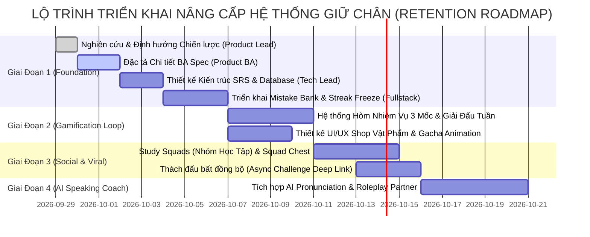

# Báo Cáo Nghiên Cứu Thị Trường & Chiến Lược Đột Phá Giữ Chân Người Dùng (Product Retention & Gamification Strategy)

> **Tài liệu chiến lược sản phẩm (Product Strategy & Benchmark Analysis)**  
> **Người thực hiện:** Product Lead (AI Executive)  
> **Dự án:** Nền tảng Học Tiếng Anh qua Mini-game (Learn English Platform)  
> **Mã công việc:** PHU-15  
> **Ngày lập:** 29/09/2026  

---

## 1. Mục Tiêu & Bối Cảnh Nghiên Cứu

Theo yêu cầu từ Ban Lãnh Đạo (Board of Directors), Product Lead tiến hành nghiên cứu chuyên sâu, đối sánh (benchmarking) các mô hình thành công nhất trên thị trường EdTech & Gamification toàn cầu (Duolingo, ELSA Speak, Quizlet, Memrise, Busuu, Kahoot, Habitica) để tìm ra các tính năng chiến lược giúp:
1. **Gia tăng mạnh mẽ tỷ lệ giữ chân người dùng (Retention Rates: D1, D7, D30)**.
2. **Hình thành thói quen học tập hàng ngày (Habit-forming Daily Loop)**.
3. **Mở rộng vòng lặp lan truyền tự nhiên (Viral Loops & Social Proof)** mà không cần chi phí quảng cáo lớn.
4. **Cung cấp giá trị học tập thực chất và cá nhân hóa (Personalized Pedagogical Value)**, biến việc chơi mini-game thành tiến trình học tập bền vững.

---

## 2. Đối Sánh Thị Trường (Competitive Benchmarking)

| Nền tảng | Thế mạnh cốt lõi | Cơ chế Giữ chân (Retention Mechanics) | Cơ chế Gamification & Lan truyền | Lỗ hổng có thể khai thác |
| :--- | :--- | :--- | :--- | :--- |
| **Duolingo** | Trải nghiệm học vi mô (Micro-learning) & Gamification đỉnh cao | • Daily Streak & Streak Freeze<br>• Early Bird & Night Owl Chests<br>• Hearts System (Áp lực cẩn thận) | • Giải đấu tuần (Bronze ➔ Diamond League)<br>• Friend Quests (Nhiệm vụ bạn bè)<br>• Monthly Badge Challenges | • Giải thích ngữ pháp còn nông<br>• Mini-game còn hạn chế về tính hành động & thời gian thực |
| **ELSA Speak** | AI Speech Recognition & Chấm điểm phát âm chuẩn xác | • Daily Coaching Plan cá nhân hóa<br>• Báo cáo điểm yếu âm vị (Phoneme breakdown)<br>• Dự đoán điểm CEFR/IELTS | • AI Roleplay scenarios đa dạng<br>• Đua top phát âm hàng tuần | • Thiếu tính cạnh tranh đối kháng trực tiếp<br>• Trải nghiệm chơi game giải trí còn thấp |
| **Quizlet & Anki** | Thuật toán lặp lại ngắt quãng (Spaced Repetition - SRS) | • Chu kỳ ôn tập từ vựng khoa học (SM-2/FSRS)<br>• Bảng theo dõi từ đã thuộc / từ hay sai (Mastery Status) | • Match Game (ghép thẻ tốc độ cao)<br>• Chia sẻ bộ thẻ học (User-generated decks) | • UI/UX khô cứng (Anki)<br>• Ít yếu tố nhập vai và cốt truyện |
| **Memrise / Busuu** | Học cùng người bản xứ & Sửa bài cộng đồng | • Video ngắn phản xạ thực tế (Learn with Locals)<br>• Người bản xứ nhận xét bài viết/nói | • Chứng chỉ trình độ sau mỗi cấp độ<br>• Huy hiệu tương tác cộng đồng | • Tốc độ mở rộng tính năng chậm, thiếu tính game hóa năng động |
| **Kahoot / Quizizz** | Đấu trường kiến thức thời gian thực | • Hiệu ứng âm thanh sôi động<br>• Áp lực bảng điểm thời gian thực | • Power-ups (Khiên bảo vệ, Nhân đôi điểm, Đóng băng đối thủ)<br>• Chế độ đấu đội nhóm | • Chỉ tập trung vào chơi nhóm ngắn hạn, thiếu tiến trình học tập cá nhân hóa dài hạn |

---

## 3. Phân Tích Hiện Trạng Nền Tảng (Current State & Gap Analysis)

### 3.1. Những gì chúng ta đã làm tốt (Assets):
1. **Cổng 4 Kỹ Năng (Four Skills Learning Hub):** Đã phân định rõ Nghe, Đọc, Viết, Nói kèm Radar Chart thể hiện độ thành thạo.
2. **Hệ thống 6 Mini-games đa dạng:** Word Match, Speed Falling, Sentence Scramble, Audio Blitz, Cloze Master, Grammar Detective.
3. **Đấu Đối Kháng 1v1 Realtime (SignalR):** Cạnh tranh kịch tính với ELO/Trophy và hệ thống Bot dự phòng.

### 3.2. Những khoảng trống chiến lược (Critical Gaps):
1. **Khoảng trống 1: Thiếu Bộ Nhớ Dài Hạn (No Long-term Memory Retention - SRS):**  
   Người dùng chơi xong 1 ván game, các từ sai trôi đi mất. Không có cơ chế tự động ghi nhận từ vựng/ngữ pháp hay sai vào "Ngân Hàng Lỗi Sai" (Mistake Bank) để ôn luyện lại vào ngày hôm sau theo chu kỳ lặp lại ngắt quãng (Spaced Repetition).
2. **Khoảng trống 2: Vòng lặp thói quen hàng ngày (Daily Habit Loop) còn mỏng:**  
   Mất chuỗi Streak gây ức chế (Chrun trigger). Chưa có vật phẩm "Bảo hiểm Chuỗi" (Streak Freeze), chưa có Hòm phần thưởng ngẫu nhiên (Surprise Daily Chests) vào các khung giờ vàng (Sáng / Tối).
3. **Khoảng trống 3: Thiếu Tính Gắn Kết Nhóm (Social Accountability & Co-op):**  
   Hiện tại mới chỉ có đấu đối kháng triệt hạ (PvP 1v1). Thiếu cơ chế **Nhóm Học Tập (Study Squads / Guilds)** để người dùng rủ bạn bè vào cùng cày điểm nhận thưởng chung.
4. **Khoảng trống 4: Thách Đấu Bất Đồng Bộ (Async Viral Challenge):**  
   Chưa có cơ chế tạo liên kết (Challenge Link) gửi qua Zalo/Facebook/Telegram để bạn bè bấm vào thách thức vượt kỷ lục điểm số.

---

## 4. Bốn Trụ Cột Chiến Lược Nâng Cấp Sản Phẩm (Four Strategic Pillars)

```
                            ┌───────────────────────────────────────────┐
                            │    NỀN TẢNG HỌC TIẾNG ANH QUA MINI-GAME   │
                            │      CHIẾN LƯỢC TĂNG TRƯỞNG & GIỮ CHÂN    │
                            └─────────────────────┬─────────────────────┘
                                                  │
         ┌────────────────────────┬───────────────┴───────────────┬────────────────────────┐
         ▼                        ▼                               ▼                        ▼
┌──────────────────┐    ┌──────────────────┐            ┌──────────────────┐     ┌──────────────────┐
│     TRỤ CỘT 1    │    │     TRỤ CỘT 2    │            │     TRỤ CỘT 3    │     │     TRỤ CỘT 4    │
│  Smart SRS &     │    │ Duolingo Habit   │            │ Social Squads &  │     │ AI Speaking &    │
│  Mistake Bank    │    │ Loop & Gacha     │            │ Async Challenges │     │ Realtime Coach   │
├──────────────────┤    ├──────────────────┤            ├──────────────────┤     ├──────────────────┤
│• Ngân hàng lỗi sai│   │• Streak Freeze   │            │• Study Squads    │     │• Nhận diện âm vị │
│• Thuật toán SM-2 │    │• Hòm thưởng 3 mốc│            │  (Nhóm 5-10 bạn) │     │  (Phoneme map)   │
│• Phòng khám điểm │    │• Giải đấu tuần   │            │• Thách đấu link  │     │• Hội thoại AI    │
│  yếu (Clinic)    │    │  (League Tiers)  │            │  (Async PvP)     │     │  (Roleplay Bot)  │
└──────────────────┘    └──────────────────┘            └──────────────────┘     └──────────────────┘
```

### Trụ Cột 1: Smart Spaced Repetition (SRS) Flashcards & Mistake Bank ("Phòng Khám Lỗi Sai")
* **Cơ chế:** Mọi câu hỏi người dùng trả lời sai ở bất kỳ mini-game nào (chọn sai từ trong Word Match, gõ sai chính tả trong Audio Blitz, chọn sai thì trong Grammar Detective) đều được hệ thống tự động lưu vào **Mistake Bank** của cá nhân.
* **Thuật toán lặp lại ngắt quãng (SM-2 / FSRS):** Hệ thống tính toán thời điểm lãng quên (Ebbinghaus Forgetting Curve) và tạo lịch nhắc ôn tập vào các mốc: 1 ngày -> 3 ngày -> 7 ngày -> 14 ngày -> 30 ngày.
* **Chế độ chơi "Weakness Clinic" (Phòng Khám Điểm Yếu):** Chế độ ôn tập nhanh chỉ xuất hiện các từ trong Mistake Bank. Khi trả lời đúng liên tục 3 lần, từ đó được thăng hạng thành "Đã Làm Chủ" (Mastered) và người dùng nhận lại Coins + XP phục hồi.
* **Tác động giữ chân:** Tạo lý do mạnh mẽ nhất để người học mở app mỗi ngày: "Hôm nay bạn có 8 từ vựng cần giải cứu trước khi bị quên!".

### Trụ Cột 2: Duolingo-style Daily Habit Loop (Streak Freeze, Daily Quest Chests & Weekly Leagues)
* **Streak Freeze (Bảo Vệ Chuỗi):** Cho phép người dùng trang bị tối đa 2 "Băng bảo vệ chuỗi". Nếu bận không vào học được 1 ngày, Băng bảo vệ tự kích hoạt để giữ nguyên Streak, tránh tình trạng bỏ học vì nản lòng khi đứt chuỗi 50 ngày.
* **Daily Quest Chests (Hòm Báu 3 Khung Giờ):**
  - Hòm Bình Minh (06:00 - 10:00): Thưởng +20% XP cho các bài học buổi sáng.
  - Hòm Năng Lượng (11:30 - 13:30): Nhận vé đấu 1v1 miễn phí.
  - Hòm Hoàng Hôn (19:00 - 23:00): Tích lũy mở Hòm Siêu Cấp nhận huy hiệu hiếm và Coins.
* **Hệ Thống Giải Đấu Tuần (Weekly Leagues):**
  - Chia nhóm 30 người chơi cùng phân hạng (Đồng, Bạc, Vàng, Lam Ngọc, Kim Cương).
  - Kết thúc lúc 23:59 Chủ Nhật hàng tuần: Top 7 thăng hạng (Promotion Zone), Top 5 dưới cùng xuống hạng (Demotion Zone). Tạo động lực cạnh tranh cày game liên tục.

### Trụ Cột 3: Social Study Squads & Async Viral Challenges
* **Study Squads (Nhóm Học Tập 5 - 10 Người):**
  - Người dùng lập nhóm học cùng bạn bè hoặc đồng nghiệp.
  - Cả nhóm có một **Thanh Tiến Độ Chung (Squad Weekly Goal)**, ví dụ: Toàn đội đạt 5,000 XP/tuần.
  - Khi hoàn thành, toàn bộ thành viên đều nhận được Hòm Kho Báu Nhóm (Squad Mega Chest) và Khung Avatar vinh danh.
* **Thách Đấu Bất Đồng Bộ (Async Challenge Link):**
  - Sau khi lập kỷ lục một ván chơi (ví dụ 1,200 điểm ở Speed Falling Word), người chơi có thể bấm "Thách đấu bạn bè".
  - Hệ thống tạo ra một Deep Link / Short Link kèm ảnh preview thành tích.
  - Người bạn mở link có thể chơi ngay ván đấu với cùng bộ từ vựng đó để đọ điểm trực tiếp mà không cần cả hai phải online cùng lúc.

### Trụ Cột 4: AI Speaking Partner & Pronunciation Phoneme Heatmap
* **Đặc tả trải nghiệm:** Tận dụng Web Speech API và Gemini AI để nâng cấp kỹ năng Nói (Speaking):
  - **Phoneme Heatmap:** Hiển thị từ vựng với các âm vị được tô màu trực quan: Xanh lá (Phát âm chuẩn), Vàng (Gần đúng/cần nhấn âm lại), Đỏ (Phát âm sai hẳn).
  - **Interactive AI Roleplay:** Người học trò chuyện giọng nói với AI theo các tình huống đời thực (Gọi món Starbucks, Trả lời phỏng vấn việc làm, Hỏi đường du lịch). AI phản hồi bằng giọng đọc tự nhiên và gợi ý sửa lỗi ngữ pháp/từ vựng ngay sau mỗi lượt thoại.

---

## 5. Lộ Trình Triển Khai Phân Kỳ (Phased Delivery Roadmap)



* **Phase 1 (Ưu tiên số 1 - Immediate Impact):**
  - **Mistake Bank & Spaced Repetition (SRS Flashcards):** Thu thập lỗi sai tự động, thuật toán SM-2 tính chu kỳ ôn tập.
  - **Duolingo-style Streak Protection:** Vật phẩm Streak Freeze và màn hình Cứu Chuỗi.
* **Phase 2 (Gamification & Engagement):**
  - **Daily Quest Chests (Hòm 3 khung giờ):** Kích hoạt người dùng quay lại nhiều lần trong ngày.
  - **Weekly League (Giải đấu tuần 30 người):** Thăng hạng/xuống hạng tự động lúc Chủ Nhật.
* **Phase 3 (Social Growth & Virality):**
  - **Study Squads (Nhóm học tập 5-10 người):** Đua điểm nhóm mở rương chung.
  - **Async Challenge Links:** Lan truyền qua mạng xã hội và tin nhắn.
* **Phase 4 (AI Deep Learning):**
  - **AI Speaking Partner & Phoneme Heatmap:** Nâng cấp đột phá cho kỹ năng Nói.

---

## 6. Chỉ Tiêu Thành Công Đo Lường (Key Performance Indicators - KPIs)

1. **User Retention:**
   - **D1 Retention:** Tăng từ mức cơ sở lên **> 45%** (nhờ Streak & Hòm bình minh).
   - **D7 Retention:** Tăng lên **> 25%** (nhờ Weekly League và Mistake Bank SRS).
   - **D30 Retention:** Đạt **> 15%** (nhờ Study Squads và cấp bậc League).
2. **Engagement & Session Time:**
   - Số phiên chơi bình quân/người dùng/ngày: Tăng từ 1.2 phiên lên **2.8 phiên/ngày**.
   - Thời gian sử dụng trung bình (Average Session Duration): Đạt **15 - 20 phút/ngày**.
3. **Viral Coefficient (K-factor):**
   - Đạt K-factor **> 0.35** thông qua Async Challenge Links và lời mời tham gia Study Squad.

---

## 7. Giao Việc Cho Đội Ngũ Trực Thuộc (Delegation Protocol)

### 7.1. Giao cho Product BA (`37c318ff-653b-4461-a1ea-36602bae2e40`):
- **Nhiệm vụ:** Viết bộ tài liệu đặc tả chức năng và cơ chế game hoàn chỉnh tại `docs/spec/retention-and-gamification-expansion.md`.
- **Yêu cầu cụ thể:**
  1. Quy tắc chi tiết của **Mistake Bank & Thuật toán lặp lại ngắt quãng (SRS SM-2)**: Công thức tính khoảng cách ngày ôn tập, hệ số dễ/khó (Ease Factor), điều kiện tốt nghiệp lỗi sai.
  2. Cơ chế **Streak Freeze & Mua vật phẩm cứu chuỗi**: Giá mua bằng Coins, quy tắc tự động kích hoạt khi quên học 1 ngày, giới hạn tích trữ tối đa.
  3. Cơ chế **Daily Quest Chests & Weekly Leagues**: Danh mục 3 nhiệm vụ ngày, tỷ lệ rơi quà hòm báu, quy tắc xếp nhóm 30 người và thăng/hạ hạng cuối tuần.
  4. Cơ chế **Study Squads & Async Challenge**: Mô hình thành viên, cách tích lũy XP nhóm, cấu trúc Deep Link thách đấu bất đồng bộ.
  5. Thiết kế Data Model (PostgreSQL DDL / C# Entities / TypeScript DTOs) và kịch bản nghiệm thu Given-When-Then cho từng tính năng.

### 7.2. Giao cho Tech Lead / Architect (`11dba413-036f-4ce1-950e-252419384dce`):
- **Nhiệm vụ:** Chuẩn bị sẵn sàng kiến trúc kỹ thuật:
  1. Thiết kế Background Job (Cron / Hangfire / Periodic HostedService) để xử lý tính toán SRS decay hàng ngày và chốt bảng xếp hạng Weekly League vào 23:59 Chủ Nhật.
  2. Thiết kế schema bảng CSDL tối ưu cho Mistake Bank (quan hệ UserMistake, ReviewSchedule, StudySquad, SquadMember).
  3. Đánh giá giải pháp Web Speech API / Gemini Audio API cho tính năng AI Speaking & Phoneme evaluation.
  4. Điều phối UI/UX Designer và Senior Fullstack Engineer triển khai theo các chặng sau khi BA hoàn thành spec.
