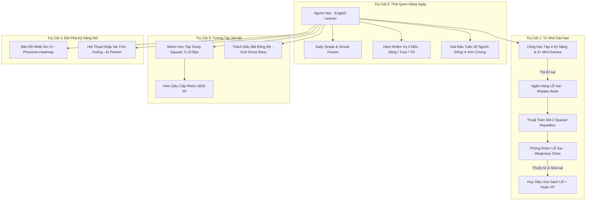
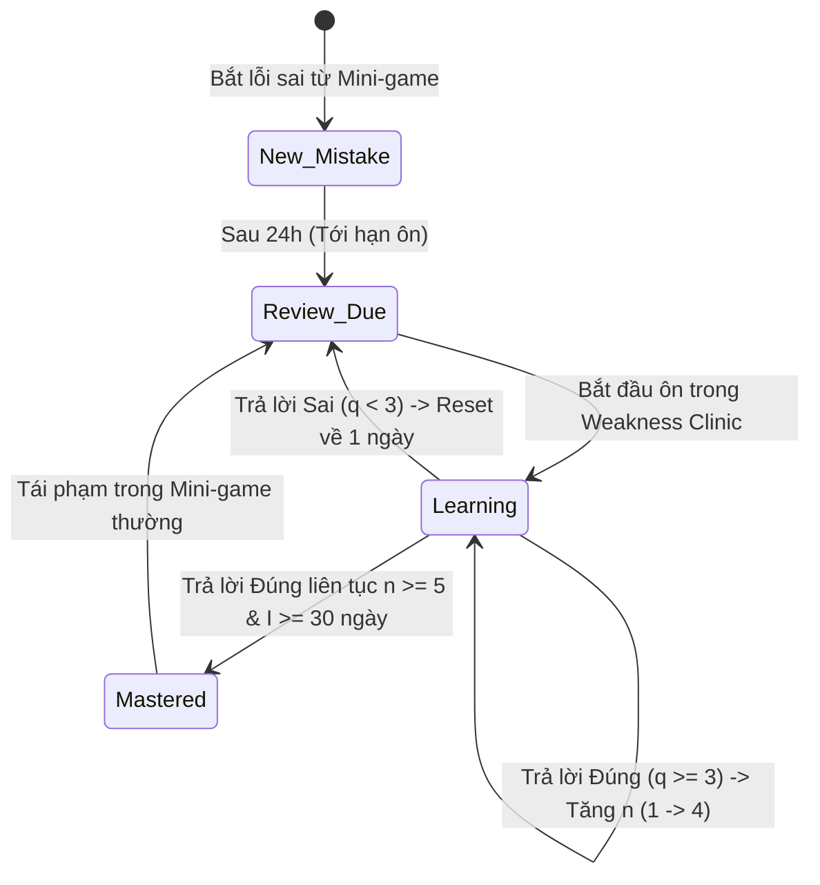

# Đặc Tả Nghiệp Vụ & Thiết Kế Chức Năng: Hệ Thống Giữ Chân Người Dùng & Gamification Nâng Cao (SRS Flashcards, Daily Habit Loop, Study Squads & AI Speaking)

**Mã tài liệu:** `SPEC-RETENTION-GAMIFICATION-V1`  
**Phiên bản:** 1.0  
**Tác giả:** Senior Product Business Analyst (Product BA)  
**Người nhận bàn giao:** Tech Lead / Architect (`11dba413-036f-4ce1-950e-252419384dce`), UI/UX Designer, Senior Fullstack Engineer, QA Team  
**Ngày ban hành:** 29/09/2026  
**Dự án liên quan:** Learn English Mini-game Platform  
**Trạng thái:** Đã hoàn thiện - Sẵn sàng chuyển giao kiến trúc & triển khai kỹ thuật  

---

## 1. Tổng Quan & Bối Cảnh Chiến Lược (Executive Summary)

### 1.1. Mục Tiêu Sản Phẩm & Định Hướng Giữ Chân (Retention Goals)
Dựa trên báo cáo nghiên cứu đối chuẩn thị trường tại [`docs/spec/product-research-retention-expansion.md`](./product-research-retention-expansion.md) (tham chiếu mô hình thành công của Duolingo, ELSA Speak, Quizlet, Anki và Kahoot), nền tảng học tiếng Anh qua mini-game chuyển mình từ một "Arcade giải trí ngắn hạn" thành một **Hệ sinh thái học tập hình thành thói quen lâu dài (Habit-forming Learning Ecosystem)**.

Mục tiêu định lượng chiến lược:
1. **D1 Retention:** Đạt **> 45%** (nhờ cơ chế Streak Freeze và Hòm nhiệm vụ Bình minh).
2. **D7 Retention:** Đạt **> 25%** (nhờ Giải đấu tuần Weekly League 30 người và Ngân hàng lỗi sai Spaced Repetition).
3. **D30 Retention:** Đạt **> 15%** (nhờ Nhóm học tập Study Squads và cấp bậc Giải đấu).
4. **Hệ số Lan truyền Tự nhiên (Viral K-factor):** Đạt **> 0.35** thông qua Liên kết thách đấu bất đồng bộ (Async Challenge Links).

---

## 2. Kiến Trúc 4 Trụ Cột Giữ Chân (Core Pillars Architecture)



---

## 3. Đặc Tả Chi Tiết Từng Phân Hệ Chức Năng

---

### Phân Hệ 1: Ngân Hàng Lỗi Sai (Mistake Bank) & Thuật Toán Lặp Lại Ngắt Quãng (SRS Flashcards)

#### 1.1. Cơ Chế Thu Thập Lỗi Sai Tự Động (Automatic Mistake Capture)
Trong quá trình người dùng chơi bất kỳ mini-game nào trong hệ thống (Word Match, Speed Falling, Sentence Scramble, Audio Blitz, Cloze Master, Grammar Detective, v.v.):
- Mỗi khi người dùng chọn đáp án sai, gõ sai chính tả hoặc sắp xếp sai cú pháp:
  - Client gửi payload kết thúc ván hoặc submit câu hỏi về Backend.
  - Backend tự động trích xuất các câu hỏi bị làm sai, kiểm tra xem từ/câu hỏi đó đã tồn tại trong `user_mistakes` của người dùng chưa:
    - Nếu **chưa có:** Tạo một bản ghi mới với trạng thái `new_mistake`, số lần lặp $n = 0$, hệ số $EF = 2.5$, ngày ôn tập kế tiếp $NextReviewAt = Now + 1\text{ ngày}$.
    - Nếu **đã có và đang ở trạng thái `mastered`:** Đưa trạng thái trở lại `learning`, reset $n = 0$, giữ nguyên hoặc giảm nhẹ hệ số $EF$.
    - Nếu **đang trong chu trình ôn tập (`learning` hoặc `review_due`):** Tăng trường `failure_count`, cập nhật lại mốc ôn tập sớm nhất.

#### 1.2. Thuật Toán Lặp Lại Ngắt Quãng SuperMemo-2 (SM-2) Chuẩn Hóa
Khoảng cách ngày ôn tập $I(n)$ (Interval in days) và Hệ số Dễ/Khó $EF$ (Ease Factor) được tính toán theo quy tắc:

1. **Thang điểm chất lượng phản hồi ($q \in \{0, 1, 2, 3, 4, 5\}$):**
   - $q = 5$ (Hoàn hảo - Easy): Nhớ ngay lập tức, không tốn thời gian suy nghĩ ($< 3$ giây).
   - $q = 4$ (Đúng - Good): Trả lời đúng sau một chút do dự (3 - 7 giây).
   - $q = 3$ (Khó - Hard): Trả lời đúng nhưng mất nhiều thời gian hoặc bấm nhầm 1 lần ($> 7$ giây).
   - $q = 2$ (Sai nhẹ - Again/Incorrect): Chọn sai nhưng khi thấy đáp án nhận ra ngay.
   - $q = 1$ (Quên hẳn - Blackout): Hoàn toàn không nhớ từ/quy tắc này.
   - $q = 0$ (Hoàn toàn mù tịt).

2. **Công thức tính khoảng cách lặp lại $I(n)$:**
   $$\begin{cases}
   I(1) = 1 \text{ ngày} & \text{với } n = 1 \\
   I(2) = 3 \text{ ngày} & \text{với } n = 2 \\
   I(3) = 7 \text{ ngày} & \text{với } n = 3 \\
   I(4) = 14 \text{ ngày} & \text{với } n = 4 \\
   I(5) = 30 \text{ ngày} & \text{với } n = 5 \\
   I(n) = \text{Round}(I(n-1) \times EF) & \text{với } n > 5
   \end{cases}$$

3. **Công thức cập nhật Hệ số Dễ/Khó $EF$:**
   $$EF' = EF + (0.1 - (5 - q) \times (0.08 + (5 - q) \times 0.02))$$
   - Giới hạn sàn: $EF \ge 1.3$ (tránh việc một từ bị lặp lại quá dày đặc vô tận).
   - Nếu $q < 3$ (người dùng trả lời sai trong buổi ôn tập):
     - Reset số lần ôn đúng liên tiếp: $n = 0$.
     - Khoảng cách ôn tập tiếp theo: $I = 1\text{ ngày}$.
   - Nếu $q \ge 3$ (trả lời đúng):
     - Tăng số lần ôn đúng liên tiếp: $n = n + 1$.
     - Nếu $n \ge 5$ và $I(n) \ge 30\text{ ngày}$: Bản ghi được chuyển sang trạng thái **`mastered`** (Đã làm chủ hoàn toàn).

#### 1.3. Vòng Đời Trạng Thái Lỗi Sai (State Machine)


#### 1.4. Chế Độ Chơi Ôn Tập: "Phòng Khám Lỗi Sai" (Weakness Clinic)
- **Vị trí UI:** Nút nổi bật kèm huy hiệu đỏ hiển thị số lượng từ tới hạn ôn: `🩺 Phòng Khám Lỗi Sai (8 từ cần chữa)`.
- **Cấu trúc phiên ôn tập:**
  - Mỗi phiên gồm 10 thẻ câu hỏi (Flashcard lật thẻ, Gõ lại chính tả, hoặc Trắc nghiệm ngữ cảnh 4 đáp án).
  - Không tính áp lực thời gian đếm ngược (để người học đọc kỹ giải thích).
- **Cơ chế thưởng phục hồi (Recovery Rewards):**
  - Mỗi câu trả lời đúng ($q \ge 3$): Nhận lại **+10 XP** và **+2 Coins** (bù đắp số điểm đã mất khi làm sai trong game trước).
  - Khi hoàn thành toàn bộ số từ tới hạn trong ngày: Nhận Huy hiệu danh giá **"Bác Sĩ Trị Lỗi" (Bug Slayer)** và thưởng Bonus **+30 Coins**.

---

### Phân Hệ 2: Vòng Lặp Thói Quen Hàng Ngày (Duolingo-style Daily Habit Loop)

#### 2.1. Bảo Vệ Chuỗi (Streak Freeze & Streak Repair)
- **Quy tắc tính Daily Streak:**
  - Một ngày học hợp lệ (Active Day) được tính khi người dùng kiếm được ít nhất **10 XP** trong khoảng thời gian từ `00:00:00` đến `23:59:59` theo múi giờ địa phương của người dùng (`Asia/Ho_Chi_Minh` - UTC+7 mặc định).
  - Hoàn thành liên tục các ngày $\implies$ Streak tăng $+1$.
- **Vật phẩm Bảo Vệ Chuỗi (Streak Freeze):**
  - **Nơi bán:** Cửa hàng Vật Phẩm (Item Shop).
  - **Giá bán:** `100 Coins` / 1 Freeze.
  - **Giới hạn lưu trữ:** Tối đa **2 Freeze** trong hòm đồ cá nhân cùng một thời điểm.
- **Cơ chế kích hoạt tự động (Auto-Consume at Midnight):**
  - Định kỳ lúc `00:00:05` hàng ngày, một Background Service chạy kiểm tra:
    - Nếu người dùng KHÔNG có hoạt động học tập nào trong ngày hôm qua:
      - Nếu `streak_freeze_count > 0`: Trừ 1 Freeze, giữ nguyên `current_streak`, đánh dấu ngày đó là `is_frozen = true`, tạo thông báo In-app: *"🧊 Chiếc Băng Bảo Vệ đã kích hoạt để giữ vững chuỗi 15 ngày của bạn!"*.
      - Nếu `streak_freeze_count == 0`: Reset `current_streak = 0`.
- **Cơ chế Cứu Chuỗi Trong 24 Giờ (Streak Repair Window):**
  - Khi người dùng bị mất chuỗi vì không có Freeze, trong vòng 24 giờ tiếp theo khi mở app, hiển thị màn hình Cứu Chuỗi: Cho phép bỏ ra `200 Coins` (hoặc xem 1 bài chia sẻ) để phục hồi lại chuỗi ngày học đã mất. Mỗi tháng chỉ được cứu chuỗi tối đa 1 lần.

#### 2.2. Hòm Báu Nhiệm Vụ 3 Mốc (Daily Quest Chests)
Nhằm kéo người dùng quay trở lại app nhiều lần trong ngày (Multi-session engagement), hệ thống thiết lập 3 hòm nhiệm vụ theo khung giờ vàng:

| Mốc Nhiệm Vụ | Khung Giờ (UTC+7) | Điều Kiện Mở Hòm | Phần Thưởng | Tác Động Giữ Chân |
| :--- | :--- | :--- | :--- | :--- |
| **🌅 Hòm Bình Minh (Early Bird Chest)** | 06:00 - 10:00 | Hoàn thành ít nhất 1 bài học/mini-game trong khung giờ sáng | • **+20% XP Booster** trong 30 phút kế tiếp.<br>• 10 Coins. | Khởi đầu ngày mới với thói quen học tiếng Anh; kích thích học tiếp nhờ hiệu ứng Booster. |
| **☀️ Hòm Năng Lượng (Lunchtime Boost)** | 11:30 - 13:30 | Chơi tối thiểu 1 ván mini-game bất kỳ | • **1 Vé Đấu 1v1 Miễn Phí (Battle Ticket)**.<br>• 15 Coins. | Tận dụng thời gian nghỉ trưa của học sinh/dân văn phòng để vào game so tài. |
| **🌙 Hòm Báu Ngày (Daily Master Chest)** | Cả ngày (Reset 23:59) | Hoàn thành trọn vẹn 3 nhiệm vụ ngày (ví dụ: Đạt 100 XP, Ôn 5 thẻ Mistake, Thắng 1 trận 1v1) | • **Gacha Hộp Quà:**<br>  - 70%: 50 - 100 Coins<br>  - 25%: 100 - 200 XP<br>  - 5%: Trúng 1 Streak Freeze hoặc Mảnh Avatar hiếm. | Vòng lặp đóng ngày trọn vẹn; tạo cảm giác thỏa mãn và bất ngờ (Variable Reward). |

#### 2.3. Giải Đấu Tuần (Weekly Leagues & 30-Player Division)
- **5 Cấp bậc Giải đấu (League Tiers):**
  1. 🥉 **Bronze (Đồng)** — Khởi đầu mặc định.
  2. 🥈 **Silver (Bạc)**
  3. 🥇 **Gold (Vàng)**
  4. 💎 **Sapphire (Lam Ngọc)**
  5. 👑 **Diamond (Kim Cương)** — Đấu trường đỉnh cao của các bậc thầy.
- **Cơ chế Xếp Phòng 30 Người (Rolling 30-Player Cohort):**
  - Không xếp bảng tĩnh theo danh sách user. Khi một tuần mới bắt đầu (từ 00:00 Thứ Hai), người dùng chỉ thực sự được đưa vào một phòng đấu 30 người (League Room) sau khi hoàn thành bài học đầu tiên trong tuần đó.
  - Cơ chế này đảm bảo người chơi được ghép cùng những người có mức độ tích cực tương đương nhau (Active Cohort Matching), không bị tình trạng phòng "chết".
- **Quy tắc Thăng / Giữ / Rớt Hạng (Chốt lúc 23:59:59 Chủ Nhật UTC+7):**
  - **Top 1 - 7 (Vùng Thăng Hạng - Promotion Zone):** Thăng lên League cao hơn vào tuần sau + Thưởng Rương Vinh Quang (Coins, Khung viền Avatar).
  - **Top 8 - 25 (Vùng An Toàn - Safe Zone):** Trụ hạng tại League hiện tại.
  - **Top 26 - 30 (Vùng Rớt Hạng - Demotion Zone):** Rớt xuống League thấp hơn liền kề (Ngoại trừ Bronze League không bao giờ bị rớt hạng).
  - **Top 3 Chung Cuộc (Podium Winners):** Nhận Cúp Tuần (Vàng, Bạc, Đồng) ghim cố định trên trang cá nhân.

---

### Phân Hệ 3: Tính Năng Xã Hội Hợp Tác (Study Squads & Async Challenges)

#### 3.1. Nhóm Học Tập Hợp Tác (Study Squads - 5 đến 10 Thành Viên)
- **Quy mô:** Tối thiểu 2, tối đa **10 thành viên/nhóm** (giữ quy mô nhỏ để tạo sự thân thiết và trách nhiệm đồng đội, không loãng như Guild 50 người).
- **Mã gia nhập (Squad Code):** Mỗi nhóm có một mã định danh 6 ký tự ngẫu nhiên (ví dụ `SQUAD9`) hoặc Link mời trực tiếp.
- **Mục Tiêu Nhóm Hàng Tuần (Weekly Squad Quest):**
  - Toàn nhóm cùng đóng góp XP học tập tích lũy từ Thứ Hai đến Chủ Nhật.
  - Các mốc mở khóa rương báu nhóm:
    - **Mốc 1 (1,000 XP):** Rương Gỗ Nhóm $\implies$ +20 Coins cho mỗi thành viên.
    - **Mốc 2 (2,500 XP):** Rương Bạc Nhóm $\implies$ +50 Coins + 1 Giờ Double XP cho mỗi thành viên.
    - **Mốc 3 (5,000 XP):** **Hòm Siêu Cấp Nhóm (Squad Mega Chest)** $\implies$ +150 Coins + 1 Băng Bảo Vệ Chuỗi (Streak Freeze) + Huy hiệu "Biệt Đội Chăm Chỉ".
- **Điều kiện nhận thưởng:** Thành viên phải đóng góp tối thiểu **100 XP** trong tuần đó để tránh tình trạng "ngồi mát ăn bát vàng" (Anti-free-riding rule).
- **Bảng Vinh Danh Nội Bộ:** Hiển thị danh hiệu `Squad MVP` cho người có số XP đóng góp cao nhất trong tuần.

#### 3.2. Thách Đấu Bất Đồng Bộ Qua Liên Kết (Async Viral Challenge Links)
- **Kịch bản trải nghiệm (User Flow):**
  1. Người dùng A chơi một ván game (ví dụ: Speed Falling Word đạt 1,250 điểm hoặc Audio Blitz đúng 10/10 câu).
  2. Tại màn hình tổng kết, hiển thị nút CTA nổi bật: **"⚔️ Thách Đấu Bạn Bè Vượt Kỷ Lục Này"**.
  3. Hệ thống sinh ra một `challenge_token` mang metadata:
     - `game_type`: Loại trò chơi (`speed_falling`, `audio_blitz`, `word_match`, v.v.).
     - `game_seed`: Seed ngẫu nhiên để client sinh ra bộ từ vựng và thứ tự rơi y hệt ván chơi của người A.
     - `target_score`: Điểm số người A đạt được (1,250 điểm).
     - `time_limit`: Thời gian ván đấu.
  4. Người A chia sẻ link qua Facebook, Zalo, Telegram, Messenger (`https://learnenglish.app/challenge/CHL-8F92A`).
  5. Người B bấm vào link:
     - Được dẫn thẳng vào phòng đấu với giao diện "Đua với Bóng" (Ghost Race): Thanh tiến độ hiển thị avatar và điểm số của Người A chạy song song.
     - Sau khi kết thúc ván:
       - Nếu B $\ge$ A: Người B thắng cuộc $\implies$ B nhận **+50 Coins**, Người A nhận thông báo *"Bạn B đã phá kỷ lục của bạn! Nhận ngay +20 Coins quà thách đấu"*.
       - Nếu B $<$ A: Người A giữ vững ngôi vị $\implies$ Cả 2 đều nhận **+10 Coins** khích lệ.
  6. **Động lực Viral:** Biến mỗi ván game thành một mẩu nội dung có thể chia sẻ, thu hút người dùng mới tham gia nền tảng mà không tốn chi phí Marketing.

---

### Phân Hệ 4: Tích Hợp AI Luyện Nói (AI Speaking Partner & Phoneme Heatmap)

#### 4.1. Cơ Chế Bản Đồ Nhiệt Âm Vị (Phoneme Scoring Heatmap)
- **Công nghệ nền tảng:** Kết hợp Web Speech API (Client) và Audio Recognition / Phonetic Alignment Service (Backend/Gemini API).
- **Quy trình đánh giá:**
  1. Người học phát âm một từ hoặc câu mẫu (ví dụ: *"She sells seashells by the seashore"*).
  2. Hệ thống thu âm và chuyển đổi âm thanh thành chuỗi âm vị chuẩn IPA (International Phonetic Alphabet).
  3. So khớp từng âm vị (Phoneme) với IPA chuẩn của người bản xứ và chấm điểm từ 0 đến 100%:
     - 🟢 **Xanh lá ($\ge 85\%$):** Phát âm chuẩn xác, rõ ràng.
     - 🟡 **Vàng ($60\% - 84\%$):** Phát âm tạm được nhưng sai trọng âm hoặc phát âm chưa dứt khoát.
     - 🔴 **Đỏ ($< 60\%$):** Phát âm sai âm vị cốt lõi, nuốt âm hoặc thiếu âm đuôi (Ending sounds như /-s/, /-t/, /-d/, /-θ/).
- **Giao diện trực quan:** Hiển thị từng âm tiết với màu sắc tương ứng, cho phép bấm vào từng âm đỏ để nghe lại khẩu hình mẫu và so sánh với âm thanh mình vừa đọc.

#### 4.2. Kịch Bản Hội Thoại Nhập Vai Tình Huống Với AI (Interactive AI Roleplay)
- **Danh mục tình huống thực tế (Roleplay Scenarios):**
  1. ☕ *At the Coffee Shop:* Đặt món, yêu cầu tùy chỉnh đường/sữa, thanh toán.
  2. 💼 *Job Interview Prep:* Giới thiệu bản thân, trả lời điểm mạnh/yếu theo phương pháp STAR.
  3. ✈️ *Airport & Hotel Check-in:* Xử lý tình huống thất lạc hành lý, đổi phòng khách sạn.
  4. 🎓 *IELTS Speaking Part 1 & 2 Practice:* Trả lời câu hỏi học thuật với thời gian chuẩn bị 1 phút.
- **Vòng lặp tương tác (Multi-turn Loop):**
  - AI đọc câu thoại bằng giọng đọc tự nhiên (TTS chuẩn US/UK).
  - Người dùng bấm giữ micro để nói câu trả lời của mình (STT chuyển thành văn bản).
  - AI chấm điểm tức thì và đưa ra câu phản hồi tiếp theo để tiếp nối mạch câu chuyện.
- **Báo cáo tổng kết buổi nói (Post-session Scorecard):**
  - **Điểm Trôi Chảy (Fluency):** Tốc độ nói (WPM - Words Per Minute) và độ ngập ngừng.
  - **Độ Chuẩn Ngữ Pháp (Grammar Accuracy):** Nhắc nhở các lỗi chia động từ, giới từ phát sinh khi nói.
  - **Độ Phong Phú Từ Vựng (Lexical Resource):** Đánh giá mức độ sử dụng từ vựng theo khung tham chiếu CEFR (A2, B1, B2, C1).

---

## 4. Thiết Kế Cơ Sở Dữ Liệu (PostgreSQL Schema & EF Core Entities)

### 4.1. Lược Đồ DDL PostgreSQL

```sql
-- 1. Bảng Ngân Hàng Lỗi Sai (Mistake Bank)
CREATE TABLE user_mistakes (
    id UUID PRIMARY KEY DEFAULT gen_random_uuid(),
    user_id UUID NOT NULL REFERENCES users(id) ON DELETE CASCADE,
    question_id UUID,
    game_type VARCHAR(50) NOT NULL, -- 'word_match', 'speed_falling', 'sentence_scramble', 'audio_blitz', 'cloze_master', 'grammar_detective'
    target_text VARCHAR(255) NOT NULL, -- Từ hoặc cụm từ hoặc cấu trúc bị sai
    prompt_question TEXT NOT NULL,
    user_wrong_answer TEXT NOT NULL,
    correct_answer TEXT NOT NULL,
    explanation TEXT,
    repetition_number INT NOT NULL DEFAULT 0, -- Số lần trả lời đúng liên tiếp (n trong SM-2)
    interval_days INT NOT NULL DEFAULT 1, -- Khoảng cách ngày ôn tập kế tiếp (I trong SM-2)
    ease_factor NUMERIC(4, 2) NOT NULL DEFAULT 2.50, -- Hệ số dễ/khó (EF trong SM-2, min 1.30)
    failure_count INT NOT NULL DEFAULT 1, -- Tổng số lần làm sai
    next_review_at TIMESTAMP WITH TIME ZONE NOT NULL, -- Thời điểm đến hạn ôn tập
    status VARCHAR(30) NOT NULL DEFAULT 'new_mistake', -- 'new_mistake', 'learning', 'review_due', 'mastered'
    created_at TIMESTAMP WITH TIME ZONE NOT NULL DEFAULT NOW(),
    updated_at TIMESTAMP WITH TIME ZONE NOT NULL DEFAULT NOW()
);

CREATE INDEX idx_user_mistakes_due ON user_mistakes(user_id, status, next_review_at);
CREATE INDEX idx_user_mistakes_target ON user_mistakes(user_id, target_text);

-- 2. Nhật Ký Ôn Tập Thuật Toán SM-2 (Mistake Review Logs)
CREATE TABLE mistake_review_logs (
    id UUID PRIMARY KEY DEFAULT gen_random_uuid(),
    mistake_id UUID NOT NULL REFERENCES user_mistakes(id) ON DELETE CASCADE,
    user_id UUID NOT NULL REFERENCES users(id) ON DELETE CASCADE,
    rating_q INT NOT NULL, -- 0 đến 5 theo chuẩn SM-2
    previous_interval INT NOT NULL,
    new_interval INT NOT NULL,
    previous_ef NUMERIC(4, 2) NOT NULL,
    new_ef NUMERIC(4, 2) NOT NULL,
    reviewed_at TIMESTAMP WITH TIME ZONE NOT NULL DEFAULT NOW()
);

-- 3. Bảng Quản Lý Chuỗi Học Tập & Bảo Hiểm Chuỗi (Streak Management)
CREATE TABLE user_streaks (
    user_id UUID PRIMARY KEY REFERENCES users(id) ON DELETE CASCADE,
    current_streak INT NOT NULL DEFAULT 0,
    max_streak INT NOT NULL DEFAULT 0,
    streak_freeze_count INT NOT NULL DEFAULT 0, -- Số lượng băng bảo vệ đang sở hữu (max 2)
    last_learned_date DATE,
    is_frozen_yesterday BOOLEAN NOT NULL DEFAULT FALSE,
    repaired_at TIMESTAMP WITH TIME ZONE,
    updated_at TIMESTAMP WITH TIME ZONE NOT NULL DEFAULT NOW()
);

-- 4. Bảng Nhiệm Vụ Hàng Ngày & Hòm Thưởng 3 Mốc (Daily Quests & Chests)
CREATE TABLE daily_quest_progress (
    id UUID PRIMARY KEY DEFAULT gen_random_uuid(),
    user_id UUID NOT NULL REFERENCES users(id) ON DELETE CASCADE,
    quest_date DATE NOT NULL,
    morning_chest_claimed BOOLEAN NOT NULL DEFAULT FALSE,
    noon_chest_claimed BOOLEAN NOT NULL DEFAULT FALSE,
    daily_chest_claimed BOOLEAN NOT NULL DEFAULT FALSE,
    games_played_count INT NOT NULL DEFAULT 0,
    xp_earned_today INT NOT NULL DEFAULT 0,
    mistakes_reviewed_count INT NOT NULL DEFAULT 0,
    created_at TIMESTAMP WITH TIME ZONE NOT NULL DEFAULT NOW(),
    updated_at TIMESTAMP WITH TIME ZONE NOT NULL DEFAULT NOW(),
    CONSTRAINT uq_user_quest_date UNIQUE (user_id, quest_date)
);

-- 5. Bảng Giải Đấu Tuần (Weekly Leagues & 30-Player Rooms)
CREATE TABLE league_seasons (
    id UUID PRIMARY KEY DEFAULT gen_random_uuid(),
    season_number INT NOT NULL UNIQUE,
    starts_at TIMESTAMP WITH TIME ZONE NOT NULL,
    ends_at TIMESTAMP WITH TIME ZONE NOT NULL,
    is_closed BOOLEAN NOT NULL DEFAULT FALSE
);

CREATE TABLE league_rooms (
    id UUID PRIMARY KEY DEFAULT gen_random_uuid(),
    season_id UUID NOT NULL REFERENCES league_seasons(id) ON DELETE CASCADE,
    league_tier VARCHAR(30) NOT NULL, -- 'bronze', 'silver', 'gold', 'sapphire', 'diamond'
    room_number INT NOT NULL,
    member_count INT NOT NULL DEFAULT 0,
    max_members INT NOT NULL DEFAULT 30,
    created_at TIMESTAMP WITH TIME ZONE NOT NULL DEFAULT NOW(),
    CONSTRAINT uq_season_tier_room UNIQUE (season_id, league_tier, room_number)
);

CREATE TABLE league_participants (
    id UUID PRIMARY KEY DEFAULT gen_random_uuid(),
    room_id UUID NOT NULL REFERENCES league_rooms(id) ON DELETE CASCADE,
    user_id UUID NOT NULL REFERENCES users(id) ON DELETE CASCADE,
    weekly_xp INT NOT NULL DEFAULT 0,
    rank_position INT,
    final_status VARCHAR(30) DEFAULT 'active', -- 'active', 'promoted', 'demoted', 'maintained'
    updated_at TIMESTAMP WITH TIME ZONE NOT NULL DEFAULT NOW(),
    CONSTRAINT uq_room_user UNIQUE (room_id, user_id)
);

CREATE INDEX idx_league_standings ON league_participants(room_id, weekly_xp DESC);

-- 6. Bảng Nhóm Học Tập Hợp Tác (Study Squads)
CREATE TABLE study_squads (
    id UUID PRIMARY KEY DEFAULT gen_random_uuid(),
    name VARCHAR(100) NOT NULL,
    invite_code VARCHAR(10) NOT NULL UNIQUE,
    leader_id UUID NOT NULL REFERENCES users(id),
    max_members INT NOT NULL DEFAULT 10,
    weekly_xp_target INT NOT NULL DEFAULT 5000,
    current_weekly_xp INT NOT NULL DEFAULT 0,
    chest_tier_unlocked INT NOT NULL DEFAULT 0, -- 0: None, 1: Wood (1000XP), 2: Silver (2500XP), 3: Mega (5000XP)
    created_at TIMESTAMP WITH TIME ZONE NOT NULL DEFAULT NOW(),
    updated_at TIMESTAMP WITH TIME ZONE NOT NULL DEFAULT NOW()
);

CREATE TABLE squad_members (
    id UUID PRIMARY KEY DEFAULT gen_random_uuid(),
    squad_id UUID NOT NULL REFERENCES study_squads(id) ON DELETE CASCADE,
    user_id UUID NOT NULL REFERENCES users(id) ON DELETE CASCADE,
    role VARCHAR(20) NOT NULL DEFAULT 'member', -- 'leader', 'member'
    weekly_xp_contribution INT NOT NULL DEFAULT 0,
    chest_claimed BOOLEAN NOT NULL DEFAULT FALSE,
    joined_at TIMESTAMP WITH TIME ZONE NOT NULL DEFAULT NOW(),
    CONSTRAINT uq_squad_user UNIQUE (squad_id, user_id)
);

-- 7. Bảng Thách Đấu Bất Đồng Bộ (Async Viral Challenges)
CREATE TABLE async_challenges (
    id UUID PRIMARY KEY DEFAULT gen_random_uuid(),
    challenge_token VARCHAR(32) NOT NULL UNIQUE,
    creator_id UUID NOT NULL REFERENCES users(id),
    game_type VARCHAR(50) NOT NULL,
    game_seed VARCHAR(64) NOT NULL,
    target_score INT NOT NULL,
    time_limit_seconds INT NOT NULL,
    opponent_id UUID REFERENCES users(id),
    opponent_score INT,
    status VARCHAR(30) NOT NULL DEFAULT 'pending', -- 'pending', 'beaten', 'defended', 'expired'
    expires_at TIMESTAMP WITH TIME ZONE NOT NULL,
    created_at TIMESTAMP WITH TIME ZONE NOT NULL DEFAULT NOW()
);

CREATE INDEX idx_async_challenges_token ON async_challenges(challenge_token);

-- 8. Bảng Luyện Nói AI & Bản Đồ Âm Vị (AI Speaking & Phoneme Heatmap)
CREATE TABLE ai_speaking_sessions (
    id UUID PRIMARY KEY DEFAULT gen_random_uuid(),
    user_id UUID NOT NULL REFERENCES users(id) ON DELETE CASCADE,
    scenario_code VARCHAR(50) NOT NULL, -- 'coffee_shop', 'job_interview', 'hotel_checkin', 'ielts_part1'
    overall_score NUMERIC(5, 2) NOT NULL,
    fluency_score NUMERIC(5, 2) NOT NULL,
    pronunciation_score NUMERIC(5, 2) NOT NULL,
    grammar_score NUMERIC(5, 2) NOT NULL,
    transcript_summary TEXT,
    created_at TIMESTAMP WITH TIME ZONE NOT NULL DEFAULT NOW()
);

CREATE TABLE ai_phoneme_evaluations (
    id UUID PRIMARY KEY DEFAULT gen_random_uuid(),
    session_id UUID NOT NULL REFERENCES ai_speaking_sessions(id) ON DELETE CASCADE,
    target_phrase TEXT NOT NULL,
    spoken_phrase TEXT NOT NULL,
    phoneme_breakdown_json JSONB NOT NULL, -- Cấu trúc chi tiết từng âm vị, màu sắc và điểm số
    accuracy_percentage NUMERIC(5, 2) NOT NULL,
    created_at TIMESTAMP WITH TIME ZONE NOT NULL DEFAULT NOW()
);
```

---

### 4.2. C# Entity Framework Core Classes (.NET 8)

```csharp
using System;
using System.Collections.Generic;
using System.ComponentModel.DataAnnotations;
using System.ComponentModel.DataAnnotations.Schema;

namespace LearnEnglish.Domain.Entities
{
    [Table("user_mistakes")]
    public class UserMistake
    {
        [Key]
        public Guid Id { get; set; } = Guid.NewGuid();

        [Required]
        public Guid UserId { get; set; }

        public Guid? QuestionId { get; set; }

        [Required]
        [MaxLength(50)]
        public string GameType { get; set; } = string.Empty;

        [Required]
        [MaxLength(255)]
        public string TargetText { get; set; } = string.Empty;

        [Required]
        public string PromptQuestion { get; set; } = string.Empty;

        [Required]
        public string UserWrongAnswer { get; set; } = string.Empty;

        [Required]
        public string CorrectAnswer { get; set; } = string.Empty;

        public string? Explanation { get; set; }

        public int RepetitionNumber { get; set; } = 0; // n
        public int IntervalDays { get; set; } = 1;      // I
        public decimal EaseFactor { get; set; } = 2.50m; // EF
        public int FailureCount { get; set; } = 1;

        public DateTime NextReviewAt { get; set; }

        [Required]
        [MaxLength(30)]
        public string Status { get; set; } = "new_mistake"; // new_mistake, learning, review_due, mastered

        public DateTime CreatedAt { get; set; } = DateTime.UtcNow;
        public DateTime UpdatedAt { get; set; } = DateTime.UtcNow;

        public virtual ICollection<MistakeReviewLog> ReviewLogs { get; set; } = new List<MistakeReviewLog>();
    }

    [Table("mistake_review_logs")]
    public class MistakeReviewLog
    {
        [Key]
        public Guid Id { get; set; } = Guid.NewGuid();

        [Required]
        public Guid MistakeId { get; set; }

        [ForeignKey("MistakeId")]
        public virtual UserMistake Mistake { get; set; } = null!;

        [Required]
        public Guid UserId { get; set; }

        public int RatingQ { get; set; } // 0..5
        public int PreviousInterval { get; set; }
        public int NewInterval { get; set; }
        public decimal PreviousEf { get; set; }
        public decimal NewEf { get; set; }
        public DateTime ReviewedAt { get; set; } = DateTime.UtcNow;
    }

    [Table("user_streaks")]
    public class UserStreak
    {
        [Key]
        public Guid UserId { get; set; }

        public int CurrentStreak { get; set; } = 0;
        public int MaxStreak { get; set; } = 0;
        public int StreakFreezeCount { get; set; } = 0; // max 2
        public DateOnly? LastLearnedDate { get; set; }
        public bool IsFrozenYesterday { get; set; } = false;
        public DateTime? RepairedAt { get; set; }
        public DateTime UpdatedAt { get; set; } = DateTime.UtcNow;
    }

    [Table("daily_quest_progress")]
    public class DailyQuestProgress
    {
        [Key]
        public Guid Id { get; set; } = Guid.NewGuid();

        [Required]
        public Guid UserId { get; set; }

        public DateOnly QuestDate { get; set; }
        public bool MorningChestClaimed { get; set; } = false;
        public bool NoonChestClaimed { get; set; } = false;
        public bool DailyChestClaimed { get; set; } = false;

        public int GamesPlayedCount { get; set; } = 0;
        public int XpEarnedToday { get; set; } = 0;
        public int MistakesReviewedCount { get; set; } = 0;

        public DateTime CreatedAt { get; set; } = DateTime.UtcNow;
        public DateTime UpdatedAt { get; set; } = DateTime.UtcNow;
    }

    [Table("study_squads")]
    public class StudySquad
    {
        [Key]
        public Guid Id { get; set; } = Guid.NewGuid();

        [Required]
        [MaxLength(100)]
        public string Name { get; set; } = string.Empty;

        [Required]
        [MaxLength(10)]
        public string InviteCode { get; set; } = string.Empty;

        public Guid LeaderId { get; set; }
        public int MaxMembers { get; set; } = 10;
        public int WeeklyXpTarget { get; set; } = 5000;
        public int CurrentWeeklyXp { get; set; } = 0;
        public int ChestTierUnlocked { get; set; } = 0; // 0, 1, 2, 3

        public DateTime CreatedAt { get; set; } = DateTime.UtcNow;
        public DateTime UpdatedAt { get; set; } = DateTime.UtcNow;

        public virtual ICollection<SquadMember> Members { get; set; } = new List<SquadMember>();
    }

    [Table("squad_members")]
    public class SquadMember
    {
        [Key]
        public Guid Id { get; set; } = Guid.NewGuid();

        [Required]
        public Guid SquadId { get; set; }

        [ForeignKey("SquadId")]
        public virtual StudySquad Squad { get; set; } = null!;

        [Required]
        public Guid UserId { get; set; }

        [MaxLength(20)]
        public string Role { get; set; } = "member"; // leader, member

        public int WeeklyXpContribution { get; set; } = 0;
        public bool ChestClaimed { get; set; } = false;
        public DateTime JoinedAt { get; set; } = DateTime.UtcNow;
    }

    [Table("async_challenges")]
    public class AsyncChallenge
    {
        [Key]
        public Guid Id { get; set; } = Guid.NewGuid();

        [Required]
        [MaxLength(32)]
        public string ChallengeToken { get; set; } = string.Empty;

        [Required]
        public Guid CreatorId { get; set; }

        [Required]
        [MaxLength(50)]
        public string GameType { get; set; } = string.Empty;

        [Required]
        [MaxLength(64)]
        public string GameSeed { get; set; } = string.Empty;

        public int TargetScore { get; set; }
        public int TimeLimitSeconds { get; set; }

        public Guid? OpponentId { get; set; }
        public int? OpponentScore { get; set; }

        [MaxLength(30)]
        public string Status { get; set; } = "pending"; // pending, beaten, defended, expired

        public DateTime ExpiresAt { get; set; }
        public DateTime CreatedAt { get; set; } = DateTime.UtcNow;
    }
}
```

---

### 4.3. TypeScript DTO Interfaces (Frontend React Vite)

```typescript
// 1. Mistake Bank & Spaced Repetition DTOs
export type MistakeStatus = 'new_mistake' | 'learning' | 'review_due' | 'mastered';

export interface UserMistakeDto {
  id: string;
  questionId?: string;
  gameType: string;
  targetText: string;
  promptQuestion: string;
  userWrongAnswer: string;
  correctAnswer: string;
  explanation?: string;
  repetitionNumber: number;
  intervalDays: number;
  easeFactor: number;
  failureCount: number;
  nextReviewAt: string;
  status: MistakeStatus;
}

export interface ReviewRatingRequest {
  mistakeId: string;
  ratingQ: 0 | 1 | 2 | 3 | 4 | 5; // Hoặc nút: 1: Again, 2: Hard, 3: Good, 4: Easy
}

export interface ReviewSubmitResponse {
  mistakeId: string;
  newIntervalDays: number;
  newStatus: MistakeStatus;
  xpEarned: number;
  coinsEarned: number;
  allDueCompleted: boolean;
  cleanSlateBadgeEarned?: boolean;
}

// 2. Streak & Quest Chests DTOs
export interface UserStreakDto {
  currentStreak: number;
  maxStreak: number;
  streakFreezeCount: number; // 0, 1, 2
  isFrozenYesterday: boolean;
  lastLearnedDate: string | null;
  freezePriceCoins: number; // Thường là 100
  canRepairStreak: boolean;
  repairPriceCoins: number; // Thường là 200
}

export interface DailyChestStatusDto {
  questDate: string;
  morningChest: {
    available: boolean;
    claimed: boolean;
    activeWindow: string; // "06:00 - 10:00"
    rewardDescription: string; // "+20% XP Booster (30m)"
  };
  noonChest: {
    available: boolean;
    claimed: boolean;
    activeWindow: string; // "11:30 - 13:30"
    rewardDescription: string; // "1 Battle Ticket + 15 Coins"
  };
  dailyMasterChest: {
    available: boolean;
    claimed: boolean;
    progressText: string; // "2/3 tasks completed"
    canClaim: boolean;
  };
}

// 3. Weekly League DTOs
export type LeagueTier = 'bronze' | 'silver' | 'gold' | 'sapphire' | 'diamond';

export interface LeagueStandingDto {
  rankPosition: number;
  userId: string;
  displayName: string;
  avatarUrl?: string;
  weeklyXp: number;
  zone: 'promotion' | 'safe' | 'demotion';
  isCurrentUser: boolean;
}

export interface LeagueRoomDto {
  tier: LeagueTier;
  roomNumber: number;
  timeLeftSeconds: number; // Đếm ngược tới 23:59 Chủ Nhật
  currentUserRank: number;
  standings: LeagueStandingDto[];
}

// 4. Study Squad DTOs
export interface SquadMemberDto {
  userId: string;
  displayName: string;
  avatarUrl?: string;
  role: 'leader' | 'member';
  weeklyXpContribution: number;
  joinedAt: string;
}

export interface StudySquadDto {
  id: string;
  name: string;
  inviteCode: string;
  leaderId: string;
  memberCount: number;
  maxMembers: number;
  weeklyXpTarget: number;
  currentWeeklyXp: number;
  chestTierUnlocked: 0 | 1 | 2 | 3;
  currentUserContribution: number;
  canClaimChest: boolean;
  members: SquadMemberDto[];
}

// 5. Async Challenge DTOs
export interface CreateChallengeRequest {
  gameType: string;
  score: number;
  gameSeed: string;
  timeLimitSeconds: number;
}

export interface AsyncChallengeDto {
  token: string;
  shareableUrl: string;
  creatorName: string;
  creatorAvatar?: string;
  gameType: string;
  targetScore: number;
  timeLimitSeconds: number;
  status: 'pending' | 'beaten' | 'defended' | 'expired';
}
```

---

## 5. Hợp Đồng API RESTful Chuẩn Hóa

### 5.1. Nhóm API Ngân Hàng Lỗi Sai (`/api/v1/mistakes/*`)

* `GET /api/v1/mistakes/due`
  * **Mô tả:** Lấy danh sách các câu hỏi lỗi sai đã đến hạn cần ôn tập hôm nay ($NextReviewAt \le Now$).
  * **Response 200 OK:**
    ```json
    {
      "totalDue": 5,
      "items": [
        {
          "id": "e4f8e5b2-7c3a-4a8d-9a67-111111111111",
          "gameType": "audio_blitz",
          "targetText": "conscientious",
          "promptQuestion": "Nghe và viết lại từ chỉ tính cẩn thận, tận tụy:",
          "correctAnswer": "conscientious",
          "userWrongAnswer": "conscientus",
          "explanation": "Conscientious (adj) = chu đáo, tận tâm. Lưu ý cụm âm -tious.",
          "repetitionNumber": 2,
          "intervalDays": 3,
          "easeFactor": 2.36
        }
      ]
    }
    ```

* `POST /api/v1/mistakes/review`
  * **Mô tả:** Gửi kết quả đánh giá một thẻ sau khi ôn tập trong Phòng Khám Điểm Yếu.
  * **Request Body:**
    ```json
    {
      "mistakeId": "e4f8e5b2-7c3a-4a8d-9a67-111111111111",
      "ratingQ": 4
    }
    ```
  * **Response 200 OK:**
    ```json
    {
      "mistakeId": "e4f8e5b2-7c3a-4a8d-9a67-111111111111",
      "newIntervalDays": 7,
      "newEaseFactor": 2.36,
      "repetitionNumber": 3,
      "status": "learning",
      "xpEarned": 10,
      "coinsEarned": 2,
      "remainingDue": 4,
      "allCompleted": false
    }
    ```

---

### 5.2. Nhóm API Chuỗi Ngày Học & Hòm Báu (`/api/v1/streaks/*` & `/api/v1/quests/*`)

* `GET /api/v1/streaks/status`
  * **Response 200 OK:**
    ```json
    {
      "currentStreak": 14,
      "maxStreak": 28,
      "streakFreezeCount": 1,
      "isFrozenYesterday": false,
      "canBuyFreeze": true,
      "freezePriceCoins": 100
    }
    ```

* `POST /api/v1/streaks/buy-freeze`
  * **Mô tả:** Mua vật phẩm Băng Bảo Vệ Chuỗi bằng Coins.
  * **Response 200 OK:**
    ```json
    {
      "success": true,
      "streakFreezeCount": 2,
      "coinsRemaining": 250,
      "message": "Đã trang bị thành công Băng Bảo Vệ Chuỗi!"
    }
    ```

* `GET /api/v1/quests/daily-chests`
  * **Response 200 OK:**
    ```json
    {
      "questDate": "2026-09-29",
      "morningChest": {
        "available": false,
        "claimed": true,
        "activeWindow": "06:00 - 10:00"
      },
      "noonChest": {
        "available": true,
        "claimed": false,
        "activeWindow": "11:30 - 13:30"
      },
      "dailyMasterChest": {
        "tasksTotal": 3,
        "tasksCompleted": 2,
        "canClaim": false
      }
    }
    ```

* `POST /api/v1/quests/claim-chest`
  * **Request Body:** `{ "chestType": "noon" }`
  * **Response 200 OK:**
    ```json
    {
      "claimed": true,
      "rewards": {
        "coins": 15,
        "battleTickets": 1
      },
      "message": "Mở hòm thành công! Nhận 15 Coins và 1 Vé đấu 1v1."
    }
    ```

---

### 5.3. Nhóm API Nhóm Học Tập Hợp Tác (`/api/v1/squads/*`)

* `POST /api/v1/squads/create`
  * **Request Body:** `{ "name": "IELTS 7.5 Aimers" }`
  * **Response 201 Created:**
    ```json
    {
      "squadId": "f78d91c2-3e4a-4b1f-9988-222222222222",
      "name": "IELTS 7.5 Aimers",
      "inviteCode": "AIM75X",
      "memberCount": 1,
      "maxMembers": 10
    }
    ```

* `POST /api/v1/squads/join`
  * **Request Body:** `{ "inviteCode": "AIM75X" }`
  * **Response 200 OK:**
    ```json
    {
      "success": true,
      "squadId": "f78d91c2-3e4a-4b1f-9988-222222222222",
      "name": "IELTS 7.5 Aimers",
      "weeklyTargetXp": 5000,
      "currentWeeklyXp": 1420
    }
    ```

* `GET /api/v1/squads/my-squad`
  * **Response 200 OK:** Trả về thông tin nhóm, tiến độ mở rương tuần và bảng xếp hạng thành viên.

---

### 5.4. Nhóm API Thách Đấu Bất Đồng Bộ (`/api/v1/challenges/*`)

* `POST /api/v1/challenges`
  * **Request Body:**
    ```json
    {
      "gameType": "speed_falling",
      "score": 1450,
      "gameSeed": "SEEDA1B2C3D4",
      "timeLimitSeconds": 60
    }
    ```
  * **Response 201 Created:**
    ```json
    {
      "challengeToken": "CHL-7K99M",
      "shareableUrl": "https://learnenglish.app/challenge/CHL-7K99M",
      "expiresAt": "2026-10-06T12:00:00Z"
    }
    ```

* `GET /api/v1/challenges/{token}`
  * **Response 200 OK:** Trả về thông tin người thách đấu, điểm cần vượt qua, game seed để chuẩn bị chơi.

* `POST /api/v1/challenges/{token}/submit`
  * **Request Body:** `{ "userScore": 1520 }`
  * **Response 200 OK:**
    ```json
    {
      "result": "beaten",
      "creatorScore": 1450,
      "yourScore": 1520,
      "coinsEarned": 50,
      "message": "Chúc mừng! Bạn đã xuất sắc vượt qua kỷ lục của đối thủ!"
    }
    ```

---

## 6. Tiêu Chí Nghiệm Thu Chuẩn Mực (Given - When - Then Acceptance Criteria)

### Kịch Bản 1: Tự động ghi nhận câu sai vào Mistake Bank
* **Given (Bối cảnh):** Người dùng đang chơi mini-game `Audio Blitz`.
* **When (Hành động):** Người dùng nghe từ *"accommodation"* nhưng gõ sai thành *"acomodation"* và hết lượt thử.
* **Then (Kết quả kỳ vọng):**
  1. Backend ghi nhận câu trả lời không chính xác.
  2. Bảng `user_mistakes` tự động thêm 1 dòng mới với `target_text = 'accommodation'`, `status = 'new_mistake'`, `repetition_number = 0`, `interval_days = 1`.
  3. Thời điểm `next_review_at` được gán chính xác là $Now + 24\text{ giờ}$.
  4. Nút "Phòng Khám Lỗi Sai" trên giao diện tăng số lượng badge đỏ lên $+1$.

---

### Kịch Bản 2: Ôn tập thẻ trong Weakness Clinic và áp dụng SM-2
* **Given (Bối cảnh):** Người dùng vào "Phòng Khám Lỗi Sai" với 1 từ đang ở trạng thái `review_due`, khoảng cách hiện tại $I = 1$, $EF = 2.50$, $n = 0$.
* **When (Hành động):** Người dùng lật thẻ, nhớ chính xác từ vựng và chọn nút đánh giá "Tốt / Good" ($q = 4$).
* **Then (Kết quả kỳ vọng):**
  1. Backend tính toán: $n' = 1$, $I(1) = 1\text{ ngày}$ (hoặc mốc kế tiếp $3\text{ ngày}$ theo cấu hình $n=1 \to 3$).
  2. Hệ số $EF' = 2.50 + (0.1 - (5 - 4) \times (0.08 + (5 - 4) \times 0.02)) = 2.50 + (0.1 - 0.10) = 2.50$.
  3. Người dùng được cộng ngay **+10 XP** và **+2 Coins**.
  4. Trạng thái bản ghi chuyển thành `learning`.

---

### Kịch Bản 3: Tự động tiêu thụ Streak Freeze vào nửa đêm
* **Given (Bối cảnh):** Người dùng đang có chuỗi học tập `current_streak = 25` ngày và sở hữu `streak_freeze_count = 1`. Ngày 29/09 người dùng bận việc và không có bất kỳ phiên học nào (0 XP kiếm được).
* **When (Hành động):** Đồng hồ hệ thống chạm mốc `00:00:05` ngày 30/09 (UTC+7) và Background Worker kích hoạt.
* **Then (Kết quả kỳ vọng):**
  1. Hệ thống phát hiện ngày 29/09 không có hoạt động.
  2. Hệ thống trừ `streak_freeze_count` từ 1 về 0.
  3. Giữ nguyên `current_streak = 25` (không bị reset về 0).
  4. Đánh dấu `is_frozen_yesterday = true`.
  5. Khi người dùng mở app vào ngày 30/09, hiển thị modal thông báo chúc mừng chiếc Băng Bảo Vệ đã cứu chuỗi thành công kèm nút mua bổ sung Freeze mới.

---

### Kịch Bản 4: Giới hạn lưu trữ Streak Freeze trong Shop
* **Given (Bối cảnh):** Người dùng đang có sẵn 2 Streak Freeze trong hòm đồ và có 500 Coins.
* **When (Hành động):** Người dùng vào Cửa hàng vật phẩm và bấm nút "Mua thêm Băng Bảo Vệ Chuỗi (100 Coins)".
* **Then (Kết quả kỳ vọng):**
  1. Client vô hiệu hóa nút mua (Disabled) kèm nhãn "Đã đạt giới hạn tối đa (2/2)".
  2. Nếu người dùng cố tình gửi request `POST /api/v1/streaks/buy-freeze`, Backend trả về mã lỗi `400 Bad Request` kèm thông điệp: `"Bạn chỉ có thể lưu trữ tối đa 2 Băng Bảo Vệ Chuỗi cùng lúc"`.
  3. Tài khoản không bị trừ Coins.

---

### Kịch Bản 5: Chốt Giải đấu tuần (Weekly League Demotion / Promotion)
* **Given (Bối cảnh):** Phòng đấu Bronze League số 12 gồm 30 người chơi, thời điểm là `23:59:59` Chủ Nhật.
  - Người chơi Minh đang xếp Hạng 3 với 850 XP.
  - Người chơi Hùng đang xếp Hạng 28 với 40 XP.
* **When (Hành động):** Cron Job chốt mùa giải tuần chạy xử lý.
* **Then (Kết quả kỳ vọng):**
  1. Người chơi Minh thuộc Top 1 - 7: Được đánh dấu `final_status = 'promoted'`. Tuần kế tiếp được xếp vào Silver League + nhận thưởng Rương Thăng Hạng (100 Coins).
  2. Người chơi Hùng thuộc Top 26 - 30: Do đang ở hạng Bronze (thấp nhất) nên không bị rớt hạng, giữ nguyên ở Bronze League tuần sau (`final_status = 'maintained'`).
  3. Toàn bộ `weekly_xp` của các thành viên được reset về 0 cho tuần thi đấu mới.

---

### Kịch Bản 6: Nhận Hòm Báu Nhóm Học Tập (Squad Mega Chest)
* **Given (Bối cảnh):** Nhóm học tập "IELTS 7.5 Aimers" có 6 thành viên, đã đạt tổng điểm tuần `current_weekly_xp = 5,200 XP` (vượt mốc 5,000 XP mở Rương Cấp 3).
  - Thành viên An đóng góp 1,200 XP.
  - Thành viên Bình chỉ đóng góp 30 XP (dưới mốc tối thiểu 100 XP).
* **When (Hành động):** Thành viên An và Thành viên Bình bấm nút "Nhận Rương Nhóm".
* **Then (Kết quả kỳ vọng):**
  1. Thành viên An nhận thành công: **+150 Coins**, **+1 Streak Freeze**, Huy hiệu tuần "Chiến Binh Nhóm".
  2. Thành viên Bình nhận thông báo: `"Bạn cần đóng góp tối thiểu 100 XP trong tuần để cùng đồng đội nhận thưởng hòm báu này (Hiện tại: 30/100 XP)"`.

---

### Kịch Bản 7: Thách đấu bất đồng bộ qua Viral Link
* **Given (Bối cảnh):** Người chơi A hoàn thành ván Speed Falling Word với 1,400 điểm và tạo link thách đấu `https://learnenglish.app/challenge/CHL-XYZ`.
* **When (Hành động):** Người chơi B (chưa đăng nhập hoặc là bạn bè) mở link và hoàn thành ván chơi đạt 1,450 điểm.
* **Then (Kết quả kỳ vọng):**
  1. Màn hình của B hiển thị: Cúp Chiến Thắng, Điểm của bạn: 1,450 vs Kỷ lục của A: 1,400.
  2. B được cộng **+50 Coins**.
  3. Hệ thống cập nhật bản ghi challenge thành `status = 'beaten'`.
  4. Người chơi A nhận thông báo In-app: *"Người chơi B vừa vượt qua kỷ lục 1,400 điểm của bạn! Bạn được tặng +20 Coins quà khích lệ"*.

---

## 7. Kế Hoạch Chuyển Giao Cho Đội Ngũ Kỹ Thuật (Handoff & Implementation Tasks)

1. **Tech Lead / Architect (`11dba413-036f-4ce1-950e-252419384dce`):**
   - Thiết lập các Background Worker (Hangfire / Periodic HostedService) trong .NET 8 cho:
     - Worker 1: Midnight Streak Checker (chạy 00:00:05 hàng ngày) xử lý tự động tiêu thụ Streak Freeze.
     - Worker 2: Sunday League Finalizer (chạy 23:59:59 Chủ Nhật) xử lý thăng/hạ hạng phòng 30 người.
   - Thêm Migration EF Core cho 8 bảng dữ liệu mới: `user_mistakes`, `mistake_review_logs`, `user_streaks`, `daily_quest_progress`, `league_seasons`, `league_rooms`, `league_participants`, `study_squads`, `squad_members`, `async_challenges`, `ai_speaking_sessions`.
2. **UI/UX Designer & Frontend Engineer:**
   - Xây dựng component giao diện "Phòng Khám Lỗi Sai" (Weakness Clinic) với tương tác Flashcard 3D lật thẻ mượt mà.
   - Thiết kế Modal Hòm Báu 3 Mốc với Animation mở rương phát sáng và rơi đồng xu (Framer Motion).
   - Thiết kế Bảng Xếp Hạng League 30 Người với 3 dải màu rõ rệt: Xanh lá (Promotion), Xám (Safe), Đỏ (Demotion).
   - Giao diện Study Squad với thanh tiến độ hợp tác mở rương nhóm.
3. **QA Team:**
   - Dựa trên 7 kịch bản Given-When-Then để xây dựng Test Cases và chạy kiểm thử tự động (Unit Test thuật toán SM-2, Integration Test kịch bản rớt mạng, boundary test mua tối đa 2 freeze).
