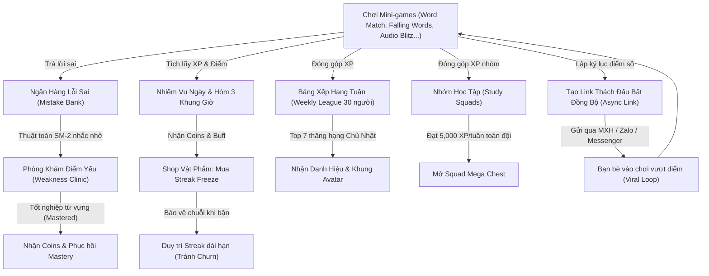
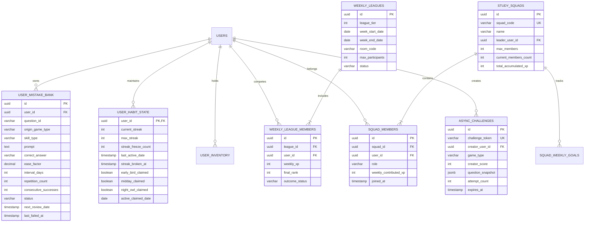

# Đặc Tả Kỹ Thuật & Nghiệp Vụ Chi Tiết: Hệ Thống Giữ Chân Người Dùng & Gamification Đột Phá (Retention & Gamification Expansion)

**Mã tài liệu:** `SPEC-RETENTION-GAMIFICATION-V1`  
**Phiên bản:** 1.0  
**Tác giả:** Senior Product Business Analyst (Product BA)  
**Người nhận bàn giao:** Tech Lead / Architect, UI/UX Designer, Senior Fullstack Engineer, QA Team  
**Ngày ban hành:** 29/09/2026  
**Trạng thái:** Đã hoàn thiện - Sẵn sàng chuyển giao thiết kế kỹ thuật & lập trình  

---

## 1. Tổng Quan & Kiến Trúc Vòng Lặp Giữ Chân Người Dùng (Retention Flywheel Architecture)

### 1.1. Bối Cảnh & Mục Tiêu Kinh Doanh
Để chuyển đổi nền tảng từ một tập hợp các mini-game rời rạc thành một **Hệ sinh thái học tập gây nghiện lành mạnh (Healthy Learning Habit)**, tài liệu này đặc tả chi tiết 3 hệ thống giữ chân cốt lõi:
1. **Trụ Cột 1 - Bộ Nhớ Dài Hạn (Pedagogical Long-Term Retention):** Hệ thống Ngân Hàng Lỗi Sai (Mistake Bank) tích hợp Thuật toán Lặp lại Ngắt quãng SuperMemo-2 (SM-2 Spaced Repetition) và chế độ "Phòng Khám Điểm Yếu" (Weakness Clinic).
2. **Trụ Cột 2 - Vòng Lặp Thói Quen Hàng Ngày (Daily Habit & Urgency Loop):** Vật phẩm bảo vệ chuỗi Streak Freeze, Hòm phần thưởng 3 khung giờ vàng (Early Bird, Midday Energy, Night Owl Chests) và Giải đấu phân hạng tuần 30 người (Weekly Leagues).
3. **Trụ Cột 3 - Trách Nhiệm Xã Hội & Lan Truyền Tự Nhiên (Social Accountability & Viral Loops):** Nhóm học tập 5–10 người (Study Squads) cày chung rương kho báu tuần và Cơ chế Thách đấu Bất đồng bộ (Async Challenge Deep Links).

### 1.2. Sơ Đồ Vòng Lặp Giữ Chân (Retention Flywheel)



---

## 2. Trụ Cột 1: Smart Spaced Repetition (SRS) Flashcards & Mistake Bank ("Phòng Khám Điểm Yếu")

### 2.1. Cơ Chế Thu Thập Lỗi Sai Tự Động (Auto-Capture Pipeline)
Mọi lượt tương tác của người dùng trên toàn bộ các mini-game (Word Match, Speed Falling, Sentence Scramble, Audio Blitz, Cloze Master, Grammar Detective, v.v.) và đấu 1v1 đều được lắng nghe bởi sự kiện trung tâm `GameQuestionEvaluatedEvent`:
- Khi người chơi chọn sai thẻ trong **Word Match**: Thu thập cặp `(Word, VietnameseMeaning)`.
- Khi để từ chạm đáy trong **Speed Falling**: Thu thập từ bị lỡ kèm nghĩa đúng.
- Khi xếp sai trật tự trong **Sentence Scramble**: Thu thập toàn bộ câu và vị trí từ bị sai ngữ pháp.
- Khi gõ sai chính tả trong **Audio Blitz**: Thu thập phát âm audio, IPA và từ đúng.
- Khi chọn sai đáp án trong **Cloze Master**: Thu thập câu đục lỗ, đáp án sai đã chọn và lời giải thích.
- Khi bắt sai lỗi trong **Grammar Detective**: Thu thập quy tắc ngữ pháp bị vi phạm.

Nếu câu hỏi đã tồn tại trong `UserMistakeBank` của người dùng:
- Tăng biến `FailCount = FailCount + 1`.
- Chuyển trạng thái sang `ActiveReview` (Kích hoạt ôn tập).
- Cập nhật thời điểm sai gần nhất `LastFailedAt = UTC_NOW`.

### 2.2. Thuật Toán Lặp Lại Ngắt Quãng SuperMemo-2 (SM-2) Cải Tiến
Mỗi lỗi sai trong Mistake Bank được quản lý theo mô hình toán học lặp lại ngắt quãng SM-2:

#### 2.2.1. Thang Đánh Giá Chất Lượng Trả Lời ($q$)
Khi người học thực hiện phiên ôn tập tại "Phòng Khám Điểm Yếu", hệ thống đánh giá chất lượng phản xạ $q \in \{0, 1, 2, 3, 4, 5\}$ dựa trên tính đúng đắn và tốc độ trả lời:
- $q = 5$ (Hoàn hảo): Trả lời đúng ngay lần đầu, thời gian phản xạ $\le 30\%$ thời gian tối đa cho phép.
- $q = 4$ (Tốt): Trả lời đúng, thời gian phản xạ từ $30\% - 70\%$ thời gian tối đa.
- $q = 3$ (Đạt): Trả lời đúng nhưng ngập ngừng, thời gian $> 70\%$ thời gian tối đa hoặc đã bấm nghe lại/xem gợi ý.
- $q = 2$ (Sai sót nhẹ): Trả lời sai nhưng khi hiển thị đáp án thì nhận ra ngay (sai chính tả 1 ký tự).
- $q = 1$ (Sai hoàn toàn): Trả lời sai, nhớ sai hoàn toàn ngữ nghĩa.
- $q = 0$ (Hoàn toàn quên): Không nhớ bất kỳ điều gì, hết giờ mà không đưa ra câu trả lời.

#### 2.2.2. Công Thức Cập Nhật Hệ Số Dễ/Khó (Ease Factor - $EF$)
Hệ số $EF$ khởi tạo mặc định là $2.5$. Sau mỗi lượt ôn tập:
$$EF' = EF + \left(0.1 - (5 - q) \times (0.08 + (5 - q) \times 0.02)\right)$$
*Ràng buộc kỹ thuật:* $EF' = \max(1.3, EF')$. Hệ số $EF$ không bao giờ giảm xuống dưới $1.3$.

#### 2.2.3. Công Thức Tính Khoảng Cách Ngày Ôn Tập Kế Tiếp ($I_n$)
Gọi $n$ là số lần ôn tập thành công liên tiếp ($q \ge 3$):
- Nếu $q < 3$ (Ôn tập thất bại):
  $$n = 0, \quad I = 1 \text{ ngày}$$
  Lỗi sai tiếp tục giữ ở danh sách ôn tập ưu tiên ngày mai.
- Nếu $q \ge 3$ (Ôn tập thành công):
  - Lần 1 ($n = 1$): $I_1 = 1 \text{ ngày}$
  - Lần 2 ($n = 2$): $I_2 = 3 \text{ ngày}$ (Tối ưu hóa so với SM-2 gốc là 6 ngày để tăng cường ghi nhớ ngắn hạn)
  - Lần 3 trở đi ($n \ge 3$):
    $$I_n = \text{Round}(I_{n-1} \times EF)$$
Thời điểm ôn tập kế tiếp:
$$\text{NextReviewDate} = \text{CurrentReviewDate} + I_n \text{ (ngày)}$$

#### 2.2.4. Điều Kiện Tốt Nghiệp Lỗi Sai (Graduation to "Mastered")
Một câu hỏi/từ vựng được công nhận là **Đã Làm Chủ (Mastered)** và rời khỏi danh sách ôn tập định kỳ khi thỏa mãn đồng thời:
1. Số lần ôn tập thành công liên tiếp $n \ge 4$.
2. Hệ số Ease Factor $EF \ge 2.5$.
3. Tổng số lần trả lời đúng liên tiếp trong Weakness Clinic đạt tối thiểu 3 lần với $q \ge 4$.

**Phần Thưởng Tốt Nghiệp (Graduation Bounty):**
- Thưởng ngay **+25 Coins** và **+50 XP**.
- Khôi phục chỉ số thông thạo trong Radar Chart 4 kỹ năng (`MasteryScore` tương ứng $+3$ điểm).

### 2.3. Chế Độ Chơi Chuyên Biệt: "Weakness Clinic" (Phòng Khám Điểm Yếu)

#### 2.3.1. Bố Cục Giao Diện ASCII Wireframe

```
+-----------------------------------------------------------------------+
|  <- Quay lại     🏥 PHÒNG KHÁM ĐIỂM YẾU (CLINIC)      ❤️ ❤️ ❤️     ⭐ 180   |
+-----------------------------------------------------------------------+
|  Tiến độ cấp cứu: [================>--------] 4 / 6 từ cần giải cứu   |
+-----------------------------------------------------------------------+
|                                                                       |
|         [🚨 TỪ BẠN ĐÃ TỪNG SAI TẠI MINI-GAME: AUDIO BLITZ]            |
|                                                                       |
|                          🔊 [ Nghe Lại ]                              |
|                                                                       |
|                   Phiên âm:  /ˌkɒm.prɪˈhen.ʃən/                       |
|                   Đã trả lời sai: 3 lần trong quá khứ                 |
|                                                                       |
|   Ngữ cảnh gây bối rối:                                               |
|   "His ________ of quantum mechanics surprised the professor."        |
|                                                                       |
|   Chọn đáp án chính xác nhất để chữa lành từ này:                     |
|                                                                       |
|   [ A. Comprehensive ]                   [ B. Comprehension  ✅ ]      |
|   [ C. Comprehend    ]                   [ D. Comprehensibly ]        |
|                                                                       |
+-----------------------------------------------------------------------+
|  ⏱️ Thời gian phản xạ: 14s              🔥 Hệ số phục hồi: x1.5      |
+-----------------------------------------------------------------------+
```

#### 2.3.2. Quy Tắc Gameplay, Timers & Scoring
- **Quy mô phiên:** Mỗi phiên khám gồm đúng **10 từ/câu hỏi** có `NextReviewDate <= UTC_NOW` được ưu tiên theo thứ tự độ khẩn cấp (ngày trễ hạn dài nhất).
- **Bộ đếm thời gian:** Mỗi câu hỏi có **15 giây** suy nghĩ.
- **Tính điểm & Phục hồi:**
  - Điểm cơ bản: $100 \text{ điểm/câu}$.
  - Thưởng tốc độ: $\max(0, \text{Thời gian còn lại}) \times 10 \text{ điểm}$.
  - Hệ số Combo: Mỗi câu đúng liên tiếp tăng hệ số Combo ($x1.0 \rightarrow x1.2 \rightarrow x1.5 \rightarrow x2.0$).
  - Mất mạng: Sai mất 1 tim (tổng 3 tim/phiên). Nếu hết tim, phiên chơi dừng lại nhưng các từ đã trả lời đúng trước đó vẫn được ghi nhận cập nhật tiến độ SRS.

### 2.4. JSON Schema & Sample Mock Data cho Mistake Card

```json
{
  "$schema": "https://json-schema.org/draft/2020-12/schema",
  "title": "SrsMistakeCard",
  "type": "object",
  "required": [
    "id",
    "userId",
    "questionId",
    "originGameType",
    "skillType",
    "prompt",
    "correctAnswer",
    "easeFactor",
    "intervalDays",
    "repetitionCount",
    "consecutiveSuccesses",
    "status",
    "nextReviewDate"
  ],
  "properties": {
    "id": { "type": "string", "format": "uuid" },
    "userId": { "type": "string", "format": "uuid" },
    "questionId": { "type": "string" },
    "originGameType": { "type": "string", "enum": ["WordMatch", "SpeedFalling", "SentenceScramble", "AudioBlitz", "ClozeMaster", "GrammarDetective", "Battle1v1"] },
    "skillType": { "type": "string", "enum": ["Listening", "Reading", "Writing", "Speaking"] },
    "prompt": { "type": "string" },
    "phonetic": { "type": "string" },
    "audioUrl": { "type": "string", "format": "uri" },
    "contextSentence": { "type": "string" },
    "correctAnswer": { "type": "string" },
    "wrongAttempts": { "type": "array", "items": { "type": "string" } },
    "explanation": { "type": "string" },
    "easeFactor": { "type": "number", "minimum": 1.3 },
    "intervalDays": { "type": "integer", "minimum": 1 },
    "repetitionCount": { "type": "integer", "minimum": 0 },
    "consecutiveSuccesses": { "type": "integer", "minimum": 0 },
    "status": { "type": "string", "enum": ["Learning", "Reviewing", "Mastered"] },
    "lastEvaluatedQuality": { "type": "integer", "minimum": 0, "maximum": 5 },
    "nextReviewDate": { "type": "string", "format": "date-time" }
  }
}
```

*Sample Mock Data:*

```json
{
  "id": "7f8b3c94-1a2b-4e8f-9a0d-5b6c7d8e9f01",
  "userId": "37c318ff-653b-4461-a1ea-36602bae2e40",
  "questionId": "q_audio_comprehension_01",
  "originGameType": "AudioBlitz",
  "skillType": "Listening",
  "prompt": "Listen to the word and select the correct noun form",
  "phonetic": "/ˌkɒm.prɪˈhen.ʃən/",
  "audioUrl": "https://assets.learnenglish.app/audio/comprehension.mp3",
  "contextSentence": "His ________ of quantum mechanics surprised the professor.",
  "correctAnswer": "Comprehension",
  "wrongAttempts": ["Comprehensive", "Comprehend"],
  "explanation": "'His' là tính từ sở hữu, vị trí chỗ trống đứng trước giới từ 'of' cần một danh từ (Comprehension - sự thấu hiểu).",
  "easeFactor": 2.36,
  "intervalDays": 3,
  "repetitionCount": 2,
  "consecutiveSuccesses": 2,
  "status": "Reviewing",
  "lastEvaluatedQuality": 4,
  "nextReviewDate": "2026-10-02T08:00:00Z"
}
```

---

## 3. Trụ Cột 2: Duolingo-style Daily Habit Loop (Streak Freeze, Daily Quest Chests & Weekly Leagues)

### 3.1. Cơ Chế Bảo Vệ Chuỗi Streak Freeze & Shop Vật Phẩm

```
+-----------------------------------------------------------------------+
|  🛒 CỬA HÀNG VẬT PHẨM (GAMIFICATION SHOP)           💰 Số dư: 640 Coins|
+-----------------------------------------------------------------------+
|                                                                       |
|  [ 🧊 BĂNG BẢO VỆ CHUỖI (STREAK FREEZE) ]                            |
|  Bảo vệ chuỗi ngày học của bạn không bị mất nếu bạn quên học 1 ngày.  |
|  Đang sở hữu: [ 🧊 1 / 2 ] (Tối đa 2 bình)                            |
|                                                                       |
|  +------------------------------------+                               |
|  |  Giá mua: 200 Coins / 1 bình       |                               |
|  |  [ MUA THÊM 1 BÌNH (+200 Coins) ]  |                               |
|  +------------------------------------+                               |
|                                                                       |
|  [ ⚡ BÌNH NĂNG LƯỢNG 1V1 ]        [ 🎯 VÉ ĐỔI NHIỆM VỤ ]              |
|  Nhận 3 lượt thi đấu 1v1 miễn phí | Đổi 1 nhiệm vụ ngày không thích   |
|  Giá: 80 Coins                    | Giá: 30 Coins                     |
|                                                                       |
+-----------------------------------------------------------------------+
```

#### 3.1.1. Quy Tắc Sở Hữu & Tích Trữ
- **Giá mua vật phẩm:** `200 Coins` đổi 1 Streak Freeze.
- **Giới hạn tích trữ tối đa (Cap):** Mỗi người dùng chỉ được trữ tối đa **2 Streak Freezes** cùng lúc trong túi đồ (`InventoryCount <= 2`). Nếu đã đủ 2 bình, nút mua bị vô hiệu hóa kèm tooltip *"Túi đồ đã đầy (Tối đa 2 bình)"*.
- **Thời hạn sử dụng:** Vĩnh viễn cho đến khi được kích hoạt tiêu thụ.

#### 3.1.2. Cơ Chế Tự Động Kích Hoạt Lúc 23:59:59 (Midnight Protection Job)
Một tác vụ nền (Scheduled Background Job) chạy lúc 23:59:59 (giờ địa phương của User):
- Kiểm tra xem người dùng có bất kỳ tương tác ghi nhận học tập (`DailyActivityCount > 0`) trong ngày hôm nay hay không.
- **Nếu đã học:** Giữ nguyên Streak Freeze. Tăng `CurrentStreak = CurrentStreak + 1`.
- **Nếu CHƯA học:**
  - Nếu `StreakFreezeCount > 0`:
    - Trừ `StreakFreezeCount = StreakFreezeCount - 1`.
    - Giữ nguyên `CurrentStreak` (Không tăng nhưng KHÔNG bị reset về 0).
    - Tạo thông báo hệ thống: *"🧊 Băng bảo vệ đã tự động kích hoạt để giữ vững chuỗi {CurrentStreak} ngày học của bạn!"*.
    - Ghi nhận `StreakProtectedDates` kèm lý do `AutoFreezeConsumed`.
  - Nếu `StreakFreezeCount == 0`:
    - Kích hoạt trạng thái **Chuỗi Bị Đóng Băng Tạm Thời (Streak Broken - In Grace Period)** trong 48 giờ.

#### 3.1.3. Cơ Chế Cứu Chuỗi Khẩn Cấp (Emergency Streak Repair)
Khi người dùng bị mất chuỗi do hết Streak Freeze, họ không bị mất vĩnh viễn ngay lập tức (tránh cảm giác thất vọng muốn bỏ app - Churn Trigger):
- **Cửa sổ cơ hội:** Kéo dài đúng **48 giờ** kể từ khi chuỗi bị gãy.
- **Lựa chọn cứu chuỗi:**
  1. *Cách 1 (Trả phí Coins):* Tiêu tốn `500 Coins` để mua vé "Sơ Cứu Chuỗi".
  2. *Cách 2 (Thử Thách Cứu Chuỗi - Skill Repair Challenge):* Hoàn thành 1 bài thi tổng hợp gồm 15 câu hỏi thuộc 4 kỹ năng với độ chính xác $\ge 85\%$ trong 5 phút.
- Sau khi hoàn thành một trong hai cách, chuỗi được phục hồi nguyên vẹn. Sau 48 giờ nếu không hành động, `CurrentStreak` chính thức trở về 0.

---

### 3.2. Hòm Báu Nhiệm Vụ 3 Khung Giờ (Daily Quest Chests)

Để kích thích thói quen mở ứng dụng nhiều lần trong ngày, hệ thống triển khai 3 Hòm Thưởng tại 3 khung giờ cố định:

```
+-----------------------------------------------------------------------+
|  🎁 HÒM THƯỞNG 3 KHUNG GIỜ VÀNG HÔM NAY                               |
+-----------------------------------------------------------------------+
|                                                                       |
|   [ 🌅 HÒM BÌNH MINH ]       [ ☀️ HÒM NĂNG LƯỢNG ]   [ 🌙 HÒM HOÀNG HÔN ] |
|   Khung giờ: 06:00 - 10:00   11:30 - 13:30           19:00 - 23:00    |
|   Trạng thái: [ĐÃ MỞ ✅]     [ĐANG MỞ KHÓA 🎁]       [CHƯA ĐẾN GIỜ 🔒]|
|   Quà: +20% XP (30 phút)     Vé Đấu 1v1 + 50 Coins   Hòm Siêu Cấp     |
|                                                                       |
+-----------------------------------------------------------------------+
```

#### 3.2.1. Chi Tiết 3 Khung Giờ & Điều Kiện Mở
1. **Hòm Bình Minh (Early Bird Chest) - [06:00 đến 10:00]:**
   - *Điều kiện:* Hoàn thành ít nhất 1 ván mini-game hoặc 1 phiên ôn tập Clinic trước 10:00 sáng.
   - *Phần thưởng cố định:* Kích hoạt Buff nhân $+20\%$ XP toàn bộ mini-game trong 30 phút tiếp theo + $30 \text{ Coins}$.
2. **Hòm Năng Lượng (Midday Energy Chest) - [11:30 đến 13:30]:**
   - *Điều kiện:* Đăng nhập và hoàn thành 1 trận Đấu Đối Kháng 1v1 (Realtime Battle).
   - *Phần thưởng cố định:* Tặng 2 vé đấu 1v1 miễn phí + $40 \text{ Coins}$.
3. **Hòm Hoàng Hôn (Night Owl Super Chest) - [19:00 đến 23:00]:**
   - *Điều kiện:* Đạt tổng cộng ít nhất $300 \text{ XP}$ trong ngày hôm nay.
   - *Phần thưởng:* Hòm báu siêu cấp với cơ chế Gacha ngẫu nhiên.

#### 3.2.2. Bảng Tỷ Lệ Rơi Quà Ngẫu Nhiên Hòm Hoàng Hôn (Gacha Loot Table)

| STT | Loại Quà Rơi (Loot Item) | Tỷ Lệ Xuất Hiện (Drop Probability) | Mô Tả & Giá Trị |
| :--- | :--- | :--- | :--- |
| 1 | **Túi Tiền Lớn (Gold Sack)** | $50.0\%$ | Nhận ngẫu nhiên từ $80 - 150 \text{ Coins}$. |
| 2 | **Bình Băng Bảo Vệ (Streak Freeze)** | $25.0\%$ | Thêm 1 Streak Freeze vào túi đồ (nếu túi chưa đầy). |
| 3 | **Bùa Nhân Đôi XP (Double XP Token)** | $15.0\%$ | Kích hoạt hiệu ứng x2 XP trong 45 phút học tiếp theo. |
| 4 | **Vé Cứu Chuỗi Vàng (Golden Repair Pass)** | $7.0\%$ | Vật phẩm cấp cao miễn phí phục hồi chuỗi khi bị đứt. |
| 5 | **Mảnh Khung Avatar Huyền Thoại (Avatar Fragment)** | $3.0\%$ | Tích lũy 3 mảnh ghép để sở hữu Khung Avatar "Cú Đêm Chăm Chỉ". |

---

### 3.3. Hệ Thống Giải Đấu Phân Hạng Tuần (Weekly Leagues - 30 Người/Bảng)

```
+-----------------------------------------------------------------------+
|  🏆 GIẢI ĐẤU TUẦN: BẢNG LAM NGỌC (SAPPHIRE LEAGUE - NHÓM #142)         |
|  ⏱️ Thời gian còn lại: 1 ngày 04 giờ (Kết thúc 23:59 Chủ Nhật)        |
+-----------------------------------------------------------------------+
|  Hạng  Người học               XP Tuần    Khu Vực                     |
|  -------------------------------------------------------------------  |
|  🥇 1.  Nguyễn Văn A (Bạn)      2,450 XP   🟢 KHU VỰC THĂNG HẠNG (Top 7)|
|  🥈 2.  Sarah Jenkins           2,310 XP   🟢                          |
|  🥉 3.  Trần Bảo Nam            2,100 XP   🟢                          |
|   4.   Alex Miller             1,950 XP   🟢                          |
|   ...                                                                 |
|   7.   Phạm Quỳnh Nga          1,620 XP   🟢 ------------------------- |
|   8.   David Beckham           1,590 XP   ⚪ KHU VỰC AN TOÀN (8 - 25)  |
|   ...                                                                 |
|  25.   Lê Hoàng Long             850 XP   ⚪ ------------------------- |
|  26.   John Doe                  720 XP   🔴 KHU VỰC XUỐNG HẠNG (26-30)|
|  27.   Vũ Đình Trọng             610 XP   🔴                          |
|  ...                                                                  |
|  30.   Emily Watson              320 XP   🔴                          |
+-----------------------------------------------------------------------+
```

#### 3.3.1. Các Bậc Giải Đấu (League Tiers)
Hệ thống gồm **5 Bậc Giải Đấu** tuần tiến:
1. 🥉 **Bronze League (Đồng):** Bậc nhập môn. Không bao giờ bị xuống hạng.
2. 🥈 **Silver League (Bạc):** Người học đạt nhịp độ trung bình.
3. 🥇 **Gold League (Vàng):** Cạnh tranh sôi nổi.
4. 💎 **Sapphire League (Lam Ngọc):** Người học kiên trì, tương tác cao.
5. 👑 **Diamond League (Kim Cương):** Đỉnh cao danh vọng của toàn nền tảng.

#### 3.3.2. Thuật Toán Phân Bảng 30 Người (Cohort Partitioning)
- **Cơ chế gom nhóm lười (Lazy Partitioning):** Vào 00:00 Thứ Hai, người dùng chưa được xếp bảng ngay. Chỉ khi người dùng hoàn thành **ván game hoặc bài học đầu tiên trong tuần**, hệ thống mới gán họ vào một bảng đấu (Room) đang mở có cùng Tier, tối đa 30 người.
- *Lợi ích sản phẩm:* Tránh tình trạng người bận rộn cả tuần bị xếp chung với người cày điểm từ 0h sáng thứ Hai, đảm bảo độ cạnh tranh công bằng.

#### 3.3.3. Quy Tắc Thăng Hạng & Xuống Hạng (Promotion / Demotion Rules)
Vào đúng **23:59:59 Chủ Nhật (UTC+7)**, hệ thống khóa bảng và xử lý:
- **Top 1 – Top 7 (Khu vực thăng hạng - Promotion Zone):**
  - Thăng lên 1 Bậc League cao hơn cho tuần tiếp theo.
  - Thưởng lớn: Top 1 ($+300 \text{ Coins}$, Huy hiệu Tuần), Top 2 ($+200 \text{ Coins}$), Top 3 ($+100 \text{ Coins}$), Top 4–7 ($+50 \text{ Coins}$).
- **Hạng 8 – Hạng 25 (Khu vực an toàn - Safe Zone):**
  - Trụ lại Bậc League hiện tại cho tuần kế tiếp.
  - Thưởng hoàn thành tuần: $+20 \text{ Coins}$.
- **Hạng 26 – Hạng 30 (Khu vực xuống hạng - Demotion Zone):**
  - Rớt xuống 1 Bậc League thấp hơn (riêng bậc Bronze không bị rớt).
  - Nhận thông điệp động viên và lời mời tham gia tuần mới.

---

## 4. Trụ Cột 3: Social Study Squads & Async Viral Challenges

### 4.1. Study Squads (Nhóm Học Tập 5 – 10 Người)

```
+-----------------------------------------------------------------------+
|  🛡️ NHÓM HỌC TẬP: "THE IELTS OVERCOMERS" (#SQUAD-9821)                |
|  Thành viên: 7 / 10 bạn   |   Cấp độ nhóm: Level 4                    |
+-----------------------------------------------------------------------+
|  🎯 TIẾN ĐỘ RƯƠNG TUẦN (SQUAD MEGA CHEST):                             |
|  [=======================>--------] 3,850 / 5,000 XP (Đạt 77%)        |
|  ⏱️ Thời gian còn lại: 2 ngày 18 giờ                                   |
+-----------------------------------------------------------------------+
|  BẢNG CỐNG HIẾN NỘI BỘ (SQUAD CONTRIBUTIONS):                         |
|  👑 1. Nguyễn Văn A (Bạn)      1,250 XP   [ Đạt chỉ tiêu rương ✅ ]   |
|  ⭐ 2. Lê Thị Mai                890 XP   [ Đạt chỉ tiêu rương ✅ ]   |
|  ⭐ 3. Trần Tuấn Kiệt            720 XP   [ Đạt chỉ tiêu rương ✅ ]   |
|  ...                                                                  |
|  ⚠️ 7. Hoàng Minh Thắng           80 XP   [ Cần thêm 70 XP để nhận quà]|
|                                                                       |
|  [ 💬 Chat Động Viên ]   [ 👥 Mời Bạn Bè Bằng Mã ]   [ 🚪 Rời Nhóm ]  |
+-----------------------------------------------------------------------+
```

#### 4.1.1. Quy Chế Thành Lập & Gia Nhập Nhóm
- **Quy mô nhóm:** Tối thiểu 1 thành viên, tối đa **10 thành viên** (Quy mô nhóm nhỏ tối ưu tâm lý trách nhiệm chéo - Social Accountability).
- **Mã Nhóm (Squad Code):** Mỗi nhóm có một mã định danh duy nhất (ví dụ: `ENG-8821`) dùng để gửi bạn bè gia nhập tức thì.
- **Vai trò:** Trưởng nhóm (Leader - người tạo nhóm, có quyền đổi tên, duyệt/kick thành viên) và Thành viên (Member).

#### 4.1.2. Thanh Tiến Độ Chung & Phần Thưởng Hòm Nhóm (Squad Mega Chest)
- Toàn bộ XP kiếm được của các thành viên từ việc chơi mini-game, học SRS, thắng đấu 1v1 đều được cộng dồn $1:1$ vào **Quỹ XP Nhóm Hàng Tuần**.
- Mục tiêu tuần chuẩn: **5,000 XP / tuần**.
- **Điều kiện nhận thưởng rương cá nhân:** Để chống gian lận (Free-riding), mỗi cá nhân trong nhóm phải đóng góp tối thiểu **150 XP** trong tuần đó mới có quyền mở rương nhóm khi đội ngũ hoàn thành mục tiêu.
- **Phần thưởng Squad Mega Chest:**
  - $+150 \text{ Coins}$ cho mỗi thành viên đạt chuẩn.
  - $1 \text{ Streak Freeze}$ bảo vệ chuỗi.
  - Danh hiệu vinh danh độc quyền: *"Squad Champion"*.
  - Thành viên Top 1 XP của nhóm nhận thêm danh hiệu *"Squad MVP"* và $+100 \text{ Coins}$ bổ sung.

---

### 4.2. Thách Đấu Bất Đồng Bộ (Async Viral Challenges)

```
+-----------------------------------------------------------------------+
|  🎮 KẾT QUẢ VÁN CHƠI: SPEED FALLING WORD                              |
|  ⭐ Kỷ lục mới: 1,420 Điểm!  |  Chính xác: 18 / 20 từ  |  Combo Max: x6|
+-----------------------------------------------------------------------+
|                                                                       |
|         🚀 BẠN CÓ DÁM THÁCH ĐẤU BẠN BÈ VƯỢT QUA ĐIỂM SỐ NÀY?          |
|                                                                       |
|   Link thách đấu của bạn:                                             |
|   [ https://learnenglish.app/c/x9aB7zKd2                         📋 ]  |
|                                                                       |
|   [ 📤 Gửi Qua Zalo ]    [ 📤 Gửi Messenger ]    [ 📥 Tải Ảnh Thẻ Kỷ Lục] |
|                                                                       |
+-----------------------------------------------------------------------+
```

#### 4.2.1. Cơ Chế Tạo Link Thách Đấu (Challenge Link Generation)
Khi người chơi kết thúc một ván mini-game đơn lẻ (Speed Falling, Word Match, Audio Blitz, Cloze Master, Sentence Scramble, Grammar Detective) và đạt số điểm $\ge 300$, họ có thể bấm nút **"Thách Đấu Bạn Bè"**:
1. Hệ thống snapshot lại chính xác bộ câu hỏi của ván đấu đó thông qua `Seed` số ngẫu nhiên hoặc danh sách `QuestionIds`.
2. Tạo bản ghi `AsyncChallenge` với mã token ngắn gọn (ví dụ: `x9aB7zKd2`).
3. Sinh Deep Link: `https://learnenglish.app/c/{challengeToken}`.

#### 4.2.2. Thẻ Xem Trước Mạng Xã Hội (Open Graph Card Preview)
Khi dán link lên Zalo, Facebook, Telegram, hệ thống trả về metadata:
- **Title:** *"🔥 Nguyễn Văn A vừa đạt 1,420 điểm môn Speed Falling Word!"*
- **Description:** *"Bộ từ vựng chủ đề Technology. Bạn có đủ nhanh tay để vượt qua kỷ lục này không? Bấm để đọ sức ngay!"*
- **Image Preview:** Ảnh render động tự động chứa avatar người thách đấu, điểm số to nổi bật và logo trò chơi.

#### 4.2.3. Quy Tắc Thi Đấu & So Sánh Kết Quả Bất Đồng Bộ
- Người nhận mở liên kết:
  - Nếu **chưa có tài khoản:** Cho phép chơi ngay dưới tư cách Khách (Guest). Hệ thống tự động ghi nhận mã giới thiệu (`ReferralCode = ChallengerUserId`).
  - Giao diện hiển thị: *"Đang thi đấu cùng bộ câu hỏi với {ChallengerName}"*.
- Khi hoàn thành ván đấu:
  - Hiển thị màn hình so găng 2 cột (Head-to-head split view).
  - Nếu người được thách đấu **Thắng điểm:** Thưởng $+50 \text{ XP}$ và thông báo gửi ngược lại cho người thách ban đầu *"Kỷ lục của bạn vừa bị phá vỡ bởi {FriendName}!"*.
  - Nếu người được thách đấu **Thua điểm:** Cho phép bấm *"Thử lại ván khác để phục thù"*.

---

## 5. Thiết Kế Mô Hình Dữ Liệu Chi Tiết (Data Models)

### 5.1. Sơ Đồ Thực Thể Liên Kết (Mermaid ERD)



---

### 5.2. Lược Đồ CSDL PostgreSQL (PostgreSQL DDL)

```sql
-- ============================================================================
-- SCRIPT DDL: RETENTION & GAMIFICATION EXPANSION
-- ============================================================================

-- 1. BẢNG NGÂN HÀNG LỖI SAI (MISTAKE BANK & SRS)
CREATE TABLE user_mistake_banks (
    id UUID PRIMARY KEY DEFAULT gen_random_uuid(),
    user_id UUID NOT NULL REFERENCES users(id) ON DELETE CASCADE,
    question_id VARCHAR(100) NOT NULL,
    origin_game_type VARCHAR(50) NOT NULL, -- WordMatch, SpeedFalling, AudioBlitz, etc.
    skill_type VARCHAR(20) NOT NULL,       -- Listening, Reading, Writing, Speaking
    prompt TEXT NOT NULL,
    phonetic VARCHAR(100),
    audio_url TEXT,
    context_sentence TEXT,
    correct_answer VARCHAR(500) NOT NULL,
    wrong_attempts JSONB DEFAULT '[]'::jsonb,
    explanation TEXT,
    ease_factor NUMERIC(4, 2) NOT NULL DEFAULT 2.50,
    interval_days INT NOT NULL DEFAULT 1,
    repetition_count INT NOT NULL DEFAULT 0,
    consecutive_successes INT NOT NULL DEFAULT 0,
    status VARCHAR(20) NOT NULL DEFAULT 'Learning', -- Learning, Reviewing, Mastered
    last_evaluated_quality INT,
    next_review_date TIMESTAMPTZ NOT NULL DEFAULT CURRENT_TIMESTAMP,
    last_failed_at TIMESTAMPTZ NOT NULL DEFAULT CURRENT_TIMESTAMP,
    created_at TIMESTAMPTZ NOT NULL DEFAULT CURRENT_TIMESTAMP,
    updated_at TIMESTAMPTZ NOT NULL DEFAULT CURRENT_TIMESTAMP
);

CREATE INDEX idx_mistake_user_review ON user_mistake_banks (user_id, status, next_review_date);
CREATE INDEX idx_mistake_user_skill ON user_mistake_banks (user_id, skill_type);

-- 2. BẢNG TRẠNG THÁI THÓI QUEN NGÀY (DAILY HABIT & STREAK STATE)
CREATE TABLE user_habit_states (
    user_id UUID PRIMARY KEY REFERENCES users(id) ON DELETE CASCADE,
    current_streak INT NOT NULL DEFAULT 0,
    max_streak INT NOT NULL DEFAULT 0,
    streak_freeze_count INT NOT NULL DEFAULT 0 CHECK (streak_freeze_count BETWEEN 0 AND 2),
    last_active_date DATE,
    streak_broken_at TIMESTAMPTZ,
    early_bird_claimed BOOLEAN NOT NULL DEFAULT FALSE,
    midday_claimed BOOLEAN NOT NULL DEFAULT FALSE,
    night_owl_claimed BOOLEAN NOT NULL DEFAULT FALSE,
    active_claimed_date DATE,
    updated_at TIMESTAMPTZ NOT NULL DEFAULT CURRENT_TIMESTAMP
);

-- 3. BẢNG GIẢI ĐẤU PHÂN HẠNG TUẦN (WEEKLY LEAGUES)
CREATE TABLE weekly_leagues (
    id UUID PRIMARY KEY DEFAULT gen_random_uuid(),
    league_tier INT NOT NULL CHECK (league_tier BETWEEN 1 AND 5), -- 1:Bronze, 2:Silver, 3:Gold, 4:Sapphire, 5:Diamond
    week_start_date DATE NOT NULL,
    week_end_date DATE NOT NULL,
    room_code VARCHAR(50) NOT NULL,
    max_participants INT NOT NULL DEFAULT 30,
    status VARCHAR(20) NOT NULL DEFAULT 'Active', -- Active, Finalized
    created_at TIMESTAMPTZ NOT NULL DEFAULT CURRENT_TIMESTAMP
);

CREATE UNIQUE INDEX uq_league_room ON weekly_leagues (week_start_date, league_tier, room_code);

CREATE TABLE weekly_league_members (
    id UUID PRIMARY KEY DEFAULT gen_random_uuid(),
    league_id UUID NOT NULL REFERENCES weekly_leagues(id) ON DELETE CASCADE,
    user_id UUID NOT NULL REFERENCES users(id) ON DELETE CASCADE,
    weekly_xp INT NOT NULL DEFAULT 0,
    final_rank INT,
    outcome_status VARCHAR(20) DEFAULT 'Pending', -- Promoted, Safe, Demoted
    joined_at TIMESTAMPTZ NOT NULL DEFAULT CURRENT_TIMESTAMP,
    CONSTRAINT uq_league_user UNIQUE (league_id, user_id)
);

CREATE INDEX idx_league_ranking ON weekly_league_members (league_id, weekly_xp DESC);

-- 4. BẢNG NHÓM HỌC TẬP (STUDY SQUADS)
CREATE TABLE study_squads (
    id UUID PRIMARY KEY DEFAULT gen_random_uuid(),
    squad_code VARCHAR(20) NOT NULL UNIQUE,
    name VARCHAR(100) NOT NULL,
    description TEXT,
    leader_user_id UUID NOT NULL REFERENCES users(id),
    max_members INT NOT NULL DEFAULT 10,
    current_members_count INT NOT NULL DEFAULT 1,
    total_accumulated_xp INT NOT NULL DEFAULT 0,
    created_at TIMESTAMPTZ NOT NULL DEFAULT CURRENT_TIMESTAMP
);

CREATE TABLE squad_members (
    id UUID PRIMARY KEY DEFAULT gen_random_uuid(),
    squad_id UUID NOT NULL REFERENCES study_squads(id) ON DELETE CASCADE,
    user_id UUID NOT NULL REFERENCES users(id) ON DELETE CASCADE,
    role VARCHAR(20) NOT NULL DEFAULT 'Member', -- Leader, Member
    weekly_contributed_xp INT NOT NULL DEFAULT 0,
    has_claimed_weekly_chest BOOLEAN NOT NULL DEFAULT FALSE,
    joined_at TIMESTAMPTZ NOT NULL DEFAULT CURRENT_TIMESTAMP,
    CONSTRAINT uq_squad_user UNIQUE (squad_id, user_id)
);

-- 5. BẢNG THÁCH ĐẤU BẤT ĐỒNG BỘ (ASYNC CHALLENGES)
CREATE TABLE async_challenges (
    id UUID PRIMARY KEY DEFAULT gen_random_uuid(),
    challenge_token VARCHAR(32) NOT NULL UNIQUE,
    creator_user_id UUID NOT NULL REFERENCES users(id) ON DELETE CASCADE,
    game_type VARCHAR(50) NOT NULL,
    creator_score INT NOT NULL,
    question_snapshot JSONB NOT NULL,
    attempt_count INT NOT NULL DEFAULT 0,
    expires_at TIMESTAMPTZ NOT NULL,
    created_at TIMESTAMPTZ NOT NULL DEFAULT CURRENT_TIMESTAMP
);

CREATE TABLE async_challenge_attempts (
    id UUID PRIMARY KEY DEFAULT gen_random_uuid(),
    challenge_id UUID NOT NULL REFERENCES async_challenges(id) ON DELETE CASCADE,
    participant_user_id UUID REFERENCES users(id) ON DELETE SET NULL,
    participant_name VARCHAR(100) NOT NULL,
    score INT NOT NULL,
    is_winner BOOLEAN NOT NULL DEFAULT FALSE,
    completed_at TIMESTAMPTZ NOT NULL DEFAULT CURRENT_TIMESTAMP
);
```

---

### 5.3. Định Nghĩa C# Entity Framework Core 8 Entities

```csharp
using System.ComponentModel.DataAnnotations;
using System.ComponentModel.DataAnnotations.Schema;

namespace LearnEnglish.Api.Domain.Entities;

public enum SrsStatus
{
    Learning = 0,
    Reviewing = 1,
    Mastered = 2
}

[Table("user_mistake_banks")]
public class UserMistakeBank
{
    [Key]
    public Guid Id { get; set; } = Guid.NewGuid();

    [Required]
    public Guid UserId { get; set; }

    [Required]
    [MaxLength(100)]
    public string QuestionId { get; set; } = string.Empty;

    [Required]
    [MaxLength(50)]
    public string OriginGameType { get; set; } = string.Empty;

    [Required]
    [MaxLength(20)]
    public string SkillType { get; set; } = string.Empty;

    [Required]
    public string Prompt { get; set; } = string.Empty;

    [MaxLength(100)]
    public string? Phonetic { get; set; }

    public string? AudioUrl { get; set; }

    public string? ContextSentence { get; set; }

    [Required]
    [MaxLength(500)]
    public string CorrectAnswer { get; set; } = string.Empty;

    public string WrongAttemptsJson { get; set; } = "[]";

    public string? Explanation { get; set; }

    [Column(TypeName = "decimal(4, 2)")]
    public decimal EaseFactor { get; set; } = 2.50m;

    public int IntervalDays { get; set; } = 1;

    public int RepetitionCount { get; set; } = 0;

    public int ConsecutiveSuccesses { get; set; } = 0;

    public SrsStatus Status { get; set; } = SrsStatus.Learning;

    public int? LastEvaluatedQuality { get; set; }

    public DateTime NextReviewDate { get; set; } = DateTime.UtcNow;

    public DateTime LastFailedAt { get; set; } = DateTime.UtcNow;

    public DateTime CreatedAt { get; set; } = DateTime.UtcNow;

    public DateTime UpdatedAt { get; set; } = DateTime.UtcNow;

    [ForeignKey(nameof(UserId))]
    public virtual User? User { get; set; }
}

[Table("user_habit_states")]
public class UserHabitState
{
    [Key]
    public Guid UserId { get; set; }

    public int CurrentStreak { get; set; } = 0;

    public int MaxStreak { get; set; } = 0;

    public int StreakFreezeCount { get; set; } = 0;

    public DateOnly? LastActiveDate { get; set; }

    public DateTime? StreakBrokenAt { get; set; }

    public bool EarlyBirdClaimed { get; set; } = false;

    public bool MiddayClaimed { get; set; } = false;

    public bool NightOwlClaimed { get; set; } = false;

    public DateOnly? ActiveClaimedDate { get; set; }

    public DateTime UpdatedAt { get; set; } = DateTime.UtcNow;

    [ForeignKey(nameof(UserId))]
    public virtual User? User { get; set; }
}
```

---

### 5.4. Định Nghĩa TypeScript DTOs & Interfaces (Frontend)

```typescript
export type SkillType = 'Listening' | 'Reading' | 'Writing' | 'Speaking';
export type SrsStatus = 'Learning' | 'Reviewing' | 'Mastered';
export type LeagueTier = 'Bronze' | 'Silver' | 'Gold' | 'Sapphire' | 'Diamond';

export interface SrsMistakeCard {
  id: string;
  userId: string;
  questionId: string;
  originGameType: string;
  skillType: SkillType;
  prompt: string;
  phonetic?: string;
  audioUrl?: string;
  contextSentence?: string;
  correctAnswer: string;
  wrongAttempts: string[];
  explanation?: string;
  easeFactor: number;
  intervalDays: number;
  repetitionCount: number;
  consecutiveSuccesses: number;
  status: SrsStatus;
  lastEvaluatedQuality?: number;
  nextReviewDate: string;
}

export interface ClinicEvaluationRequest {
  mistakeId: string;
  selectedAnswer: string;
  responseTimeMs: number;
  usedHint: boolean;
}

export interface ClinicEvaluationResult {
  mistakeId: string;
  isCorrect: boolean;
  qualityScore: number; // 0 to 5
  newEaseFactor: number;
  newIntervalDays: number;
  nextReviewDate: string;
  isGraduated: boolean;
  awardedCoins: number;
  awardedXp: number;
}

export interface UserHabitSummary {
  currentStreak: number;
  maxStreak: number;
  streakFreezeCount: number; // max 2
  isStreakProtectedToday: boolean;
  isStreakInGracePeriod: boolean;
  gracePeriodExpiresAt?: string;
  chests: {
    earlyBird: { available: boolean; claimed: boolean; window: string };
    midday: { available: boolean; claimed: boolean; window: string };
    nightOwl: { available: boolean; claimed: boolean; window: string };
  };
}

export interface WeeklyLeagueLeaderboard {
  leagueTier: LeagueTier;
  roomCode: string;
  expiresInSeconds: number;
  currentUserRank: number;
  currentUserXp: number;
  participants: Array<{
    rank: number;
    userId: string;
    userName: string;
    avatarUrl?: string;
    weeklyXp: number;
    zone: 'Promotion' | 'Safe' | 'Demotion';
  }>;
}

export interface StudySquadDetail {
  squadId: string;
  squadCode: string;
  name: string;
  leaderUserId: string;
  memberCount: number;
  maxMembers: number;
  weeklyGoalXp: number;
  currentWeeklyXp: number;
  currentUserContributionXp: number;
  hasClaimedReward: boolean;
  members: Array<{
    userId: string;
    userName: string;
    role: 'Leader' | 'Member';
    weeklyXp: number;
    hasReachedThreshold: boolean;
  }>;
}
```

---

## 6. Hợp Đồng API RESTful (API Contracts)

| Method | Endpoint | Mô Tả | Yêu Cầu Auth |
| :--- | :--- | :--- | :--- |
| `GET` | `/api/v1/srs/mistakes/summary` | Lấy số lượng từ cần ôn hôm nay & thống kê Mastered | Bearer Token |
| `GET` | `/api/v1/srs/clinic/session` | Khởi tạo phiên khám gồm 10 thẻ đến hạn ôn tập | Bearer Token |
| `POST` | `/api/v1/srs/clinic/submit` | Gửi kết quả trả lời từng câu, tính toán SM-2 | Bearer Token |
| `GET` | `/api/v1/habits/summary` | Lấy trạng thái Streak, Băng bảo vệ & 3 Hòm thưởng | Bearer Token |
| `POST` | `/api/v1/habits/shop/buy-freeze` | Mua thêm 1 bình Băng Bảo Vệ (trừ 200 Coins) | Bearer Token |
| `POST` | `/api/v1/habits/chests/claim` | Mở 1 trong 3 Hòm Thưởng Khung Giờ | Bearer Token |
| `POST` | `/api/v1/habits/streak/repair` | Cứu chuỗi trong 48h bằng Coins hoặc Challenge | Bearer Token |
| `GET` | `/api/v1/leagues/current` | Lấy BXH bảng 30 người của tuần hiện tại | Bearer Token |
| `GET` | `/api/v1/squads/my-squad` | Lấy thông tin nhóm học tập & tiến độ rương tuần | Bearer Token |
| `POST` | `/api/v1/squads/join` | Gia nhập nhóm bằng `squadCode` | Bearer Token |
| `POST` | `/api/v1/squads/claim-chest` | Mở Squad Mega Chest khi cả đội đạt 5,000 XP | Bearer Token |
| `POST` | `/api/v1/challenges/create` | Tạo link thách đấu bất đồng bộ từ ván game vừa chơi | Bearer Token |
| `GET` | `/api/v1/challenges/{token}` | Lấy snapshot bộ câu hỏi để thi đấu so tài | Public / Guest |
| `POST` | `/api/v1/challenges/{token}/submit` | Nộp kết quả đọ điểm với người thách đấu | Public / Guest |

---

## 7. Tiêu Chí Nghiệm Thu Độc Lập Cho QA & Tech Lead (Given - When - Then)

### 7.1. Nhóm Kịch Bản: Mistake Bank & Thuật Toán SM-2

#### Kịch bản AC-SRS-01: Tự động ghi nhận câu trả lời sai vào Mistake Bank
- **Given:** Người học đang chơi mini-game `AudioBlitz` và trả lời sai chính tả từ `"comprehension"`.
- **When:** Hệ thống gửi kết quả chấm điểm câu hỏi về endpoint `/api/v1/games/evaluate`.
- **Then:**
  1. Bản ghi mới được tạo trong bảng `user_mistake_banks` với `question_id = 'q_audio_comprehension_01'`, `ease_factor = 2.50`, `interval_days = 1`.
  2. Trường `next_review_date` được đặt bằng thời điểm hiện tại `UTC_NOW`.
  3. Badge "Lỗi sai cần khắc phục" trên thanh Menu tăng thêm 1 đơn vị.

#### Kịch bản AC-SRS-02: Cập nhật SM-2 khi trả lời đúng xuất sắc ($q = 5$) trong Weakness Clinic
- **Given:** Từ vựng trong Mistake Bank đang có `repetition_count = 1`, `interval_days = 1`, `ease_factor = 2.50`.
- **When:** Người học vào Phòng Khám Điểm Yếu và trả lời đúng từ đó trong vòng $2.5$ giây (thời gian phản xạ cực nhanh, $q = 5$).
- **Then:**
  1. Thuật toán tính $EF' = 2.50 + (0.1 - 0) = 2.60$.
  2. Khoảng cách ôn tập kế tiếp $I_2 = 3 \text{ ngày}$.
  3. `repetition_count` tăng lên thành 2.
  4. `next_review_date` được dời về đúng `UTC_NOW + 3 ngày`.
  5. Thưởng ngay $+10 \text{ Coins}$ và $+25 \text{ XP}$.

#### Kịch bản AC-SRS-03: Tốt nghiệp từ vựng (Mastered) khi thỏa mãn điều kiện
- **Given:** Từ vựng đã đạt `repetition_count = 3`, `consecutive_successes = 2`, `ease_factor = 2.60`.
- **When:** Người học tiếp tục trả lời đúng lần thứ 3 với $q \ge 4$.
- **Then:**
  1. Trạng thái `status` chuyển thành `'Mastered'`.
  2. Hệ thống bắn hiệu ứng pháo hoa chúc mừng tốt nghiệp từ vựng.
  3. Người học nhận **+25 Coins** và **+50 XP** Graduation Bounty.
  4. Radar Chart kỹ năng tương ứng tăng điểm kinh nghiệm chuyên sâu.

---

### 7.2. Nhóm Kịch Bản: Daily Habit Loop & Streak Protection

#### Kịch bản AC-HABIT-01: Giới hạn mua Streak Freeze trong Shop
- **Given:** Người học đang sở hữu 2 bình Streak Freeze trong túi đồ (`streak_freeze_count = 2`).
- **When:** Người học truy cập Cửa Hàng và cố gắng bấm nút "Mua thêm 1 bình" (giá 200 Coins).
- **Then:**
  1. Nút mua bị disable với màu xám mờ.
  2. Hệ thống hiển thị tooltip/toast thông báo: *"Túi đồ đã đầy. Bạn chỉ có thể tích trữ tối đa 2 Băng Bảo Vệ."*.
  3. Số dư Coins của người học không bị trừ.

#### Kịch bản AC-HABIT-02: Tự động kích hoạt Streak Freeze khi người dùng quên học
- **Given:** Người học có `current_streak = 15`, sở hữu `streak_freeze_count = 1`, và không thực hiện bất kỳ hoạt động học nào trong ngày 29/09/2026.
- **When:** Đồng hồ hệ thống chạm mốc 23:59:59 ngày 29/09/2026 và Cron Job chạy.
- **Then:**
  1. `current_streak` vẫn được bảo toàn nguyên vẹn là 15 ngày.
  2. `streak_freeze_count` bị trừ từ 1 về 0.
  3. Một bản ghi thông báo hệ thống được gửi đến User: *"Băng bảo vệ đã tự kích hoạt để bảo vệ chuỗi 15 ngày học của bạn!"*.

#### Kịch bản AC-HABIT-03: Nhận Hòm Bình Minh đúng khung giờ
- **Given:** Đồng hồ hiện tại là 07:30 sáng và người học hoàn thành 1 ván mini-game.
- **When:** Người học bấm nút "Mở Hòm Bình Minh" tại màn hình chính.
- **Then:**
  1. Endpoint `/api/v1/habits/chests/claim` trả về mã `200 OK`.
  2. Người học nhận $+30 \text{ Coins}$.
  3. Kích hoạt hiệu ứng Buff `+20% XP Booster` với đồng hồ đếm ngược 30 phút trên thanh trạng thái.
  4. Nút Hòm Bình Minh chuyển sang trạng thái "Đã Nhận ✅" cho đến sáng hôm sau.

---

### 7.3. Nhóm Kịch Bản: Weekly Leagues & Bảng Xếp Hạng 30 Người

#### Kịch bản AC-LEAGUE-01: Phân bảng lười (Lazy Partitioning) vào đầu tuần
- **Given:** Đã bước sang tuần mới (08:00 sáng Thứ Hai), người dùng thuộc Bậc Vàng (Gold League) nhưng chưa chơi ván game nào.
- **When:** Người dùng đăng nhập vào hệ thống.
- **Then:** Người dùng chưa bị ép vào bảng đấu nào.
- **When:** Người dùng hoàn thành ván chơi `Sentence Scramble` đầu tiên và nhận 150 XP.
- **Then:** Hệ thống tự động gán người dùng vào phòng thi đấu `Gold-Room-XX` đang còn chỗ ($< 30$ người), cập nhật điểm tuần bằng 150 XP và hiển thị thứ hạng ban đầu.

#### Kịch bản AC-LEAGUE-02: Chốt thăng hạng và xuống hạng lúc 23:59:59 Chủ Nhật
- **Given:** Bảng đấu Sapphire League gồm 30 người kết thúc tuần. User A đứng Hạng 3, User B đứng Hạng 12, User C đứng Hạng 28.
- **When:** Job chốt kết quả tuần chạy lúc 23:59:59 Chủ Nhật.
- **Then:**
  1. User A (Hạng 3): Thăng hạng lên **Diamond League**, nhận huy hiệu vinh danh và $+100 \text{ Coins}$.
  2. User B (Hạng 12): Trụ lại **Sapphire League**, nhận thưởng hoàn thành $+20 \text{ Coins}$.
  3. User C (Hạng 28): Xuống hạng **Gold League**, nhận thư động viên cho tuần mới.

---

### 7.4. Nhóm Kịch Bản: Study Squads & Async Challenges

#### Kịch bản AC-SQUAD-01: Đạt chỉ tiêu nhóm 5,000 XP và phân phối thưởng
- **Given:** Nhóm học tập gồm 6 thành viên, đã tích lũy được 4,900 XP. Thành viên A đã cống hiến 500 XP, Thành viên B mới cống hiến 40 XP.
- **When:** Thành viên A hoàn thành 1 ván game nhận 120 XP, đưa tổng điểm nhóm lên 5,020 XP ($> 5,000$).
- **Then:**
  1. Trạng thái rương nhóm chuyển sang "Sẵn sàng mở 🎁".
  2. Thành viên A bấm mở rương: Nhận thành công $+150 \text{ Coins}$, $1 \text{ Streak Freeze}$ và danh hiệu "Squad Champion".
  3. Thành viên B bấm mở rương: Bị chặn kèm thông báo: *"Bạn cần đóng góp thêm 110 XP (tối thiểu 150 XP) để đủ điều kiện mở rương nhóm."*.

#### Kịch bản AC-ASYNC-01: Tạo và thi đấu qua Link Thách Đấu Bất Đồng Bộ
- **Given:** Người học hoàn thành ván `Speed Falling Word` với điểm số 1,250 điểm.
- **When:** Người học bấm "Thách đấu bạn bè".
- **Then:** Hệ thống sinh mã token `https://learnenglish.app/c/techlead_challenge_01` chứa chính xác snapshot 20 từ vựng đã xuất hiện.
- **When:** Người bạn mở link, chơi cùng bộ từ vựng và đạt 1,380 điểm.
- **Then:**
  1. Người bạn thắng cuộc, nhận ngay $+50 \text{ XP}$.
  2. Màn hình hiển thị bảng so tài: Người bạn (1,380 điểm) 🟢 Thắng - Người thách đấu (1,250 điểm) 🔴 Thua.
  3. Người thách đấu nhận được thông báo: *"Bạn của bạn vừa vượt qua kỷ lục với 1,380 điểm!"*.
